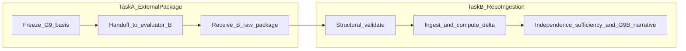

# PLAN: Real Independent Evaluator B Workflow (G9B)

This document is an **execution-oriented plan** for how a **real independent Evaluator B** workflow **will** be implemented and operated so that it **can later** produce **truthful** evidence suitable for a serious **Level B** attempt under Gate G9B (`docs/ROADMAP_MVP_GoC.md` §6.10). It does **not** perform scoring, ingestion, gate upgrades, or closure classification.

**Governing references:** `docs/ROADMAP_MVP_GoC.md`; `docs/GoC_Gate_Baseline_Audit_Plan.md`; `docs/audit/gate_G9_experience_acceptance_baseline.md`; `docs/audit/gate_G9B_evaluator_independence_baseline.md`; `docs/audit/gate_G10_end_to_end_closure_baseline.md`; `docs/audit/gate_summary_matrix.md`; `docs/audit/closure_level_classification_summary.md`; `docs/audit/master_goc_baseline_audit_report.md`; `docs/audit/repo_evidence_index.md`; `docs/goc_evidence_templates/` (templates and JSON schemas); authoritative G9 bundle `tests/reports/evidence/g9_level_a_fullsix_20260410/` (Evaluator A matrix, frozen scenario JSONs, and current Evaluator B–related artifacts for context only).

---

## 1. Scope

**In scope**

- Planning a **real independent Evaluator B workflow**: separate authorship, separate score generation, separate raw rationales, contamination controls, independence evidence requirements, handoff boundaries, acceptance and rejection rules, and a recommended execution sequence aligned with the roadmap and audit baselines.

**Out of scope**

- Scoring scenarios in this document.
- Ingesting Evaluator B outputs into the repository in this document.
- Upgrading Gate G9B or Gate G10 baselines, audit statuses, or closure-level classification in this document.
- Any MVP or program **closure** claim.
- Generating a second evaluator matrix, raw sheet, or delta as part of this planning artifact.

---

## 2. Why current evaluator-B evidence is insufficient for Level B

The repository already contains a second matrix and related G9B artifacts for `audit_run_id` `g9_level_a_fullsix_20260410` (see `docs/audit/gate_G9B_evaluator_independence_baseline.md` and `tests/reports/evidence/g9_level_a_fullsix_20260410/g9b_evaluator_b_declaration.json`). Those artifacts **explicitly** record **limited** independence: they were produced in the **same assistant-mediated, same-repository** context as other audit work—not a second human adjudicator (`independence_assessment: limited` and the English limitation in `independence_and_process` in the declaration pattern).

For roadmap Level B, `docs/ROADMAP_MVP_GoC.md` §6.10 and `docs/goc_evidence_templates/README.md` require **actual** independence in **process**, **authorship**, and **score generation**. A **structural** package with two frozen matrices and a computed delta is **necessary** for later analysis but **not sufficient** to support a strict Level B independence claim when process and authorship separation do not meet that bar. A **future** real independent Evaluator B workflow must therefore be designed to close that evidential gap—not to duplicate the same contextual limitation under a new filename.

---

## 3. Definition of a real independent evaluator

**Acceptable examples** (for later execution; none are asserted here)

- A **second human** evaluator who scores the fixed scenario set from the handoff package alone, with documented visibility rules and timestamps.
- A **separate external** evaluation process (e.g. contracted reviewer, institutional review) with its own **frozen** prompt or instruction package and an **auditable authorship trail** (who wrote the prompt, who scored, when).
- A **separate model or automated workflow** only if isolation is **documented**: no access to Evaluator A’s raw scores or rationales unless a **pre-scoring** documented exception applies (see §4 and §6), and **no reuse** of Evaluator A’s rationale text.

**Unacceptable examples**

- The **same** assistant or **same** hidden session generating a “second” matrix without process isolation equivalent to the above.
- **Cosmetic** rewording of Evaluator A’s rationales or **scores tuned** to match A before raw artifacts are frozen.
- **Backfilled** scores or rationales **derived from** A’s matrix after A is known in full, framed as “independent.”
- A **post-hoc** “independence” narrative written **after** full exposure to A’s raw scores and rationales when the process had claimed blind scoring.
- Treating **delta computation**, **reconciliation**, or narrative **harmonization** as a substitute for **independent raw scoring** completed first.

**Important:** Assistant-produced chain-of-thought or other **non-archived hidden reasoning** must **not** be cited as Evaluator B evidence. Only **frozen, human- or process-attributable artifacts** in the handoff package count.

---

## 4. Required source package for evaluator B

**Fixed six scenario ids** (normative order; do not substitute, merge, or drop)—from `ai_stack/goc_g9_roadmap_scenarios.py` and `docs/ROADMAP_MVP_GoC.md` §6.9:

1. `goc_roadmap_s1_direct_provocation` — Direct provocation  
2. `goc_roadmap_s2_deflection_brevity` — Deflection / brevity  
3. `goc_roadmap_s3_pressure_escalation` — Pressure escalation  
4. `goc_roadmap_s4_misinterpretation_correction` — Misinterpretation / correction  
5. `goc_roadmap_s5_primary_failure_fallback` — Primary model failure + fallback (`failure_oriented: true` for graceful-degradation semantics in the G9 frame)  
6. `goc_roadmap_s6_retrieval_heavy` — Retrieval-heavy context  

**Authoritative six scenario JSON artifacts** (frozen for the audit run)

- The six `scenario_goc_roadmap_s*_*.json` files under `tests/reports/evidence/g9_level_a_fullsix_20260410/` for `audit_run_id: g9_level_a_fullsix_20260410`, as described in `docs/audit/gate_G9_experience_acceptance_baseline.md`. Evaluator B **must** score **this** frozen set only.

**Scoring rubric and criteria** (must match G9)

- Each scenario: scores **1–5** on: dramatic responsiveness; truth consistency; character credibility; conflict continuity; graceful degradation. Threshold semantics for the **failure-oriented** row (S5) remain aligned with `docs/ROADMAP_MVP_GoC.md` §6.9 and `docs/goc_evidence_templates/README.md` (`failure_oriented`, validator mapping). The handoff package may reference `scripts/g9_threshold_validator.py` for **meaning** of thresholds; Evaluator B’s raw task is **not** to re-run the repo validator unless the governing process explicitly requires it.

**Allowed source-grounding materials** (to be listed explicitly in the handoff zip or manifest)

- The frozen scenario JSON bundle above.
- Optional dramatic source grounding, e.g. `resources/Script-God-Of-Carnage-Script-by-Yazmina-Reza.pdf` (as in existing declaration patterns), **if** the handoff authorizes it.
- Canonical repo references **as cited in the handoff**, e.g. `content/modules/god_of_carnage/`, `docs/CANONICAL_TURN_CONTRACT_GOC.md`—not an open-ended repo crawl unless the governing package says so.

**Hard recommendation: blindness to Evaluator A**

- Default: Evaluator B **must not** see Evaluator A’s matrix (`g9_experience_score_matrix.json`) or A’s **per-cell rationales** before B’s **raw** scoring is complete and frozen.
- Any deviation requires **pre-scoring** written documentation (who approved it, why, what exactly B was allowed to see).

If evaluator B is allowed to see evaluator A scores or rationales before raw scoring, that exception must be documented before scoring begins and the resulting submission must be treated as contaminated unless the governing review explicitly accepts that weaker independence class.

---

## 5. Required scoring package for evaluator B

Evaluator B **must** return a **complete 6×5** raw score grid: every scenario id above × each of the five criteria, integer scores 1–5, with **`cell_rationale` text generated separately** for each cell (no copying from Evaluator A).

**Required metadata and narrative fields** (align names and shapes with `docs/goc_evidence_templates/schemas/g9_experience_score_matrix.schema.json` and related G9B schemas where applicable)

- `evaluator_b_id` — stable identifier for this scoring pass.  
- `scored_at_utc` — timestamp for when raw scoring finished.  
- **`pre_scoring_visibility_statement` (mandatory)** — a single, explicit field (JSON key or equivalent in the declaration bundle) stating **exactly** what Evaluator B **was** and **was not** allowed to see **before** raw scoring began (Evaluator A matrix, A per-cell rationales, deltas, reconciliation drafts, etc.). The same content **may** also appear under an equivalent key such as `visibility_before_scoring` if a schema uses that name; at least one such **required** field **must** be present and non-empty.  
- Per-cell rationales — **distinct** from A; grounded in the scenario JSON fields (and authorized grounding materials).  
- **Source-grounding note** — how scores tie to scenario artifacts (and script/module refs if used).  
- **Process note** — steps taken, tools used, session boundaries.  
- **Independence declaration** — human / external / isolated workflow class; must be **consistent** with `pre_scoring_visibility_statement`.  
- **Limitation note** — any constraint that affects interpretation (optional but required if non-trivial).

**Target canonical filenames** (same evidence directory convention as `docs/goc_evidence_templates/README.md`; Evaluator A file stays immutable)

- `g9_experience_score_matrix_evaluator_b.json`  
- `g9b_raw_score_sheet_evaluator_b.json`  
- `g9b_evaluator_b_declaration.json` (or equivalent structured declaration matching project schema evolution)

Evaluator B **must not** replace or edit `g9_experience_score_matrix.json` (Evaluator A).

---

## 6. Blindness and contamination-control rules

**Default**

- Evaluator B **will** operate **blind** to Evaluator A’s raw matrix and A’s per-cell rationales until B’s raw scoring artifact is complete and frozen, unless a **documented pre-scoring exception** applies (§4).

If evaluator B is allowed to see evaluator A scores or rationales before raw scoring, that exception must be documented before scoring begins and the resulting submission must be treated as contaminated unless the governing review explicitly accepts that weaker independence class.

**Additional rules**

- **Pre-scoring visibility:** If A’s scores or rationales are visible before B scores, that fact **must** be recorded **before** scoring starts. Until a **governing review** explicitly accepts the **weaker independence class**, Task B (§8) **must not** treat the submission as meeting the **strict blind** bar for full roadmap independence evidence.
- **Frozen scoring prompt/package:** The instructions, rubric text, and any LLM system prompts used for B **will** be versioned (id + date), stored in a fixed location, and **not** silently edited mid-pass.
- **Authorship separation:** The handoff **will** record **who** authored the prompt package and **who** produced scores (roster / identity record)—not only a file name.
- **Copied language:** Substantive overlap between B’s `cell_rationale` texts and A’s (beyond unavoidable short rubric phrases) **will** be treated as contamination; see §10.
- **Reconciliation and delta:** **Raw** Evaluator B scoring **must** be **completed and frozen** before any A-vs-B **delta**, **reconciliation**, or **narrative harmonization** begins. This follows `docs/ROADMAP_MVP_GoC.md` §6.10 (raw scores stored separately; reconciled scores do not replace raw evidence) and the sequencing in `docs/goc_evidence_templates/README.md`.

---

## 7. Independence evidence requirements

For a **later** serious Level B attempt, the following **will** need to exist and remain inspectable:

- **Evaluator roster or identity record** — roles, names or pseudonymous ids, and contact/organization boundary as appropriate.  
- **Authorship and process declaration** — who created the prompt package vs. who entered scores.  
- **Independent scoring timestamp** — aligned with `scored_at_utc` and artifact file metadata where applicable.  
- **Separate raw artifact generation trail** — evidence that B’s matrix and rationales were produced in a process **separate** from A’s (e.g. different human, different system, different dated run).  
- **Explicit visibility statement** — exact list of what Evaluator B **was** and **was not** allowed to see before scoring (including A matrix, A rationales, delta drafts, reconciliation notes).  
- **Explicit classifier** — whether B was **human**, **external reviewer**, or **isolated alternate workflow**, and what “isolated” means in that deployment.

---

## 8. Ingestion boundary and later repo task split

Producing a real independent Evaluator B package (**Task A**) is **separate** from repository ingestion, delta computation, and gate narrative updates (**Task B**).

- **Task A (external / out-of-repo or staged handoff):** Prepare the handoff source package (§4), execute independent scoring under §6–§7, and deliver the scoring package (§5) plus declarations to the repository maintainer or audit owner.  
- **Task B (repo):** Validate structure; ingest files into `tests/reports/evidence/g9_level_a_fullsix_20260410/` **or** a successor bundle under an explicit `audit_run_id` policy; run `scripts/g9b_compute_score_delta.py` against **frozen** A and B matrices; update `g9b_evaluator_record.json`, `g9b_level_b_attempt_record.json`, and related baselines **only after** independence sufficiency review—outside this plan’s execution.

**This planning document** prepares **Task A** and its **handoff into Task B** only. It does **not** perform Task B.

---

## 9. Acceptance criteria for a valid evaluator-B submission

A **later** Evaluator B submission **will** be treated as **acceptable for ingestion** (subject to Task B review) only if **all** of the following hold:

- **Complete 6×5 matrix** — all six scenario ids and five criteria populated with integer scores 1–5.  
- **Valid schema/shape** — JSON validates against the governing templates in `docs/goc_evidence_templates/schemas/` (or explicitly agreed successor schemas).  
- **Separate rationales** — every cell has its own rationale; no copying from Evaluator A.  
- **Explicit independence and process metadata** — mandatory `pre_scoring_visibility_statement` (or equivalent `visibility_before_scoring`), process note, declaration, and limitation note if needed.  
- **Same fixed scenario ids and criteria** as §4; **failure_oriented** flags consistent with `ai_stack/goc_g9_roadmap_scenarios.py` for S5.  
- **No missing cells** unless the submission is explicitly marked **incomplete** and **must not** be ingested as a Level B candidate until completed.

---

## 10. Failure modes and rejection rules

Task B **will** **reject** the submission or treat it as **incomplete / not valid for strict independence** when **any** of the following apply:

- Missing or partial raw matrix (incomplete grid).  
- Missing required metadata (§5, §7), including missing or empty **`pre_scoring_visibility_statement`** (or equivalent mandatory visibility field).  
- **Copied or trivially paraphrased** Evaluator A rationales.  
- **Contradictory** independence declaration vs. visibility evidence (e.g. claims blind scoring but logs show A’s matrix opened first without documented exception).  
- Evidence that Evaluator B **saw and relied on** Evaluator A’s raw scores or rationales **before** generating B **when** blind scoring was required **without** a **pre-scoring** documented exception.  
- **Undocumented** exception: A’s scores or rationales were visible before scoring but no prior written record exists → treat as **contaminated** / insufficient for the **strict** independence class.  
- **No meaningful authorship separation** (same hidden assistant context, same author, no external boundary—mirrors the limitation documented for the current bundle).  
- **Structural mismatch** — wrong scenario ids, wrong criteria, or substituted scenarios.  
- **Reconciliation or delta-driven editing** of B’s raw sheet **before** raw B is frozen.  
- **Reliance on non-archived hidden reasoning** as substitute for written rationales.

---

## 11. Recommended execution sequence

1. **Freeze the authoritative G9 basis** — Do **not** mutate archived Evaluator A matrix `tests/reports/evidence/g9_level_a_fullsix_20260410/g9_experience_score_matrix.json` or the frozen scenario JSONs for that `audit_run_id`; additive Level B artifacts stay separate (`docs/audit/gate_G9B_evaluator_independence_baseline.md`).  
2. **Prepare the Evaluator B handoff package** — §4 materials, frozen rubric text, blindness rules, versioned scoring prompt.  
3. **Hand off to the real independent evaluator** — human, external process, or documented isolated workflow.  
4. **Receive the Evaluator B scoring package** — §5 outputs plus §7 evidence.  
5. **Validate structurally** — schema, completeness, contamination checks (§9–§10).  
6. **Run Task B** — beyond structural validation (schema, completeness, contamination checks), **explicitly assign an independence class** for the submission so later decisions are framed consistently, for example: **`strict_blind`** (no A scores/rationales before raw B; documented process matches §4 default); **`documented_exception`** (pre-scoring visibility of A was allowed **and** recorded before scoring began per §4/§6; governing review may still accept a **weaker independence class**); or **`contaminated`** (visibility rules violated, undocumented exception, or evidence contradicts the declaration—**not** eligible for strict blind unless re-run or re-documented under governing review). Then: repo ingestion, `scripts/g9b_compute_score_delta.py`, independence sufficiency decision, and G9B narrative updates **only** if warranted.  
7. **Only then** reconsider G9B aggregation and downstream gates (e.g. G10 step 11 references) under `docs/GoC_Gate_Baseline_Audit_Plan.md` and `docs/audit/closure_level_classification_summary.md`—without preemptive closure language.

---

## 12. Non-goals and disclaimers

- This planning document **does not** create Evaluator B or produce scores.  
- This planning document **does not** upgrade Gate G9B or change its baseline status.  
- This planning document **does not** upgrade Gate G10 or change its baseline status.  
- This planning document **does not** create Level B evidence or assert Level B capability.  
- This planning document **does not** assert MVP or program closure.

**Repository scaffolding (supporting this plan, not substitute for Task A/B):** `docs/goc_evidence_templates/g9b_evaluator_b_declaration.template.json`, `docs/goc_evidence_templates/schemas/g9b_evaluator_b_declaration.schema.json`, and the cross-reference in `docs/goc_evidence_templates/README.md` supply machine-readable shapes for `pre_scoring_visibility_statement`, optional `visibility_before_scoring`, and optional `task_b_independence_class` after Task B review.

---

*End of plan.*
