# NPC and Narrator Thinking Logic in the Play-Service

This document explains how NPC thinking logic and Narrator thinking logic are modeled inside the Play-Service / World-Engine runtime.

The word "thinking" does not mean uncontrolled human-like cognition. In this architecture, thinking means a governed decision process built from runtime state, authored content, semantic interpretation, scene pressure, responder selection, validation, and commit rules.

The core rule remains:

> The AI may propose. The engine validates. Only validated output may become committed runtime truth.

---

## 1. Executive Summary

The Narrator and NPCs are not free-floating agents that can rewrite the world.

They are runtime roles supported by structured decision surfaces:

- the current story session,
- the current scene,
- player input,
- semantic move interpretation,
- CharacterMind records,
- SocialState records,
- ScenePlan records,
- retrieval context,
- dramatic effect gates,
- validation seams,
- commit rules,
- diagnostics.

The Narrator is responsible for scene framing, consequence, pacing, tension, and visible continuity.

NPC thinking is responsible for deciding who should react, why they react, how they react, and whether their reaction is consistent with their role, pressure state, and scene function.

The two systems cooperate. The Narrator frames the scene and makes consequences visible. NPC logic gives individual actors plausible agency inside that scene. Validation ensures that neither the Narrator nor an NPC can commit invalid truth.

---

## 2. Role Separation

| Role | Primary Responsibility | Should Do | Should Not Do |
| --- | --- | --- | --- |
| Narrator | Frame the scene and make consequences visible | Describe pressure, pace the scene, explain consequence, guide transitions | Invent unvalidated state changes or override committed truth |
| NPC Logic | Select and shape character reactions | Choose responder, posture, dialogue intent, social pressure response | Act as an autonomous agent outside scene rules |
| Scene Director | Connect player input, scene state, and responder logic | Determine scene function, pacing, responder set | Become a second truth boundary |
| Conflict Logic | Resolve multi-actor tension | Synthesize competing goals and pressure | Escalate without validation |
| Narrative Formulation | Produce visible text | Render the approved or approval-ready response | Commit hidden mutations |
| Validation and Commit | Protect runtime truth | Accept or reject proposed changes | Rely on prose alone |

---

## 3. High-Level System View

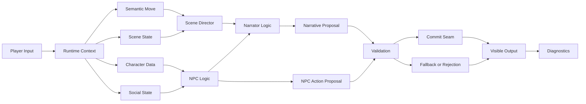

### Natural explanation

A turn begins with player input and runtime context. The system interprets the player input as a semantic move. The current scene state determines what is already true. Character data and social state determine which NPCs are relevant and how pressured they are.

Scene direction then chooses the scene function and pacing. NPC logic determines who should react and how. Narrator logic frames the result into a visible scene response. Finally, validation and commit decide what may become true.

---

## 4. What "Thinking" Means in This Runtime

Thinking is a controlled runtime process.

It includes:

- reading the current state,
- interpreting the player move,
- selecting relevant actors,
- applying authored constraints,
- choosing dramatic function,
- producing a proposal,
- validating the proposal,
- rendering only valid or safe output,
- writing diagnostics.

Thinking does not mean:

- the model independently decides canon,
- NPCs freely mutate state,
- the Narrator can skip validation,
- dialogue automatically becomes world truth,
- fallback output is treated as success without degradation markers.

---

## 5. Core Data Structures

| Data Structure | Used By | Purpose |
| --- | --- | --- |
| Runtime context | Narrator, NPC logic, task router | Carries current turn data |
| Scene state | Narrator, scene director, validation | Defines where the scene is and what is currently true |
| SemanticMoveRecord | Scene director, NPC logic | Classifies the player's social or tactical move |
| CharacterMindRecord | NPC logic, responder selection | Provides bounded tactical identity for a character |
| SocialStateRecord | Scene director, conflict logic | Summarizes pressure, continuity, active threads, and social risk |
| ScenePlanRecord | Narrator, narrative route, validation | Selects scene function, responder set, pacing, and rationale codes |
| Retrieved context pack | Narrator, NPC logic, narrative route | Provides lore or continuity support |
| Narrative proposal | Validation, render | Candidate visible output |
| NPC action proposal | Validation, render | Candidate actor reaction or dialogue |
| Validation result | Commit, diagnostics | Accepts or rejects the proposal |
| Commit record | Runtime state | Records what actually became true |
| Diagnostics envelope | Admin, tests, operators | Explains the route and decisions |

---

## 6. Narrator Thinking Model

The Narrator is best understood as a runtime role that frames the scene, exposes consequence, manages pacing, and converts internal scene logic into visible experience.

The Narrator does not own truth. The Narrator reads truth from the runtime and proposes visible narration that must remain consistent with validation and commit rules.

### 6.1 Narrator Thinking Flow

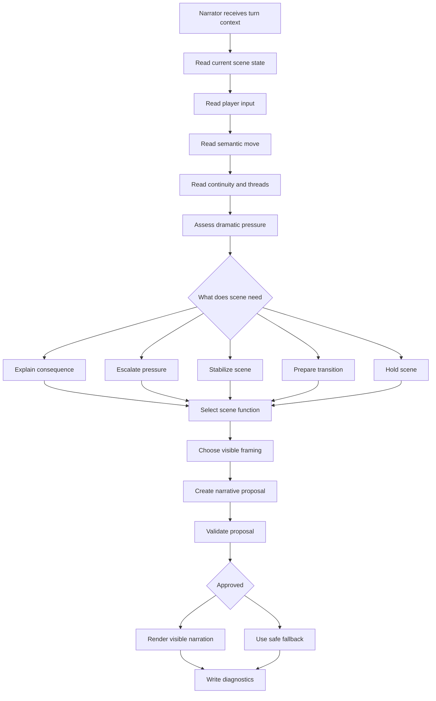

### 6.2 Narrator Questions

The Narrator answers questions such as:

| Question | Why It Matters |
| --- | --- |
| What is the current scene actually about? | Prevents generic text generation |
| What did the player change, challenge, reveal, or pressure? | Anchors narration to input |
| Does the scene need consequence, escalation, stabilization, or transition? | Controls pacing |
| Which NPC reaction should be visible? | Connects scene framing to actor agency |
| Is silence meaningful or just passivity? | Prevents dead scenes |
| Is a transition legal? | Prevents scene skipping |
| What should the player understand now? | Keeps the visible response clear |
| What may be committed? | Keeps narration aligned with authority |

### 6.3 Narrator Inputs

| Input | Function |
| --- | --- |
| Player input | Provides the immediate trigger |
| Current scene state | Defines the actual scene boundary |
| Scene phase | Helps determine pacing and transition readiness |
| Semantic move | Explains social or tactical meaning |
| Social state | Shows pressure, risk, and active threads |
| Retrieved context | Adds lore or continuity when needed |
| Scene plan | Provides selected scene function and responder set |
| Conflict proposal | Provides synthesized tension when multiple actors matter |
| Validation constraints | Restricts what may be shown or committed |

### 6.4 Narrator Outputs

| Output | Meaning |
| --- | --- |
| Narrative frame | Visible description of what happens |
| Consequence framing | Explanation of what the player action means |
| Pacing signal | Fast, tense, reflective, restrained, escalating, or stabilizing |
| Scene function signal | Continue, reveal, escalate, repair, block, transition |
| Transition candidate | Possible transition proposal, not truth by itself |
| Visible response proposal | Player-facing text candidate |
| Diagnostics | Explanation of narrator route and decisions |

### 6.5 Narrator Decision Tree

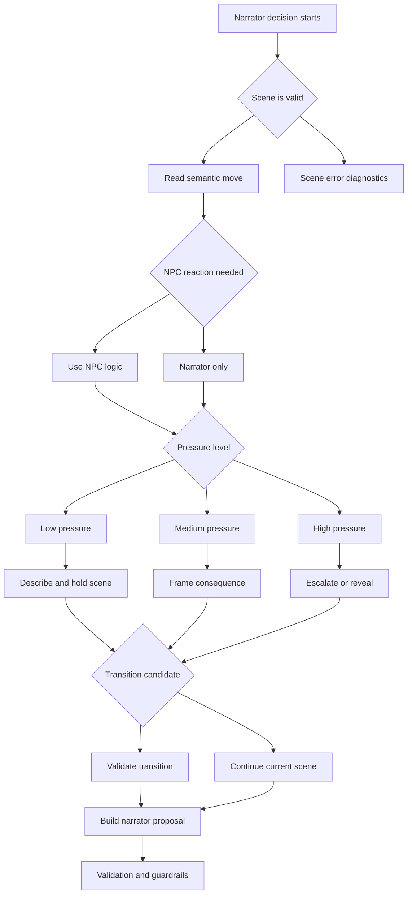

### 6.6 Narrator Behavior Modes

| Mode | When Used | Visible Effect |
| --- | --- | --- |
| Scene holding | Scene is stable or input is minor | Keeps scene grounded |
| Consequence framing | Player action affects meaning or pressure | Makes consequence visible |
| Escalation | Pressure is high or conflict deepens | Raises stakes |
| Stabilization | Player attempts repair or confusion needs clarity | Prevents chaotic drift |
| Reveal framing | A clue, motive, or social contradiction becomes visible | Makes discovery dramatic |
| Transition preparation | Scene boundary may be reached | Prepares but does not auto-commit transition |
| Blocked response | Player attempts illegal or incoherent action | Explains limitation safely |
| Degraded fallback | Model or validation path fails | Provides safe but marked output |

---

## 7. NPC Thinking Model

NPC thinking is a bounded actor-reaction system. It is not unrestricted agent autonomy.

An NPC reaction should be derived from:

- authored character identity,
- tactical posture,
- pressure response bias,
- current scene state,
- player semantic move,
- social state,
- continuity impact,
- responder selection,
- scene function,
- validation rules.

### 7.1 NPC Thinking Flow

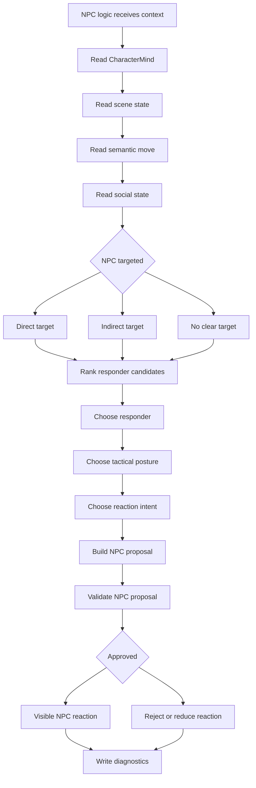

### 7.2 NPC Questions

NPC logic answers questions such as:

| Question | Why It Matters |
| --- | --- |
| Is this NPC directly addressed? | Direct address should usually raise priority |
| Is this NPC indirectly implicated? | Some reactions are triggered by social pressure |
| What does the NPC know in this scene? | Prevents impossible knowledge |
| What is the NPC's tactical posture? | Keeps the reaction character-specific |
| What social risk is present? | Determines restraint or escalation |
| Should the NPC speak, act, withhold, deflect, or escalate? | Produces meaningful agency |
| Does the reaction fit the current scene function? | Keeps the scene coherent |
| Is the proposed reaction legal and lore-consistent? | Protects canon and state |

### 7.3 NPC Inputs

| Input | Function |
| --- | --- |
| CharacterMindRecord | Gives the NPC a bounded tactical identity |
| Scene state | Defines current available reality |
| SemanticMoveRecord | Describes what the player is doing socially or tactically |
| SocialStateRecord | Captures pressure, continuity, and active threads |
| ScenePlanRecord | Provides scene function, pacing, and responder set |
| Retrieved context | Provides lore or memory support |
| Prior continuity impacts | Influences trust, blame, hostility, or restraint |
| Validation policy | Defines legal action and mutation limits |

### 7.4 NPC Outputs

| Output | Meaning |
| --- | --- |
| Responder selection | Which NPC should react |
| Reaction intent | Speak, accuse, repair, deflect, reveal, withhold, escalate |
| Dialogue proposal | Candidate line or dialogue beat |
| Action proposal | Candidate non-dialogue behavior |
| Pressure effect proposal | Possible pressure shift, not truth until commit |
| Rationale codes | Machine-readable explanation of why the NPC reacted |
| Diagnostics | Evidence for route choice and validation |

### 7.5 NPC Decision Tree

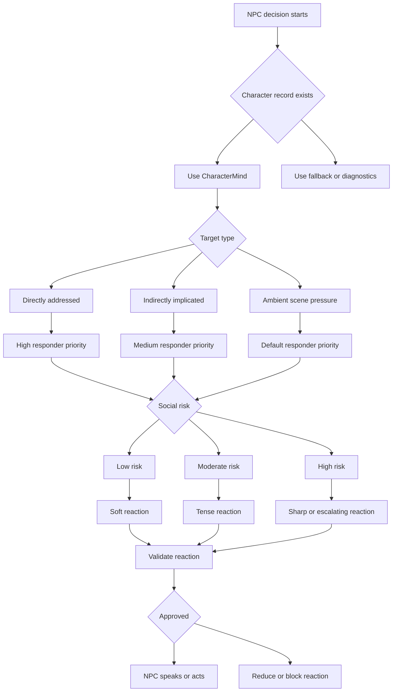

### 7.6 NPC Reaction Modes

| Mode | Meaning | Example Use |
| --- | --- | --- |
| Answer | NPC responds directly to player | Player asks a clear question |
| Accuse | NPC challenges another actor or the player | Player exposes blame |
| Deflect | NPC avoids direct responsibility | Player applies pressure |
| Repair | NPC attempts to reduce conflict | Player tries reconciliation |
| Withhold | NPC intentionally stays silent or evasive | Revealing truth would be premature |
| Reveal | NPC exposes information or contradiction | Scene pressure justifies revelation |
| Escalate | NPC increases conflict | High pressure or direct provocation |
| Stabilize | NPC calms or reframes | Scene risks incoherence |
| Observe | NPC reacts physically or emotionally without dialogue | Silence is meaningful |
| Exit or withdraw | NPC reduces engagement | Pressure is too high or scene function allows it |

### 7.7 Meaningful Silence

NPC silence is only useful when it means something.

| Silence Type | Valid When | Invalid When |
| --- | --- | --- |
| Strategic silence | NPC is withholding information | The scene expects a direct reply |
| Shocked silence | A reveal or accusation lands strongly | Used repeatedly without consequence |
| Social refusal | NPC refuses to dignify the move | No visible cue explains it |
| Pressure silence | The room reacts through tension | The player receives no feedback |
| Fallback silence | System failed and cannot generate safely | It is hidden as normal behavior |

A quiet NPC is acceptable only if the Narrator makes the silence visible and meaningful.

---

## 8. Narrator and NPC Cooperation

The Narrator and NPC logic should not compete. They serve different parts of the same turn.

The NPC provides actor-level agency. The Narrator provides scene-level framing.

### 8.1 Cooperation Diagram

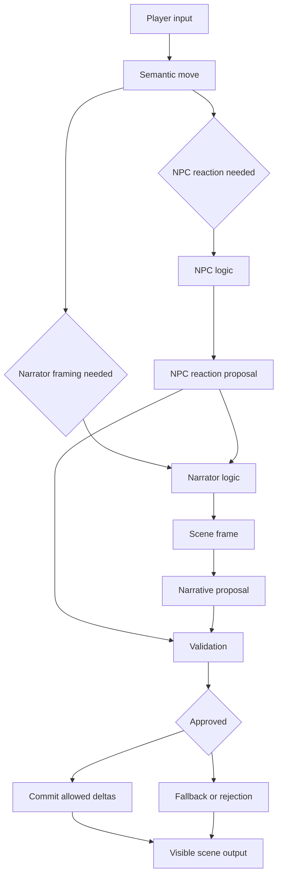

### 8.2 Cooperation Rules

| Rule | Meaning |
| --- | --- |
| NPCs provide local agency | NPCs should react from character, pressure, and scene function |
| Narrator provides global framing | The Narrator explains the scene-level consequence |
| Scene direction coordinates both | Scene function decides whether to prioritize reaction, reveal, escalation, or stabilization |
| Validation governs both | Neither NPC nor Narrator bypasses the authority boundary |
| Diagnostics must include both | Operators need to see why an NPC reacted and how the Narrator framed it |

### 8.3 Handoff Table

| From | To | Handoff Object | Purpose |
| --- | --- | --- | --- |
| Classification | NPC logic | Semantic move and target hint | Determine relevant actor |
| Classification | Narrator logic | Move type and directness | Determine framing need |
| Retrieval | NPC logic | Character or lore context | Ground reaction |
| Retrieval | Narrator logic | Scene or continuity context | Ground narration |
| NPC logic | Scene direction | Responder candidate and reaction intent | Shape scene plan |
| Scene direction | Narrator logic | Scene function and pacing | Frame visible output |
| Conflict synthesis | NPC logic | Conflict pressure | Shape actor reaction |
| Conflict synthesis | Narrator logic | Conflict summary | Frame stakes |
| Narrator and NPC logic | Validation | Proposals | Accept or reject |
| Validation | Render | Accepted or fallback result | Produce player-facing output |

---

## 9. Combined Turn Patterns

Different turns require different combinations of Narrator and NPC logic.

### 9.1 Narrator-Only Turn

Used when the player performs an environmental action or asks for scene description without targeting a character.

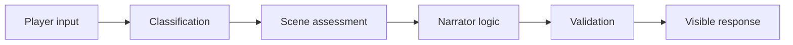

### 9.2 NPC-Targeted Turn

Used when the player speaks to, accuses, questions, helps, threatens, or pressures an NPC.

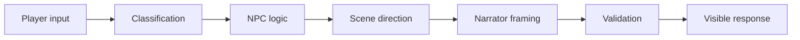

### 9.3 Multi-NPC Conflict Turn

Used when several characters are implicated or the player creates a social collision.

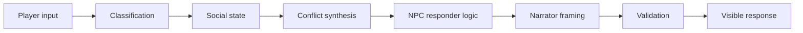

### 9.4 Lore-Dependent Character Turn

Used when an NPC response depends on prior events, authored lore, or hidden context.

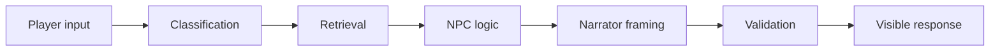

### 9.5 Failed or Degraded Turn

Used when model invocation, retrieval, parsing, or validation fails.

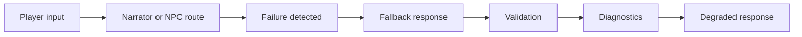

---

## 10. How NPC Agency Emerges

NPC agency should emerge from structured constraints, not from uncontrolled autonomy.

Agency emerges when the runtime can answer:

1. Who is affected?
2. Why is this actor affected?
3. What pressure is acting on them?
4. What do they want to protect, reveal, deny, or repair?
5. What can they plausibly do in this scene?
6. What is the visible consequence?
7. Is the reaction valid?

### NPC Agency Pipeline

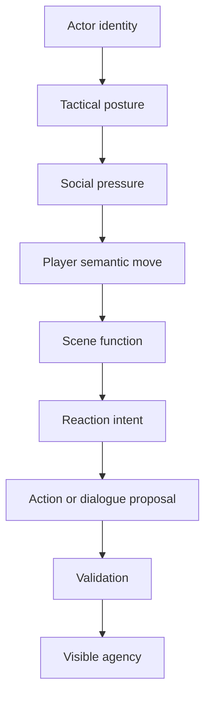

### Agency Quality Criteria

| Criterion | Good Behavior | Weak Behavior |
| --- | --- | --- |
| Specificity | NPC reacts as this character | NPC sounds generic |
| Relevance | Reaction addresses player input | Reaction ignores player action |
| Pressure awareness | Reaction matches scene tension | Reaction is emotionally flat |
| Continuity | Reaction respects prior events | Reaction forgets consequences |
| Scene fit | Reaction supports current scene function | Reaction derails scene |
| Validity | Reaction passes validation | Reaction invents illegal state |
| Visibility | Player can understand the reaction | Reaction is hidden or absent |

---

## 11. How Narrator Authority Emerges

Narrator authority is not the same as world authority.

The Narrator has presentation authority, not commit authority. It can frame, explain, pace, and render, but the world-engine remains responsible for truth.

### Narrator Authority Pipeline

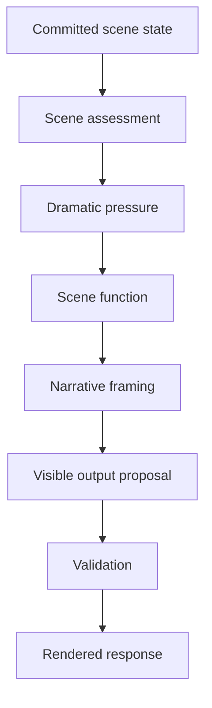

### Narrator Quality Criteria

| Criterion | Good Behavior | Weak Behavior |
| --- | --- | --- |
| Grounding | Narration reflects committed state | Narration invents facts |
| Consequence | Player action visibly matters | Output feels disconnected |
| Pacing | Scene intensity is controlled | Scene rushes or stalls |
| NPC integration | Character reactions are framed | NPCs feel silent |
| Clarity | Player understands outcome | Response is vague |
| Authority safety | State changes are validated | Narration silently mutates truth |
| Diagnostic visibility | Decisions are explainable | Runtime feels like a black box |

---

## 12. Failure Modes

### 12.1 NPC Failure Modes

| Failure Mode | Symptom | Likely Cause | Repair Direction |
| --- | --- | --- | --- |
| Passive NPC | Character does not respond | Responder selection weak or scene pressure missing | Strengthen ranking and scene pressure signals |
| Generic NPC | Character voice feels interchangeable | CharacterMind not used strongly enough | Bind reaction to tactical posture and role |
| Incoherent NPC | Reaction violates scene or lore | Retrieval or validation insufficient | Improve grounding and guardrails |
| Overactive NPC | Character hijacks scene | Scene function or pacing too loose | Add responder and pacing constraints |
| Silent but unexplained NPC | Player gets no feedback | Silence not rendered by Narrator | Require meaningful silence framing |
| Wrong target NPC | Irrelevant actor responds | Semantic target detection weak | Improve classification and target hints |

### 12.2 Narrator Failure Modes

| Failure Mode | Symptom | Likely Cause | Repair Direction |
| --- | --- | --- | --- |
| Passive narrator | Scene feels static | Weak pressure or scene function | Strengthen dramatic assessment |
| Overexplaining narrator | Response becomes summary-heavy | Delivery mode too recap-like | Use live scene framing controls |
| Unclear narrator | Player cannot tell what happened | Poor consequence framing | Require outcome and consequence markers |
| Lore-breaking narrator | Narration invents facts | Validation too permissive | Strengthen lore and scene checks |
| Transition-happy narrator | Scene jumps too fast | Transition validation weak | Add transition readiness rules |
| Hidden degradation | Output says ok while quality is degraded | Fallback not visible enough | Add degradation diagnostics and player-safe fallback |

---

## 13. Design Requirements

### 13.1 NPC Thinking Requirements

1. NPC reactions must be grounded in CharacterMind, SocialState, SceneState, and SemanticMove data.
2. NPCs must not directly mutate world state.
3. NPC silence must be meaningful and visible when it matters.
4. Responder selection must be diagnosable.
5. NPC proposals must pass validation before visible or committed consequences become truth.
6. NPC logic must support both direct and indirect targeting.
7. NPC reaction intensity must be aligned with scene pressure and pacing.

### 13.2 Narrator Thinking Requirements

1. Narration must be grounded in committed runtime state.
2. The Narrator must frame consequence, pressure, and scene movement.
3. The Narrator must not invent unvalidated state changes.
4. Scene transitions must be proposed and validated, not auto-committed.
5. The Narrator must integrate NPC reactions into readable player-facing output.
6. The Narrator must make degraded or blocked outcomes safe and understandable.
7. Narrator decisions must be visible in diagnostics.

### 13.3 Shared Requirements

1. Both NPC and Narrator logic must use structured handoffs.
2. Both must write diagnostics.
3. Both must respect the validation and commit boundary.
4. Both must degrade explicitly on failure.
5. Both must be testable with deterministic fixtures.
6. Neither may become a second truth authority.

---

## 14. Diagnostics Requirements

Operators should be able to answer:

| Diagnostic Question | Required Evidence |
| --- | --- |
| Which NPC was selected? | Responder selection record |
| Why was this NPC selected? | Target hint, ranking score, rationale code |
| What did the player input mean? | SemanticMoveRecord |
| What scene function was chosen? | ScenePlanRecord |
| What pressure state was active? | SocialStateRecord |
| Did retrieval contribute context? | Retrieval hit metadata |
| Was the Narrator framing based on scene state? | Scene assessment evidence |
| Did the model or fallback generate the proposal? | Model route diagnostics |
| What was rejected? | Validation result and rejected delta |
| What was committed? | Commit record |
| Why was the turn degraded? | Degradation signals |

---

## 15. Risk Matrix

| Risk | Affected Logic | Impact | Safeguard |
| --- | --- | --- | --- |
| NPC autonomy escapes validation | NPC logic | AI becomes truth authority | Proposal-only NPC outputs |
| Narrator invents state | Narrator logic | Lore or scene break | Grounding and validation |
| Responder selection is weak | NPC logic, scene direction | Wrong or silent NPC | Ranking and target diagnostics |
| Scene pressure not modeled | Narrator, NPC logic | Passive runtime | SocialState and dramatic pressure gates |
| Conflict not synthesized | NPC logic, narrator | Multi-actor scenes feel flat | Conflict synthesis route |
| Retrieval missing | Both | Generic or false response | Retrieval diagnostics and cautious fallback |
| Validation rejects too much | Both | Low agency and fallback loops | Improve proposal normalization and repair paths |
| Fallback hidden as success | Both | Operators cannot detect degradation | Explicit degradation signals |

---

## 16. Presentation Structure

| Slide | Title | Main Message | Suggested Visual |
| --- | --- | --- | --- |
| 1 | What Thinking Means | Thinking is governed runtime logic, not free autonomy | High-level system view |
| 2 | Role Separation | Narrator frames the scene, NPCs provide actor agency | Role table |
| 3 | Data Structures | Thinking depends on structured state and contracts | Data structure table |
| 4 | Narrator Thinking | Narrator reads scene, pressure, consequence, and pacing | Narrator thinking flow |
| 5 | NPC Thinking | NPC logic selects responder, posture, and reaction | NPC thinking flow |
| 6 | Cooperation | Narrator and NPC logic hand off structured proposals | Cooperation diagram |
| 7 | Turn Patterns | Different inputs activate different route chains | Combined turn diagrams |
| 8 | Agency and Authority | Agency emerges before validation, truth after commit | Agency pipeline |
| 9 | Failure Modes | Passivity and hallucination are diagnosable failure modes | Failure mode tables |
| 10 | Requirements | Safe thinking requires validation, diagnostics, and boundaries | Requirements summary |

---

## 17. Speaker Notes

| Slide | Notes |
| --- | --- |
| 1 | "When we say NPCs or the Narrator think, we mean controlled runtime reasoning, not free hallucination." |
| 2 | "The Narrator owns presentation and consequence framing. NPC logic owns actor-level reaction. The engine owns truth." |
| 3 | "The system needs structured data. Without CharacterMind, SocialState, SemanticMove, and ScenePlan, the model has no stable reasoning surface." |
| 4 | "The Narrator decides what the scene needs: consequence, pressure, stabilization, reveal, or transition." |
| 5 | "NPCs react through target detection, tactical posture, social risk, and scene function." |
| 6 | "NPC output and Narrator framing cooperate. The NPC provides agency; the Narrator makes it visible and coherent." |
| 7 | "Not every turn needs every route. Some are narrator-only, some are NPC-targeted, some involve conflict or retrieval." |
| 8 | "Agency emerges from proposals. Authority only exists after validation and commit." |
| 9 | "Passive scenes, generic NPCs, hidden fallback, and transition drift are not just writing issues. They are route and data issues." |
| 10 | "The safe architecture keeps all creative generation before the authority boundary." |

---

## 18. Summary for Presenters

### Five key statements

1. NPC and Narrator thinking are structured runtime processes, not uncontrolled free-agent cognition.
2. The Narrator frames scene pressure, consequence, pacing, and transitions.
3. NPC logic selects actor reactions based on CharacterMind, SocialState, SemanticMove, and ScenePlan data.
4. NPC and Narrator proposals remain advisory until validation and commit approve them.
5. Meaningful agency requires diagnostics, responder selection, scene pressure, and visible consequence.

### Short answer to: How do NPCs think?

NPCs think through bounded character and scene logic. The runtime reads the NPC's tactical posture, the player's semantic move, social pressure, continuity, and scene function. It then selects a responder and proposes a reaction. That reaction must pass validation before it can shape visible or committed state.

### Short answer to: How does the Narrator think?

The Narrator thinks through scene-level reasoning. It reads the committed scene state, player input, semantic move, social pressure, retrieval context, and scene plan. It decides whether to frame consequence, escalate, stabilize, reveal, hold, or prepare a transition. It proposes visible narration, but validation and commit still control truth.

### Short answer to: How do they work together?

NPC logic provides actor-level agency. Narrator logic provides scene-level framing. Scene direction coordinates both. Validation protects the authority boundary. Commit records only accepted changes. Diagnostics explain the full path.
