# 20-Minute Presentation: AI, LangChain, RAG, LLM, and SLM in the Play-Service

The **Play-Service is the `world-engine` service in this project**. It is the authoritative runtime for story sessions. The backend service remains important for authentication, policy, publishing, integration, and proxy flows, but **committed runtime truth is created in the World-Engine / Play-Service**.

Equally important: AI outputs are **proposals**, not truth. The AI may propose narration, reactions, or state changes. The engine validates and commits only valid changes.

Not everything already exists as a perfect final architecture.

| Topic                                         | Status                                                                                                                 |
| --------------------------------------------- | ---------------------------------------------------------------------------------------------------------------------- |
| World-Engine as authoritative runtime         | directly evidenced                                                                                                     |
| LangGraph as turn orchestration               | directly evidenced                                                                                                     |
| LangChain as prompt / parser / adapter bridge | directly evidenced                                                                                                     |
| RAG in the runtime turn                       | directly evidenced                                                                                                     |
| AI output only as proposal until validation   | directly evidenced                                                                                                     |
| Narrator as its own class                     | not clearly evidenced; evidenced as a runtime role through Scene Director / Visible Render / Commit logic              |
| NPC thinking as autonomous agents             | not clearly evidenced; evidenced as deterministic CharacterMind / SceneDirector / Responder logic                      |
| Full persistent world-state simulation        | not fully evidenced; currently bounded story session state, history, scene progression, diagnostics, narrative threads |
| Demand-driven RAG skipping                    | useful in the ideal flow; in the current runtime graph, retrieval is present as its own standard node                  |

---

The Play-Service is not simply a ChatGPT call inside the game. It is a runtime chain that accepts player input, considers session state and world state, can enrich context through RAG, orchestrates AI through LangGraph and LangChain, prepares Narrator-adjacent and NPC-adjacent decisions, checks model responses, and only applies validated changes to the game state.

The most important statement is:

> The AI creates proposals. The engine decides what actually becomes true.

That is the central safety line against hallucinations, lore breaks, incorrect NPC reactions, and uncontrolled world-state mutations.

---

## 2. Natural Presentation

Today is about the Play-Service in *World of Shadows* and how AI is actually integrated into it.

From the outside, one might think the system works like this: the player writes something, the system sends it to an LLM, and the LLM answers. But that would be too simple. The Play-Service is not just a text generation machine. It is a runtime that must decide what is allowed to happen in the game.

The authoritative Play-Service lives in the `world-engine`. The backend can prepare sessions, compile content, and forward requests, but the actual story runtime runs in the World-Engine. That is where the `StoryRuntimeManager` manages story sessions, executes turns, writes diagnostics, and advances the current scene state.

When a player enters an action, generation does not happen immediately. First, the input is interpreted. Then a turn context is built: Which session are we in? Which module? Which scene? What previous events or continuity impacts exist? Which narrative threads are active? After that, the turn runs through a LangGraph-based runtime graph.

This graph is a kind of execution plan for the player turn. It contains nodes such as input interpretation, retrieval, scene assessment, model routing, model invocation, fallback, proposal normalization, validation, commit, and visible rendering. This matters because the whole process does not disappear into one large prompt. The flow remains structured and diagnosable.

RAG acts as a controlled memory. When context is needed, such as lore, module knowledge, character profiles, or runtime projections, a retrieval request is built. In the code, this is evidenced through `ai_stack/rag.py` and the runtime graph. The retriever returns context chunks that can be inserted into the prompt. But here as well: retrieval is not truth by itself. It provides hints and context. The engine and validators must still check whether the result is valid.

In this project, LangChain is not used as a magical agent platform. It is used very concretely as a bridge for prompt templates, structured output parsers, and adapter invocations. The runtime graph decides when a model is invoked. LangChain helps build the prompt cleanly and parse structured results.

LLMs and SLMs have different roles. Large models are useful for complex narrative formulation, conflict synthesis, and difficult social decisions. Smaller models are better suited for classification, preflight checks, routing, or simple detection. The backend has dedicated routing contracts for that. In the live path of the World-Engine, model routing is evidenced through the registry, routing policy, and adapters, but exact LLM/SLM provider parity is not clearly visible in every detail. The important principle is: not every task needs the same model.

The Narrator is not simply a single mystical figure in the code. Technically, it is more of a runtime role: assessing the scene, estimating dramatic pressure, making consequences visible, preparing transitions, and rendering a visible output. For the `God of Carnage` module, concrete building blocks exist, such as `scene_director_goc.py`, scene assessment, the Dramatic Effect Gate, and visible render logic.

NPCs also do not think freely like fully autonomous beings. Their behavior is derived from concrete data: CharacterMind records, social state, scene state, previous continuity impacts, semantic interpretation of player input, and responder selection. An NPC should therefore not react arbitrarily, but according to its role, the current scene, and the allowed dramaturgy.

For that reason, the decision tree is not a single tree in one file. It is an interaction between rules, graph nodes, routing policies, validation seams, guardrails, and commit logic. Some decisions are deterministic: Is the session valid? Is the scene known? Is a transition allowed? Other decisions are AI-assisted: How should a reaction be phrased? Which narrative response fits? Even then, the engine remains the authority that decides whether this becomes truth.

When everything works correctly, a turn roughly works like this: player input arrives, session and state are loaded, context is built, retrieval adds missing knowledge, the Scene Director plans Narrator-adjacent and NPC-adjacent reactions, a model creates a structured proposal, validation and guardrails check that proposal, and only valid changes are committed. The player then receives a narratively appropriate response, and the diagnostics show what happened.

The risks lie exactly at the interfaces: missing context, wrong runtime configuration, provider failure, hallucinated model responses, overly passive narration, NPCs without clear goals, or insufficiently visible diagnostics. That is why this architecture is more than a prompt. It is a controlled interaction between memory, decision-making, generation, validation, and state.

---

## 3. Technical Explanation in Plain Language

| Term                 | Explanation in the Play-Service context                                                                          | Example from repository or ideal flow                                                                                                                     |
| -------------------- | ---------------------------------------------------------------------------------------------------------------- | --------------------------------------------------------------------------------------------------------------------------------------------------------- |
| AI                   | Umbrella term for model calls, retrieval, orchestration, and proposal logic.                                     | `ai_stack/langgraph_runtime.py`, `ai_stack/rag.py`                                                                                                        |
| LLM                  | Large model for complex narrative or social generation.                                                          | Backend routing names `narrative_formulation`, `scene_direction`, and `conflict_synthesis` as LLM-adjacent tasks.                                         |
| SLM                  | Smaller model for fast, narrower tasks such as classification or preflight.                                      | `backend/app/runtime/model_routing.py` names `classification`, `ranking`, and `cheap_preflight`. Live provider assignment is not fully clearly evidenced. |
| RAG                  | Retrieval-Augmented Generation: context is searched from project/runtime knowledge and inserted into the prompt. | `ai_stack/rag.py`, `docs/technical/ai/RAG.md`, `_retrieve_context` in the runtime graph.                                                                  |
| LangChain            | Helps with prompt templates, structured parsers, and adapter calls.                                              | `ai_stack/langchain_integration/bridges.py`.                                                                                                              |
| LangGraph            | Orchestrates the turn as a graph of multiple steps.                                                              | `RuntimeTurnGraphExecutor` in `ai_stack/langgraph_runtime.py`.                                                                                            |
| Retrieval            | Searches relevant context chunks for the current turn.                                                           | `RetrievalRequest(domain=runtime, profile=runtime_turn_support)`.                                                                                         |
| Embeddings           | Optional dense search index for semantic search.                                                                 | `.wos/rag/runtime_embeddings.npz`, optional `fastembed`; not necessarily always active.                                                                   |
| Vector Store         | No external production vector DB service is evidenced in the current state; local dense artifacts are evidenced. | `.wos/rag/runtime_corpus.json`, `.npz` dense index.                                                                                                       |
| Prompt               | The text sent to the model.                                                                                      | LangChain runtime prompt with player input, interpretation, and retrieval context.                                                                        |
| Prompt Context       | Combined context from session, scene, retrieval, and interpretation.                                             | `model_prompt`, `context_text` in LangGraph state.                                                                                                        |
| Tool Call            | Controlled access to capabilities.                                                                               | Capability Registry / LangChain tool bridge is evidenced; a complete tool loop is not clearly evidenced as the main path.                                 |
| Guardrail            | Protection rule against invalid, lore-breaking, or unsuitable outputs.                                           | `dramatic_effect_gate.py`, validation seams, backend validators.                                                                                          |
| Validation           | Check whether an AI proposal may be accepted.                                                                    | `run_validation_seam`, `validators.py`, `commit_models.py`.                                                                                               |
| Runtime Config       | Effective runtime / routing / adapter configuration.                                                             | Distributed in code through env, `RoutingPolicy`, `ModelRegistry`, `game_service.py`; no single complete `RuntimeConfig` truth is clearly evidenced.      |
| Session State        | State of a running story session.                                                                                | `StorySession` in `world-engine/app/story_runtime/manager.py`.                                                                                            |
| World State          | Authoritative game/story truth.                                                                                  | Bounded in story runtime code: scene, history, diagnostics, narrative threads, continuity impacts. A full persistent simulation is not fully evidenced.   |
| Turn Context         | Short-lived context for one player turn.                                                                         | LangGraph `RuntimeTurnState`, backend `ShortTermTurnContext`.                                                                                             |
| Narrator             | Runtime role for scene assessment, consequence, and visible narration.                                           | Scene Director, Visible Render, Narrative Commit; no single `Narrator` class is clearly evidenced.                                                        |
| NPC Decision Logic   | Logic for selecting responders, posture, and scene function.                                                     | `scene_director_goc.py`, `character_mind_goc.py`, `social_state_contract.py`.                                                                             |
| Decision Tree        | Distributed decision logic made of graph, policies, rules, routing, and validation.                              | LangGraph nodes, commit resolver, scene director.                                                                                                         |
| Policy               | Rule set that decides what is allowed or how routing works.                                                      | `decision_policy.py`, `mutation_policy.py`, `model_routing.py`, `reference_policy.py`.                                                                    |
| State Machine        | State sequence of a turn or session.                                                                             | LangGraph flow and turn state.                                                                                                                            |
| Delta Proposal       | Change proposed by AI or normalization.                                                                          | Live: `proposed_state_effects`; backend: delta validation.                                                                                                |
| Accepted Delta       | Validated and applied change.                                                                                    | `committed_result`, `StoryNarrativeCommitRecord.allowed`.                                                                                                 |
| Rejected Delta       | Rejected change.                                                                                                 | `validation_outcome` rejected, blocked commit reason.                                                                                                     |
| Diagnostics Envelope | Structured diagnostic information per turn.                                                                      | `session.diagnostics`, graph diagnostics, `/api/story/sessions/{id}/diagnostics`.                                                                         |

---

## 4. Play-Service Flow Diagram

**Ideal flow with current-state note:** The diagram shows the desired clean flow. In the current code, retrieval is evidenced as its own runtime graph node; a real “skip retrieval only when not needed” path is not clearly evidenced.

**Presentation note:** All Mermaid diagrams in this file use descriptive internal IDs instead of cryptic single letters. This keeps the diagrams understandable even if a renderer unexpectedly shows IDs in the source or view.

```mermaid
flowchart TD
    playerAction["Main path: player sends action"] --> frontendInput["Frontend receives input"]
    frontendInput --> backendTurnRequest["Backend API receives turn request"]
    backendTurnRequest --> storySessionExists{"World-Engine story session exists?"}

    storySessionExists -- "No" --> backendCompilesModule["Backend compiles module and runtime projection"]
    backendCompilesModule --> worldEngineCreatesSession["World-Engine creates story session"]
    storySessionExists -- "Yes" --> worldEngineReceivesTurn["World-Engine receives turn request"]
    worldEngineCreatesSession --> worldEngineReceivesTurn

    worldEngineReceivesTurn --> playServiceRuntime["Play-Service / World-Engine"]
    playServiceRuntime --> storyRuntimeManagerTurn["StoryRuntimeManager.execute_turn"]
    storyRuntimeManagerTurn --> loadSessionState["Load session state and increment turn counter"]
    loadSessionState --> interpretInput["LangGraph node: interpret_input"]

    interpretInput --> assessContext["Context assessment"]
    assessContext --> ragContextNeeded{"RAG context needed?"}
    ragContextNeeded -- "Yes / currently evidenced as graph node" --> ragRetrievalPath["RAG path: RetrievalRequest and ContextPack"]
    ragContextNeeded -- "No / ideal path" --> directPromptContext["Direct prompt context"]
    ragRetrievalPath --> buildPromptContext["Build prompt context"]
    directPromptContext --> buildPromptContext

    interpretInput --> narratorAnalysisPath["Narrator path: scene assessment and dramatic pressure"]
    interpretInput --> npcAnalysisPath["NPC path: semantic move, CharacterMind, and SocialState"]
    narratorAnalysisPath --> determineSceneIntent["Scene function, pacing, and visible intent"]
    npcAnalysisPath --> determineSceneIntent

    buildPromptContext --> modelRouting["Model routing: LLM, SLM, provider, or adapter"]
    determineSceneIntent --> modelRouting
    modelRouting --> providerAvailable{"Provider available?"}

    providerAvailable -- "Yes" --> modelInvocation["LangChain prompt, parser, and LLM/SLM invocation"]
    providerAvailable -- "No" --> fallbackPath["Error/fallback path: mock, fallback, or degraded marker"]

    modelInvocation --> aiProposal["AI proposal / structured output"]
    fallbackPath --> aiProposal

    aiProposal --> validationPath["Validation path: validation seam and guardrails"]
    validationPath --> proposalValid{"Proposal valid?"}

    proposalValid -- "Yes" --> acceptedDelta["Accepted delta / commit seam"]
    acceptedDelta --> updateWorldState["Bounded world-state update: scene, history, threads, diagnostics"]
    proposalValid -- "No" --> rejectedDelta["Rejected delta / blocked / diagnostics_only"]

    updateWorldState --> responseToPlayer["Response to player"]
    rejectedDelta --> responseToPlayer
    responseToPlayer --> writeDiagnostics["Diagnostics, logs, and evidence"]
```

---

## 5. Sequence Diagram

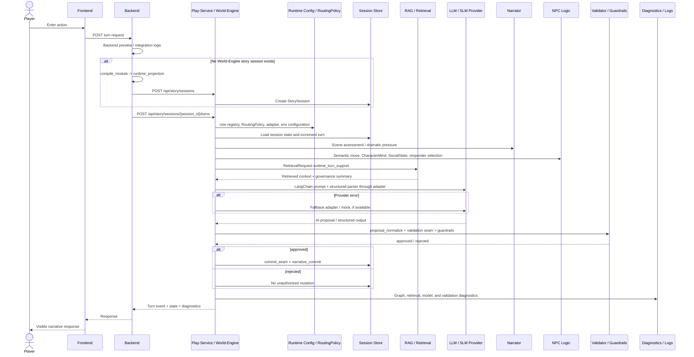

---

## 6. State Diagram for a Player Turn

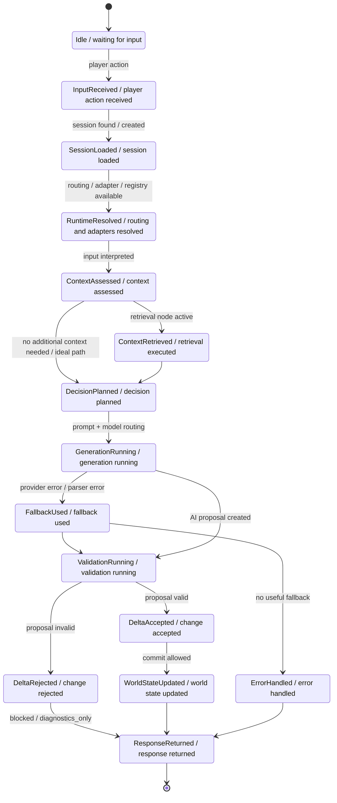

This diagram means: a turn is not a single function call, but a controlled state machine. Authoritative runtime state may change only after session, context, generation, and validation have successfully run.

---

## 7. UML Component Diagram / Architecture Diagram

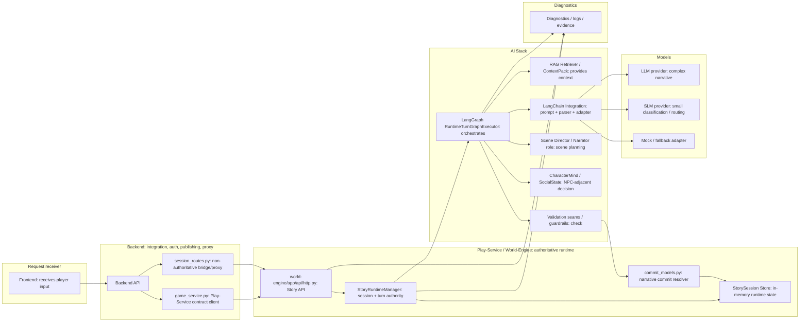

Component roles:

| Component                   | Role                                                |
| --------------------------- | --------------------------------------------------- |
| Frontend                    | Request entry point for players                     |
| Backend                     | Integration, proxy, auth/policy, module compilation |
| World-Engine                | Authoritative turn execution                        |
| StoryRuntimeManager         | Session and turn orchestration on the runtime side  |
| LangGraph                   | Turn flow control                                   |
| RAG                         | Context provider                                    |
| LangChain                   | Prompt / parser / adapter bridge                    |
| Scene Director              | Narrator-adjacent planning                          |
| CharacterMind / SocialState | NPC-adjacent planning                               |
| Validator / Guardrails      | Protection layer before commit                      |
| Commit Resolver             | Decides what is authoritatively accepted            |
| Diagnostics                 | Traceability                                        |

---

## 8. Major Function Chains in the Play-Service

### 8.1 Function Chain Table

| Function chain                                                                                                         | Starting point        | Involved components                                                             | Purpose                         | Result                                      | Risk                                               |
| ---------------------------------------------------------------------------------------------------------------------- | --------------------- | ------------------------------------------------------------------------------- | ------------------------------- | ------------------------------------------- | -------------------------------------------------- |
| Player input → Request handling → Session load → Runtime config → AI routing → Generation → Validation → Response      | Player action         | Frontend, Backend, World-Engine, LangGraph, LangChain, Validator                | Complete main turn path         | Response + optional commit                  | Provider error, missing session, validation reject |
| Player input → Intent detection → NPC selection → NPC decision → Dialogue / action → World-state update                | Interpreted input     | `interpret_input`, semantic planner, Scene Director, CharacterMind, SocialState | Determine relevant NPC reaction | Responder, scene function, visible reaction | NPC feels passive or lore-breaking                 |
| Player input → Retrieval decision → RAG query → Context assembly → Prompt build → LLM response                         | Context need          | RAG, ContextPackAssembler, LangChain prompt                                     | Add missing context             | Prompt contains relevant lore/memory        | Retrieval finds nothing or wrong context           |
| Narrator turn → Scene state → Dramatic pressure → Narrative intent → Generated output → Guardrails                     | Scene assessment      | Scene Director, Dramatic Effect Gate, Visible Render                            | Lead the scene narratively      | Narrative text, consequence, pressure       | Narrator remains too generic/passive               |
| NPC turn → Character traits → Relationship state → Goal evaluation → Decision tree → Action / dialogue                 | NPC-adjacent reaction | CharacterMind, SocialState, SemanticMove, Scene Director                        | Plausible character reaction    | Dialogue/action proposal                    | Goals/relationships are modeled too weakly         |
| Runtime config → Provider selection → LLM/SLM routing → Fallback handling                                              | Turn routing          | RoutingPolicy, Registry, Adapter, LangChain                                     | Choose suitable model           | Primary model or fallback                   | Wrong model, cost/latency, no fallbacks            |
| AI output → Structured delta proposal → Validation → Accepted/rejected changes → Committed world state                 | Model response        | LangChain parser, proposal_normalize, validation seam, commit seam              | Control AI proposal             | Commit or reject                            | Hallucination would otherwise become truth         |
| Failure path → Missing context / provider error / validation failure → Fallback / error response / diagnostic evidence | Error case            | LangGraph fallback, Diagnostics, Logs                                           | Degrade in a controlled way     | Degraded response + evidence                | Error remains invisible or UX breaks               |

### 8.2 Most Important Function Chain in the Ideal State

When the player enters something, the system does not simply generate text. Instead, a chain runs through context resolution, decision logic, model selection, generation, checking, and state change.

The player input is first placed into a runtime context: Which session? Which scene? Which previous events? Then the runtime graph decides which information is needed and which role becomes active: Narrator, NPC-adjacent logic, or both. RAG can provide additional context. After that, model routing and adapters invoke a model. But the model only creates a proposal. Only validation and commit logic decide whether it becomes authoritative game truth.

### 8.3 Mermaid Flowchart of the Most Important Function Chains

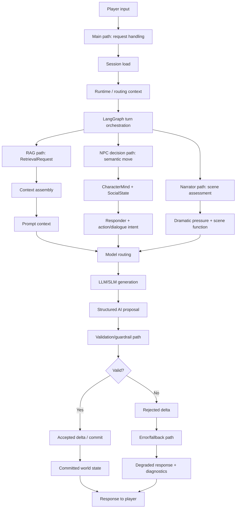

---

## 9. Decision Tree and Decision Logic

### 9.1 Explaining the Decision Tree in General

In this project, “decision tree” does not mean that exactly one file contains a classic tree. The decision tree is distributed.

It consists of:

- deterministic rules,
- LangGraph nodes,
- model routing,
- retrieval governance,
- Scene Director logic,
- CharacterMind and SocialState,
- validation seams,
- commit resolver,
- fallback routing.

The AI may formulate, interpret, and propose. The engine decides what is accepted into the authoritative state. This separation matters because otherwise a model could accidentally invent character knowledge, skip scenes, or change the world state in an uncontrolled way.

### 9.2 Decision Tree for a Player Turn

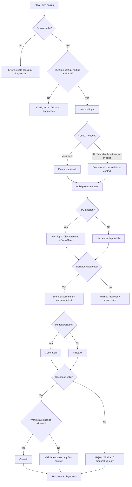

### 9.3 Decision Tree for NPCs

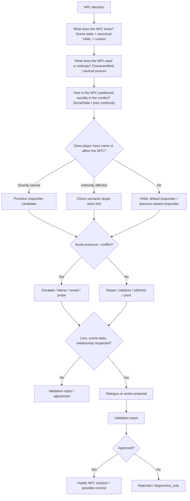

### 9.4 Decision Tree for the Narrator

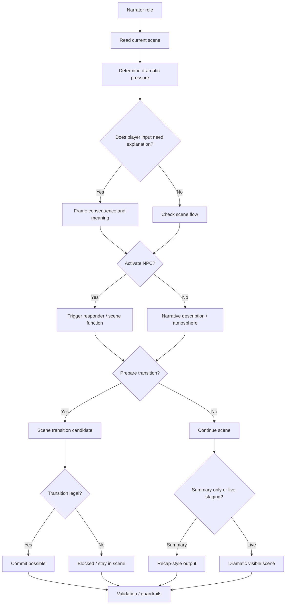

### 9.5 Presentation Text for Decision Logic

The decision tree is the place where the Play-Service decides what is allowed to happen at all. The key point is: the AI must not freely overwrite the game state. It proposes reactions, dialogue, or state changes. The engine checks whether that is allowed and commits only valid changes.

In practice, this decision tree is distributed: part of it is in the LangGraph flow, part in the Scene Director, part in model routing, and part in validation and commit logic. This exact separation prevents a single LLM output from controlling the entire game world.

---

## 10. Narrator Thinking Model

Technically, the Narrator does not “think” like a human. It receives structured signals:

- current scene,
- module and runtime projection,
- player input,
- semantic interpretation,
- previous continuity impacts,
- narrative threads,
- retrieval context,
- dramatic pressure,
- possible scene functions.

Its goal is to continue the scene in a way that is understandable, consequential, and dramatically meaningful. It does not merely explain what happens; it frames consequences, tension, and possible transitions.

In the current code, no single `Narrator` object is clearly evidenced. The Narrator role is distributed across scene assessment, director logic, visible render, commit resolver, and diagnostics.

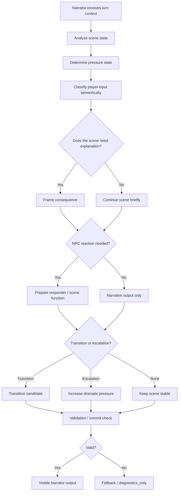

---

## 11. NPC Thinking Model

In the repository, NPCs “think” primarily through structured, bounded models:

- `CharacterMindRecord`: tactical role and posture of a character.
- `SocialStateRecord`: social pressure, threads, scene pressure.
- `SemanticMoveRecord`: what the player is doing socially or dramatically.
- `ScenePlanRecord`: selected scene function, responder set, pacing.
- `scene_director_goc.py`: concrete selection of responder and scene function for `God of Carnage`.

This is not a free autonomous agent psyche. It is controlled decision logic: Who should react? Why? With which function? Is the reaction allowed to happen in this scene?

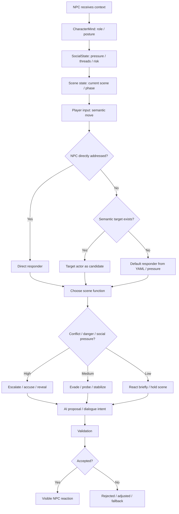

---

## 12. RAG in the Play-Service

Example: the player asks about an old event that is not in the current prompt context.

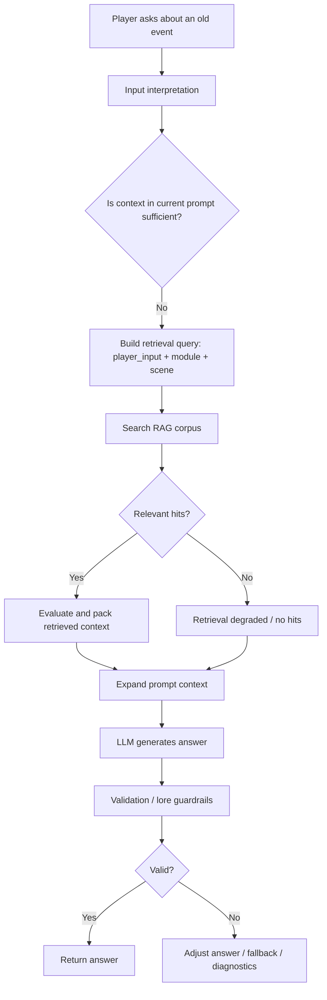

RAG is helpful when:

- relevant lore is not in the current prompt,
- previous events or module knowledge are needed,
- the turn references a scene, character, or relationship,
- the prompt would otherwise have too little context.

RAG is not needed when:

- the reaction can be derived purely locally from the current scene,
- the turn is only a small UI/meta response,
- the context already exists in the turn state.

If retrieval finds nothing, the model must not simply invent truth. The answer must then be cautious, or the turn must be diagnosed as degraded/fallback.

---

## 13. LLM vs. SLM

| Task                            | Suitable model               | Why?                                          | Risk if chosen incorrectly                     |
| ------------------------------- | ---------------------------- | --------------------------------------------- | ---------------------------------------------- |
| Narrative formulation           | LLM                          | Requires language, context, social nuance     | SLM feels flat or implausible                  |
| Scene direction                 | LLM                          | Complex dramaturgical judgment                | Wrong tone, wrong escalation                   |
| Conflict synthesis              | LLM                          | Multiple character interests at once          | Conflict becomes oversimplified                |
| Ambiguity resolution            | LLM or escalation            | Unclear player intent requires interpretation | Wrong intent is committed                      |
| Classification                  | SLM                          | Narrow, fast task                             | LLM would be more expensive/slower             |
| Trigger extraction              | SLM                          | Structured signal detection                   | LLM may overthink                              |
| Ranking / preflight             | SLM                          | Cheaper and faster                            | LLM adds unnecessary latency/cost              |
| High-stakes continuity judgment | LLM + validation             | Risk of lore/state break                      | Wrong world-state change                       |
| Fallback response               | Small model or mock fallback | Must respond in a controlled degraded way     | Player receives broken or meaningless response |

In the repository, LLM/SLM routing principles are especially evidenced in `backend/app/runtime/model_routing.py` and the routing contracts. In the live path of the World-Engine, model routing is evidenced through registry, RoutingPolicy, and adapters; concrete provider parity is not clearly evidenced in every detail.

---

## 14. LangChain / LangGraph / Orchestration

LangGraph is centrally evidenced in the live turn path. The runtime graph contains steps such as:

- `interpret_input`,
- `retrieve_context`,
- `goc_resolve_canonical_content`,
- `director_assess_scene`,
- `director_select_dramatic_parameters`,
- `route_model`,
- `invoke_model`,
- `fallback_model`,
- `proposal_normalize`,
- `validate_seam`,
- `commit_seam`,
- `render_visible`,
- `package_output`.

LangChain is used more narrowly and concretely:

- prompt templates,
- Pydantic structured output parser,
- runtime adapter invocation,
- retriever bridge,
- capability tool bridge.

So it would be incorrect to say: “LangChain controls everything.” Better:

> LangGraph controls the flow. LangChain helps with model invocation and structured output.

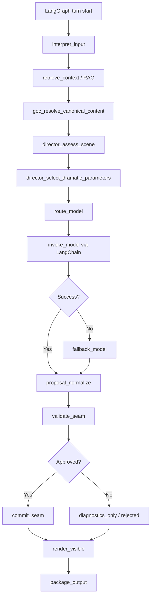

---

## 15. Essential Data Structures and Design Requirements

### 15.1 Essential Data Structures

| Data structure              | Purpose                               | Created by                           | Read by                                | Why required?                                             |
| --------------------------- | ------------------------------------- | ------------------------------------ | -------------------------------------- | --------------------------------------------------------- |
| Session State               | Holds the running story session       | `StoryRuntimeManager.create_session` | World-Engine API, Manager, Diagnostics | Without a session, no authoritative turn exists           |
| World State                 | Authoritative truth of the game world | Engine commit                        | Runtime, UI, Diagnostics               | Separates truth from AI proposal                          |
| Player Input / Action       | Trigger of a turn                     | Player/Frontend                      | Backend, World-Engine, LangGraph       | Starting point of every decision                          |
| Turn Context                | Short-lived context of a turn         | LangGraph / Runtime Manager          | Model routing, Validator, Renderer     | Prevents contextless generation                           |
| Runtime Config              | Providers, routing, secrets, URLs     | Env/Config/Registry                  | Backend, World-Engine                  | Wrong config breaks integration                           |
| Model Routing Config        | Model choice per task                 | RoutingPolicy / Contracts            | LangGraph, Adapter                     | Controls cost, latency, and quality                       |
| Retrieval Query             | Search request for context            | Runtime graph / RAG                  | Retriever                              | Makes RAG targeted and useful                             |
| Retrieved Context           | Found context                         | Retriever / Assembler                | Prompt builder / LangChain             | Adds knowledge outside the prompt                         |
| Prompt Context              | Model input text                      | LangGraph + LangChain                | LLM/SLM provider                       | Controlled model request                                  |
| AI Decision / AI Proposal   | Proposal from the model               | LLM/SLM via adapter                  | Validator, Commit Seam                 | AI may propose, not directly commit                       |
| Narrator Output             | Visible narration                     | Visible render / model               | Player, Diagnostics                    | Creates experience and consequence                        |
| NPC State                   | Character-related state               | Canonical YAML / CharacterMind       | Scene Director, Validator              | Makes reactions plausible                                 |
| NPC Goal / Motivation       | Character intent                      | CharacterMind / YAML-adjacent logic  | NPC decision logic                     | Not fully evidenced as a persistent goal system           |
| Relationship State          | Relationship context                  | SocialState / Runtime Context        | NPC/Narrator logic                     | Not fully clearly evidenced as a rich relationship system |
| Scene State                 | Current scene and phase               | Runtime projection / Session         | Scene Director, Commit Resolver        | Scene logic and transitions need state                    |
| Decision Tree / Policy Node | Decision logic                        | Code rules / graph nodes             | Runtime                                | Makes the flow controllable                               |
| Validation Result           | Result of the check                   | Validator / Validation Seam          | Commit Seam, Diagnostics               | Prevents invalid mutations                                |
| Guardrail Result            | Protective decision                   | Dramatic Effect Gate / Policies      | Runtime graph                          | Protection against lore/tone/state breaks                 |
| Accepted Delta              | Allowed change                        | Commit Seam / Resolver               | Session Store                          | Only accepted change becomes truth                        |
| Rejected Delta              | Rejected change                       | Validator / Commit Resolver          | Diagnostics, Response                  | Makes errors visible instead of silently mutating         |
| Runtime Event Log           | Turn evidence                         | StoryRuntimeManager                  | Operators, Tests, Debug                | Traceability                                              |
| Diagnostics Envelope        | Structured diagnostics                | LangGraph + Manager                  | Admin/Ops/Debug                        | Explains what happened and why                            |

Status notes:

- `Session State` is directly typed as `StorySession`.
- `RuntimeTurnState` is evidenced as a TypedDict.
- RAG structures are clearly typed: `RetrievalRequest`, `RetrievalHit`, `CorpusChunk`.
- `NPC Goal / Motivation` is more of a derived tactical posture than a complete persistent goal system.
- A full world-state simulation is not fully evidenced in the story runtime code; currently the commit in the examined path is bounded.

### 15.2 Design Requirements for the Architecture

1. **Clear separation between AI proposal and engine truth**
  The AI may propose, but the engine commits.
2. **Traceable decisions**
  Retrieval, routing, responder selection, and validation must remain explainable.
3. **Deterministic validation**
  Critical rules must not live only in the model.
4. **Unified runtime configuration**
  Backend and World-Engine must see the same effective reality, or deviations must be diagnosable.
5. **Diagnostic visibility**
  Operators must be able to see which chain was active.
6. **Clean data contracts**
  API and runtime shapes must not drift apart.
7. **Fallback capability**
  Provider, parser, or validation failures must be handled in a controlled way.
8. **RAG only when needed**
  Important as an ideal; currently retrieval is evidenced as a runtime node, while real skipping is not clearly evidenced.
9. **Role-clear AI components**
  Narrator, NPC logic, retrieval, validator, and model router must not be mixed.
10. **Testability**
  Decision logic must remain evidenced through unit, integration, and E2E tests.

### 15.3 Architecture Requirements Matrix

| Design requirement         | Why important?                   | Affected components         | Required data structure                       | Risk if violated          |
| -------------------------- | -------------------------------- | --------------------------- | --------------------------------------------- | ------------------------- |
| AI Proposal ≠ Engine Truth | Protection against hallucination | AI Stack, Validator, Engine | AI Proposal, Validation Result, Commit Record | Model overwrites world    |
| Traceable decisions        | Debugging and trust              | LangGraph, Diagnostics      | RuntimeTurnState, Diagnostics Envelope        | Error cannot be explained |
| Deterministic validation   | Lore/state safety                | Validator, Commit Resolver  | Validation Result, Scene State                | Invalid progress          |
| Unified config             | Stable runtime                   | Backend, World-Engine       | Runtime Config, Routing Config                | Wrong provider/endpoint   |
| Diagnostics                | Operation and demo safety        | Logs, Admin, Backend        | Runtime Event Log                             | Black box                 |
| API contracts              | Frontend/backend/engine parity   | APIs, Schemas               | Runtime Projection, Turn Event                | Schema drift              |
| Fallbacks                  | Controlled degradation           | LangGraph, Adapter          | Fallback Metadata                             | Hard failure              |
| Targeted RAG               | Quality without overhead         | RAG, Prompt Builder         | Retrieval Query, Retrieved Context            | Irrelevant context        |
| Role separation            | Clear responsibility             | Narrator, NPC, Validator    | Scene Plan, CharacterMind                     | Mixed logic               |
| Testability                | Provable quality                 | Tests, CI                   | Fixtures, Contracts                           | Regressions               |

### 15.4 Data Flow Diagram

```mermaid
flowchart LR
    playerInputData["Player input"] --> sessionStateData["Session state"]
    sessionStateData --> worldSceneStateData["World state / scene state"]
    worldSceneStateData --> runtimeRoutingData["Runtime config / routing"]
    playerInputData --> retrievalQueryData["Retrieval query"]
    retrievalQueryData --> retrievedContextData["Retrieved context"]
    retrievedContextData --> promptContextData["Prompt context"]
    worldSceneStateData --> promptContextData
    runtimeRoutingData --> promptContextData
    promptContextData --> aiProposalData["AI proposal"]
    aiProposalData --> validationResultData["Validation result"]
    validationResultData --> deltaAcceptedDecision{"Accepted?"}
    deltaAcceptedDecision -- "Yes" --> acceptedDeltaData["Accepted delta"]
    deltaAcceptedDecision -- "No" --> rejectedDeltaData["Rejected delta"]
    acceptedDeltaData --> updatedWorldStateData["Updated world state"]
    rejectedDeltaData --> fallbackBlockedResponseData["Fallback / blocked response"]
    updatedWorldStateData --> playerResponseData["Player response"]
    fallbackBlockedResponseData --> playerResponseData
    validationResultData --> diagnosticsData["Diagnostics"]
    runtimeRoutingData --> diagnosticsData
    retrievedContextData --> diagnosticsData
    aiProposalData --> diagnosticsData
```

### 15.5 Natural Spoken Explanation

For an AI-supported Play-Service to work reliably, it is not enough to simply send a prompt to a model. The system needs clear data structures: Who am I? Where am I? Who is present? What does the NPC know? What is allowed to change? What was only proposed, and what was actually committed?

Those exact structures prevent the AI from hallucinating freely or changing game state in an uncontrolled way. The Play-Service is therefore more of a controlled runtime system with AI support than a chatbot.

---

## 16. Validation & Guardrails

The system validates:

- structured model response,
- proposed scene transition,
- proposed state effects,
- dramatic plausibility,
- character / scene / lore relation,
- allowed mutation,
- fallback / degraded states.

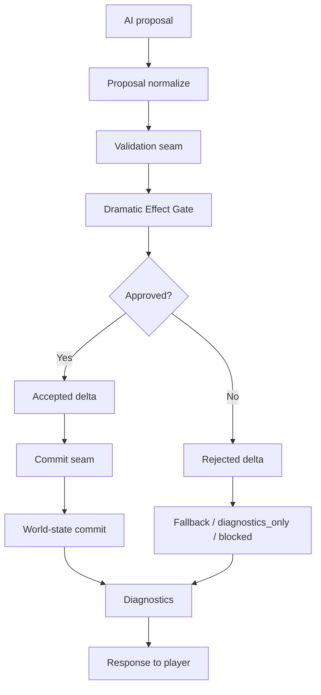

Rejected deltas are not committed anyway. Instead, diagnostic information is produced, and the response may be degraded, blocked, or fallback-based.

---

## 17. Problems and Risks

| Problem                            | When does it occur?                                        | Impact                              | Ideal solution                                       |
| ---------------------------------- | ---------------------------------------------------------- | ----------------------------------- | ---------------------------------------------------- |
| Missing retrieval context          | RAG finds nothing or the wrong profile                     | Answer becomes thin or hallucinates | Make hit status visible and answer cautiously        |
| Wrong runtime config               | Backend/World-Engine URLs, secrets, or providers are wrong | Session start or turn breaks        | Readiness checks + admin visibility                  |
| Provider unavailable               | Model/adapter fails                                        | Fallback or degraded output         | Controlled fallback with diagnostics                 |
| LLM hallucinates                   | Model invents lore/state                                   | Lore break                          | Validation + retrieval + reject                      |
| NPC contradicts lore               | CharacterMind/SocialState unclear                          | Character feels wrong               | Stronger character contracts                         |
| Narrator remains too passive       | Scene pressure or render is weak                           | Scene feels lifeless                | Dramatic Effect Gate + better pacing controls        |
| Validation fails                   | Proposal violates rules                                    | No commit                           | Useful blocked/fallback response                     |
| World state not synchronized       | Backend volatile state instead of World-Engine truth       | UI shows wrong state                | Treat World-Engine state as the only runtime truth   |
| Decision tree is too coarse        | Responder/scene function is wrong                          | Wrong reaction                      | Finer policies and tests                             |
| Data structure missing or drifting | API/runtime shapes change                                  | Consumers break                     | Contract tests                                       |
| Diagnostics show too little detail | Error in graph/provider/validation                         | Debugging is hard                   | Expand diagnostics envelope                          |
| Fallback is not expressive enough  | Provider or validation error                               | Poor UX                             | Narrative fallbacks instead of only technical errors |

Especially critical for a live demo:

1. wrong Play-Service configuration,
2. provider/fallback unavailable,
3. validation reject without understandable response,
4. UI/backend/World-Engine contract drift.

---

## 18. Ideal State

In the stable ideal flow, runtime configuration is clear, routing is traceable, retrieval is used deliberately, model choice fits the task, Narrator and NPCs operate with clear role separation, and the AI stays in its role: it proposes.

The engine validates. The world state remains consistent. The response is narratively meaningful. Diagnostics show which component was active, which context was used, which provider was invoked, and why a delta was accepted or rejected.

That turns AI in the game from an uncontrolled text machine into a controllable, inspectable runtime partner.

---

## 19. Slide Structure for 10 Minutes

| Slide | Title                              | Key message                                                                     | Visual / diagram          | Speaker hint                                                                              |
| ----- | ---------------------------------- | ------------------------------------------------------------------------------- | ------------------------- | ----------------------------------------------------------------------------------------- |
| 1     | What is the Play-Service?          | Authoritative story runtime in the `world-engine`                               | Component overview        | “Not backend and not chatbot: the World-Engine is runtime truth.”                         |
| 2     | The path of a player input         | Input runs through several runtime stages                                       | Sequence diagram          | “A turn is a chain, not a single prompt.”                                                 |
| 3     | The most important function chains | Context, routing, generation, validation, commit                                | Function-chain flowchart  | “This shows why the system remains controllable.”                                         |
| 4     | AI in the system                   | LangGraph controls, LangChain invokes models structurally, RAG provides context | Orchestration diagram     | “LangGraph is the execution plan; LangChain is the model bridge.”                         |
| 5     | Decision tree                      | Rules + state + AI + validation                                                 | Player-turn decision tree | “The AI does not decide alone.”                                                           |
| 6     | Narrator thinking model            | Narrator is a runtime role for scene, pressure, consequence                     | Narrator tree             | “Technically, the Narrator frames the scene through context and pressure.”                |
| 7     | NPC thinking model                 | NPCs react through CharacterMind, SocialState, and scene function               | NPC tree                  | “NPCs are not free; they are role-bound and scene-bound.”                                 |
| 8     | Data structures                    | State, context, proposal, validation hold the world together                    | Data flow diagram         | “This is memory and control system.”                                                      |
| 9     | Validation & guardrails            | Only checked proposals become truth                                             | Validation diagram        | “Proposal is not the same as commit.”                                                     |
| 10    | Ideal flow without problems        | Clean runtime from input to diagnostics                                         | Main flow diagram         | “This is how the demo path should look.”                                                  |
| 11    | Typical risks and diagnostics      | Errors are expected but must be visible                                         | Risk table                | “The point is not that nothing ever goes wrong, but that it happens in a controlled way.” |
| 12    | Conclusion                         | More than ChatGPT: runtime + AI + validation                                    | 5 key statements          | “AI is embedded, not released unchecked.”                                                 |

---

## 20. Speaker Notes

| Slide | Speaker Notes                                                                                                                                        |
| ----- | ---------------------------------------------------------------------------------------------------------------------------------------------------- |
| 1     | “The Play-Service is the running game instance. It decides what actually happens in a story session.”                                                |
| 2     | “Player input goes through frontend and backend into the World-Engine. The backend is important, but runtime truth lives in the World-Engine.”       |
| 3     | “Here we see the chains: input, context, routing, model, checking, commit. Each chain can be diagnosed.”                                             |
| 4     | “LangGraph is the execution plan of the turn. LangChain builds and parses the model call. RAG provides context when the scene needs more knowledge.” |
| 5     | “The decision tree is distributed. Rules decide hard facts, AI formulates proposals, validation decides acceptance.”                                 |
| 6     | “Technically, the Narrator is the role that makes scene, pressure, and consequence visible. It is not a magical voice, but a runtime role.”          |
| 7     | “NPCs react through posture, social pressure, scene, and player input. This keeps characters more consistent.”                                       |
| 8     | “Without data structures, everything would be just prompt. Session state, world state, and turn context make this a real runtime.”                   |
| 9     | “The most important protection: an AI proposal must not automatically become truth.”                                                                 |
| 10    | “In the ideal case, every step is traceable: why this model, why this NPC, why this delta was accepted.”                                             |
| 11    | “Risks sit at interfaces: config, providers, retrieval, validation, and UI contracts.”                                                               |
| 12    | “The core idea is: the system uses AI, but the engine remains responsible.”                                                                          |

---

## 21. Repository Evidence

| File                                                                               | Why relevant                                                                                               |
| ---------------------------------------------------------------------------------- | ---------------------------------------------------------------------------------------------------------- |
| `docs/ADR/adr-0001-runtime-authority-in-world-engine.md`                           | Evidences World-Engine as authoritative runtime.                                                           |
| `docs/ADR/adr-0004-runtime-model-output-proposal-only-until-validator-approval.md` | Evidences AI output as proposal until validator/engine approval.                                           |
| `docs/technical/runtime/runtime-authority-and-state-flow.md`                       | Evidences ownership: World-Engine, Backend, story_runtime_core, ai_stack.                                  |
| `docs/technical/architecture/canonical_runtime_contract.md`                        | Evidences API/runtime contract and `runtime_projection`.                                                   |
| `docs/technical/ai/RAG.md`                                                         | Evidences RAG purpose, domains, storage, and runtime profile.                                              |
| `docs/technical/integration/LangChain.md`                                          | Evidences LangChain as adapter/prompt/parser harness.                                                      |
| `docs/archive/architecture-legacy/langgraph_in_world_of_shadows.md`                | Evidences LangGraph as a turn orchestration concept; the current code form is extended.                    |
| `world-engine/app/api/http.py`                                                     | Evidences Play-Service HTTP APIs, story session endpoints, and internal API key.                           |
| `world-engine/app/story_runtime/manager.py`                                        | Evidences `StoryRuntimeManager`, `StorySession`, turn execution, diagnostics, LangGraph integration.       |
| `world-engine/app/story_runtime/commit_models.py`                                  | Evidences deterministic narrative commit resolver and bounded scene progression.                           |
| `ai_stack/langgraph_runtime.py`                                                    | Evidences active runtime turn graph with retrieval, routing, invoke, fallback, validation, commit, render. |
| `ai_stack/langchain_integration/bridges.py`                                        | Evidences LangChain prompt templates, Pydantic parser, adapter invocation, retriever bridge.               |
| `ai_stack/rag.py`                                                                  | Evidences retrieval data structures, corpus, hybrid/sparse retrieval, runtime retriever.                   |
| `ai_stack/scene_director_goc.py`                                                   | Evidences GoC scene assessment, responder selection, scene function, pacing.                               |
| `ai_stack/character_mind_contract.py`                                              | Evidences CharacterMind as a bounded tactical identity model.                                              |
| `ai_stack/character_mind_goc.py`                                                   | Evidences GoC-specific CharacterMind derivation.                                                           |
| `ai_stack/social_state_contract.py`                                                | Evidences SocialState as a derived, non-authoritative social projection.                                   |
| `ai_stack/semantic_move_contract.py`                                               | Evidences semantic player-move classification.                                                             |
| `ai_stack/scene_plan_contract.py`                                                  | Evidences ScenePlan as advisory until validation/commit.                                                   |
| `ai_stack/dramatic_effect_gate.py`                                                 | Evidences guardrail for dramatic effect and plausibility.                                                  |
| `backend/app/api/v1/session_routes.py`                                             | Evidences backend as non-authoritative bridge/proxy to the World-Engine.                                   |
| `backend/app/services/game_service.py`                                             | Evidences Play-Service contract client, config check, and error handling.                                  |
| `backend/app/api/v1/game_routes.py`                                                | Evidences game/Play-Service integration through backend API.                                               |
| `backend/app/runtime/model_routing.py`                                             | Evidences LLM/SLM-adjacent routing principles in the backend context.                                      |
| `backend/app/runtime/model_routing_contracts.py`                                   | Evidences model routing data structures and task categories.                                               |
| `backend/app/runtime/decision_policy.py`                                           | Evidences AI action taxonomy and policy principle.                                                         |
| `backend/app/runtime/validators.py`                                                | Evidences validation of AI proposals in the backend runtime context.                                       |
| `backend/app/runtime/reference_policy.py`                                          | Evidences reference checks for characters, scenes, triggers.                                               |
| `backend/app/runtime/mutation_policy.py`                                           | Evidences mutation whitelist/blocking principle.                                                           |
| `backend/app/runtime/short_term_context.py`                                        | Evidences Short-Term Turn Context as a bounded context structure.                                          |
| `ai_stack/tests/test_langgraph_runtime.py`                                         | Test reference for LangGraph runtime.                                                                      |
| `ai_stack/tests/test_langchain_integration.py`                                     | Test reference for LangChain integration.                                                                  |
| `ai_stack/tests/test_rag.py`                                                       | Test reference for RAG.                                                                                    |
| `ai_stack/tests/test_goc_runtime_graph_seams_and_diagnostics.py`                   | Test reference for GoC graph seams and diagnostics.                                                        |
| `ai_stack/tests/test_character_mind_goc.py`                                        | Test reference for CharacterMind.                                                                          |
| `ai_stack/tests/test_dramatic_effect_gate.py`                                      | Test reference for guardrail / Dramatic Effect Gate.                                                       |

Markers:

| Statement                                     | Status                                                                    |
| --------------------------------------------- | ------------------------------------------------------------------------- |
| World-Engine is the authoritative runtime     | directly evidenced by ADR, docs, and code                                 |
| AI output is proposal until validation        | directly evidenced by ADR, docs, and code                                 |
| LangGraph is runtime orchestration            | directly evidenced by code                                                |
| LangChain is prompt / parser / adapter bridge | directly evidenced by code                                                |
| RAG is the runtime context provider           | directly evidenced by code and docs                                       |
| Narrator as a single class                    | not clearly evidenced                                                     |
| Narrator as a runtime role                    | evidenced by Scene Director, Render, Commit, and Diagnostics              |
| NPCs as fully autonomous agents               | not clearly evidenced                                                     |
| NPC-adjacent decision logic                   | evidenced by CharacterMind, SocialState, SemanticMove, and Scene Director |
| RAG only when needed                          | ideal flow; current skipping is not clearly evidenced                     |
| Full persistent world-state simulation        | not fully evidenced; bounded story runtime state is evidenced             |

---

## 22. Summary for Me as Presenter

### The 5 Most Important Statements

1. The Play-Service is the authoritative story runtime in the `world-engine`.
2. A player turn is a chain of context, decision, model invocation, validation, and commit.
3. The AI creates proposals, but the engine decides what becomes truth.
4. LangGraph orchestrates the flow; LangChain helps with structured model invocation; RAG provides context.
5. Narrator and NPCs are technically controlled runtime roles, not freely hallucinating figures.

### The 3 Most Important Diagrams

1. **Play-Service flow diagram**
  Shows the full ideal flow from input to diagnostics.
2. **Sequence diagram**
  Shows who communicates with whom.
3. **Validation & guardrails diagram**
  Shows the most important safety line: Proposal ≠ Commit.

### The 3 Most Critical Risks During Questions

1. **Runtime config / provider unavailable**
  Then fallback must take over, otherwise the turn breaks.
2. **AI hallucinates or violates lore**
  That is why validation, guardrails, and commit resolver exist.
3. **Backend and World-Engine state drift apart**
  That is why the World-Engine must be treated as the authoritative runtime.

### Short Answer to: “Why is this more than simply ChatGPT in the game?”

Because the Play-Service does not merely generate text. It loads runtime state, builds context, uses RAG, orchestrates the turn through LangGraph, invokes models structurally through LangChain, checks results through validation and guardrails, and commits only allowed changes into the authoritative world state. ChatGPT would only be generation. The Play-Service is the controlled runtime around it.