# Play-Service Task Routes and Their System Embedding

This document explains the major task routes inside the Play-Service / World-Engine runtime and how they interact with each other during a story turn.

It is written as a presentation-ready companion to the Play-Service runtime document. The goal is to make the task routes understandable not only as isolated diagrams, but as cooperating runtime paths that together transform player input into validated, visible, and state-safe story output.

---

## 1. Core Idea

The Play-Service does not treat every player input as a single generic text-generation request.

Instead, a turn is decomposed into several task routes:

- classification,
- retrieval,
- scene direction,
- narrative formulation,
- conflict synthesis,
- ranking and preflight,
- validation and commit,
- diagnostics and visible response packaging.

Each route has a clear responsibility. Some routes prepare context. Some decide which actors or scene functions matter. Some generate narrative proposals. Some validate the results. Some decide whether a result is allowed to become committed runtime truth.

The most important rule remains:

> AI output is a proposal. The engine validates. Only validated results may become committed runtime truth.

---

## 2. Task Route Overview

| Task Route | Main Responsibility | Typical Model Type | Produces | Consumed By |
| --- | --- | --- | --- | --- |
| Classification Route | Classifies player intent, semantic move, trigger type, or task category | Rule, SLM, lightweight classifier | Labels, confidence, semantic move | Task router, scene direction, ranking |
| Retrieval Route | Finds missing context from runtime, lore, module, or memory sources | Retriever, embeddings, sparse search | Retrieved context pack | Prompt assembly, narrative route, scene route |
| Ranking / Preflight Route | Ranks candidate responders, actions, tools, or route options | Rule, SLM, compact model | Ranked candidates, preflight result | Scene direction, conflict synthesis, model routing |
| Scene Direction Route | Determines scene function, pacing, pressure, responder set, and dramatic direction | Rule, LLM, hybrid policy | Scene plan | Narrative formulation, validation |
| Conflict Synthesis Route | Combines conflicting goals, tensions, and actor positions into a coherent dramatic proposal | LLM, hybrid policy | Conflict proposal, escalation or stabilization | Scene direction, narrative formulation, validation |
| Narrative Formulation Route | Generates the visible narrative response or dialogue-shaped player-facing text | LLM, compact fallback | Narrative output proposal | Validation and visible render |
| Validation and Commit Route | Checks proposals against schema, lore, scene state, allowed mutation scope, and guardrails | Deterministic validators, policies | Accepted or rejected delta | Commit seam, diagnostics, visible render |
| Diagnostics Route | Records evidence about what happened and why | Deterministic logging | Diagnostics envelope | Admin, tests, operators, debugging |

---

## 3. System Embedding of Task Routes

The task routes live inside the runtime path between player input and visible output. The backend may receive and forward requests, but the authoritative runtime decision path belongs to the World-Engine / Play-Service.

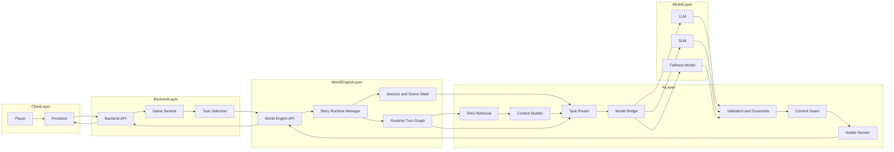

### Natural explanation

The player interacts with the frontend. The frontend sends the input to the backend. The backend may handle integration, auth, publishing, and proxy concerns. The actual story-runtime path continues into the World-Engine.

Inside the World-Engine, the runtime manager loads the session and scene state. The runtime turn graph then coordinates the task routes. Retrieval can add missing context. Classification determines what kind of input the player produced. Scene direction decides who or what should react. Conflict synthesis resolves dramatic tensions. Narrative formulation produces visible text. Validation and commit decide whether any proposed state change is allowed.

The routes are not separate mini-applications. They are cooperating stages in one governed turn pipeline.

---

## 4. Global Task Routing Logic

The global task router determines which specialized route should handle the turn, or which routes must be chained together.

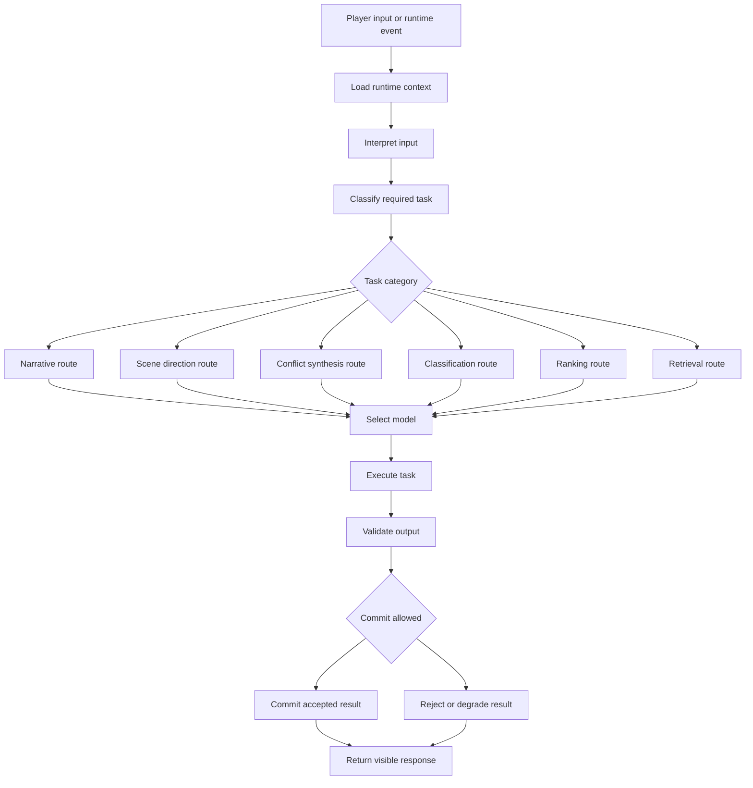

### What this route does

The global task route is the dispatcher. It reads the current turn context and determines which specialized task route is needed.

It answers questions like:

- Is this player input mainly a direct action?
- Is it a question about existing lore or memory?
- Does it target a specific NPC?
- Does it require scene progression?
- Does it require conflict resolution?
- Can this be handled with deterministic logic?
- Does it require a large model?

### Inputs

| Input | Purpose |
| --- | --- |
| Player input | The user-facing action or question |
| Session state | Determines where the player currently is |
| Scene state | Determines what is currently happening |
| Runtime config | Determines which tools, models, and fallbacks are available |
| Prior diagnostics | Helps detect repeated failures or degraded paths |

### Outputs

| Output | Meaning |
| --- | --- |
| Selected task route | The primary route for the turn |
| Secondary route list | Supporting routes needed before or after the primary route |
| Model selection hint | Suggests LLM, SLM, rule path, or fallback path |
| Diagnostics marker | Explains why a route was selected |

---

## 5. Classification Route

The classification route handles bounded recognition tasks. It should be fast, narrow, and controlled.

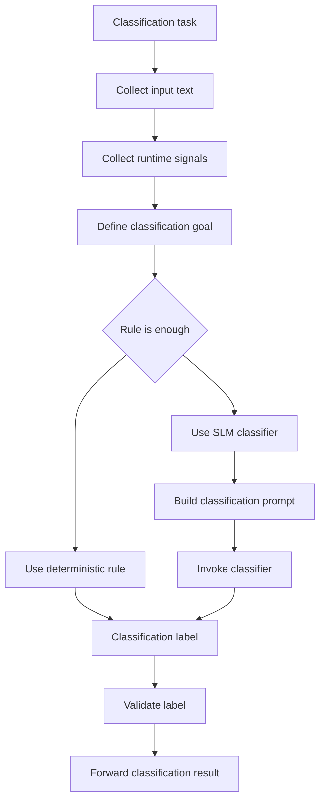

### Purpose

Classification is used when the runtime needs a small, structured decision before deeper processing.

Examples:

- player intent,
- semantic move,
- target actor hint,
- urgency level,
- whether the input is a question, command, accusation, request, investigation, social pressure, or scene-transition attempt.

### Why this route matters

Without classification, the system may send every input directly into a large narrative prompt. That makes the runtime more expensive, less predictable, and harder to diagnose.

Classification gives the rest of the runtime a compact interpretation of the input.

### Typical route behavior

| Step | Description |
| --- | --- |
| Collect input | Read player text and local runtime signals |
| Choose method | Use deterministic rules if possible, otherwise a compact classifier |
| Produce label | Output a bounded label, not open-ended prose |
| Validate label | Reject labels outside the allowed taxonomy |
| Forward result | Pass the classification into task routing and scene logic |

### Risk

| Risk | Effect | Mitigation |
| --- | --- | --- |
| Wrong classification | Wrong NPC or scene route may be selected | Use confidence, fallback, and validation |
| Overbroad labels | Later routes lose precision | Use bounded taxonomies |
| Model overthinking | Small input gets inflated into complex interpretation | Prefer rules and SLMs for narrow tasks |

---

## 6. Retrieval Route

The retrieval route adds missing context when the current turn needs knowledge beyond the immediate prompt.

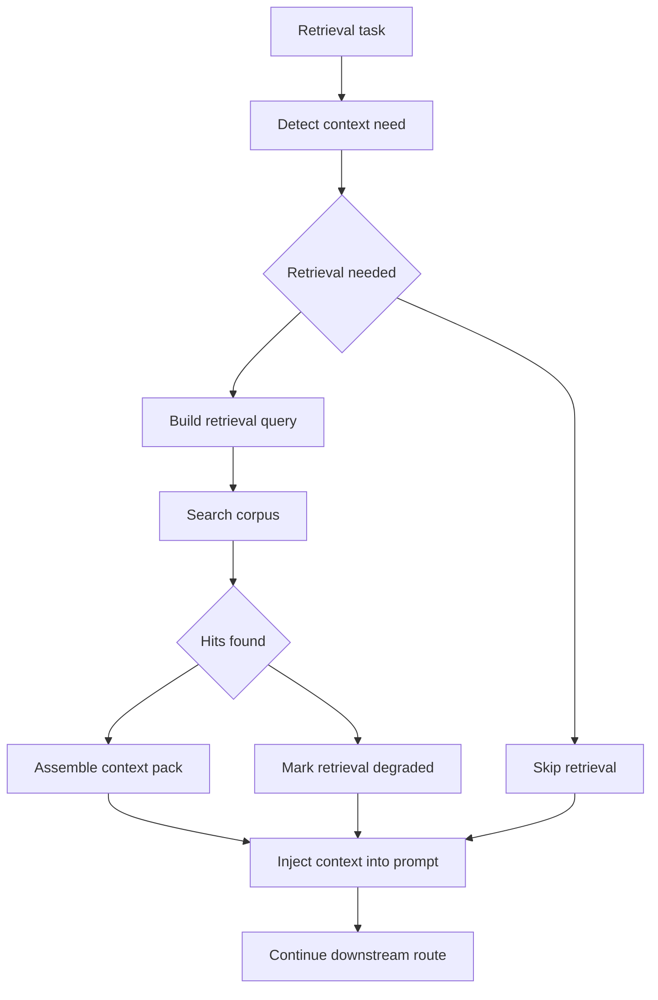

### Purpose

Retrieval supports the turn by finding relevant context from available knowledge sources.

Examples:

- module lore,
- canonical scene data,
- prior events,
- character context,
- relationship state,
- runtime memory,
- technical or rule references.

### Important distinction

Retrieval does not create truth. It provides context. The engine and validators still decide what may become committed runtime state.

### Inputs

| Input | Purpose |
| --- | --- |
| Player input | Creates the retrieval query |
| Module ID | Limits retrieval to relevant content |
| Scene ID | Prioritizes scene-specific material |
| Character hints | Helps retrieve NPC-related information |
| Runtime profile | Defines retrieval domain and policy |

### Outputs

| Output | Meaning |
| --- | --- |
| Retrieved context pack | Context that can be included in prompts |
| Retrieval hit metadata | Evidence for diagnostics |
| Empty or degraded context marker | Indicates missing context or retrieval failure |

### Risk

| Risk | Effect | Mitigation |
| --- | --- | --- |
| No hits | Model may lack required knowledge | Mark retrieval degraded and answer cautiously |
| Wrong hits | Model may use irrelevant lore | Validate retrieved context domain and relevance |
| Too much context | Prompt becomes noisy | Rank, trim, and summarize context |
| Retrieval treated as truth | Incorrect retrieved text may mutate state | Keep validation and commit authoritative |

---

## 7. Ranking and Preflight Route

The ranking and preflight route helps choose between candidates before the runtime performs an expensive or high-impact action.

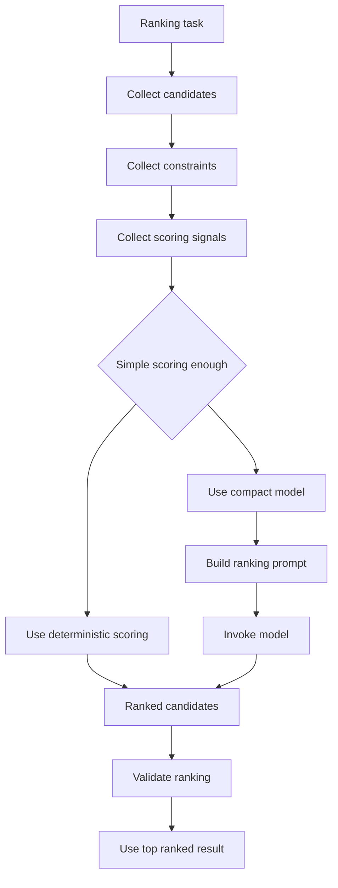

### Purpose

Ranking is used when the runtime has several plausible options and must choose the best one.

Examples:

- Which NPC should respond?
- Which scene function fits the current moment?
- Which retrieved context hit should be used first?
- Which fallback path is safest?
- Which model route is appropriate?
- Which tool or capability should be attempted?

### Why this route matters

Ranking prevents the runtime from making arbitrary choices. It allows the system to explain why one responder, route, model, or action was selected over another.

### Inputs

| Input | Purpose |
| --- | --- |
| Candidate list | The options being compared |
| Constraints | Hard rules that candidates must satisfy |
| Scoring signals | Relevance, urgency, target actor, scene pressure, cost, latency |
| Runtime policy | Determines whether deterministic scoring is enough |

### Outputs

| Output | Meaning |
| --- | --- |
| Ranked candidate list | Ordered options |
| Selected top candidate | Preferred choice |
| Rejection reasons | Why some candidates were discarded |
| Diagnostics evidence | Shows why a choice was made |

### Risk

| Risk | Effect | Mitigation |
| --- | --- | --- |
| Weak scoring | Wrong responder or route | Add stronger signals and tests |
| Unvalidated candidate | Illegal route may be selected | Validate constraints before use |
| Hidden ranking | Operators cannot explain behavior | Persist ranking diagnostics |

---

## 8. Scene Direction Route

The scene direction route determines how the current scene should move.

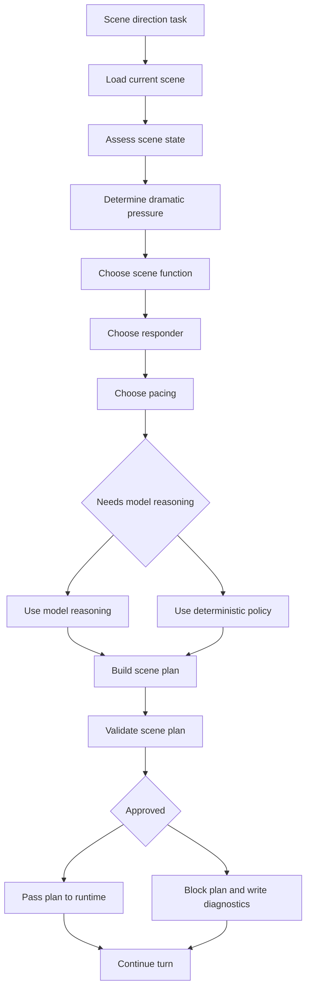

### Purpose

Scene direction decides what kind of scene beat should happen next.

It does not merely generate text. It evaluates the current scene and determines the intended dramatic function.

Examples:

- continue the scene,
- escalate pressure,
- reveal information,
- activate an NPC,
- block an invalid transition,
- stabilize the scene after confusion,
- prepare a transition candidate.

### Inputs

| Input | Purpose |
| --- | --- |
| Scene state | Determines the active scene and phase |
| Classification result | Indicates what the player is trying to do |
| Retrieved context | Adds relevant lore or continuity |
| Social state | Shows pressure between actors |
| Character mind records | Helps determine plausible responders |
| Runtime policies | Defines legal transitions and mutations |

### Outputs

| Output | Meaning |
| --- | --- |
| Scene plan | Advisory plan for what the scene should do |
| Responder set | Actors expected to react |
| Scene function | Dramatic purpose of the beat |
| Pacing decision | How intense, fast, or restrained the response should be |
| Transition candidate | Possible scene transition, not yet committed |

### Risk

| Risk | Effect | Mitigation |
| --- | --- | --- |
| Scene plan too passive | Runtime feels lifeless | Use pressure, responder, and pacing tests |
| Wrong responder | NPCs feel irrelevant or silent | Use classification and ranking |
| Illegal transition | Scene jumps or breaks continuity | Validate transition before commit |
| Scene route bypasses validation | AI output becomes unsafe | Always pass through validation and commit route |

---

## 9. Conflict Synthesis Route

The conflict synthesis route is used when multiple actors, interests, or tensions must be combined into one coherent dramatic result.

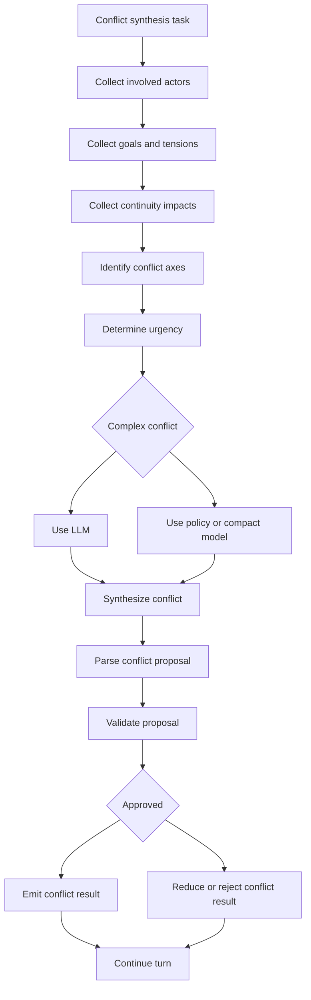

### Purpose

Conflict synthesis is responsible for combining tensions into a coherent narrative or behavioral proposal.

Examples:

- player accuses one NPC in front of another,
- two NPC goals conflict,
- a player action increases scene pressure,
- a prior continuity impact changes the current social situation,
- an NPC wants to reveal something but another NPC has reason to suppress it.

### Inputs

| Input | Purpose |
| --- | --- |
| Involved actors | Determines whose interests matter |
| Character goals or tactical posture | Helps interpret likely reactions |
| Social state | Captures conflict pressure |
| Continuity impacts | Carries forward prior consequences |
| Scene function | Keeps conflict tied to scene purpose |
| Player semantic move | Shows how the player is influencing the conflict |

### Outputs

| Output | Meaning |
| --- | --- |
| Conflict proposal | Suggested dramatic interpretation |
| Escalation level | Whether pressure should increase |
| Stabilization option | Whether the scene should calm or reframe |
| Responder priority | Which actor should speak or act |
| Validation target | What must be checked before use |

### Risk

| Risk | Effect | Mitigation |
| --- | --- | --- |
| Conflict over-escalates | Scene becomes melodramatic or incoherent | Validate pressure and pacing |
| Conflict under-escalates | Scene feels flat | Use dramatic pressure signals |
| Actor motivations blur | NPCs feel generic | Use CharacterMind and SocialState |
| Proposal mutates state directly | AI becomes authority | Route through validation and commit |

---

## 10. Narrative Formulation Route

The narrative formulation route creates the visible player-facing response.

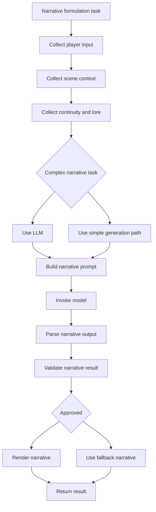

### Purpose

Narrative formulation transforms validated or validation-ready context into visible text.

It is the part of the system that feels most like classic LLM generation, but it still does not own truth. It phrases and proposes. The runtime validates and commits.

### Inputs

| Input | Purpose |
| --- | --- |
| Player input | Anchors response to what the player did |
| Scene plan | Provides scene function and pacing |
| Conflict proposal | Provides dramatic tension when needed |
| Retrieved context | Provides lore and continuity |
| Responder set | Indicates who may speak or act |
| Validation constraints | Prevents unsafe or illegal narrative content |

### Outputs

| Output | Meaning |
| --- | --- |
| Visible narrative proposal | Candidate text for the player |
| Structured narrative metadata | Optional tags, actors, effects, scene impact |
| Proposed state effects | Any suggested changes that must be validated |
| Fallback text | Safe output when generation fails |

### Risk

| Risk | Effect | Mitigation |
| --- | --- | --- |
| Beautiful but false text | Player sees lore-breaking output | Validate against scene and lore |
| Narrative commits hidden changes | State changes without approval | Treat state effects as proposals only |
| Passive output | Scene feels static | Feed stronger scene direction and conflict inputs |
| Generic fallback | Bad user experience | Use narrative-aware fallback templates |

---

## 11. Validation and Commit Route

The validation and commit route is the authority boundary.

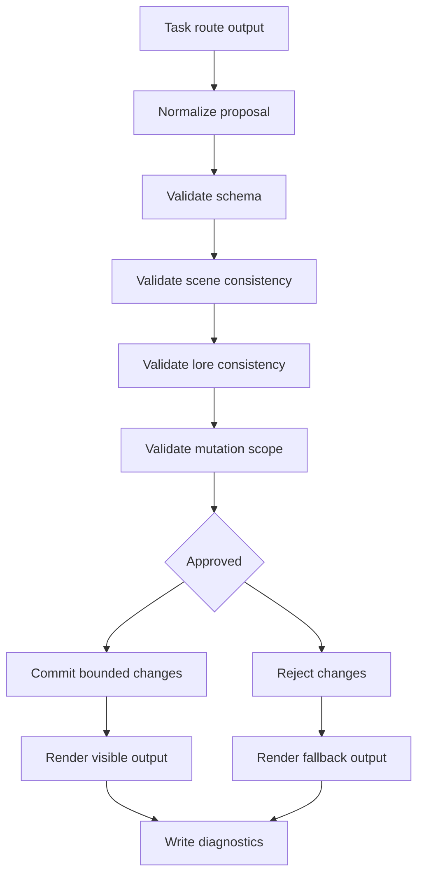

### Purpose

Validation and commit decide what is allowed to become runtime truth.

This route must remain stricter than generation. It checks structure, scene legality, lore consistency, mutation scope, and guardrail rules.

### Inputs

| Input | Purpose |
| --- | --- |
| Task route output | Proposal from narrative, scene, conflict, or ranking route |
| Current world and scene state | Authority reference |
| Allowed mutation policy | Defines what can change |
| Guardrail rules | Prevents unsafe or incoherent outcomes |
| Diagnostics context | Records why validation accepted or rejected |

### Outputs

| Output | Meaning |
| --- | --- |
| Accepted delta | Validated change that may be committed |
| Rejected delta | Blocked change |
| Visible response | Player-facing output |
| Diagnostics envelope | Evidence for operators and tests |

### Risk

| Risk | Effect | Mitigation |
| --- | --- | --- |
| Too permissive | AI hallucinations become truth | Strong schema, lore, and mutation checks |
| Too strict | Good turns get blocked too often | Better failure explanations and repair paths |
| Silent rejection | Player sees weak response with no evidence | Always write diagnostics |
| Commit before validation | Authority boundary breaks | Enforce proposal-before-commit pipeline |

---

## 12. How the Task Routes Work Together

The task routes are best understood as a cooperating pipeline, not as independent features.

A typical turn does not use every route equally. Some routes are always active, while others are conditional. Classification, context loading, validation, and diagnostics are common across almost every turn. Retrieval, conflict synthesis, ranking, and scene direction become important when the player input or scene state requires them.

### 12.1 Full Runtime Turn with Embedded Task Routes

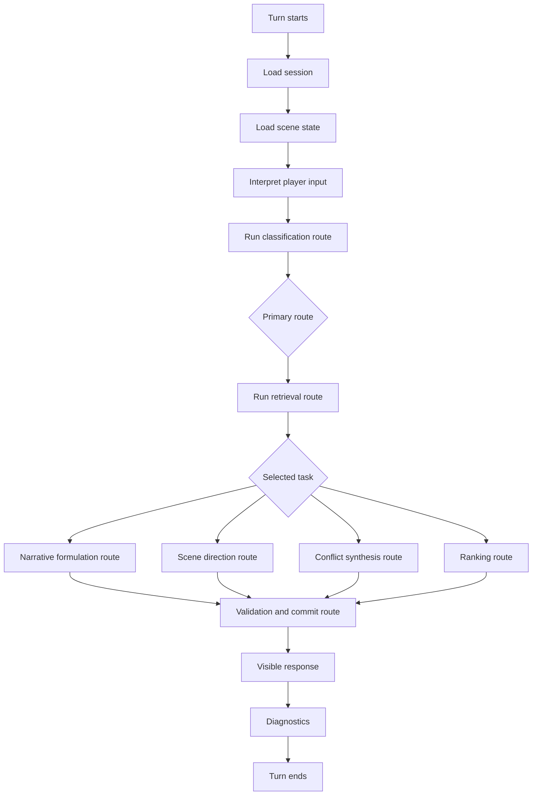

### 12.2 Cooperation Model

| Stage | Active Route | What It Contributes | What It Hands Off |
| --- | --- | --- | --- |
| 1 | Session and scene loading | Provides authoritative current state | Runtime context |
| 2 | Classification | Converts raw player input into structured intent | Intent label, semantic move, target hints |
| 3 | Retrieval | Adds missing lore, scene, or memory context | Retrieved context pack |
| 4 | Ranking / preflight | Chooses best candidates or route options | Selected responder, selected route, ranked alternatives |
| 5 | Scene direction | Determines scene function, pacing, responder set | Scene plan |
| 6 | Conflict synthesis | Resolves multi-actor tension and escalation | Conflict proposal |
| 7 | Narrative formulation | Creates visible player-facing text | Narrative proposal |
| 8 | Validation and commit | Decides what may become truth | Accepted or rejected delta |
| 9 | Render and diagnostics | Packages response and evidence | Player response and operator evidence |

### 12.3 Route Dependencies

| Route | Depends On | Enables |
| --- | --- | --- |
| Classification | Player input, scene context | Task routing, responder selection, retrieval decision |
| Retrieval | Classification, module, scene, query terms | Prompt assembly, lore-aware response |
| Ranking | Classification, candidates, constraints | Responder selection, route selection, model selection |
| Scene direction | Classification, retrieval, ranking, scene state | Narrative formulation, conflict handling |
| Conflict synthesis | Scene direction, actor state, social state | Narrative formulation, escalation logic |
| Narrative formulation | Scene plan, retrieved context, conflict proposal | Visible response proposal |
| Validation and commit | All proposal outputs and authoritative state | Accepted state update or rejection |
| Diagnostics | Every route | Auditability and debugging |

### 12.4 Route Chaining Patterns

Different player inputs produce different route chains.

#### Simple local action

A simple action may not need heavy retrieval or conflict synthesis.

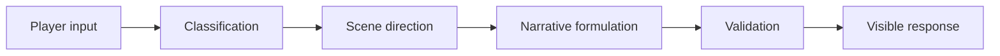

#### Lore-dependent question

A question about prior events or world knowledge benefits from retrieval before narrative formulation.

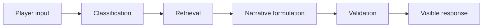

#### NPC-targeted action

An action aimed at a specific character benefits from classification, ranking, scene direction, and narrative formulation.

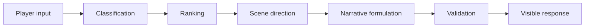

#### Multi-actor conflict

A tense situation involving several actors needs conflict synthesis before the visible narrative is finalized.

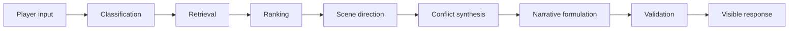

#### Provider or validation failure

Failure routes must still produce controlled output and diagnostics.

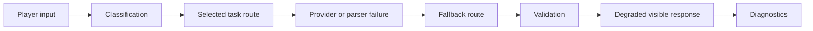

### 12.5 Why the Routes Must Work Together

No single route can produce a safe, high-quality story turn alone.

| Without This Route | What Breaks |
| --- | --- |
| Without classification | The system cannot reliably identify player intent or target actor |
| Without retrieval | The model may lack relevant lore or continuity |
| Without ranking | Responder and route selection may feel arbitrary |
| Without scene direction | Output may be textually good but dramatically passive |
| Without conflict synthesis | Multi-actor situations become flat or inconsistent |
| Without narrative formulation | The response may be technically valid but not engaging |
| Without validation | AI output can become uncontrolled runtime truth |
| Without diagnostics | Failures become invisible and hard to fix |

### 12.6 Central Cooperation Rule

The routes should cooperate in this order of authority:

1. Runtime state defines what is currently true.
2. Classification and retrieval interpret what the turn needs.
3. Ranking and scene direction determine what should be attempted.
4. Conflict synthesis and narrative formulation create proposals.
5. Validation decides what is allowed.
6. Commit makes only accepted changes true.
7. Diagnostics explain the path taken.

This keeps the architecture stable because creative generation happens before the authority boundary, never after it.

---

## 13. Task Route Data Flow

The task routes exchange structured data. They should not rely only on unstructured prose.

```mermaid
flowchart LR
    playerInput["Player Input"] --> classificationData["Classification Result"]
    classificationData --> retrievalQuery["Retrieval Query"]
    retrievalQuery --> retrievedContext["Retrieved Context"]
    classificationData --> rankingData["Ranking Inputs"]
    retrievedContext --> scenePlan["Scene Plan"]
    rankingData --> scenePlan
    scenePlan --> conflictProposal["Conflict Proposal"]
    conflictProposal --> narrativeProposal["Narrative Proposal"]
    retrievedContext --> narrativeProposal
    narrativeProposal --> validationResult["Validation Result"]
    validationResult --> commitRecord["Commit Record"]
    validationResult --> visibleResponse["Visible Response"]
    commitRecord --> updatedState["Updated Runtime State"]
    visibleResponse --> diagnostics["Diagnostics"]
    updatedState --> diagnostics
```

### Key data objects

| Data Object | Role |
| --- | --- |
| Runtime context | Bundles session, scene, turn, and config information |
| Classification result | Converts input into controlled labels |
| Retrieval query | Defines what knowledge should be searched |
| Retrieved context pack | Carries relevant knowledge into prompts |
| Ranking result | Explains candidate selection |
| Scene plan | Describes intended scene function and responder behavior |
| Conflict proposal | Describes multi-actor tension and possible escalation |
| Narrative proposal | Provides visible text and optional state-effect proposals |
| Validation result | Accepts or rejects proposed outputs |
| Commit record | Records what actually became runtime truth |
| Diagnostics envelope | Explains the route path and outcome |

---

## 14. Design Requirements

### 14.1 Route separation

Each route should have a defined job. A narrative route should not secretly commit world state. A retrieval route should not decide truth. A classifier should not invent narrative consequences.

### 14.2 Explicit handoffs

The output of each route should become a structured input for the next route. This allows testing, replay, and diagnostics.

### 14.3 Authority boundary

The validation and commit route is the authority boundary. Task route output is advisory until approved.

### 14.4 Degraded-safe operation

If any route fails, the runtime should produce a controlled degraded response and write diagnostics. A failed retrieval route should not silently become hallucinated lore. A failed model route should not silently pretend it succeeded.

### 14.5 Diagnosability

Operators should be able to answer:

- Which task route was selected?
- Why was it selected?
- Which model or fallback was used?
- Which retrieved context was injected?
- Which responder was selected?
- Which proposal was accepted or rejected?
- What was committed?
- Why was the turn degraded?

---

## 15. Risk Matrix

| Risk | Affected Routes | Symptom | Needed Safeguard |
| --- | --- | --- | --- |
| Wrong task selected | Classification, routing | Response ignores player intent | Classification tests and route diagnostics |
| RAG missing or irrelevant | Retrieval, narrative | Thin or hallucinated answer | Retrieval hit evidence and cautious fallback |
| NPC remains passive | Ranking, scene direction, narrative | No meaningful character reaction | Responder scoring and scene pressure rules |
| Scene jumps too quickly | Scene direction, validation | Continuity break | Transition validation |
| Conflict becomes incoherent | Conflict synthesis, narrative | Characters act without motive | CharacterMind, SocialState, validation |
| AI proposes illegal state change | Narrative, conflict, validation | Unauthorized mutation | Mutation policy and commit checks |
| Fallback hides real failure | Model route, diagnostics | Output says ok but quality is degraded | Explicit degradation signals |
| Diagnostics are incomplete | All routes | Hard to debug failures | Route-level diagnostics envelope |

---

## 16. Presentation Structure

| Slide | Title | Main Message | Suggested Visual |
| --- | --- | --- | --- |
| 1 | Why Task Routes Exist | A story turn is not one prompt | Task route overview table |
| 2 | System Embedding | Routes sit inside World-Engine runtime | System embedding diagram |
| 3 | Global Routing | The runtime selects the needed route chain | Global task routing diagram |
| 4 | Classification and Retrieval | First understand the input and gather context | Classification and retrieval diagrams |
| 5 | Ranking and Scene Direction | Select responders and scene function | Ranking and scene direction diagrams |
| 6 | Conflict Synthesis | Multi-actor tension needs its own route | Conflict synthesis diagram |
| 7 | Narrative Formulation | Visible text is generated from structured context | Narrative formulation diagram |
| 8 | Validation and Commit | Proposal is not truth until accepted | Validation and commit diagram |
| 9 | How Routes Work Together | Routes form chains depending on turn type | Full runtime turn diagram |
| 10 | Risks and Diagnostics | Failures must be visible and degraded-safe | Risk matrix |

---

## 17. Speaker Notes

| Slide | Notes |
| --- | --- |
| 1 | "The Play-Service does not send every player input directly to a model. It decomposes the turn into task routes." |
| 2 | "The backend can forward or integrate, but the runtime decision path belongs to the World-Engine." |
| 3 | "Task routing decides whether we need classification, retrieval, scene direction, conflict synthesis, narrative generation, or a fallback path." |
| 4 | "Classification gives the system a compact interpretation. Retrieval adds missing context, but retrieval itself is not truth." |
| 5 | "Ranking avoids arbitrary actor selection. Scene direction turns state and pressure into a scene function." |
| 6 | "Conflict synthesis is important when several characters or pressures collide." |
| 7 | "Narrative formulation creates the visible answer, but it still only proposes." |
| 8 | "Validation and commit are the authority boundary. This is where proposal becomes truth, or gets rejected." |
| 9 | "The routes are not isolated. They cooperate in chains depending on the type of turn." |
| 10 | "If a route fails, the system should degrade explicitly and record evidence." |

---

## 18. Summary for Presenters

### Five key statements

1. Task routes make the Play-Service more than a generic chatbot.
2. Classification, retrieval, ranking, scene direction, conflict synthesis, narrative generation, validation, and diagnostics each have a distinct role.
3. The routes cooperate as a governed pipeline.
4. Creative AI output remains a proposal until validation and commit approve it.
5. Diagnostics must show which route chain was used and why.

### Short answer to: Why do task routes matter?

Task routes keep the runtime controllable. They prevent every player input from becoming a single opaque model call. Instead, the system understands the input, gathers context, selects responders, plans the scene, generates a proposal, validates it, commits only allowed changes, and records evidence.

### Short answer to: How do the routes work together?

They form a chain. Classification identifies what the turn needs. Retrieval adds missing knowledge. Ranking selects candidates. Scene direction decides the dramatic function. Conflict synthesis handles multi-actor tension. Narrative formulation writes the visible response. Validation and commit decide what becomes truth. Diagnostics explain the whole path.
