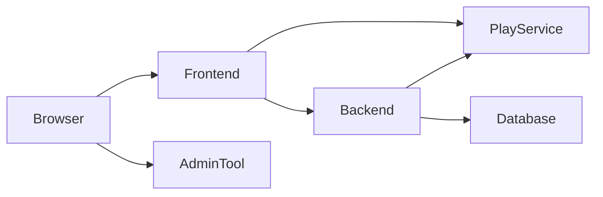

# Better Tomorrow (World of Shadows)

World of Shadows is a multi-service narrative game platform: player-facing web apps, an API layer, an authoritative play runtime, and a shared **AI stack** (RAG, LangGraph turn orchestration, guarded capabilities, MCP-oriented tooling) used by the world-engine and related workflows.

The product direction for the **MVP vertical slice** is a **guided interactive drama runtime** (scene-led, truth-aligned turns)—not a generic chatbot or prose toy. See **[docs/ROADMAP_MVP_VSL.md](docs/ROADMAP_MVP_VSL.md)** for the target state and **[docs/FREEZE_OPERATIONALIZATION_MVP_VSL.md](docs/FREEZE_OPERATIONALIZATION_MVP_VSL.md)** for how Phase 0 freeze rules attach to that slice.

## Table of contents

- [Services and packages](#services-and-packages)
- [Repository structure](#repository-structure)
- [Architecture and request flow](#architecture-and-request-flow)
- [Prerequisites](#prerequisites)
- [MVP vertical slice: God of Carnage (GoC)](#mvp-vertical-slice-god-of-carnage-goc)
- [Content authoring and canonical modules](#content-authoring-and-canonical-modules)
- [AI stack (high level)](#ai-stack-high-level)
- [MCP and auxiliary tooling](#mcp-and-auxiliary-tooling)
- [Writers Room](#writers-room)
- [Service responsibilities](#service-responsibilities)
- [Local development quick start](#local-development-quick-start)
- [Cross-service configuration (example)](#cross-service-configuration-example)
- [Required environment variables (high-level)](#required-environment-variables-high-level)
- [Docker Compose](#docker-compose)
- [Helper scripts](#helper-scripts)
- [Testing](#testing)
- [Continuous integration](#continuous-integration)
- [Changelog and releases](#changelog-and-releases)
- [Documentation index](#documentation-index)
- [Troubleshooting](#troubleshooting)

## Services and packages

| Area | Role |
| --- | --- |
| `frontend/` | Canonical player/public web frontend (Flask) |
| `administration-tool/` | Admin/management frontend (separate by design) |
| `backend/` | API, auth, policy, persistence, content/compiler integration |
| `world-engine/` | Authoritative play runtime (FastAPI), sessions, WebSocket |
| `ai_stack/` | RAG, LangGraph runtime, GoC director/seams, tests |
| `story_runtime_core/` | Shared interpretation, model registry/adapters, structured payloads |
| `content/modules/` | YAML-first canonical modules (e.g. **God of Carnage**) |
| `writers-room/` | Optional small Flask UI that calls the backend Writers-Room API (JWT) |

## Repository structure

```text
backend/               # Flask API, migrations, content compiler, tests
frontend/              # Player/public Flask frontend
administration-tool/   # Admin/management frontend
writers-room/          # Standalone Writers-Room demo UI → backend /api/v1/writers-room/*
world-engine/          # FastAPI play service, story runtime manager, tests
ai_stack/              # RAG, LangGraph, GoC slice, LangChain bridges, capabilities
story_runtime_core/    # Editable package: interpreter, adapters, registry
content/modules/       # Authoritative module trees (god_of_carnage/, …)
docs/                  # Architecture, freeze, roadmap, operations, testing
tests/                 # Smoke suite, multi-suite runner (run_tests.py)
tools/                 # MCP server and related tooling
.github/workflows/     # CI: backend, admin, engine, ai-stack, quality, pre-deploy
.devcontainer/         # Dev Containers / Codespaces bootstrap
```

## Architecture and request flow

High-level interaction (browser → services → persistence):



- **Runtime authority** for live play lives in **`world-engine`** (not the backend’s legacy web layer).
- **Backend** owns persistence, auth, and orchestration; it proxies or calls the play service where configured.
- **Canonical player HTML** lives under **`frontend/`**; backend **`/`** redirects to **`/backend`** (operator/developer surface).

Further reading: [docs/architecture/README.md](docs/architecture/README.md) (redirect), [docs/technical/architecture/service-boundaries.md](docs/technical/architecture/service-boundaries.md), [docs/technical/runtime/runtime-authority-and-state-flow.md](docs/technical/runtime/runtime-authority-and-state-flow.md).

## Prerequisites

- **Python**: **3.10+** per `requires-python` in packages; **CI and the Dev Container pin 3.10** for reproducible test results. Newer interpreters often work but are not the merge bar.
- **Git** and a virtual environment per service (recommended).
- **Docker Desktop** (or compatible engine) if you use Compose at the repo root.
- For **AI stack / LangGraph tests**: editable installs of `story_runtime_core` and `ai_stack[test]` plus repo root on `PYTHONPATH` (see [Testing](#testing)).

## MVP vertical slice: God of Carnage (GoC)

The **God of Carnage** module under `content/modules/god_of_carnage/` is the binding **canonical content authority** for the first dramatic vertical slice. Runtime behavior for that slice is contract-driven:

| Topic | Document |
| --- | --- |
| Slice boundaries, YAML authority, vocabulary | [docs/VERTICAL_SLICE_CONTRACT_GOC.md](docs/VERTICAL_SLICE_CONTRACT_GOC.md) |
| Turn schema, director nodes, proposal/validation/commit seams | [docs/CANONICAL_TURN_CONTRACT_GOC.md](docs/CANONICAL_TURN_CONTRACT_GOC.md) |
| Gate families, preview discipline, operator questions | [docs/GATE_SCORING_POLICY_GOC.md](docs/GATE_SCORING_POLICY_GOC.md) |
| Phase 0 freeze closure | [docs/PHASE0_FREEZE_CLOSURE_NOTE_GOC.md](docs/PHASE0_FREEZE_CLOSURE_NOTE_GOC.md) |

Phase reports (Phase 2–4 breadth, experience, reliability) are produced under `tests/reports/` during local runs; that directory may be gitignored—generate reports after running the suites described in [Testing](#testing).

**Implementation entry points**

- `ai_stack/langgraph_runtime.py` — `RuntimeTurnGraphExecutor`, nodes through `package_output`
- `ai_stack/scene_director_goc.py` — deterministic GoC scene director
- `ai_stack/goc_turn_seams.py` — validation, commit, visible render, `diagnostics_refs`
- `ai_stack/goc_yaml_authority.py` — canonical YAML load for GoC slice surfaces

**Representative tests**

- `ai_stack/tests/test_goc_phase1_runtime_gate.py` — seams, non-preview path, repro metadata
- `ai_stack/tests/test_goc_phase2_scenarios.py` — breadth, continuity, anti-seductive validation
- `ai_stack/tests/test_goc_phase3_experience_richness.py` — multi-turn richness
- `ai_stack/tests/test_goc_phase4_reliability_breadth_operator.py` — reliability, long runs, operator diagnostics

## Content authoring and canonical modules

- Authoritative authored content lives under **`content/modules/<module_id>/`** (YAML and referenced assets).
- The backend **content compiler** projects modules for runtime and retrieval; see [docs/technical/content/canonical_authored_content_model.md](docs/technical/content/canonical_authored_content_model.md) and `backend/app/content/compiler/`.
- **Builtins** templates (e.g. experience seeds) are **secondary** to YAML for GoC; they must not silently override canonical module truth (see vertical slice contract §6.1).

## AI stack (high level)

- **RAG**: corpus ingestion and context packs (`ai_stack/rag.py`); used on the runtime turn path for grounded prompts.
- **LangGraph**: `RuntimeTurnGraphExecutor` orchestrates interpret → retrieve → GoC resolve → director → model → normalize → validate → commit → render → package.
- **LangChain**: adapter invocation bridge for structured runtime output (`ai_stack/langchain_integration/`).
- **Capabilities / MCP**: guarded capability registry and MCP server live alongside the stack; see [docs/technical/ai/ai-stack-overview.md](docs/technical/ai/ai-stack-overview.md) and `ai_stack/capabilities.py`.
- **Player input**: structured interpretation contract in `story_runtime_core` — [docs/technical/runtime/player_input_interpretation_contract.md](docs/technical/runtime/player_input_interpretation_contract.md).

Model routing (registry, adapters, timeouts) is configured in the world-engine startup path; local runs typically use **mock** or configured providers per `story_runtime_core` registry.

## MCP and auxiliary tooling

- **`tools/mcp_server/`** — MCP server implementation (operator/session tooling as implemented in-repo).
- **`.mcp.json`** (repo root) — Cursor/MCP client configuration where used.
- **Improvement loop** HTTP APIs are part of the backend (`/api/v1/improvement/...`); see [docs/technical/ai/improvement_loop_in_world_of_shadows.md](docs/technical/ai/improvement_loop_in_world_of_shadows.md).

## Writers Room

The **canonical** Writers-Room workflow is implemented on the **backend** (JWT, RAG, capabilities, model routing). A separate **`writers-room/`** tree is a small Flask app that **calls that API** for local demos.

| What | Where |
| --- | --- |
| HTTP API (create review, get review, decision, revision) | `backend/app/api/v1/writers_room_routes.py` — under `/api/v1/writers-room/...` |
| Workflow orchestration (retrieval, LangGraph seed, proposals, review bundle) | `backend/app/services/writers_room_service.py` |
| LangGraph seed + LangChain Writers-Room invocation | `ai_stack/langgraph_runtime.py` (`build_seed_writers_room_graph`), `ai_stack/langchain_integration/` (`invoke_writers_room_adapter_with_langchain`, …) |
| Standalone browser UI (uses `BACKEND_API_URL` / `BACKEND_BASE_URL` + JWT) | `writers-room/app.py` and `writers-room/app/` |
| Architecture (stages, HITL, shared stack) | [docs/technical/content/writers-room-and-publishing-flow.md](docs/technical/content/writers-room-and-publishing-flow.md) |
| Governance / operator surfaces | `administration-tool` canonical Inspector Suite workbench: `/manage/inspector-workbench` (`templates/manage/inspector_workbench.html`, `static/manage_inspector_workbench.js`); read-only admin APIs under `/api/v1/admin/ai-stack/...` (see `backend/app/api/v1/ai_stack_governance_routes.py`) |

**Quick check:** OpenAPI or route list is not duplicated here; search the backend for `writers-room` or read `writers_room_routes.py` for exact methods and paths.

**Optional local UI:** from repo root, with backend already running and a valid JWT:

```bash
cd writers-room
pip install -r requirements.txt
python app.py
```

Configure `BACKEND_API_URL` or `BACKEND_BASE_URL` if the backend is not on `http://127.0.0.1:5000`.

## Service responsibilities

### `frontend/`

- Owns player/public pages: login, register, dashboard, news, wiki, community, game menu, play shell
- Integrates with backend API and play-service endpoints
- Does not own admin/management pages

### `administration-tool/`

- Owns management/editorial workflows (`/manage/*`)
- Uses backend API for auth and data operations
- Remains a standalone service by design

### `backend/`

- Owns API endpoints, authN/authZ, policy enforcement, persistence, and service integration
- Exposes game/bootstrap/ticket APIs for frontend and play-service orchestration
- Serves a small **technical HTML area** at `/backend/*` (architecture, API, ops — not player/admin UI); **`/` redirects to `/backend`**
- Legacy `backend/app/web/*` paths (except `/` and `/health`) remain compatibility redirects to `FRONTEND_URL`, not canonical player UI hosting

### `world-engine/`

- Owns authoritative game runtime state, session execution, and WebSocket live behavior
- Integrates `ai_stack` for turn execution where configured (`StoryRuntimeManager`, see `world-engine/requirements-dev.txt` for full test deps)

## Local development quick start

Default **bare-metal** URLs (from [docs/development/LocalDevelopment.md](docs/development/LocalDevelopment.md)):

| Service | URL |
| --- | --- |
| Backend | `http://127.0.0.1:5000` |
| Frontend | `http://127.0.0.1:5002` |
| Administration tool | `http://127.0.0.1:5001` |
| Play service | `http://127.0.0.1:8001` |

### 1) Backend

```bash
cd backend
pip install -r requirements.txt
flask init-db
flask db upgrade
python run.py
```

### 2) Player/Public frontend

```bash
cd frontend
pip install -r requirements.txt
python run.py
```

### 3) Administration tool (separate)

```bash
cd administration-tool
pip install -r requirements.txt
python app.py
```

### 4) Play service

```bash
cd world-engine
pip install -r requirements.txt
python -m uvicorn app.main:app --reload --port 8001
```

**Suggested order for a full local loop:** backend (DB migrated) → world-engine → frontend (and administration-tool if you need `/manage/*`).

## Cross-service configuration (example)

Minimal **local** alignment (copy/adapt into each app’s environment):

**Backend**

- `CORS_ORIGINS=http://127.0.0.1:5002,http://127.0.0.1:5001`
- `FRONTEND_URL=http://127.0.0.1:5002`
- Optional: `ADMINISTRATION_TOOL_URL=http://127.0.0.1:5001`
- `PLAY_SERVICE_PUBLIC_URL=http://127.0.0.1:8001`
- `PLAY_SERVICE_INTERNAL_URL=http://127.0.0.1:8001`
- `PLAY_SERVICE_SHARED_SECRET=<shared secret>`

**Frontend**

- `BACKEND_API_URL=http://127.0.0.1:5000`
- `PLAY_SERVICE_PUBLIC_URL=http://127.0.0.1:8001`

**Administration tool**

- `BACKEND_API_URL=http://127.0.0.1:5000`

See [docs/development/LocalDevelopment.md](docs/development/LocalDevelopment.md) for notes on Linux/CI path and world-engine tests.

## Required environment variables (high-level)

- `SECRET_KEY`, `JWT_SECRET_KEY` — backend
- `FRONTEND_SECRET_KEY` — `frontend/`
- `BACKEND_API_URL` — `frontend/`, `administration-tool/`
- `CORS_ORIGINS` — backend (include frontend and admin origins)
- `FRONTEND_URL` — backend legacy redirects; optional `ADMINISTRATION_TOOL_URL` for `/backend` links
- `PLAY_SERVICE_PUBLIC_URL`, `PLAY_SERVICE_INTERNAL_URL`, `PLAY_SERVICE_SHARED_SECRET` — backend ↔ play integration

Individual services may define additional variables; check each app’s README or config modules if present.

## Docker Compose

Use the root compose file:

```bash
docker compose up --build
```

Compose exposes:

- backend on **`:8000`** (not 5000)
- frontend **`:5002`**
- administration-tool **`:5001`**
- play-service **`:8001`**

Inside containers, `frontend` and `administration-tool` use `BACKEND_API_URL=http://backend:8000`. On bare metal, backend is **5000** and `BACKEND_API_URL=http://127.0.0.1:5000`.

## Helper scripts

| Script | Purpose |
| --- | --- |
| `setup-test-environment.sh` / `setup-test-environment.bat` | Installs backend test deps and editable `story_runtime_core` + `ai_stack[test]` |
| `run-smoke-tests.sh` / `run-smoke-tests.bat` | Canonical smoke pytest entry |
| `docker-up.py` (repo root) | Docker Compose helper (rebuild-oriented local stacks) |
| `tests/run_tests.py` | Legacy multi-suite runner (`backend`, `administration`, `engine`, …) |

## Testing

### CRITICAL: Install dependencies first

```bash
./setup-test-environment.sh       # macOS/Linux
setup-test-environment.bat        # Windows
# or:
python -m pip install -r backend/requirements-test.txt
```

### Matching CI, Dev Container, and your laptop

GitHub Actions uses **Python 3.10** for backend and `ai_stack` jobs. The **Dev Container** (`.devcontainer/devcontainer.json`) uses the same **3.10** image and runs the **same** install sequence as the setup scripts, then adds `world-engine/requirements-dev.txt`. If you use **Python 3.11+** on the host, behavior can still differ (pip/setuptools); for the closest guarantee to CI green, use **3.10** or open the repo in the Dev Container.

Full write-up: [docs/testing-setup.md](docs/testing-setup.md) — **Environment parity (CI, Dev Container, local)**.

### Merge bar for `ai_stack` / GoC LangGraph tests

Claims that the full **`ai_stack/tests`** suite (including GoC regression) is green **must** match the install sequence in [`.github/workflows/ai-stack-tests.yml`](.github/workflows/ai-stack-tests.yml): editable `story_runtime_core`, editable `ai_stack[test]`, `PYTHONPATH` = repository root. **Repo checkout + `PYTHONPATH` alone is not sufficient** (PyPI deps such as `langchain-core` / `langgraph` are required). Parity shortcuts: [scripts/install-ai-stack-test-env.sh](scripts/install-ai-stack-test-env.sh) (POSIX), [scripts/install-ai-stack-test-env.ps1](scripts/install-ai-stack-test-env.ps1) / [scripts/install-ai-stack-test-env.bat](scripts/install-ai-stack-test-env.bat) (Windows), or [docker/Dockerfile.ai-stack-test](docker/Dockerfile.ai-stack-test).

### Quick start: canonical smoke suite

```bash
./run-smoke-tests.sh              # macOS/Linux
run-smoke-tests.bat               # Windows
python -m pytest tests/smoke/ -v --tb=short
```

Expected: ~140 tests in under 15 seconds.

### AI stack / LangGraph (`ai_stack/tests`)

```bash
python -m pip install -e "./story_runtime_core"
python -m pip install -e "./ai_stack[test]"
export PYTHONPATH="$(pwd)"        # Linux/macOS
# Windows PowerShell: $env:PYTHONPATH = (Get-Location).Path

python -m pytest ai_stack/tests -q --tb=short
```

Focused GoC regression example (add [test] install as above):

```bash
python -m pytest \
  ai_stack/tests/test_goc_phase1_runtime_gate.py \
  ai_stack/tests/test_goc_phase2_scenarios.py \
  ai_stack/tests/test_goc_phase3_experience_richness.py \
  ai_stack/tests/test_goc_phase4_reliability_breadth_operator.py \
  ai_stack/tests/test_goc_phase5_final_mvp_closure.py \
  ai_stack/tests/test_goc_frozen_vocab.py \
  ai_stack/tests/test_goc_closure_residuals.py \
  ai_stack/tests/test_langgraph_runtime.py \
  -q --tb=short
```

If `from ai_stack import RuntimeTurnGraphExecutor` fails, install `[test]` extras and set `PYTHONPATH`; see [docs/testing-setup.md](docs/testing-setup.md) § AI stack / LangGraph.

### Backend, admin, engine

```bash
cd backend && pip install -r requirements-test.txt && pytest tests/ -v
```

```bash
pip install -r world-engine/requirements-dev.txt
cd world-engine && python -m pytest tests/ -q --tb=short
```

```bash
cd tests && python run_tests.py --suite backend
cd tests && python run_tests.py --suite administration
cd tests && python run_tests.py --suite engine
```

### Test documentation and profiles

- [docs/testing-setup.md](docs/testing-setup.md) — profiles (`testing_isolated`, `testing_bootstrap_on`, `testing_isolated_production_like`), fixtures, troubleshooting
- [docs/test-environment-hygiene.md](docs/test-environment-hygiene.md) — reproducible environments

## Continuous integration

Workflows under `.github/workflows/`:

| Workflow | Scope |
| --- | --- |
| `backend-tests.yml` | Backend pytest |
| `admin-tests.yml` | Administration tool |
| `engine-tests.yml` | World-engine (includes dev deps for `ai_stack`) |
| `ai-stack-tests.yml` | `ai_stack/tests` |
| `quality-gate.yml` | Cross-cutting quality checks |
| `pre-deployment.yml` | Pre-deploy validation |

## Changelog and releases

[CHANGELOG.md](CHANGELOG.md) follows [Keep a Changelog](https://keepachangelog.com/en/1.1.0/).

## Documentation index

**Audience-first docs (start here)**

- [docs/INDEX.md](docs/INDEX.md) — master map (users, admins, developers, presentations)
- [docs/start-here/README.md](docs/start-here/README.md) — plain-language system introduction
- [docs/reference/glossary.md](docs/reference/glossary.md) — terminology

**Architecture and runtime**

- [docs/technical/README.md](docs/technical/README.md) — technical documentation root
- [docs/architecture/README.md](docs/architecture/README.md) — redirect to `docs/technical/`
- [docs/technical/content/writers-room-and-publishing-flow.md](docs/technical/content/writers-room-and-publishing-flow.md)
- [docs/technical/architecture/service-boundaries.md](docs/technical/architecture/service-boundaries.md)
- [docs/technical/ai/ai-stack-overview.md](docs/technical/ai/ai-stack-overview.md)
- [docs/technical/runtime/runtime-authority-and-state-flow.md](docs/technical/runtime/runtime-authority-and-state-flow.md)
- [docs/technical/content/canonical_authored_content_model.md](docs/technical/content/canonical_authored_content_model.md)
- [docs/technical/runtime/player_input_interpretation_contract.md](docs/technical/runtime/player_input_interpretation_contract.md)

**Product / slice / freeze**

- [docs/ROADMAP_MVP_VSL.md](docs/ROADMAP_MVP_VSL.md)
- [docs/FREEZE_OPERATIONALIZATION_MVP_VSL.md](docs/FREEZE_OPERATIONALIZATION_MVP_VSL.md)
- [docs/VERTICAL_SLICE_CONTRACT_GOC.md](docs/VERTICAL_SLICE_CONTRACT_GOC.md)
- [docs/CANONICAL_TURN_CONTRACT_GOC.md](docs/CANONICAL_TURN_CONTRACT_GOC.md)
- [docs/GATE_SCORING_POLICY_GOC.md](docs/GATE_SCORING_POLICY_GOC.md)

**Repository cleanup baseline (classification gate)**

- [docs/audit/TASK_1A_REPOSITORY_BASELINE.md](docs/audit/TASK_1A_REPOSITORY_BASELINE.md) — Task 1A inventory, `D*`/`R*`/`X*` tags, evidence-path and mirror policy appendices

**Operations and local dev**

- [docs/development/LocalDevelopment.md](docs/development/LocalDevelopment.md)
- [docs/operations/RUNBOOK.md](docs/operations/RUNBOOK.md)
- [docs/testing-setup.md](docs/testing-setup.md)

**Tooling**

- [.devcontainer/devcontainer.json](.devcontainer/devcontainer.json) — Codespaces / Dev Containers (`world-engine/requirements-dev.txt`, `PYTHONPATH` for `ai_stack`)

## Troubleshooting

| Symptom | What to check |
| --- | --- |
| `ModuleNotFoundError: flask` (or similar) | Run `setup-test-environment` or install `backend/requirements-test.txt` |
| `RuntimeTurnGraphExecutor` missing from `ai_stack` | `pip install -e "./ai_stack[test]"` and `pip install -e "./story_runtime_core"` |
| Engine tests fail on Linux/CI but work on Windows | Use `world-engine/requirements-dev.txt`; see [LocalDevelopment.md](docs/development/LocalDevelopment.md) |
| CORS errors in browser | `CORS_ORIGINS` must list exact frontend/admin origins |
| Play features time out or 401 | `PLAY_SERVICE_*` URLs and `PLAY_SERVICE_SHARED_SECRET` must match backend and engine config |
| Docker UI cannot reach backend | Use service names and port **8000** for backend inside Compose, not `127.0.0.1:5000` from another container |

For deeper operational playbooks, use [docs/operations/RUNBOOK.md](docs/operations/RUNBOOK.md).
