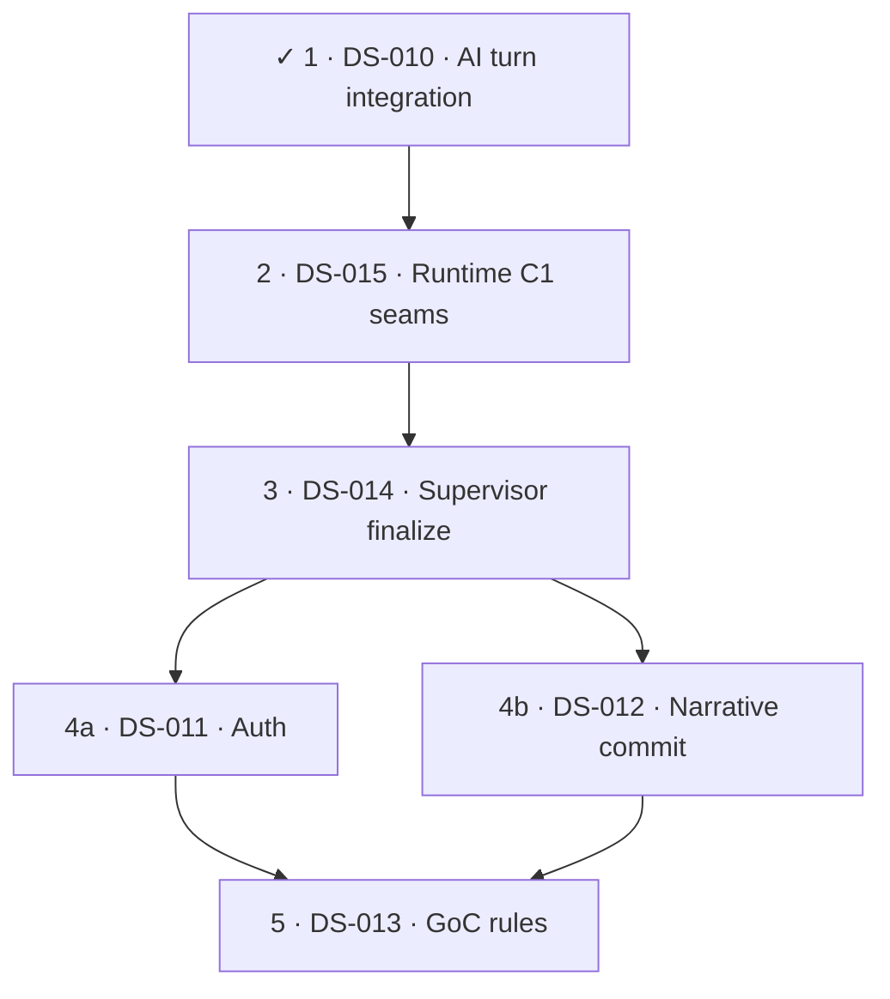

# Despaghettification — information input list for implementers

*Path:* `despaghettify/despaghettification_implementation_input.md` — Overview: [README.md](../README.md).

This document is **not** part of the frozen consolidation archive under [`docs/archive/documentation-consolidation-2026/`](../../docs/archive/documentation-consolidation-2026/). That archive holds **completed** findings and migration evidence (ledgers, topic map, validation reports) — **do not overwrite or “continue writing” those files**.

Here you find the **living working basis**: structural and spaghetti topics in **code**, prioritised input rows for task implementers, coordination rules, and an **optional** progress note. Like documentation consolidation 2026: **one canonical truth per topic** — applied here to **code structure** (fewer duplicates, clearer boundaries, smaller coherent modules).

**This file is part of wave discipline:** Whoever implements a **despaghettification wave** in code (new helper modules, noticeable AST/structure change) **updates this Markdown in the same wave** — not only the code. Details: § **“Maintaining this file during structural waves”** under coordination. This does **not** replace pre/post artefacts under `despaghettify/state/artifacts/…` (they remain mandatory per [`EXECUTION_GOVERNANCE.md`](../state/EXECUTION_GOVERNANCE.md)); it complements them as the **functional** entry and priority track.

## Link to `despaghettify/state/` (execution governance, pre/post)

This document is **not** a replacement for [`state/EXECUTION_GOVERNANCE.md`](../state/EXECUTION_GOVERNANCE.md); it is the **functional input side** for structural refactors that should use the **same** evidence and restart rules.

| Governance building block | Role for despaghettification |
|---------------------------|------------------------------|
| [`EXECUTION_GOVERNANCE.md`](../state/EXECUTION_GOVERNANCE.md) | Mandatory: read state document, **pre** and **post** artefacts per wave, compare pre→post, update state from evidence (**completion gate**). |
| [`WORKSTREAM_INDEX.md`](../state/WORKSTREAM_INDEX.md) | Maps **workstream** → `artifacts/workstreams/<slug>/pre|post/`. |
| [`state/README.md`](../state/README.md) | Entry to the state hub. |
| `despaghettify/state/artifacts/repo_governance_rollout/pre|post/` | Optional for **repo-wide** waves (e.g. large diff across packages); useful when a structural wave needs the same repo commands as the rollout. |

**Artefact paths (canonical, relative to `despaghettify/state/`):**

- Per affected workstream: `artifacts/workstreams/<workstream>/pre/` and `…/post/`.
- Slugs as in the index: `backend_runtime_services`, `ai_stack`, `administration_tool`, `world_engine` (documentation only if MkDocs/nav is in scope).

**Naming convention for structural waves (DS-*):**

- Session/wave prefix as today: `session_YYYYMMDD_…`.
- **DS-ID in the filename**, e.g. `session_YYYYMMDD_DS-001_scope_snapshot.txt`, `session_YYYYMMDD_DS-001_pytest_collect.exit.txt`, `session_YYYYMMDD_DS-001_pre_post_comparison.json` (the latter typically under **`post/`**).
- At least **one** human-readable artefact (`.txt`/`.md`) and **preferably** one machine-readable (`.json`) — as governance requires.

**DS-ID → primary workstream (where to place pre/post):**

| ID | Primary workstream (`artifacts/workstreams/…`) | Also involved (own pre/post only for real scope) |
|----|--------------------------------------------------|-----------------------------------------------------|
| ~~DS-006~~ ✓ CLOSED (2026-04-13 Writers’ Room stages) | `backend_runtime_services` | — |
| ~~DS-007~~ ✓ CLOSED (2026-04-13 inspector/analytics) | `backend_runtime_services` | — |
| ~~DS-008~~ ✓ CLOSED (2026-04-13 dramatic gate + MCP) | `ai_stack` | `tools/mcp_server` (co-scope; artefacts under **ai_stack** pre/post) |
| ~~DS-009~~ ✓ CLOSED (2026-04-10) | `backend_runtime_services` | — |
| ~~DS-010~~ ✓ CLOSED (2026-04-12 AI turn integration phases) | `backend_runtime_services` | — |
| DS-011 | `backend_runtime_services` | — |
| DS-012 | `world_engine` | — |
| DS-013 | `ai_stack` | — |
| DS-014 | `backend_runtime_services` | — |
| DS-015 | `backend_runtime_services` | — |

**Fill in:** For each active **DS-*** one row (or a group sharing the same primary workstream); slugs as in [`WORKSTREAM_INDEX.md`](../state/WORKSTREAM_INDEX.md): `backend_runtime_services`, `ai_stack`, `administration_tool`, `world_engine`, `documentation`. Repo-wide cross-check without product code: optional `artifacts/repo_governance_rollout/pre|post/` (e.g. **DS-REPLAY-G**).

Implementers: tick the **completion gate** from `EXECUTION_GOVERNANCE.md`; record the wave and new artefact paths in the matching `WORKSTREAM_*_STATE.md`. Avoid crossings: one clear wave owner per **DS-ID**; multiple workstreams only with agreed **separate** artefact sets.

## Link to documentation-consolidation-2026

| Archive artefact | Link to code despaghettification |
|------------------|----------------------------------|
| [`TOPIC_CONSOLIDATION_MAP.md`](../../docs/archive/documentation-consolidation-2026/TOPIC_CONSOLIDATION_MAP.md) | Topics map to **one** active doc per topic; code refactors should not reopen the same functional edge across two parallel implementations (e.g. RAG, MCP, runtime). |
| [`DURABLE_TRUTH_MIGRATION_LEDGER.md`](../../docs/archive/documentation-consolidation-2026/DURABLE_TRUTH_MIGRATION_LEDGER.md) | Model for **traceable** moves instead of silent drift; despaghettification: **one source** for shared building blocks (e.g. builtins). |
| [`FINAL_DOCUMENTATION_VALIDATION_REPORT.md`](../../docs/archive/documentation-consolidation-2026/FINAL_DOCUMENTATION_VALIDATION_REPORT.md) | Closure criteria for a **documentation** strand; for code: tests/CI green, behaviour unchanged, interfaces explicit. |

## Coordination — extend work without colliding

1. **Claims:** Before larger refactors, name the **ID(s)** in team/issue/PR (all **`DS-*** you are taking from this information input list). Preferably **one** clear owner per ID.
2. **No double track:** Two implementers do **not** work the same ID in parallel; if split: separate sub-tasks explicitly (e.g. DS-003a backend wiring only, DS-003b world-engine import only).
3. **Leave archive alone:** Do not mirror code findings into `documentation-consolidation-2026/*.md`; use CHANGELOG, PR description, **`despaghettify/state/` artefacts**, **this input list** (§ *Latest structure scan*, filled DS rows, optional § *progress*) and matching **`WORKSTREAM_*_STATE.md`**.
4. **Interfaces first:** For cycles (runtime cluster) small **DTO / protocol modules** before big moves; avoids PRs that touch half of `app.runtime` at once.
5. **Measurement optional:** AST/review-based lengths are **guidance**; success is **understandable** boundaries + green suites, not a percentage score.

### Maintaining this file during structural waves (move with the code)

For every relevant **DS-*** / despaghettification **wave**, update this file in the **same PR/commit logic** (not “code only”):

| What | Content |
|------|---------|
| **Information input list** | Per **DS-***: maintain columns; **pattern** starts with **C1..C7** symbol(s) (`**C3 ·** …`) per [spaghetti-check-task.md](../spaghetti-check-task.md) §2; mark completed waves briefly. |
| **§ Latest structure scan** | After measurable change: **main table** (as-of **date and time**, **M7** as **%**, **C1..C7** with **`%`**, AST telemetry **N / L₅₀ / L₁₀₀ / D₆**); subsection **Score *M7*** with the **same** **C1..C7** **`%`** and **AST telemetry** as the **extra row directly under C7** in the three-column table; optional **extra checks**; **open hotspots** on every [spaghetti-check-task.md](../spaghetti-check-task.md) run (**prune** solved items). For runtime edges `tools/ds005_runtime_import_check.py`. Rankings: script output only. |
| **§ Recommended implementation order** | Update when priority, dependency, or phase changes; **mandatory** Mermaid `flowchart` below the phase table on every [spaghetti-check-task.md](../spaghetti-check-task.md) pass that fills phases (see that doc §3). |
| **§ Progress / work log** | Optional **one** new row: DS-ID(s), short summary, gates/tests, pre/post paths (or “see PR”). |
| **DS-ID → workstream table** | Place new or moved **DS-*** here; note co-involved workstreams. |

**Governance:** `despaghettify/state/artifacts/workstreams/<slug>/pre|post/` and `WORKSTREAM_*_STATE.md` remain **formal** evidence; this file is the **compact** working and review map.

## Latest structure scan (orientation, no warranty)

**Purpose:** A **fillable** overview after measurable runs — after larger refactors update **date and time**, **M7 inputs**, and optional **extra checks** / **open hotspots**. Measurement flow, builtins grep, runtime spot check: [spaghetti-check-task.md](../spaghetti-check-task.md). The spaghetti check maintains the **information input list** and **recommended implementation order** when the **trigger policy** in § *Trigger policy for check task updates* fires (per-category score thresholds **or** composite **`M7 ≥ M7_ref`**); otherwise this scan section (including M7 and category breakdown) is enough. **Rankings** and longest functions: output of `python tools/spaghetti_ast_scan.py` only (repo root). **Open hotspots:** [spaghetti-solve-task.md](../spaghetti-solve-task.md) clears or narrows items when waves resolve them; on every spaghetti-check run, **prune** so solved items are not listed.

| Field | Value (adjust when updating scan) |
|-------|-------------------------------------|
| **As of (date & time)** | **2026-04-12 00:55:51** *(Europe/Berlin)* — post **DS-010** AST telemetry refresh |
| Spaghetti scan command | `python tools/spaghetti_ast_scan.py` (ROOTS = *measurement scope* column) |
| Measurement scope (ROOTS) | `backend/app`, `world-engine/app`, `ai_stack`, `story_runtime_core`, `tools/mcp_server`, `administration-tool` |
| **M7** — weighted 7-category spaghetti score | **≈ 24.3%** |
| C1: Circular dependencies | **17%** |
| C2: Nesting depth | **11%** |
| C3: Long functions + complexity | **44%** |
| C4: Multi-responsibility modules | **26%** |
| C5: Magic numbers + global state | **16%** |
| C6: Missing abstractions / duplication | **21%** |
| C7: Confusing control flow | **23%** |
| **AST telemetry N / L₅₀ / L₁₀₀ / D₆** | **4320** / **271** / **54** / **0** |
| Extra check builtins | **One** `def build_god_of_carnage_solo` in `story_runtime_core/goc_solo_builtin_template.py`; **0** defs in `**/builtins.py` (backend + world-engine) |
| Extra check runtime | `python tools/ds005_runtime_import_check.py` — exit **0**; grep `TYPE_CHECKING` / `avoid circular` / `circular dependency` under `backend/app/runtime`: **0** hits |
| **Open hotspots** | **D₆ = 0**; **54** functions **>100** AST lines (**L₅₀=271**). **`run_execute_turn_with_ai_integration`** split (**DS-010** ✓). Longest callables: **`admin_security`**, **`execute_auth_login`**, **`resolve_narrative_commit`** (nesting depth 5), **`build_goc_priority_rules`**, **supervisor finalize / non-finalizer** trio. Next band: **`register_manage_routes`**, **`users_assign_role`**, **`_check_play_http`**, **`preflight_validate_payload`**. Open **DS-011–014**; full leaderboard: `python tools/spaghetti_ast_scan.py` only. |

### Score *M7* — inputs, weights, and calculation

| Symbol | Meaning | Value |
|--------|---------|-------|
| **C1** | Circular dependencies | **17%** |
| **C2** | Nesting depth | **11%** |
| **C3** | Long functions + complexity | **44%** |
| **C4** | Multi-responsibility modules | **26%** |
| **C5** | Magic numbers + global state | **16%** |
| **C6** | Missing abstractions / duplication | **21%** |
| **C7** | Confusing control flow | **23%** |
| **AST telemetry** | N / L₅₀ / L₁₀₀ / D₆ | **4320** / **271** / **54** / **0** |

**Formula:** `M7 = 0.20*C1 + 0.10*C2 + 0.20*C3 + 0.15*C4 + 0.10*C5 + 0.15*C6 + 0.10*C7` *(**C1..C7** as 0–100; use the number without the `%` sign in the sum.)*

**Evaluation:** Fill **C1..C7** with **`%`** in the main scan and this table; compute **M7** for the main scan table; copy **AST telemetry** counts into the row under **C7** so they match the main scan row.

**Trigger policy for check task updates:**

Update § *Information input list*, § *Recommended implementation order*, and § *DS-ID → primary workstream* (for new IDs) when **any** of the following holds (scores **C1..C7** are **percent** values 0–100 as in the tables above, e.g. **17%**; triggers compare the **number** to the threshold, e.g. 17 > 5; use strict **>** for per-category lines):

| Condition | Rule |
|-----------|------|
| **C1** — Circular dependencies | **C1 > 5%** |
| **C2** — Nesting depth | **C2 > 8%** |
| **C3** — Long functions + complexity | **C3 > 25%** |
| **C4** — Multi-responsibility modules | **C4 > 20%** |
| **C5** — Magic numbers + global state | **C5 > 12%** |
| **C6** — Missing abstractions / duplication | **C6 > 14%** |
| **C7** — Confusing control flow | **C7 > 10%** |
| **Composite** | **`M7 ≥ M7_ref`** with **`M7_ref ≈ 14.1%`** — `0.20×5 + 0.10×8 + 0.20×25 + 0.15×20 + 0.10×12 + 0.15×14 + 0.10×10` at trigger boundaries; same unit as **M7**; canonical definition: [spaghetti-check-task.md](spaghetti-check-task.md) **Threshold**. |

**Otherwise** (no per-category trigger **and** **`M7 < 14.1%`**): update **only** § *Latest structure scan*.

*Note:* **M7** is heuristic.

## Information input list (extensible)

Each row: **ID**, **pattern** (starts with **C1..C7** from the [spaghetti-check-task.md](../spaghetti-check-task.md) **Per-category triggers** table, e.g. **`C3 ·`** …), **location**, **hint / measurement idea**, **direction**, **collision hint** (what is risky in parallel).

| ID | pattern | location (typical) | hint / measurement idea | direction (solution sketch) | collision hint |
|----|---------|--------------------|-------------------------|----------------------------|----------------|
| ~~DS-006~~ ✓ CLOSED (2026-04-13) | ~~**C3 ·** Very long Writers’ Room stage callables~~ | ~~`writers_room_pipeline_generation_stage.py`, `writers_room_pipeline_finalize_stage.py`~~ | ~~AST; writers-room pytest~~ | ✓ `writers_room_pipeline_generation_preflight`, `writers_room_pipeline_generation_synthesis`, `writers_room_pipeline_finalize_audits`, `writers_room_pipeline_finalize_package_out`; thin stage entrypoints; `_norm_wr_adapter` re-export preserved | Completed |
| ~~DS-007~~ ✓ CLOSED (2026-04-13) | ~~**C3 · C4 ·** Large inspector / analytics projection builders~~ | ~~`inspector_projection_coverage_health.py`, `inspector_projection_service.py`, `analytics_service.py` (timeline)~~ | ~~AST; inspector + analytics pytest~~ | ✓ `inspector_projection_coverage_health_distribution`, `inspector_projection_turn_view`, `inspector_projection_comparison`, `inspector_projection_provenance_raw_entries`, `analytics_service_timeline`; public APIs unchanged | Completed |
| ~~DS-008~~ ✓ CLOSED (2026-04-13) | ~~**C3 · C4 ·** Long **ai_stack** evaluators and **MCP** handler assembly~~ | ~~`dramatic_effect_gate_evaluate_core.py`; `tools_registry_handlers_backend_session.py`~~ | ~~AST; gate + MCP tests~~ | ✓ `dramatic_effect_gate_evaluate_tags`, `dramatic_effect_gate_evaluate_branch_outcomes`, thin `evaluate_dramatic_effect_gate`; ✓ `backend_session_mcp_handler_factories` + thin `build_backend_session_mcp_handlers` | Completed |
| ~~DS-009~~ ✓ CLOSED (2026-04-10) | ~~**C3 ·** Improvement / release-readiness long orchestrations~~ | ~~`improvement_experiment_pipeline_finalize.py`; `ai_stack_release_readiness_report_payload_parts.py`~~ | ~~AST; improvement + M11 pytest~~ | ✓ `improvement_experiment_pipeline_finalize_phases`; signal extractors + `build_readiness_areas_list` + `ai_stack_release_readiness_static_tail`; thin finalize + thin `build_release_readiness_area_rows`; static tail re-export from `report_payload_parts` | Completed |
| ~~DS-010~~ ✓ CLOSED (2026-04-12) | ~~**C3 ·** Long AI turn integration orchestration~~ | ~~`ai_turn_execute_integration.py` (`run_execute_turn_with_ai_integration`)~~ | ~~AST; `ds005`; runtime tests~~ | ✓ `ai_turn_execute_integration_phases` (`run_routing_and_first_response_phase`, `run_after_first_response_tail`); thin `run_execute_turn_with_ai_integration`; `package_classification` updated | Completed |
| DS-011 | **C3 · C4 ·** Auth admin + login handler monoliths | `backend/app/auth/admin_security.py`, `backend/app/api/v1/auth_login_handler.py` | AST; auth / login pytest | Separate policy tables vs HTTP wiring | Touches security-sensitive paths — small PRs, full auth tests |
| DS-012 | **C2 · C3 ·** Deep narrative commit resolver | `world-engine/app/story_runtime/commit_models.py` (`resolve_narrative_commit`, high nesting) | AST; `pytest world-engine/tests/test_story_runtime_narrative_commit.py` (+ threads tests as needed) | Phase split on commit resolution branches | `world_engine` workstream; avoid parallel edits with backend narrative DTO churn |
| DS-013 | **C3 ·** Long GoC semantic priority rules builder | `ai_stack/goc_semantic_priority_rules.py` (`build_goc_priority_rules`) | AST; `pytest ai_stack/tests/` (GoC / semantic rules as applicable) | Table-driven rules or sub-builders | `ai_stack` package only — later in pipeline unless blocking backend |
| DS-014 | **C3 ·** Supervisor finalize + non-finalizer orchestration giants | `supervisor_merge_finalize_finalizer_budget.py`, `supervisor_orchestrate_execute_sections.py`, `supervisor_orchestrator.py` | AST; `ds005`; supervisor / turn runtime tests | Split budget vs section orchestration vs `finalize_with_agent` tail | Same package cluster as DS-010 — sequence waves or shared pre scope |
| DS-015 | **C1 ·** Runtime import-seam hardening (cycle-prone `app.runtime` cluster) | `backend/app/runtime` (turn executor, supervisor orchestration, AI integration edges) | `python tools/ds005_runtime_import_check.py`; targeted `pytest tests/runtime` (or subset); optional static import fan-in review | Introduce or tighten **DTO / protocol / facade** leaves so hot modules do not import each other in cycles; keep `package_classification` and frozen import lists truthful | **Before** large DS-014 refactors when both touch supervisor/turn graph; coordinate with DS-011 only if auth pulls runtime types |

**New rows:** consecutive **DS-001**, **DS-002**, … (or your ID scheme); **pattern** begins with **C1..C7** per [spaghetti-check-task.md](../spaghetti-check-task.md) §2; briefly justify the topic. Per § *DS-ID → primary workstream* pick `artifacts/workstreams/<slug>/pre|post/` paths.

## Recommended implementation order

Prioritised **phases**, **order**, and **dependencies** — aligned with § **information input list** and [`EXECUTION_GOVERNANCE.md`](../state/EXECUTION_GOVERNANCE.md). After filling the phase table: **mandatory** Mermaid `flowchart` (or `graph`) **immediately below** the table, per [spaghetti-check-task.md](../spaghetti-check-task.md) §3; optional extra subsections per phase.

| Priority / phase | DS-ID(s) | short logic | workstream (primary) | note (dependencies, gates) |
|------------------|----------|-------------|----------------------|----------------------------|
| 1 | ~~DS-010~~ ✓ | ~~Shrink **`run_execute_turn_with_ai_integration`** before wider runtime churn~~ | `backend_runtime_services` | **Done (2026-04-12):** `ds005` exit 0; `pytest tests/runtime` **1088** passed (`-o addopts=`); artefacts `session_20260412_DS-010_ai_turn_execute_integration_*` |
| 2 | **DS-015** | **C1:** stabilise **`app.runtime`** import seams (DTO/protocol/facade) before large supervisor refactors | `backend_runtime_services` | After **Phase 1** (DS-010 ✓); **`ds005` exit 0** + runtime pytest slice; **before** DS-014 so supervisor/turn splits do not fight a fragile import graph |
| 3 | DS-014 | Break up **supervisor finalize / non-finalizer / `finalize_with_agent`** long callables | `backend_runtime_services` | After **DS-015** when same graph is hot; `ds005` + supervisor-related backend tests |
| 4a | DS-011 | Split **`admin_security`** and **`execute_auth_login`** into testable units | `backend_runtime_services` | **Parallel** with **4b** after Phase 3; auth/login route + service tests; security review on behaviour-visible changes |
| 4b | DS-012 | Reduce **`resolve_narrative_commit`** size and nesting | `world_engine` | **Parallel** with **4a**; coordinate if shared narrative types; `pytest world-engine/tests/test_story_runtime_narrative_commit.py` (+ related narrative thread tests) |
| 5 | DS-013 | Decompose **`build_goc_priority_rules`** | `ai_stack` | **After 4a and 4b**; `pytest ai_stack/tests/` (GoC / semantic priority coverage) |

**Fill in:** one phase row per open **DS-*** (or an explicit merge noted in **note**). Order by **risk**: stabilise **runtime / import seams** (`backend_runtime_services` under `app.runtime`, `ds005`-touched paths) before very large **service orchestration** waves; **`ai_stack`**-only (or other packages) typically **later** unless the scan shows a hard blocker. **Parallel:** when two DS waves are independent (different primary workstream, no hard import coupling), use parallel phase bands (e.g. `3a`/`3b`) and document in **note**. **Workstream (primary)** must match [WORKSTREAM_INDEX.md](../state/WORKSTREAM_INDEX.md) for pre/post paths. **note** column: concrete **gates** (`pytest …`, `ds005`). **Mermaid:** mandatory diagram **under** the table once phase rows are real (omit while the table is only `—`); **one line per node**, text inside `["…"]`, parts separated by **` · `** (phase · DS-ID · short hook) — see [spaghetti-check-task.md](../spaghetti-check-task.md) §3. Full rules: same doc § *Maintaining the input list* → **Recommended implementation order** → *How to build a suitable phase table*. Coordination § *Maintaining this file*: when priority changes or new **DS-*** appear, update this section **and** the Mermaid block.

**Implementation** of phases until documented closure (completion gate, session by session): [spaghetti-solve-task.md](../spaghetti-solve-task.md).

## Progress / work log (optional, in addition to mandatory maintenance above)

Implementers may **briefly** record visible progress (for reviewers and the next iteration). **Mandatory** for structural waves remains **updating the input table, § structure scan, and — if needed — this log** (see coordination § *Maintaining this file*). **Additionally**, new waves add **pre/post files** under `despaghettify/state/artifacts/…` (see `EXECUTION_GOVERNANCE.md`); older session artefacts may be missing if intentionally cleaned — proof then via Git/CI/PR. Not a substitute for issues/PRs.

| date | ID(s) | short description | pre artefacts (rel. to `despaghettify/state/`) | post artefacts (rel. to `despaghettify/state/`) | state doc(s) updated | PR / commit |
|------|-------|-------------------|----------------------------------------|----------------------------------------|----------------------|-------------|
| 2026-04-12 | DS-010 | **AI turn execute integration:** routing/first-response phase + post-routing tail module; entrypoint ~29 AST L; runtime suite 1088 passed. | `artifacts/workstreams/backend_runtime_services/pre/session_20260412_DS-010_ai_turn_execute_integration_pre.md` | `artifacts/workstreams/backend_runtime_services/post/session_20260412_DS-010_ai_turn_execute_integration_post.md` + `…/post/session_20260412_DS-010_pre_post_comparison.json` | `WORKSTREAM_BACKEND_RUNTIME_AND_SERVICES_STATE.md` | workspace |
| 2026-04-12 | — | **spaghetti-check-task:** `spaghetti_ast_scan` (N=4318, L₅₀=270, L₁₀₀=55, D₆=0); builtins + runtime grep + `ds005` exit 0; **M7 ≥ 19%** trigger → new **DS-010–014** + phase table refresh from current top-12. | — | — | — | workspace |
| 2026-04-10 | DS-009 | **Improvement finalize + release-readiness payloads:** phase helpers for evidence/review/rationale/store; signal extractors + area row list + static-tail module; thin entrypoints. | `artifacts/workstreams/backend_runtime_services/pre/session_20260410_DS-009_improvement_finalize_release_readiness_pre.md` | `artifacts/workstreams/backend_runtime_services/post/session_20260410_DS-009_improvement_finalize_release_readiness_post.md` + `…/post/session_20260410_DS-009_pre_post_comparison.json` | `WORKSTREAM_BACKEND_RUNTIME_AND_SERVICES_STATE.md` | workspace |
| 2026-04-13 | DS-008 | **Dramatic effect gate + MCP session tools:** tag/branch modules + thin `evaluate_dramatic_effect_gate`; handler factories + thin registry builder. | `artifacts/workstreams/ai_stack/pre/session_20260413_DS-008_dramatic_gate_mcp_pre.md` | `artifacts/workstreams/ai_stack/post/session_20260413_DS-008_dramatic_gate_mcp_post.md` + `…/post/session_20260413_DS-008_pre_post_comparison.json` | `WORKSTREAM_AI_STACK_STATE.md` | workspace |
| 2026-04-13 | DS-006 | **Writers’ Room generation/finalize:** preflight + synthesis modules; finalize audits + package_out assembly; stage entrypoints slimmed. | `artifacts/workstreams/backend_runtime_services/pre/session_20260413_DS-006_writers_room_stages_pre.md` | `artifacts/workstreams/backend_runtime_services/post/session_20260413_DS-006_writers_room_stages_post.md` + `…/post/session_20260413_DS-006_pre_post_comparison.json` | `WORKSTREAM_BACKEND_RUNTIME_AND_SERVICES_STATE.md` | workspace |
| 2026-04-13 | DS-007 | **Inspector + analytics split:** coverage distribution + turn view + comparison + provenance entries + analytics timeline module; orchestrators slimmed. | `artifacts/workstreams/backend_runtime_services/pre/session_20260413_DS-007_inspector_analytics_pre.md` | `artifacts/workstreams/backend_runtime_services/post/session_20260413_DS-007_inspector_analytics_post.md` + `…/post/session_20260413_DS-007_pre_post_comparison.json` | `WORKSTREAM_BACKEND_RUNTIME_AND_SERVICES_STATE.md` | workspace |
| 2026-04-10 | — | **`spaghetti-add-task-to-meet-trigger` (C1):** added **DS-015** (runtime import-seam / cycle-risk); renumbered § *Recommended implementation order* and Mermaid — **C1** **17%** unchanged until a [spaghetti-check-task.md](../spaghetti-check-task.md) scan refresh. | — | — | — | workspace |
| 2026-04-12 | — | **spaghetti-reset-task** (Steps 1–3): temp dirs per reset doc; `despaghettification_implementation_input.md` reset from `templates/…EMPTY.md`; one **spaghetti-check** — AST **N=4266**, **L₅₀=268**, **L₁₀₀=65**, **D₆=0**; builtins + `ds005` exit **0**; runtime cycle-hint grep **0** hits. Trigger met (**M7 ≈ 24.3% ≥ 19%**); repopulated **DS-006..009**, workstream map, phase table. Prior **DS-001..005** closure history: **Git** parent revision. | — | — | — | workspace |

**New rows:** chronologically (**newest first** recommended); **DS-ID(s)**, gates/tests run, pre/post paths as in [`EXECUTION_GOVERNANCE.md`](../state/EXECUTION_GOVERNANCE.md); for scan/docs-only updates note briefly. Longer history: Git, PRs, `WORKSTREAM_*_STATE.md`.

## Canonical technical reading paths (after refactor)

After structural changes to runtime/AI/RAG/MCP, align **active** technical docs (not the 2026 archive):

- Runtime / authority: [`docs/technical/runtime/runtime-authority-and-state-flow.md`](../../docs/technical/runtime/runtime-authority-and-state-flow.md) — supervisor orchestration: `supervisor_orchestrate_execute.py` + `supervisor_orchestrate_execute_sections.py`; subagent invocation: `supervisor_invoke_agent.py` + `supervisor_invoke_agent_sections.py`
- Inspector projection (backend): `inspector_turn_projection_sections.py` orchestrates; pieces in `inspector_turn_projection_sections_{utils,constants,semantic,provenance}.py`; evidence-backed views: `inspector_projection_coverage_health_distribution.py`, `inspector_projection_turn_view.py`, `inspector_projection_comparison.py`, `inspector_projection_provenance_raw_entries.py` (+ thin `inspector_projection_coverage_health.py` / `inspector_projection_service.py`); analytics daily timeline: `analytics_service_timeline.py`
- Writers’ Room pipeline (backend): `writers_room_pipeline.py` orchestrates stages; generation preflight/synthesis: `writers_room_pipeline_generation_preflight.py`, `writers_room_pipeline_generation_synthesis.py` (+ thin `writers_room_pipeline_generation_stage.py`); finalize audits/package: `writers_room_pipeline_finalize_audits.py`, `writers_room_pipeline_finalize_package_out.py` (+ thin `writers_room_pipeline_finalize_stage.py`); packaging/retrieval/manifest modules unchanged by this wave.
- Admin tool routes: `administration-tool/route_registration.py` + `route_registration_{proxy,pages,manage,security}.py`
- God-of-Carnage solo builtin (core): `story_runtime_core/goc_solo_builtin_template.py` + `goc_solo_builtin_catalog.py` + `goc_solo_builtin_roles_rooms.py`
- AI / RAG / LangGraph: [`docs/technical/ai/RAG.md`](../../docs/technical/ai/RAG.md), [`docs/technical/integration/LangGraph.md`](../../docs/technical/integration/LangGraph.md), [`docs/technical/integration/MCP.md`](../../docs/technical/integration/MCP.md)
- Dev seam overview: [`docs/dev/architecture/ai-stack-rag-langgraph-and-goc-seams.md`](../../docs/dev/architecture/ai-stack-rag-langgraph-and-goc-seams.md)
- Dramatic effect gate (GoC): `dramatic_effect_gate.py` → `dramatic_effect_gate_evaluate_core.evaluate_dramatic_effect_gate`; tags/scene groups in `dramatic_effect_gate_evaluate_tags.py`; branch outcomes in `dramatic_effect_gate_evaluate_branch_outcomes.py`
- MCP backend session tools: `tools_registry_handlers_backend_session.build_backend_session_mcp_handlers` composes `backend_session_mcp_handler_factories.make_handle_*` (registry wiring unchanged in `tools_registry_handlers.py`)
- Improvement experiment finalize (API): `improvement_experiment_pipeline_finalize.finalize_improvement_experiment_capability_phase` delegates to `improvement_experiment_pipeline_finalize_phases` (evidence hydrate → governance review → rationale/strength → enrich/validate/store)
- Release-readiness partial payloads: `ai_stack_release_readiness_report_payload_parts.build_release_readiness_area_rows` composes `ai_stack_release_readiness_signal_extractors` + `ai_stack_release_readiness_area_rows_list`; `build_release_readiness_static_tail` lives in `ai_stack_release_readiness_static_tail` (re-exported from `report_payload_parts` for existing imports)
- In-process AI turn integration: `ai_turn_executor.execute_turn_with_ai` → `ai_turn_execute_integration.run_execute_turn_with_ai_integration` (thin) → `ai_turn_execute_integration_phases` (`run_routing_and_first_response_phase`, `run_after_first_response_tail`)

---

*Created as an operational bridge between structural code work, the state hub under [`despaghettify/state/`](../state/README.md) (pre/post evidence), and the completed documentation archive of 2026.*
