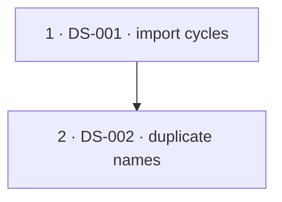

# Despaghettification — information input list for implementers

*Path:* `despaghettify/despaghettification_implementation_input.md` — Overview: [README.md](../README.md).

This document is **not** part of the frozen consolidation archive under [`docs/archive/documentation-consolidation-2026/`](../../docs/archive/documentation-consolidation-2026/). That archive holds **completed** findings and migration evidence (ledgers, topic map, validation reports) — **do not overwrite or “continue writing” those files**.

Here you find the **living working basis**: structural and spaghetti topics in **code**, prioritised input rows for task implementers, coordination rules, and an **optional** progress note. Like documentation consolidation 2026: **one canonical truth per topic** — applied here to **code structure** (fewer duplicates, clearer boundaries, smaller coherent modules).

**This file is part of wave discipline:** Whoever implements a **despaghettification wave** in code (new helper modules, noticeable AST/structure change) **updates this Markdown in the same wave** — not only the code. Details: § **“Maintaining this file during structural waves”** under coordination. This does **not** replace pre/post artefacts under `despaghettify/state/artifacts/…` (they remain mandatory per [`EXECUTION_GOVERNANCE.md`](../state/EXECUTION_GOVERNANCE.md)); it complements them as the **functional** entry and priority track.

## Link to `despaghettify/state/` (execution governance, pre/post)

This document is **not** a replacement for [`state/EXECUTION_GOVERNANCE.md`](../state/EXECUTION_GOVERNANCE.md); it is the **functional input side** for structural refactors that should use the **same** evidence and restart rules.

| Governance building block | Role for despaghettification |
|---------------------------|------------------------------|
| [`EXECUTION_GOVERNANCE.md`](../state/EXECUTION_GOVERNANCE.md) | Mandatory: read state document, **pre** and **post** artefacts per wave, compare pre→post, update state from evidence (**completion gate**). |
| [`WORKSTREAM_INDEX.md`](../state/WORKSTREAM_INDEX.md) | Maps **workstream** → `artifacts/workstreams/<slug>/pre|post/`. |
| [`state/README.md`](../state/README.md) | Entry to the state hub. |
| `despaghettify/state/artifacts/repo_governance_rollout/pre|post/` | Optional for **repo-wide** waves (e.g. large diff across packages); useful when a structural wave needs the same repo commands as the rollout. |

**Artefact paths (canonical, relative to `despaghettify/state/`):**

- Per affected workstream: `artifacts/workstreams/<workstream>/pre/` and `…/post/`.
- Slugs as in the index: `backend_runtime_services`, `ai_stack`, `administration_tool`, `world_engine` (documentation only if MkDocs/nav is in scope).

**Naming convention for structural waves (DS-*):**

- Session/wave prefix as today: `session_YYYYMMDD_…`.
- **DS-ID in the filename**, e.g. `session_YYYYMMDD_DS-001_scope_snapshot.txt`, `session_YYYYMMDD_DS-001_pytest_collect.exit.txt`, `session_YYYYMMDD_DS-001_pre_post_comparison.json` (the latter typically under **`post/`**).
- At least **one** human-readable artefact (`.txt`/`.md`) and **preferably** one machine-readable (`.json`) — as governance requires.

**DS-ID → primary workstream (where to place pre/post):**

| ID | Primary workstream (`artifacts/workstreams/…`) | Also involved (own pre/post only for real scope) |
|----|--------------------------------------------------|-----------------------------------------------------|
| DS-001 | `backend_runtime_services` | May touch `ai_stack` / `world-engine` imports only if a cycle spans packages — coordinate scope. |
| DS-002 | `backend_runtime_services` | Duplicate-name proxy spans all ROOTS; secondaries (`ai_stack`, `world_engine`) only if renames leave those trees. |

**Fill in:** For each active **DS-*** one row (or a group sharing the same primary workstream); slugs as in [`WORKSTREAM_INDEX.md`](../state/WORKSTREAM_INDEX.md): `backend_runtime_services`, `ai_stack`, `administration_tool`, `world_engine`, `documentation`. Repo-wide cross-check without product code: optional `artifacts/repo_governance_rollout/pre|post/` (e.g. **DS-REPLAY-G**).

Implementers: tick the **completion gate** from `EXECUTION_GOVERNANCE.md`; record the wave and new artefact paths in the matching `WORKSTREAM_*_STATE.md`. Avoid crossings: one clear wave owner per **DS-ID**; multiple workstreams only with agreed **separate** artefact sets.

## Link to documentation-consolidation-2026

| Archive artefact | Link to code despaghettification |
|------------------|----------------------------------|
| [`TOPIC_CONSOLIDATION_MAP.md`](../../docs/archive/documentation-consolidation-2026/TOPIC_CONSOLIDATION_MAP.md) | Topics map to **one** active doc per topic; code refactors should not reopen the same functional edge across two parallel implementations (e.g. RAG, MCP, runtime). |
| [`DURABLE_TRUTH_MIGRATION_LEDGER.md`](../../docs/archive/documentation-consolidation-2026/DURABLE_TRUTH_MIGRATION_LEDGER.md) | Model for **traceable** moves instead of silent drift; despaghettification: **one source** for shared building blocks (e.g. builtins). |
| [`FINAL_DOCUMENTATION_VALIDATION_REPORT.md`](../../docs/archive/documentation-consolidation-2026/FINAL_DOCUMENTATION_VALIDATION_REPORT.md) | Closure criteria for a **documentation** strand; for code: tests/CI green, behaviour unchanged, interfaces explicit. |

## Coordination — extend work without colliding

1. **Claims:** Before larger refactors, name the **ID(s)** in team/issue/PR (all **`DS-*** you are taking from this information input list). Preferably **one** clear owner per ID.
2. **No double track:** Two implementers do **not** work the same ID in parallel; if split: separate sub-tasks explicitly (e.g. DS-003a backend wiring only, DS-003b world-engine import only).
3. **Leave archive alone:** Do not mirror code findings into `documentation-consolidation-2026/*.md`; use CHANGELOG, PR description, **`despaghettify/state/` artefacts**, **this input list** (§ *Latest structure scan*, filled DS rows, optional § *progress*) and matching **`WORKSTREAM_*_STATE.md`**.
4. **Interfaces first:** For cycles (runtime cluster) small **DTO / protocol modules** before big moves; avoids PRs that touch half of `app.runtime` at once.
5. **Measurement optional:** AST/review-based lengths are **guidance**; success is **understandable** boundaries + green suites, not a percentage score.

### Maintaining this file during structural waves (move with the code)

For every relevant **DS-*** / despaghettification **wave**, update this file in the **same PR/commit logic** (not “code only”):

| What | Content |
|------|---------|
| **Information input list** | Per **DS-***: maintain columns; **pattern** starts with **C1..C7** (`**C3 ·**` …) per [spaghetti-check-task.md](../spaghetti-check-task.md) §2; mark completed waves briefly. |
| **§ Latest structure scan** | After measurable change: **main table** — **Trigger v2** + **Anteil %** for **M7** / **C1..C7** from **`metrics_bundle.score`** via `check --with-metrics` ([spaghetti-check-task.md](../spaghetti-check-task.md) §1); telemetry **N / L₅₀ / L₁₀₀ / D₆** from `spaghetti_ast_scan`; § *Score M7* **same** dual columns + **AST telemetry** row **under C7**; optional **extra checks**; **open hotspots** (**prune** solved items). For runtime edges `despaghettify/tools/ds005_runtime_import_check.py`. Rankings: script output only. |
| **§ Recommended implementation order** | Update when priority, dependency, or phase changes; **mandatory** Mermaid `flowchart` below the phase table on every [spaghetti-check-task.md](../spaghetti-check-task.md) pass that fills phases (see that doc §3). |
| **§ Progress / work log** | Optional **one** new row: DS-ID(s), short summary, gates/tests, pre/post paths (or “see PR”). |
| **DS-ID → workstream table** | Place new or moved **DS-*** here; note co-involved workstreams. |

**Governance:** `despaghettify/state/artifacts/workstreams/<slug>/pre|post/` and `WORKSTREAM_*_STATE.md` remain **formal** evidence; this file is the **compact** working and review map.

## Latest structure scan (orientation, no warranty)

**Purpose:** A **fillable** overview after measurable runs — update **date and time**, **`metrics_bundle.score`** (**Trigger v2** + **Anteil %**), **AST telemetry**, optional **extra checks**, and **open hotspots** per [spaghetti-check-task.md](../spaghetti-check-task.md). **Numeric** thresholds (**bars**, **weights**, **`M7_ref`**) are canonical in [spaghetti-setup.md](../spaghetti-setup.md). The spaghetti check maintains the **information input list** and **recommended implementation order** when the **trigger policy** in § *Trigger policy for check task updates* fires (per **setup**); otherwise this scan section (including M7 and category breakdown) is enough. **Rankings:** `python despaghettify/tools/spaghetti_ast_scan.py` only (repo root). **Open hotspots:** [spaghetti-solve-task.md](../spaghetti-solve-task.md) clears or narrows items when waves resolve them; on every spaghetti-check run, **prune** so solved items are not listed.

| Field | **Trigger v2** (0–100; advisory) | **Anteil %** (vs. bars / `M7_ref`; **M7** row = `m7_anteil_pct_gewichtet`) |
|-------|-------------------------------------|-------------------------------------|
| **As of (date & time)** | — | **2026-04-12 12:47:09 (UTC)** |
| Spaghetti scan command | — | `python despaghettify/tools/spaghetti_ast_scan.py` (ROOTS = *measurement scope*) |
| Measurement scope (ROOTS) | — | `backend/app`, `world-engine/app`, `ai_stack`, `story_runtime_core`, `tools/mcp_server`, `administration-tool` |
| **M7** — gewichtete 7-Kategorien-Summe | **36.30** | **6.29** |
| C1: Circular dependencies | **6.09** | **10.77** |
| C2: Nesting depth | **0.00** | **1.27** |
| C3: Long functions + complexity | **65.44** | **0.77** |
| C4: Multi-responsibility modules | **67.10** | **6.18** |
| C5: Magic numbers + global state | **36.91** | **1.11** |
| C6: Missing abstractions / duplication | **26.57** | **14.99** |
| C7: Confusing control flow | **42.54** | **5.65** |
| **AST telemetry N / L₅₀ / L₁₀₀ / D₆** | — | **4404** / **272** / **34** / **0** |
| Extra check builtins | — | **`check` embed:** **0** `def build_god_of_carnage_solo` hits across `**/builtins.py`; factory remains on `goc_solo_builtin_template` (same UTC pass). |
| Extra check runtime | — | **`ds005` exit 0**; **0** hits for `TYPE_CHECKING` / “avoid circular” / “circular dependency” grep under `backend/app/runtime` (same pass). |
| **Open hotspots** | — | **Policy:** **C1** share **10.77%** **>** bar **0%** (`backend/app` import SCC v1 — **35** / **325** graph files). **C6** share **14.99%** **>** bar **0%** (duplicate callable **names** across files — proxy). **C7** share **5.65%** **>** bar **3%**. **Composite:** `M7_anteil` **6.29** **<** `M7_ref` **9.1** (no composite fire). **Advisory:** **Trigger v2** is high on **C3**/**C4** (long / broad callables) without crossing **Anteil** bars — track if tails grow. Longest measured body this pass: **`legacy_keyword_scene_candidates`** (`ai_stack/scene_director_goc_legacy_keyword_candidates.py`). |

### Score *M7* — inputs, weights, and calculation

| Symbol | Meaning | **Trigger v2** (0–100) | **Anteil %** |
|--------|---------|------------------------|--------------|
| **M7** | Gewichtete Summe | **36.30** | **6.29** |
| **C1** | Circular dependencies | **6.09** | **10.77** |
| **C2** | Nesting depth | **0.00** | **1.27** |
| **C3** | Long functions + complexity | **65.44** | **0.77** |
| **C4** | Multi-responsibility modules | **67.10** | **6.18** |
| **C5** | Magic numbers + global state | **36.91** | **1.11** |
| **C6** | Missing abstractions / duplication | **26.57** | **14.99** |
| **C7** | Confusing control flow | **42.54** | **5.65** |
| **AST telemetry** | N / L₅₀ / L₁₀₀ / D₆ | — | **4404** / **272** / **34** / **0** |

**Formeln:** **Trigger:** `M7_trigger = Σ weight_i × trigger_v2(Ci)` aus **`metrics_bundle.m7`** / **`score`**. **Anteil:** `M7_anteil = Σ weight_i × anteil_pct(Ci)` aus **`score.m7_anteil_pct_gewichtet`**. **Weights:** [spaghetti-setup.md](../spaghetti-setup.md) § *M7 category weights*.

**Evaluation:** From **`check --with-metrics`**: fill **`metrics_bundle.score`** (both columns); **AST** from **`spaghetti_ast_scan`**. **Bars** apply to **Anteil %** / **`metric_a.m7`** only (see [spaghetti-check-task.md](../spaghetti-check-task.md) §1).

**Trigger policy for check task updates:**

Update § *Information input list*, § *Recommended implementation order*, and § *DS-ID → primary workstream* when **`metrics_bundle.trigger_policy_fires`** is true — i.e. **Anteil(C*n*) > bar*n*** or **`M7_anteil ≥ M7_ref`** per [spaghetti-setup.md](../spaghetti-setup.md).

| Condition | Rule |
|-----------|------|
| **Per-category** | **Anteil(C*n*)** **>** **bar*n*** per [spaghetti-setup.md](../spaghetti-setup.md) § *Per-category trigger bars*. |
| **Composite** | **`M7_anteil` ≥ `M7_ref`** (`metric_a.m7`). |

**Otherwise** (no per-category exceedance **and** **`M7_anteil` < `M7_ref`**): update **only** § *Latest structure scan*.

*Note:* **`trigger_policy_basis`:** `anteil_pct`. **Trigger v2** is advisory. No hand edits.

## Information input list (extensible)

Each row: **ID**, **pattern** (lead with **C1..C7** from [spaghetti-setup.md](../spaghetti-setup.md) § *Per-category trigger bars*, e.g. **`C3 ·`** …), **location**, **hint / measurement idea**, **direction**, **collision hint** (what is risky in parallel).

| ID | pattern | location (typical) | hint / measurement idea | direction (solution sketch) | collision hint |
|----|---------|--------------------|-------------------------|----------------------------|----------------|
| DS-001 | **C1 ·** import SCC load (`backend.app` v1) | `backend/app` import graph (non-trivial SCC membership) | Re-run `python -m despaghettify.tools check --with-metrics`; watch **`c1_files_in_cycles`** vs **`c1_import_graph_files`**. | Prefer cycle-cutting facades / DTO modules at SCC borders; reduce mutual `app.*` edges before large runtime edits. | Touches shared runtime import seams — avoid parallel uncoordinated refactors across the same SCC. |
| DS-002 | **C6 ·** duplicate callable names (cross-file proxy) | Helpers and services under ROOTS (name appears in **>1** file) | Use AST scan leaderboards + ripgrouped name search; rename or consolidate in small batches. | Namespace-private helpers, module-level renames, or thin adapter modules to dedupe public names. | Rename waves collide with open import work — sequence after **DS-001** unless analysis proves disjoint file sets. |

**New rows:** consecutive **DS-001**, **DS-002**, … (or your ID scheme); **pattern** starts with **C1..C7** per [spaghetti-check-task.md](../spaghetti-check-task.md) §2; briefly justify the topic. Per § *DS-ID → primary workstream* pick `artifacts/workstreams/<slug>/pre|post/` paths.

## Recommended implementation order

Prioritised **phases**, **order**, and **dependencies** — aligned with § **information input list** and [`EXECUTION_GOVERNANCE.md`](../state/EXECUTION_GOVERNANCE.md). After filling the phase table: **mandatory** Mermaid `flowchart` (or `graph`) **immediately below** the table, per [spaghetti-check-task.md](../spaghetti-check-task.md) §3; optional extra subsections per phase.

| Priority / phase | DS-ID(s) | short logic | workstream (primary) | note (dependencies, gates) |
|------------------|----------|-------------|----------------------|----------------------------|
| 1 | DS-001 | Shrink or dissolve `backend/app` import SCCs (v1) before broad runtime churn | backend_runtime_services | Gates: `python despaghettify/tools/ds005_runtime_import_check.py` (expect **0**); `pytest backend/tests/runtime/` (focused). |
| 2 | DS-002 | Reduce duplicate-name pressure across measured roots without behaviour drift | backend_runtime_services | Soft-dep: prefer after **DS-001** when hotspots overlap; gates: broader `pytest backend/tests/` after each rename batch. |

**Fill in:** one phase row per open **DS-*** (or an explicit merge noted in **note**). Order by **risk**: stabilise **runtime / import seams** (`backend_runtime_services` under `app.runtime`, `ds005`-touched paths) before very large **service orchestration** waves; **`ai_stack`**-only (or other packages) typically **later** unless the scan shows a hard blocker. **Parallel:** when two DS waves are independent (different primary workstream, no hard import coupling), use parallel phase bands (e.g. `3a`/`3b`) and document in **note** — do not invent a linear order by default. **Workstream (primary)** must match [WORKSTREAM_INDEX.md](../state/WORKSTREAM_INDEX.md) for pre/post paths. **note** column: concrete **gates** (`pytest …`, `ds005`). **Mermaid:** mandatory diagram **under** the table once phase rows are real (omit while the table is only `—`); **one line per node**, `["phase · DS-ID · short hook"]`, fork/join for parallel bands — [spaghetti-check-task.md](../spaghetti-check-task.md) §3. Full rules: same doc § *Maintaining the input list* → **Recommended implementation order** → *How to build a suitable phase table*. Coordination § *Maintaining this file*: when priority changes or new **DS-*** appear, update this section **and** the Mermaid block.

**Implementation:** invoke [spaghetti-solve-task.md](../spaghetti-solve-task.md) with **one** **DS-ID** per run (e.g. `run spaghetti-solve-task DS-016`); sub-waves and autonomous closure per that doc (completion gate each sub-wave).

## Progress / work log (optional, in addition to mandatory maintenance above)

Implementers may **briefly** record visible progress (for reviewers and the next iteration). **Mandatory** for structural waves remains **updating the input table, § structure scan, and — if needed — this log** (see coordination § *Maintaining this file*). **Additionally**, new waves add **pre/post files** under `despaghettify/state/artifacts/…` (see `EXECUTION_GOVERNANCE.md`); older session artefacts may be missing if intentionally cleaned — proof then via Git/CI/PR. Not a substitute for issues/PRs.

| date | ID(s) | short description | pre artefacts (rel. to `despaghettify/state/`) | post artefacts (rel. to `despaghettify/state/`) | state doc(s) updated | PR / commit |
|------|-------|-------------------|----------------------------------------|----------------------------------------|----------------------|-------------|
| 2026-04-12 | — | `spaghetti-reset-task` + one **`spaghetti-check`**: workstreams wiped, EMPTY → live input, metrics from `check --with-metrics` (same timestamps as § *Latest structure scan*). | — | — | — | Evidence: `despaghettify/reports/reset_check_with_metrics.json`, `despaghettify/reports/reset_ast_scan_capture.txt` |
| — | — | — | — | — | — | — |

**New rows:** chronologically (**newest first** recommended); **DS-ID(s)**, gates/tests run, pre/post paths as in [`EXECUTION_GOVERNANCE.md`](../state/EXECUTION_GOVERNANCE.md); for scan/docs-only updates note briefly. Longer history: Git, PRs, `WORKSTREAM_*_STATE.md`.

## Canonical technical reading paths (after refactor)

After structural changes to runtime/AI/RAG/MCP, align **active** technical docs (not the 2026 archive):

- Runtime / authority: [`docs/technical/runtime/runtime-authority-and-state-flow.md`](../../docs/technical/runtime/runtime-authority-and-state-flow.md) — supervisor orchestration: `supervisor_orchestrate_execute.py` + `supervisor_orchestrate_execute_sections.py`; subagent invocation: `supervisor_invoke_agent.py` + `supervisor_invoke_agent_sections.py`
- Inspector projection (backend): `inspector_turn_projection_sections.py` orchestrates; pieces in `inspector_turn_projection_sections_{utils,constants,semantic,provenance}.py`
- Admin tool routes: `administration-tool/route_registration.py` + `route_registration_{proxy,pages,manage,security}.py`
- God-of-Carnage solo builtin (core): `story_runtime_core/goc_solo_builtin_template.py` + `goc_solo_builtin_catalog.py` + `goc_solo_builtin_roles_rooms.py`
- AI / RAG / LangGraph: [`docs/technical/ai/RAG.md`](../../docs/technical/ai/RAG.md), [`docs/technical/integration/LangGraph.md`](../../docs/technical/integration/LangGraph.md), [`docs/technical/integration/MCP.md`](../../docs/technical/integration/MCP.md)
- Dev seam overview: [`docs/dev/architecture/ai-stack-rag-langgraph-and-goc-seams.md`](../../docs/dev/architecture/ai-stack-rag-langgraph-and-goc-seams.md)

---

*Created as an operational bridge between structural code work, the state hub under [`despaghettify/state/`](../state/README.md) (pre/post evidence), and the completed documentation archive of 2026.*
