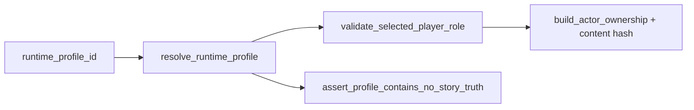

# ADR-MVP1-002: Runtime Profile Resolver

**Status**: Accepted
**MVP**: 1 — Experience Identity and Session Start
**Date**: 2026-04-24

## Context

No runtime profile concept existed in the codebase before MVP1. Templates (ExperienceTemplate) served as both content configuration and runtime identity. This made it impossible to distinguish "this is the content" from "this is the runtime mode".

## Decision

Create `world-engine/app/runtime/profiles.py` with a `RuntimeProfileResolver` pattern:

- `resolve_runtime_profile(runtime_profile_id)` resolves a profile id to a `RuntimeProfile` object
- `RuntimeProfile` contains: `runtime_profile_id`, `content_module_id`, `runtime_module_id`, `runtime_mode`, `selectable_player_roles`, `forbidden_story_truth_fields`
- `validate_selected_player_role(role, profile)` validates the player's role selection
- `build_actor_ownership(role, profile)` produces `human_actor_id`, `npc_actor_ids`, `actor_lanes`, `visitor_present`
- `assert_profile_contains_no_story_truth(profile_dict)` enforces content boundary

Error codes emitted by the resolver:
- `runtime_profile_required`
- `runtime_profile_not_found`
- `runtime_profile_not_content_module` (enforced via content module directory check)
- `selected_player_role_required`
- `invalid_selected_player_role`
- `selected_player_role_not_canonical_character`
- `invalid_visitor_runtime_reference`
- `runtime_profile_contains_story_truth`

## Affected Services/Files

- `world-engine/app/runtime/profiles.py` (NEW)
- `world-engine/app/api/http.py` — consumes resolver in `create_run` handler

## Consequences

- MVP2 can import `resolve_runtime_profile` from `app.runtime.profiles`
- The resolver is currently hard-coded for `god_of_carnage_solo`; future profiles require adding cases
- `RuntimeProfileError` is a structured ValueError subclass with `.code` and `.details`

## Diagrams

**`RuntimeProfileResolver`** maps `runtime_profile_id` → profile metadata, validates role choice, and asserts **no embedded story truth**.

## Alternatives Considered

- Database-driven profile registry: deferred (overkill for MVP1 with one profile)
- Profile resolution in the backend only: rejected — world-engine must validate its own create_run contracts

## Validation Evidence

- `test_runtime_profile_resolver_success` — PASS
- `test_unknown_runtime_profile_rejected` — PASS
- `test_create_run_missing_runtime_profile_returns_contract_error` — PASS

## Operational Gate Impact

No operational tooling changes required.
