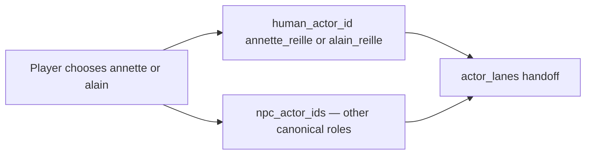

# ADR-MVP1-003: Role Selection and Actor Ownership

**Status**: Accepted
**MVP**: 1 — Experience Identity and Session Start
**Date**: 2026-04-24

## Context

The previous GoC solo template had a single HUMAN role (`visitor`) that was automatically assigned. There was no player choice and no way to associate a canonical story character with the human actor. The player was not a character — they were a nameless visitor.

## Decision

1. The player must choose `annette` or `alain` before session creation. This choice is mandatory.

2. The chosen role is preserved as `selected_player_role` (`annette`/`alain`) and resolves through content identity to the canonical human-controlled `human_actor_id` (`annette_reille`/`alain_reille`). The live story-session contract must compare the resolved actor identity, not raw string equality.

3. All other canonical God of Carnage characters (`alain`/`annette`, `veronique`, `michel`, depending on choice) become NPC dramatic actors.

4. `build_actor_ownership()` produces the authoritative `human_actor_id`, `npc_actor_ids`, and `actor_lanes` map for MVP2 consumption.

5. The `CreateRunRequest` in `world-engine/app/api/http.py` now accepts `selected_player_role`. The `world-engine/app/runtime/manager.py:_bootstrap_instance` accepts `preferred_role_id`.

## Affected Services/Files

- `story_runtime_core/goc_solo_builtin_roles_rooms.py` — annette and alain are HUMAN+can_join, both start in hallway
- `world-engine/app/runtime/manager.py` — `create_run()` and `_bootstrap_instance()` extended
- `world-engine/app/runtime/profiles.py` — `validate_selected_player_role()`, `build_actor_ownership()`
- `world-engine/app/api/http.py` — `create_run` handler wires profile resolution to manager

## Consequences

- Sessions where neither annette nor alain is selected are rejected at the API level
- `selected_player_role` remains the player-facing role slug while `human_actor_id` is the canonical runtime actor ID
- The two human-selectable lobby seats (annette, alain) both exist in the template; the unselected one remains an empty lobby seat
- MVP2 receives `human_actor_id` and `npc_actor_ids` from the `CreateRunResponse`

## Diagrams

Mandatory **`annette` / `alain`** selection resolves through content identity to **`human_actor_id`**; all other canonical characters become **NPC** lanes for MVP2.

## Alternatives Considered

- Single-role template variants (one for each player choice): rejected — violates profile-only separation
- Make selection optional with a default: rejected — mandatory selection is the stop condition for MVP1

## Validation Evidence

- `test_valid_annette_start` — PASS
- `test_valid_alain_start` — PASS
- `test_session_creation_without_selected_player_role_fails` — PASS
- `test_session_creation_invalid_role_fails` — PASS
- `test_role_slug_must_resolve_to_canonical_actor` — PASS
- `test_runtime_projection_accepts_role_slug_resolving_to_human_actor_id` — PASS
- `test_runtime_projection_rejects_role_slug_resolving_to_different_human_actor_id` — PASS
- `test_annette_human_role_exists_in_template` — PASS
- `test_alain_human_role_exists_in_template` — PASS

## Operational Gate Impact

No operational tooling changes required.
