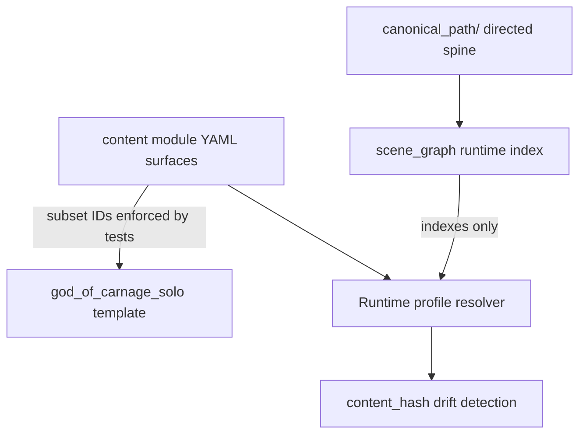

# ADR-MVP1-005: Canonical Content Authority

**Status**: Accepted
**MVP**: 1 — Experience Identity and Session Start (enforced; also required by MVP 2)
**Date**: 2026-04-25

## Context

The `god_of_carnage_solo` ExperienceTemplate in `story_runtime_core/` owned role descriptions, NPC voice strings, room layouts, props, actions, and beats — story truth that belongs exclusively to the canonical content module at `content/modules/god_of_carnage/`. This created two competing authorities: the runtime template and the content YAML. Changes to character identity, NPC voice, room/object truth, or canonical path beats required updates in two places, with no guarantee of consistency.

FIX-006 of the MVP1 audit cycle identified that the role IDs (`annette`, `alain`, `veronique`, `michel`) in the runtime template must derive from canonical content, not be maintained independently.

## Decision

1. **`content/modules/god_of_carnage/`** is the sole canonical content authority for God of Carnage story truth: character identities, relationships, locations, objects, canonical path steps, escalation policy, beats, content-access rules, and NPC voice intent.

   The current authored story spine is **not** `scenes.yaml`. Directed story truth lives in `canonical_path/index.yaml` and the numbered `canonical_path/*.yaml` step files. `scene_graph.yaml` is retained only as a runtime/compatibility node index over canonical path and location IDs; it must not become a second scene-description database.

2. **`god_of_carnage_solo` ExperienceTemplate** (in `story_runtime_core/`) is runtime scaffolding only — it provides the game-engine participation model (lobby seats, room graph, action menus). It does not author story truth.

3. **Runtime profile** (`world-engine/app/runtime/profiles.py`) resolves canonical actor IDs from the modular character content under `content/modules/god_of_carnage/characters/` at runtime via `_resolve_goc_content()`, not from hardcoded constants.

4. **Role IDs** in the ExperienceTemplate must be a subset of character IDs in `characters/index.yaml` and `characters/definitions/*.yaml`. This is enforced by `test_goc_solo_runtime_projection_is_derived_from_canonical_content`.

5. **`god_of_carnage_solo` runtime module** cannot own characters, rooms, objects, canonical path steps, relationships, or endings as story truth. `assert_profile_contains_no_story_truth()` enforces this for profile dicts.

6. Backend transitional continuity helpers may expose progression momentum
   (`momentum=resolving`, `momentum=stalled`, etc.) as context-selection
   rationale, but they must not infer GoC ending previews unless the active
   `ContentModule` exposes authored `ending_conditions`. The current GoC
   module shape intentionally omits legacy standalone `endings.yaml`; tests
   must not require `approaching_resolution` for this module.

7. Canonical GoC YAML is UTF-8 content. Tests and loaders that parse
   `content/modules/god_of_carnage/**/*.yaml` must open files with explicit
   UTF-8 encoding so Windows locale defaults such as `cp1252` do not become a
   second, accidental content contract.

## Affected Services/Files

- `content/modules/god_of_carnage/module.yaml` — canonical module metadata and file registry
- `content/modules/god_of_carnage/canonical_path/index.yaml` and numbered `canonical_path/*.yaml` — directed story spine and beat authority
- `content/modules/god_of_carnage/scene_graph.yaml` — runtime node index over canonical path/location IDs; not a story-truth replacement for `canonical_path/`
- `content/modules/god_of_carnage/characters/index.yaml` and `characters/definitions/*.yaml` — canonical authority for character IDs
- `world-engine/app/runtime/profiles.py` — `_resolve_goc_content()` reads canonical character content, produces content hash
- `story_runtime_core/goc_solo_builtin_roles_rooms.py` — role IDs must match canonical character IDs
- `world-engine/tests/test_mvp1_experience_identity.py` — `TestStoryTruthBoundary` and `TestContentResolvedRoleMapping`

## Consequences

- Any change to canonical character IDs in `characters/index.yaml` or `characters/definitions/*.yaml` must be reflected in the ExperienceTemplate role IDs
- Test `test_goc_solo_runtime_projection_is_derived_from_canonical_content` will fail if they drift
- The runtime profile produces a `content_hash` from canonical character content in `build_actor_ownership()`, enabling drift detection
- MVP 2 can trust that `human_actor_id` and `npc_actor_ids` in the handoff trace back to canonical content
- Foundation gates must verify the active content shape (`canonical_path/` plus `scene_graph.yaml`) and must not require legacy flat story files such as `scenes.yaml`, `transitions.yaml`, `triggers.yaml`, or `endings.yaml`.
- Lore/direction continuity tests for GoC must treat resolving momentum as a
  bounded context signal, not as proof that an authored ending exists.
- Content parse tests must be locale-independent and read canonical YAML as
  UTF-8, matching the authored repository content.

## Diagrams

**YAML in `content/modules/god_of_carnage/`** is sole story authority; the **solo ExperienceTemplate** is scaffolding only; resolver pulls IDs from the modular **`characters/`** authority surface.

## Alternatives Considered

- Keep role descriptions in the template: rejected — creates dual authority and drift risk
- Sync from canonical content at template build time (code generation): deferred as over-engineering for one module
- Validate at CI time only: rejected — runtime resolution is more robust than a separate CI check

## Validation Evidence

- `test_goc_solo_runtime_projection_is_derived_from_canonical_content` — PASS
- `test_profile_contains_no_story_truth` — PASS
- `test_runtime_module_contains_no_story_truth` — PASS
- `test_role_slug_map_uses_content_resolved_actor_ids` — PASS
- `test_build_actor_ownership_includes_content_hash` — PASS
- `test_canonical_module_has_directed_story_authority` — PASS

## Related Findings

- FIX-006 (story truth boundary enforcement)
- FIX-007 (content-resolved role mapping)
- ADR-MVP1-001 (experience identity)
- ADR-MVP1-002 (runtime profile resolver)

## Tests Proving the Decision

- `test_goc_solo_runtime_projection_is_derived_from_canonical_content` in `world-engine/tests/test_mvp1_experience_identity.py`
- `test_role_slug_map_uses_content_resolved_actor_ids` in `world-engine/tests/test_mvp1_experience_identity.py`

## Operational Gate Impact

`tests/reports/MVP_Live_Runtime_Completion/MVP1_CAPABILITY_EVIDENCE.md` marks `canonical_content_authority` as `implemented` with concrete source anchors. The `mvp1-tests.yml` workflow job `mvp1-tooling-gate` verifies this ADR file exists before closing.
