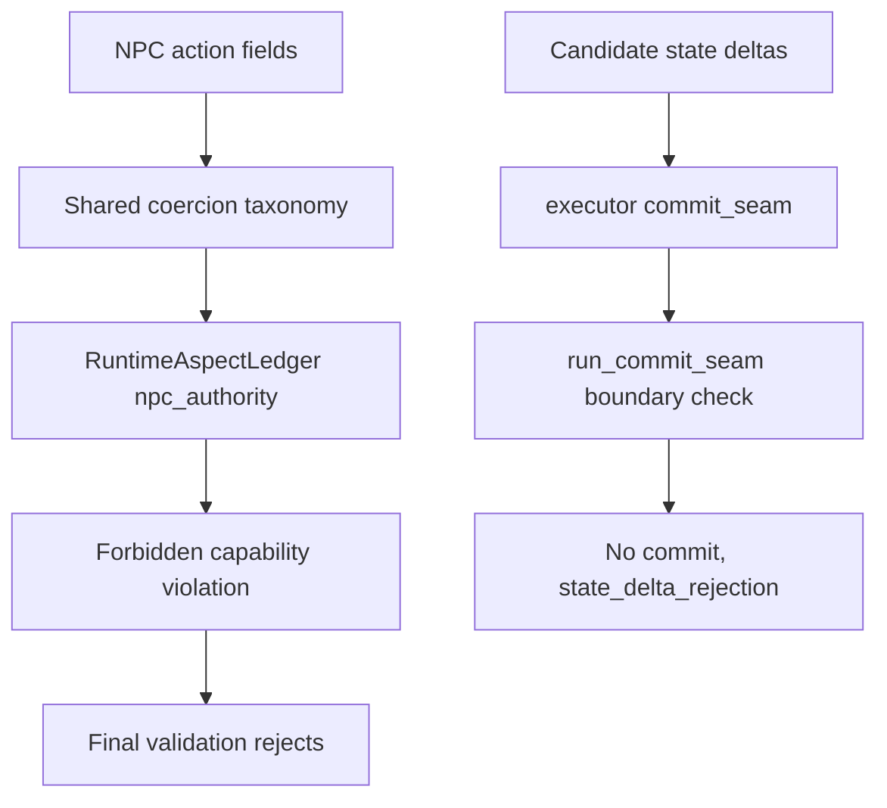

# ADR-MVP2-003: NPC Coercion Rejection and StateDeltaBoundary

**Status**: Accepted
**MVP**: 2 — Runtime State, Actor Lanes, and Content Boundary
**Date**: 2026-04-25

## Context

While ADR-MVP2-004 prevents the AI from speaking or acting *as* the human actor, a separate violation is possible: an NPC action that *controls the outcome* of the human actor without speaking as them. Examples:
- "Alain forces Annette to apologize." — NPC determines human speech
- "Véronique makes Alain leave the room." — NPC determines human movement
- "Michel decides that Annette feels ashamed." — NPC assigns human emotion

Additionally, the runtime had no mechanism preventing state deltas from mutating protected story truth fields (canonical_scene_order, canonical_characters, selected_player_role, human_actor_id, actor_lanes). An AI-generated state delta could silently change the player's selected role or rewrite canonical scene structure.

## Decision

### NPC Coercion

1. **`validate_npc_action_coercion()`** in `world-engine/app/runtime/actor_lane.py` enforces that NPC actions targeting the human actor may not constitute control. Classification uses structured fields first (coercion_type, action_type against `_COERCIVE_ACTION_TYPES`), then text-level analysis as supplementary evidence. This is not a pure string match.

2. Allowed: NPC pressures, challenges, addresses, interrupts, provokes, accuses, taunts, or appeals to the human actor. These are social influences, not outcome determinations.

3. Rejected: NPC forces, makes, compels, commands, orders, decides for, assigns emotion to, or controls the human actor's speech, action, movement, belief, decision, consent, or physical state. Error code: `npc_action_controls_human_actor`.

4. NPC-to-NPC coercive actions are not restricted by this rule (human actor boundary only).

5. The live LangGraph validation path mirrors the same structured coercion taxonomy through `ai_stack.dramatic_capability_contracts.NPC_COERCIVE_ACTION_TYPES`. When a structured NPC action targets the human actor and uses a coercive action/coercion type, `RuntimeAspectLedger.npc_authority` records `npc_action_controls_human_actor`, `RuntimeAspectLedger.capability_selection` records `npc.force_player_speech.forbidden`, and final validation rejects before commit.

6. `npc_action_controls_human_actor` is recoverable for self-correction feedback, but it is not eligible for degraded commit. The model may retry with corrected actor boundaries; the bad turn must not become committed story truth.

### StateDeltaBoundary

7. **`StateDeltaBoundary`** in `world-engine/app/runtime/models.py` defines `protected_paths` (canonical story truth and identity fields) and `allowed_runtime_paths` (runtime-only mutable fields).

8. **`validate_state_delta()`** in `world-engine/app/runtime/state_delta.py` rejects any delta whose path matches or is under a protected path. Error codes: `protected_state_mutation_rejected`, `state_delta_boundary_violation`.

9. **`run_commit_seam()`** in `ai_stack/goc_turn_seams.py` accepts `candidate_deltas` and `state_delta_boundary`. The live executor `_commit_seam()` forwards these fields from `RuntimeTurnState`, so protected path mutations are rejected at the commit seam before any write occurs.

10. Protected paths include: `canonical_scene_order`, `canonical_characters`, `canonical_relationships`, `canonical_content_truth`, `content_module_id`, `selected_player_role`, `human_actor_id`, `actor_lanes`.

11. Allowed runtime paths include: `runtime_flags`, `turn_memory`, `scene_pressure`, `admitted_objects`, `relationship_runtime_pressure`.

12. A blocked candidate delta returns `commit_applied=False`, carries `state_delta_rejection`, and is written into the commit aspect with `failure_class=hard_contract_failure`.

## Affected Services/Files

- `world-engine/app/runtime/models.py` — `StateDeltaBoundary`, `StateDeltaValidationResult`
- `world-engine/app/runtime/actor_lane.py` — `validate_npc_action_coercion()`, `_COERCIVE_ACTION_TYPES`, `_ALLOWED_PRESSURE_VERBS`
- `world-engine/app/runtime/state_delta.py` — `validate_state_delta()`, `validate_state_deltas()`, `build_default_goc_boundary()`
- `ai_stack/goc_turn_seams.py` — `run_commit_seam()` extended with `candidate_deltas`
- `ai_stack/dramatic_capability_contracts.py` — shared NPC coercion taxonomy and forbidden capability mapping
- `ai_stack/langgraph/langgraph_runtime_executor.py` — live authority-aspect and commit-seam wiring
- `ai_stack/story_runtime_playability.py` — retry/degraded-commit policy for coercion failures

## Consequences

- NPCs retain full dramatic freedom but cannot determine the human actor's outcomes
- Structured NPC coercion is rejected in the same authority ledger used by final validation, not only in isolated unit helpers
- Canonical scene order, character definitions, and identity fields cannot be mutated by runtime deltas
- A rejected commit from a protected delta returns `commit_applied=False` with `state_delta_rejection` in the result
- Unknown paths are rejected by default (`reject_unknown_paths=True`) — only explicitly listed allowed paths can be mutated
- ADR-0039 boundary: tests must assert taxonomy, error codes, ledger fields, commit flags, and capability violations, not copied prose examples

## Diagrams

**NPC coercion** blocks outcome-control of the human actor; **`StateDeltaBoundary`** rejects mutations on **protected canonical paths** at **`run_commit_seam`**.

## Validation Evidence

- `test_npc_action_cannot_force_human_response` — PASS
- `test_npc_action_cannot_force_human_movement` — PASS
- `test_npc_action_cannot_assign_human_emotion` — PASS
- `test_npc_action_can_pressure_human_without_control` — PASS
- `test_npc_action_can_challenge_human` — PASS
- `test_ai_delta_cannot_change_selected_player_role` — PASS
- `test_ai_delta_cannot_change_human_actor_id` — PASS
- `test_ai_delta_cannot_mutate_actor_lanes` — PASS
- `test_protected_state_mutation_canonical_scene_order` — PASS
- `test_commit_seam_rejects_protected_state_mutation` — PASS
- `test_npc_structured_coercion_of_human_actor_rejected_by_runtime_aspect` — PASS
- `test_structured_npc_coercion_written_to_aspect_ledger_and_capability_violation` — PASS
- `test_commit_seam_passes_candidate_deltas_to_state_delta_boundary` — PASS
- `test_npc_coercion_runtime_aspect_is_retryable_but_not_degradable` — PASS
- `tests/gates/test_table_b_anti_hardcoding_gate.py` — PASS (ADR-0039 guard)

## Related ADRs

- ADR-MVP2-004 Actor-Lane Enforcement — AI cannot speak/act as human actor
- ADR-MVP1-003 Role Selection and Actor Ownership — human actor identity established here
