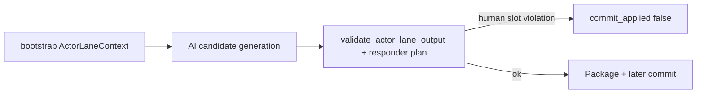

# ADR-MVP2-004: Actor-Lane Enforcement

**Status**: Accepted
**MVP**: 2 — Runtime State, Actor Lanes, and Content Boundary
**Date**: 2026-04-25

## Context

MVP1 established that the player selects `annette` or `alain` and that the unselected canonical characters become NPC dramatic actors. However, there was no mechanism preventing the AI from generating lines, actions, emotional states, or decisions for the selected human actor. The AI had authority over all actor output slots, including the human player's slot.

Additionally, the responder nomination seam (`build_responder_and_function()` in `ai_stack/scene_director_goc.py`) had no guard preventing the human actor from being nominated as a scene responder — an AI-generated response that would silently puppet the player.

## Decision

1. **ActorLaneContext** is assembled at runtime bootstrap from the MVP1 `build_actor_ownership()` handoff. It carries `human_actor_id`, `actor_lanes`, `ai_allowed_actor_ids`, and `ai_forbidden_actor_ids`. The human actor is always in `ai_forbidden_actor_ids`.

2. **`validate_actor_lane_output()`** in `world-engine/app/runtime/actor_lane.py` rejects any AI candidate block (spoken line, actor action, emotional state, decision) whose `actor_id` or `speaker_id` matches `human_actor_id`. Error code: `ai_controlled_human_actor`.

3. **`validate_responder_plan()`** in `world-engine/app/runtime/actor_lane.py` rejects any responder plan where the `primary_responder_id` or any `secondary_responder_ids` entry is the human actor. Error code: `human_actor_selected_as_responder`.

4. **`run_validation_seam()`** in `ai_stack/goc_turn_seams.py` is extended with an optional `actor_lane_context` dict parameter. When provided, it scans the AI generation's structured output (spoken_lines, action_lines, emotional_shift, responder nominations) for human-actor violations **before** the dramatic-effect gate runs. This ensures enforcement happens before response packaging and before commit.

5. **Enforcement order**: runtime bootstrap → ActorLaneContext assembly → AI candidate generation → actor-lane validation → responder validation → response packaging. Validation that only filters after commit is a gate failure.

6. **visitor** is rejected from all actor lane seams with error code `invalid_visitor_runtime_reference`.

7. **`actor_lane_validation_too_late`** error code is raised if validation is called after a candidate is already marked as committed.

## Affected Services/Files

- `world-engine/app/runtime/models.py` — `ActorLaneContext`, `ActorLaneValidationResult`
- `world-engine/app/runtime/actor_lane.py` — `build_actor_lane_context()`, `validate_actor_lane_output()`, `validate_responder_plan()`
- `ai_stack/goc_turn_seams.py` — `_check_human_actor_violations()`, `run_validation_seam()` extended with `actor_lane_context`
- `ai_stack/scene_director_goc.py` — `build_responder_and_function()` (responder nomination seam — receives validation in MVP3)

## Consequences

- AI cannot generate any output for the selected human actor's slot in any scene turn
- Human actor can only speak or act via player input, never via AI generation
- NPC actors retain full dramatic freedom to speak, act, address, challenge, and interact with both the human actor and each other
- `run_commit_seam()` receives a rejected `validation_outcome` when human actor enforcement fires, ensuring `commit_applied=False`
- `run_visible_render()` emits `render_downgrade` when enforcement fires

## Diagrams

**`ActorLaneContext`** forbids AI output on the **human** slot and blocks **human as responder** — enforced in **`run_validation_seam`** before dramatic gates and commit.

## Alternatives Considered

- Post-render filtering: rejected — validation that only removes human-actor output after commit has already accepted it is not enforcement, it is masking
- Frontend-only blocking: rejected — same reason; the boundary must be at the AI seam, not the display layer
- Permitting AI to speak as a "narrator voice" for the human actor: rejected — violates the player agency contract

## Validation Evidence

- `test_ai_cannot_speak_for_human_actor` — PASS
- `test_ai_cannot_act_for_human_actor` — PASS
- `test_ai_cannot_assign_human_actor_emotion` — PASS
- `test_ai_cannot_decide_for_human_actor` — PASS
- `test_human_actor_cannot_be_primary_responder` — PASS
- `test_human_actor_cannot_be_secondary_responder` — PASS
- `test_visitor_cannot_be_responder` — PASS
- `test_actor_lane_validation_runs_before_response_packaging` — PASS
- `test_actor_lane_validation_too_late_error` — PASS

## Related Audit Finding IDs

- MVP1-FIX-003: Unselected human guest roles become NPC participants
- MVP1-FIX-007: Visitor removed from participants and lobby_seats

## Operational Gate Impact

MVP2 gate fails if this enforcement is absent or post-hoc. Test `test_actor_lane_validation_runs_before_response_packaging` proves enforcement fires before `run_commit_seam()` and before `run_visible_render()`.
