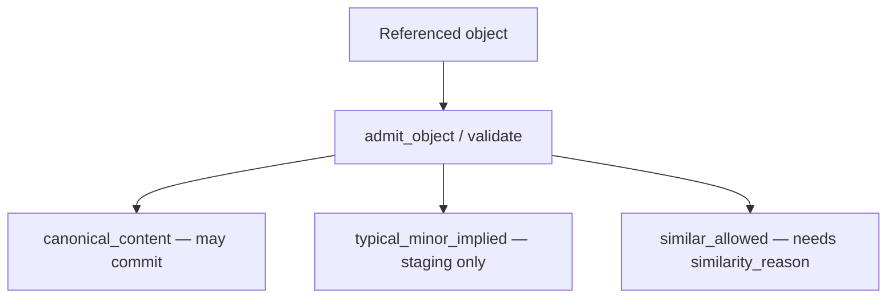
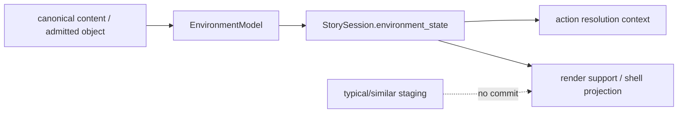

# ADR-MVP2-015: Canonical, Typical, and Similar Environment Affordances

**Status**: Accepted
**MVP**: 2 — Runtime State, Actor Lanes, and Content Boundary
**Date**: 2026-04-25

## Context

The runtime AI had no formal classification for environment objects it could reference or use in scene turns. Any object — a minor prop like a water glass or a plot-changing item like a legal contract — could be introduced without restriction. This created the risk of:
- AI inventing canonical story truth through object introduction (e.g., a new character prop that redefines the scene)
- Major or dangerous objects appearing with no canonical backing
- Objects being committed to persistent state when they should only be staged temporarily

## Decision

All environment objects entering the runtime must be classified by source_kind before use. Three tiers are defined:

1. **`canonical_content`**: The object is explicitly present in the canonical content module (`content/modules/god_of_carnage/`). Admitted with `commit_allowed=True`, `temporary_scene_staging=False`.

2. **`typical_minor_implied`**: The object is a minor, plausible, contextually implied prop that does not change plot truth (e.g., a water glass in a living room). Admitted with `temporary_scene_staging=True`, `commit_allowed=False`. Not committed to persistent runtime state.

3. **`similar_allowed`**: The object is similar to a known canonical object and passes the similarity test. Requires a non-empty `similarity_reason`. Admitted with `commit_allowed=False`.

Objects with missing or invalid `source_kind` are rejected with `object_source_kind_required`. `similar_allowed` without `similarity_reason` is rejected with `similar_allowed_requires_similarity_reason`. Major, dangerous, or plot-changing objects (weapons, explosives, plot documents) without `canonical_content` backing are rejected with `environment_object_not_admitted`.

An `ObjectAdmissionRecord` is produced for every admitted or rejected object, carrying the full classification decision and commit policy.

### Relationship to Pi15 EnvironmentState

Pi15 adds a durable `EnvironmentState`, but it does **not** loosen this ADR. `EnvironmentModel` may normalize canonical layout/object YAML into room and prop state, and `StorySession.environment_state` may persist canonical-content objects, actor locations, visible rooms, salient objects, and recent environment events. Typical or similar objects remain temporary staging unless they pass the admission contract with `commit_allowed=True`.

Environment state is therefore a projection of admitted/canonical environment truth, not a second object-authority surface. Model-generated props cannot become persistent story truth by appearing in narration, local context, render support, or shell readout.

## Affected Services/Files

- `world-engine/app/runtime/models.py` — `ObjectAdmissionRecord`, `VALID_SOURCE_KINDS`
- `world-engine/app/runtime/object_admission.py` — `admit_object()`, `validate_object_admission()`
- `ai_stack/contracts/environment_state_contracts.py` — canonical `EnvironmentModel` / durable `EnvironmentState` helpers
- `ai_stack/player_action_resolution.py` — action affordance context bound to current environment state
- `ai_stack/langgraph/langgraph_runtime_executor.py` — environment state initialization, generation context, commit-time mutation, render context
- `ai_stack/story_runtime/turn/god_of_carnage_turn_seams.py` — render support marker for bound environment state
- `world-engine/app/story_runtime/manager.py` — `StorySession.environment_state` persistence and get-state diagnostics
- `world-engine/app/story_runtime_shell_readout.py` — shell projection of current environment state

## Consequences

- The AI may only reference objects that have been explicitly admitted with a valid source_kind
- Typical minor props are available for scene staging but cannot be committed to story truth
- No object can create new canonical story truth at runtime
- The `god_of_carnage_solo` runtime template continues to own no props (`props=[]` in the template); canonical module content may still define layout/object truth that Pi15 normalizes into environment state
- Player-visible environment projections remain projections of committed state and admitted/canonical content, not proof that narration invented a new persistent object

## Diagrams

Every object is **`source_kind`**-classified (`canonical_content`, `typical_minor_implied`, `similar_allowed`) with an **`ObjectAdmissionRecord`** and explicit **commit vs staging** rules.

Pi15 sits after this boundary: only committed/admitted environment truth is durable.

## Alternatives Considered

- Open object list: rejected — any object without source classification can silently create new story truth
- Binary canonical/non-canonical: rejected — leaves no tier for contextually plausible minor props, forcing everything into canonical or rejected

## Validation Evidence

- `test_canonical_object_admitted` — PASS
- `test_typical_minor_object_admitted_as_temporary` — PASS
- `test_similar_allowed_requires_similarity_reason` — PASS
- `test_unadmitted_plausible_object_rejected` — PASS
- `test_major_plot_changing_object_rejected` — PASS
- `test_runtime_module_contains_no_goc_story_truth` — PASS
- `test_god_of_carnage_solo_does_not_define_characters_scenes_props_or_plot_truth` — PASS
- `ai_stack/tests/test_environment_state_contracts.py` — PASS
- `world-engine/tests/test_story_runtime_environment_state.py` — PASS
- `ai_stack/tests/test_langgraph_runtime.py::test_runtime_turn_graph_emits_player_action_resolution_surface` — PASS

## Related ADRs

- ADR-MVP1-005 Canonical Content Authority — story truth authority model this builds on
- ADR-MVP2-004 Actor-Lane Enforcement — parallel enforcement for actor output boundary
- ADR-0039 Gate Tests Must Not Use Hardcoded Oracles — Pi15 tests derive room/object expectations from canonical policy/content and assert schema relationships, not narrator prose

## Operational Gate Impact

MVP2 gate fails if `god_of_carnage_solo` template contains props, beats, or actions (story truth). Enforced by `test_runtime_module_contains_no_goc_story_truth` and `test_god_of_carnage_solo_does_not_define_characters_scenes_props_or_plot_truth`.
