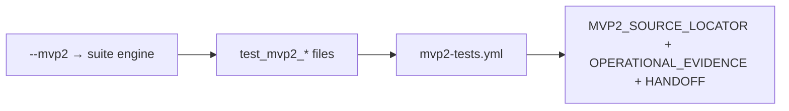

# ADR-MVP2-016: Operational Test and Startup Gates

**Status**: Accepted
**MVP**: 2 — Runtime State, Actor Lanes, and Content Boundary
**Date**: 2026-04-25

## Context

MVP1 established `docker-up.py`, `tests/run_tests.py`, GitHub workflows, and TOML/tooling as mandatory operational gates. MVP2 adds new test suites and artifacts that must be covered by the same infrastructure. A partial implementation (feature code present, test runner not updated) does not satisfy the gate.

## Decision

1. **`tests/run_tests.py --mvp2`** runs the world-engine engine suite, which includes all MVP2 test files:
   - `test_mvp2_runtime_state_actor_lanes.py` (Waves 2.1–2.2)
   - `test_mvp2_npc_coercion_state_delta.py` (Wave 2.3)
   - `test_mvp2_object_admission.py` (Wave 2.4)
   - `test_mvp2_operational_gate.py` (Wave 2.5 operational checks)

2. **`.github/workflows/mvp2-tests.yml`** covers all four MVP2 test files plus MVP1 regression. It triggers on changes to MVP2 source files, test files, content, and the workflow itself. No suite is silently skipped.

3. **`world-engine/pyproject.toml`** `testpaths = ["tests"]` picks up all MVP2 test files automatically (no manual entry required).

4. **`docker-up.py gate`** must report failure non-silently when services are unreachable. This behavior was verified in MVP1 (exit code 2 when backend is unreachable). MVP2 adds no new services but must not break startup.

5. **Required MVP2 report artifacts** must exist for the gate to pass:
   - `tests/reports/MVP_Live_Runtime_Completion/MVP2_SOURCE_LOCATOR.md`
   - `tests/reports/MVP_Live_Runtime_Completion/MVP2_OPERATIONAL_EVIDENCE.md`
   - `tests/reports/MVP_Live_Runtime_Completion/GOC_MVP2_HANDOFF_TO_MVP3.md`

6. **Required MVP2 ADRs** must exist:
   - `docs/ADR/MVP_Live_Runtime_Completion/adr-mvp2-004-actor-lane-enforcement.md`
   - `docs/ADR/MVP_Live_Runtime_Completion/adr-mvp2-015-environment-affordances.md`
   - `docs/ADR/MVP_Live_Runtime_Completion/adr-mvp2-016-operational-gates.md`

## Affected Services/Files

- `tests/run_tests.py` — `--mvp2` flag added
- `.github/workflows/mvp2-tests.yml` — new workflow
- `world-engine/pyproject.toml` — `testpaths = ["tests"]` (unchanged; picks up MVP2 files)
- `world-engine/tests/test_mvp2_operational_gate.py` — operational gate tests

## Consequences

- Any MVP2 test file removed or renamed without updating `mvp2-tests.yml` will break the workflow
- `tests/run_tests.py --mvp2` delegates to `tests/run_tests.py --suite engine`, which runs all world-engine tests including MVP2 files
- The operational evidence artifact must list concrete test files and markers, not just suite names

## Diagrams

**`--mvp2`** runs engine suites covering MVP2 files; **`mvp2-tests.yml`**, **reports**, and **required ADRs** must stay in sync.

## Alternatives Considered

- Running MVP2 tests only from CI without canonical runner integration: rejected — the operational gate requires `tests/run_tests.py` to be the canonical entry point
- Merging MVP2 tests into the MVP1 test file: rejected — separate files per MVP keep gate evidence clean

## Validation Evidence

- `test_run_test_mvp2_flag_exists` — PASS
- `test_github_workflow_includes_mvp2_suite` — PASS
- `test_mvp2_source_locator_artifact_exists` — PASS
- `test_mvp2_operational_evidence_artifact_exists` — PASS
- `test_mvp2_handoff_artifact_exists` — PASS
- `test_mvp2_adrs_present` — PASS
- `test_toml_testpaths_include_mvp2_tests` — PASS

## Related ADRs

- ADR-MVP1-016 Operational Test and Startup Gates — MVP1 baseline this extends
