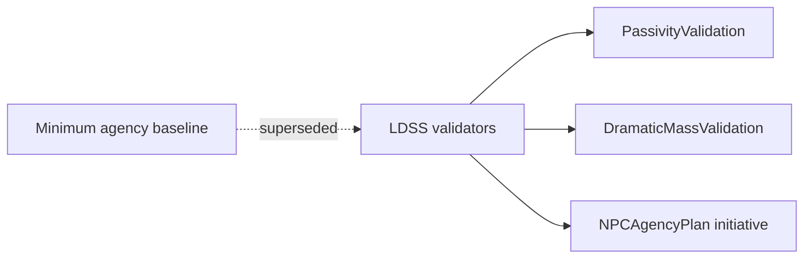

# ADR-MVP3-007: Minimum Agency Baseline Superseded by LDSS

**Status**: Accepted
**MVP**: 3 — Live Dramatic Scene Simulator
**Date**: 2026-04-26

## Context

Prior to MVP3, the runtime had a minimum agency baseline that defined a floor for NPC behavior. This floor was defined as "at least one visible NPC actor response per turn" and was enforced through passivity checks in the existing graph pipeline.

MVP3 introduces the Live Dramatic Scene Simulator (LDSS), which supersedes the minimum agency baseline with a richer contract: NPCs must not only respond but must do so with dramatic mass (actor lines, actions, or environment interactions), follow their own initiative, and act autonomously without waiting to be directly addressed.

The old minimum agency baseline (passive reactivity) is insufficient. NPCs must be assertive dramatic agents, not prompted responders.

## Decision

1. **The prior minimum agency baseline is superseded.** LDSS replaces it with a behavior contract that requires visible NPC actor responses (`actor_line`, `actor_action`, or `environment_interaction`) and prohibits narrator-only output as a complete turn.

2. **PassivityValidation** is the enforced gate. It requires at least one visible NPC block with a non-null `actor_id`. A turn consisting solely of narrator blocks is rejected with error code `no_visible_actor_response`.

3. **DramaticMassValidation** is the mass gate. It requires at least one NPC block of a visible type. A too-thin proposal (no NPC response) is rejected with error code `dramatic_alignment_insufficient_mass`.

4. **NPCAgencyPlan** is the initiative contract. LDSS must emit an `NPCAgencyPlan` identifying `primary_responder_id`, `secondary_responder_ids`, and per-NPC initiative intents. NPCs may speak without being directly addressed.

5. **NPC-to-NPC interaction** is valid and expected. A secondary NPC may react to the primary NPC's line without involving the human actor.

6. **The deterministic mock output** in `build_deterministic_ldss_output()` always satisfies these requirements, serving as a guaranteed valid fallback when no real AI call is available.

## Affected Services/Files

- `ai_stack/live_dramatic_scene_simulator.py` — `PassivityValidation`, `validate_passivity()`, `validate_dramatic_mass()`, `build_deterministic_ldss_output()`
- `world-engine/app/story_runtime/manager.py` — `_build_ldss_scene_envelope()` (LDSS entry point post-commit)
- `tests/gates/test_goc_mvp03_live_dramatic_scene_simulator_gate.py` — gates proving passivity and dramatic mass enforcement

## Consequences

- NPCs act autonomously and are assertive dramatic agents, not only reactive
- A turn with no visible NPC response is always rejected — no silent turns
- The deterministic mock guarantees at least one visible NPC response even without AI
- The gate for passivity runs before commit and before response packaging

## Diagrams

Legacy “one NPC line” floor is replaced by **LDSS**: **passivity**, **dramatic mass**, and **`NPCAgencyPlan`** gates before commit.

## Alternatives Considered

- Keeping minimum agency baseline and adding LDSS on top: rejected — creates two competing contracts for the same enforcement point
- Making passivity optional: rejected — passive NPC behavior is a violation of the live dramatic scene simulator contract

## Validation Evidence

- `test_mvp3_gate_npcs_act_without_direct_address` — PASS
- `test_mvp3_gate_too_thin_mock_output_recovered_or_rejected_without_commit` — PASS
- `test_mvp3_gate_dramatic_validation_before_commit` — PASS
- `test_mvp3_gate_fallback_output_satisfies_validation` — PASS

## Related ADRs

- ADR-MVP3-012 (NPC Free Dramatic Agency) — NPC initiative details
- ADR-MVP2-004 (Actor Lane Enforcement) — human actor protection
