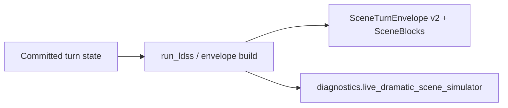

# ADR-MVP3-011: Live Dramatic Scene Simulator Contract

**Status**: Accepted
**MVP**: 3 — Live Dramatic Scene Simulator
**Date**: 2026-04-26

## Context

Prior to MVP3, the story runtime returned raw visible output bundles (narration, spoken lines, action lines) from the LangGraph executor. This was sufficient for recap and dramatic_turn experience modes, but insufficient for live dramatic scene play where the player needs structured, typed scene blocks.

MVP3 introduces LDSS as a non-optional live-path component that wraps the turn's output in a validated `SceneTurnEnvelope.v2` with typed `SceneBlock` objects, NPC agency metadata, and live-path diagnostics.

## Decision

1. **`SceneTurnEnvelope.v2`** is the canonical output contract for God of Carnage solo turns. It is returned as `scene_turn_envelope` on the `execute_turn` response.

2. **`SceneBlock`** is the typed scene unit. Valid block types: `narrator`, `actor_line`, `actor_action`, `environment_interaction`, `system_degraded_notice`.

3. **`LDSSInput`** is the input contract: story session state, actor lane context, admitted objects, and player input.

4. **`LDSSOutput`** is the intermediate output: decision count, scene block count, visible actor response flag, NPC agency plan, and visible scene output.

5. **LDSS invocation point**: `_finalize_committed_turn()` in `world-engine/app/story_runtime/manager/` calls `_build_ldss_scene_envelope()` after validation and commit. LDSS runs on committed state only.

6. **LDSS diagnostics status**: The diagnostics field `diagnostics.live_dramatic_scene_simulator.status` reports the active LDSS outcome. Direct canonical-step LDSS envelope builds report `"approved"` when the authored canonical path step produced valid visible blocks. Full story-turn manager routes may project that same successful LDSS evidence as `"evidenced_live_path"` in higher-level runtime diagnostics. The diagnostics include `story_session_id`, `turn_number`, `input_hash`, `output_hash`, `decision_count`, `scene_block_count`, and `legacy_blob_used=false`.

7. **Legacy blob rejection**: The response packager must not use legacy text blobs as final output. `legacy_blob_used` must be `false` in diagnostics.

8. **Deterministic output sources**: When a resolvable `canonical_step_id` and canonical path bundle are present, LDSS renders deterministic visible scene blocks from authored canonical path truth. When no live/canonical visible generation is available, `build_deterministic_ldss_output()` returns an explicit `system_degraded_notice` with `status="degraded_error"` and a non-empty error code; it must not fabricate narrator/NPC story truth merely to satisfy validators.

## Affected Services/Files

- `ai_stack/live_dramatic_scene_simulator.py` — `SceneTurnEnvelopeV2`, `SceneBlock`, `LDSSInput`, `LDSSOutput`, `run_ldss()`, `build_deterministic_ldss_output()`, `build_scene_turn_envelope_v2()`
- `world-engine/app/story_runtime/manager/` — `_build_ldss_scene_envelope()`, LDSS import, call in `_finalize_committed_turn`
- `tests/gates/test_goc_mvp03_live_dramatic_scene_simulator_gate.py`
- `world-engine/tests/test_mvp3_ldss_integration.py`

## Consequences

- Every God of Carnage solo turn produces `SceneTurnEnvelope.v2`
- Non-GoC sessions do not produce a scene envelope (LDSS is GoC-specific)
- The response is packaged from committed state, not raw AI output
- Diagnostics provide turn-level observability for MVP4 (Narrative Gov, Langfuse)
- A degraded LDSS fallback is valid as an error surface, not as a successful dramatic scene; gates that require NPC participation must use canonical-step or live-generated output.

## Diagrams

After validation/commit, **`_build_ldss_scene_envelope`** emits **`SceneTurnEnvelope.v2`** with typed **`SceneBlock`**s and **evidenced** diagnostics — no legacy blob as final truth.

## Alternatives Considered

- Adding LDSS as a new LangGraph node: rejected for MVP3 — the existing graph already validates and commits; LDSS packaging runs post-commit without modifying the graph
- Parallel fake turn path for testing: rejected — LDSS must run through the real `story.turn.execute` path

## Validation Evidence

- `test_mvp3_gate_start_primary_human_live_scene_turn` — PASS
- `test_mvp3_gate_start_secondary_human_live_scene_turn` — PASS
- `test_mvp3_gate_canonical_path_output_satisfies_validation` — PASS
- `test_mvp3_gate_missing_canonical_step_returns_degraded_notice` — PASS
- `test_mvp3_gate_response_packaged_from_committed_state` — PASS
- `test_mvp3_gate_trace_header_preserved_on_story_turn` — PASS
- `test_execute_turn_produces_scene_turn_envelope_annette` — PASS
- `test_execute_turn_produces_scene_turn_envelope_alain` — PASS
- `test_scene_envelope_diagnostics_evidenced_live_path` — PASS

## Related ADRs

- ADR-MVP3-012 (NPC Free Dramatic Agency)
- ADR-MVP3-013 (Narrator Inner Voice Contract)
- ADR-MVP2-004 (Actor Lane Enforcement)
