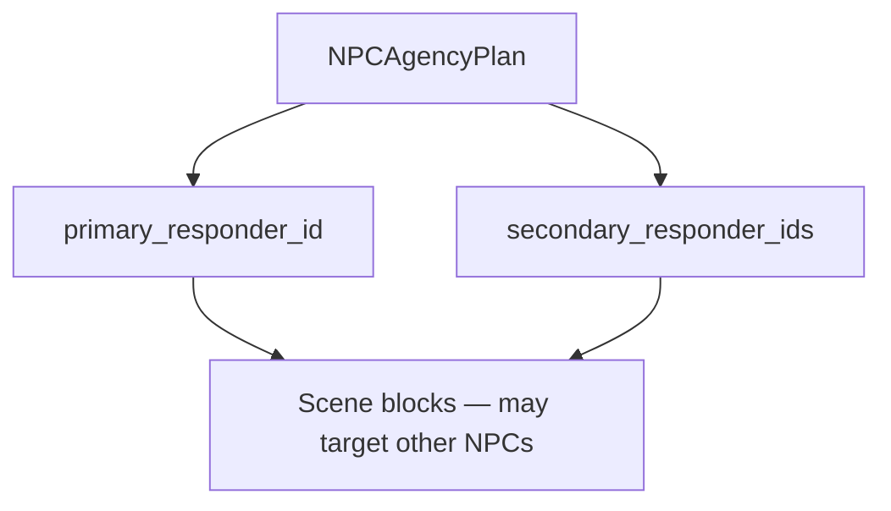

# ADR-MVP3-012: NPC Free Dramatic Agency

**Status**: Accepted
**MVP**: 3 — Live Dramatic Scene Simulator
**Date**: 2026-04-26

## Context

MVP2 established that NPCs are AI-controlled actors and the human actor is protected from AI control. MVP3 must go further: NPCs must have genuine free dramatic agency — the ability to initiate, address each other, react without being prompted, and pursue their own dramatic line within the scene.

A passive NPC that only responds when directly addressed violates the live dramatic scene simulator contract. NPCs must be assertive, autonomous dramatic agents.

## Decision

1. **NPCAgencyPlan** is the initiative contract. LDSS emits an `NPCAgencyPlan` per turn with `primary_responder_id`, `secondary_responder_ids`, and `npc_initiatives` (per-NPC intent, allowed block types, and target actor).

2. **Primary NPC initiative**: The primary responder speaks or acts first. Selection priority: `veronique` → `alain` → `michel` (Véronique is the most dramatically assertive in God of Carnage).

3. **Secondary NPC initiative**: The secondary NPC reacts to the primary NPC or to the scene state. This is NPC-to-NPC interaction — the human actor is not required as a bridge.

4. **No direct address required**: NPCs may speak or act without being addressed by name in the player's input. Player input is dramatic context, not a command prompt.

5. **Responder candidate exclusion**: Human actor and `visitor` are never in the responder candidate set. `validate_responder_candidates()` enforces this.

6. **Multiple NPC participation**: More than one NPC may participate in a single turn (primary + secondary). `NPCAgencyPlan.secondary_responder_ids` lists additional participants.

7. **NPC-to-NPC `target_actor_id`**: A block may target another NPC as its `target_actor_id`. This proves NPC-to-NPC dramatic exchange without human actor mediation.

## Affected Services/Files

- `ai_stack/live_dramatic_scene_simulator.py` — `NPCAgencyPlan`, `NPCInitiative`, `validate_responder_candidates()`, `_select_primary_responder()`, `build_deterministic_ldss_output()`
- `ai_stack/npc_agency_contracts.py` — shared partial runtime contract normalization for `npc_agency_plan.v1`, including legacy `initiatives` compatibility and human/visitor exclusion.
- `ai_stack/npc_agency_realization.py` — shared realization and validation helpers for `npc_initiative_realization_v1` / `npc_initiative_validation_v1`.
- `ai_stack/runtime_aspect_ledger.py` — `npc_agency` runtime aspect projection for planned, realized, missing, and partial-status evidence.
- `ai_stack/story_runtime_playability.py` — recoverable rewrite feedback for missing required NPC initiative without allowing degraded commit to hide it.
- `ai_stack/langgraph_runtime_executor.py` — model-visible partial NPC agency plan projection, bounded initiative directives, validation-aspect wiring, and self-correction trigger surface.
- `ai_stack/actor_survival_telemetry.py` — vitality telemetry projection of planned, realized, missing, and required NPC initiatives.
- `ai_stack/narrative_runtime_agent.py` — ruhepunkt pressure analysis reads the v1 `npc_initiatives` contract and remains backward-compatible with legacy `initiatives`.
- `tests/gates/test_goc_mvp03_live_dramatic_scene_simulator_gate.py` — `test_mvp3_gate_npcs_act_without_direct_address`, `test_mvp3_gate_multiple_npcs_can_participate`, `test_mvp3_gate_responder_candidates_exclude_human_and_visitor`
- `ai_stack/tests/test_npc_agency_contracts.py` — normalization, required realization, NPC-to-NPC target, and human/visitor exclusion coverage for the partial Pi7 contract slice.
- `ai_stack/tests/test_narrative_runtime_agent.py` — coverage that `NarrativeRuntimeAgent` consumes v1 `npc_initiatives`.

## Current Implementation Status (Pi7 Partial Slice)

As of the 2026-05-14 partial Pi7 slice, this ADR is implemented as a bounded runtime projection, not as a full multi-agent simulation.

Implemented now:

- `npc_agency_plan.v1` is normalized through a shared helper and always remains marked `partial_runtime_projection`.
- Legacy `initiatives` payloads are accepted and projected into `npc_initiatives`.
- Human actor aliases and `visitor` are excluded from planned NPC initiative actors.
- `npc_initiative_realization_v1` records planned, realized, missing, required, event-only, and multi-NPC realization fields.
- `npc_initiative_validation_v1` can reject or degrade missing required NPC initiative and forbidden actor participation.
- Missing required NPC initiative is surfaced through the `npc_agency` runtime aspect and becomes recoverable self-correction feedback; it is not silently accepted as a degraded commit.
- `NarrativeRuntimeAgent` reads `npc_initiatives` so ruhepunkt pressure is aligned with the v1 contract.

Not implemented yet:

- Independent NPC agency planner beyond selected responder projection.
- Durable carry-forward of unresolved NPC initiatives into committed next-turn planner truth.
- Operator and Langfuse closure that scores planned vs. realized NPC initiative as a first-class runtime quality surface.
- Any claim that Π7 is `implemented` in the capability matrix.

## Consequences

- NPCs are autonomous dramatic agents, not prompted responders
- Human actor is never in the responder candidate set
- `visitor` is never in the responder candidate set
- Multi-NPC turns are valid and expected when 2+ NPCs are in the session
- Responder selection is traceable in `diagnostics.npc_agency`

## Diagrams

**`NPCAgencyPlan`** picks **primary/secondary** responders, allows **NPC→NPC** blocks, and never nominates the **human** (or `visitor`) as responder.

## Alternatives Considered

- Single-NPC-per-turn restriction: rejected — limits dramatic richness and prevents NPC-to-NPC exchanges
- Human actor as implicit responder: rejected — violates actor lane enforcement (ADR-MVP2-004)

## Validation Evidence

- `test_mvp3_gate_npcs_act_without_direct_address` — PASS
- `test_mvp3_gate_multiple_npcs_can_participate` — PASS
- `test_mvp3_gate_responder_candidates_exclude_human_and_visitor` — PASS
- `test_mvp3_gate_human_actor_not_generated_as_speaker` — PASS
- `test_mvp3_gate_human_actor_not_generated_as_actor` — PASS
- `pytest ai_stack/tests/test_npc_agency_contracts.py ai_stack/tests/test_narrative_runtime_agent.py ai_stack/tests/test_vitality_telemetry_v1.py ai_stack/tests/test_wave3_multi_actor_vitality.py -q` — PASS (97 passed, local partial Pi7 slice)
- `pytest tests/gates/test_table_b_anti_hardcoding_gate.py -q` — PASS (ADR-0039 guard for non-example-shaped tests)

## Related ADRs

- ADR-MVP2-004 (Actor Lane Enforcement)
- ADR-MVP3-007 (Minimum Agency Baseline Superseded)
- ADR-MVP3-011 (Live Dramatic Scene Simulator Contract)
