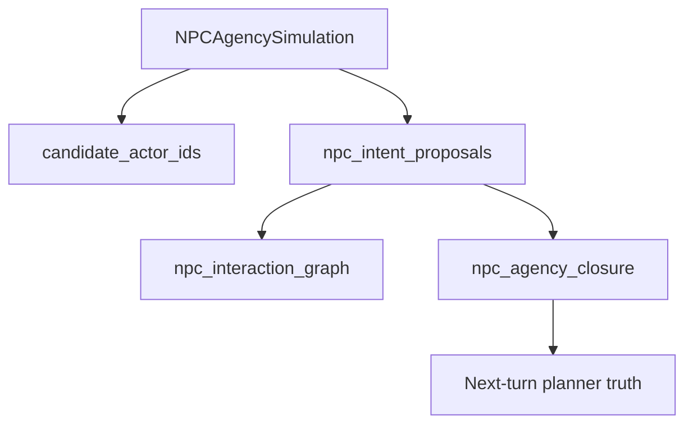

# ADR-MVP3-012: NPC Free Dramatic Agency

**Status**: Accepted
**MVP**: 3 — Live Dramatic Scene Simulator
**Date**: 2026-04-26

## Context

MVP2 established that NPCs are AI-controlled actors and the human actor is protected from AI control. MVP3 must go further: NPCs must have genuine free dramatic agency — the ability to initiate, address each other, react without being prompted, and pursue their own dramatic line within the scene.

A passive NPC that only responds when directly addressed violates the live dramatic scene simulator contract. NPCs must be assertive, autonomous dramatic agents.

## Decision

1. **NPCAgencyPlan** is the initiative contract. LDSS emits an `NPCAgencyPlan` per turn with `primary_responder_id`, `secondary_responder_ids`, and `npc_initiatives` (per-NPC intent, allowed block types, and target actor).

2. **Primary NPC initiative**: The primary responder speaks or acts first. Selection priority: `veronique` → `alain` → `michel` (Véronique is the most dramatically assertive in God of Carnage).

3. **Secondary NPC initiative**: The secondary NPC reacts to the primary NPC or to the scene state. This is NPC-to-NPC interaction — the human actor is not required as a bridge.

4. **No direct address required**: NPCs may speak or act without being addressed by name in the player's input. Player input is dramatic context, not a command prompt.

5. **Responder candidate exclusion**: Human actor and `visitor` are never in the responder candidate set. `validate_responder_candidates()` enforces this.

6. **Multiple NPC participation**: More than one NPC may participate in a single turn (primary + secondary). `NPCAgencyPlan.secondary_responder_ids` lists additional participants.

7. **NPC-to-NPC `target_actor_id`**: A block may target another NPC as its `target_actor_id`. This proves NPC-to-NPC dramatic exchange without human actor mediation.

## Affected Services/Files

- `ai_stack/live_dramatic_scene_simulator.py` — `NPCAgencyPlan`, `NPCInitiative`, `validate_responder_candidates()`, `_select_primary_responder()`, `build_deterministic_ldss_output()`
- `ai_stack/npc_agency_contracts.py` — shared runtime contract normalization for the current `npc_agency_simulation.v1` surface, durable closure constants, human/visitor exclusion, and the internal `npc_agency_plan.v1` adapter.
- `ai_stack/npc_agency_planner.py` — deterministic independent NPC roster planner for `npc_agency_simulation.v1`, including candidate scoring, carry-forward pressure, and NPC-to-NPC target graph projection.
- `ai_stack/npc_agency_realization.py` — shared realization, validation, and durable closure helpers for `npc_initiative_realization_v1`, `npc_initiative_validation_v1`, and `npc_agency_closure.v1`.
- `ai_stack/runtime_aspect_ledger.py` — `npc_agency` runtime aspect projection for candidate, planned, realized, missing, carry-forward, closure, and scoring evidence.
- `ai_stack/story_runtime_playability.py` — recoverable rewrite feedback for missing required NPC initiative without allowing degraded commit to hide it.
- `ai_stack/langgraph_runtime_executor.py` — model-visible current NPC agency simulation projection, bounded initiative directives, validation-aspect wiring, and self-correction trigger surface.
- `ai_stack/actor_survival_telemetry.py` — vitality telemetry projection of candidate, planned, realized, missing, required, and carry-forward NPC initiatives.
- `ai_stack/narrative_runtime_agent.py` — ruhepunkt pressure analysis reads the v1 `npc_initiatives` contract and remains backward-compatible with legacy `initiatives`.
- `world-engine/app/story_runtime/commit_models.py` — persists `npc_agency_simulation`, `npc_agency_closure`, and unresolved carry-forward rows in committed planner truth.
- `world-engine/app/story_runtime/manager.py` — rehydrates carry-forward planner truth and emits Langfuse NPC agency spans and deterministic scores.
- `backend/app/services/operator_turn_history_service.py` — exposes operator-facing NPC agency breakdowns from telemetry, aspect ledger, and committed closure truth.
- `tools/mcp_server/tools_registry_handlers_langfuse_verify.py` — exposes NPC agency deterministic scores and matrix columns through MCP Langfuse verification.
- `tests/gates/test_goc_mvp03_live_dramatic_scene_simulator_gate.py` — `test_mvp3_gate_npcs_act_without_direct_address`, `test_mvp3_gate_multiple_npcs_can_participate`, `test_mvp3_gate_responder_candidates_exclude_human_and_visitor`
- `ai_stack/tests/test_npc_agency_planner.py` — current simulation, independent roster planning, durable carry-forward, and closure coverage.
- `ai_stack/tests/test_npc_agency_contracts.py` — adapter normalization, required realization, NPC-to-NPC target, and human/visitor exclusion coverage for compatibility surfaces.
- `ai_stack/tests/test_narrative_runtime_agent.py` — coverage that `NarrativeRuntimeAgent` consumes v1 `npc_initiatives`.

## Current Implementation Status (Pi7 Runtime Simulation Slice)

As of the 2026-05-14 Pi7 runtime simulation slice, this ADR has a bounded current runtime implementation. The current primary contract is `npc_agency_simulation.v1`; `npc_agency_plan.v1` remains an internal adapter surface for existing realization helpers and compatibility, not the promoted proof target.

Implemented now:

- `npc_agency_simulation.v1` is emitted as the primary LangGraph dramatic packet surface with `contract_status = implemented_runtime_simulation`, `not_full_multi_agent_simulation = false`, and `independent_planning_used = true`.
- The planner derives the candidate NPC roster from actor-lane context, selected responders, mind records, and unresolved prior closure truth rather than relying only on directly selected responders.
- Independent NPC intent proposals include stable actor ids, requirement scopes, target actors, source evidence, and a deterministic interaction graph.
- Human actor aliases and `visitor` are excluded from planned NPC initiative actors.
- `npc_initiative_realization_v1` records planned, realized, missing, required, event-only, and multi-NPC realization fields.
- `npc_initiative_validation_v1` can reject or degrade missing required NPC initiative and forbidden actor participation.
- `npc_agency_closure.v1` persists unresolved required NPC initiatives into committed planner truth and rehydrates them into the next turn.
- Missing required NPC initiative is surfaced through the `npc_agency` runtime aspect and becomes recoverable self-correction feedback; it is not silently accepted as a degraded commit.
- Langfuse/runtime aspect scoring now records NPC agency planning, independent planning, required realization, multi-NPC realization, carry-forward closure, and forbidden-actor absence.
- Operator turn history and MCP Langfuse verification expose candidate, planned, realized, missing, and carry-forward NPC agency fields.
- `NarrativeRuntimeAgent` reads `npc_initiatives` so ruhepunkt pressure is aligned with the v1 contract.

Still not claimed:

- Unbounded per-NPC agent processes, long-horizon private NPC planning, or an LLM swarm.
- Full staging proof across live provider traces, operator workflows, MCP export, and player-facing replay.
- A capability-matrix claim that Π7 is fully implemented rather than a bounded runtime simulation slice.

## Consequences

- NPCs are autonomous dramatic agents, not prompted responders
- Human actor is never in the responder candidate set
- `visitor` is never in the responder candidate set
- Multi-NPC turns are valid and expected when 2+ NPCs are in the session
- Responder selection is traceable in `diagnostics.npc_agency`

## Diagrams

**`NPCAgencySimulation`** derives the NPC roster, picks required initiatives, allows **NPC→NPC** pressure edges, carries unresolved initiatives forward, and never nominates the **human** (or `visitor`) as responder.

## Alternatives Considered

- Single-NPC-per-turn restriction: rejected — limits dramatic richness and prevents NPC-to-NPC exchanges
- Human actor as implicit responder: rejected — violates actor lane enforcement (ADR-MVP2-004)

## Validation Evidence

- `test_mvp3_gate_npcs_act_without_direct_address` — PASS
- `test_mvp3_gate_multiple_npcs_can_participate` — PASS
- `test_mvp3_gate_responder_candidates_exclude_human_and_visitor` — PASS
- `test_mvp3_gate_human_actor_not_generated_as_speaker` — PASS
- `test_mvp3_gate_human_actor_not_generated_as_actor` — PASS
- `pytest ai_stack/tests/test_npc_agency_planner.py ai_stack/tests/test_wave3_multi_actor_vitality.py ai_stack/tests/test_runtime_aspect_ledger.py ai_stack/tests/test_vitality_telemetry_v1.py -q` — PASS (50 passed, local Pi7 runtime simulation slice)
- `PYTHONPATH=.:.. pytest tests/test_planner_truth_and_runtime_surfaces.py tests/test_story_runtime_narrative_threads.py::test_prior_planner_truth_passed_to_graph_from_committed_truth tests/test_trace_middleware.py::test_langfuse_emits_runtime_aspect_spans_and_reasoned_scores -q` — PASS (9 passed, world-engine focused NPC agency closure/scoring slice)
- `PYTHONPATH=/mnt/d/WorldOfShadows pytest tools/mcp_server/tests/test_langfuse_verify_tools.py -q` — PASS (29 passed, MCP Langfuse verify)
- `PYTHONPATH=/mnt/d/WorldOfShadows/backend:/mnt/d/WorldOfShadows pytest backend/tests/test_operator_diagnostics_routes.py -q` — PASS (3 passed, operator diagnostics surface)
- `pytest tests/gates/test_table_b_anti_hardcoding_gate.py -q` — PASS (ADR-0039 guard for non-example-shaped tests)

## Related ADRs

- ADR-MVP2-004 (Actor Lane Enforcement)
- ADR-MVP3-007 (Minimum Agency Baseline Superseded)
- ADR-MVP3-011 (Live Dramatic Scene Simulator Contract)
