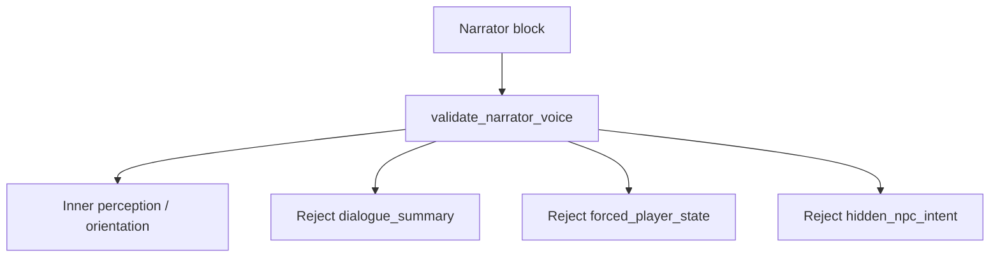

# ADR-MVP3-013: Narrator Inner Voice Contract

**Status**: Accepted
**MVP**: 3 — Live Dramatic Scene Simulator
**Date**: 2026-04-26

## Context

The narrator block type exists in the LDSS scene output. Without a contract, the narrator could degrade into a dialogue summarizer, a state-setter that forces player emotions, or a hidden-intent revealer that undermines dramatic tension.

All three of these uses violate the player experience contract: the narrator must be the player's inner perception and orientation voice — not a recapper, not a puppeteer, and not an oracle.

## Decision

1. **Narrator is inner perception / orientation only.** The narrator block describes what the player character notices, perceives, feels inclined toward, or senses — from the player's point of view. It does not summarize what happened.

2. **Three rejected narrator modes are enforced:**
   - `dialogue_summary`: narrator recaps or summarizes dialogue between characters (e.g., "Véronique and Alain argue while Michel becomes uncomfortable"). Error code: `narrator_dialogue_summary_rejected`.
   - `forced_player_state`: narrator tells the player how they feel or what they decide (e.g., "You decide that Alain is right and feel ashamed"). Error code: `narrator_forces_player_state`.
   - `hidden_npc_intent`: narrator reveals undisclosed NPC internal motivation (e.g., "You can see through Alain's composure; he secretly wants this to end"). Error code: `narrator_reveals_hidden_intent`.

3. **`validate_narrator_voice()`** in `ai_stack/live_dramatic_scene_simulator.py` enforces these rejections using pattern matching. Valid narrator blocks are approved.

4. **Valid narrator example**: "You notice the pause before Alain answers; it feels less like uncertainty than calculation." — This is inner perception, not dialogue recap, not forced state, not hidden intent.

5. **Narrator is optional**: Not every turn requires a narrator block. When narrator blocks are present, they must pass `validate_narrator_voice()`.

## Affected Services/Files

- `ai_stack/live_dramatic_scene_simulator.py` — `validate_narrator_voice()`, `_NARRATOR_DIALOGUE_SUMMARY_PATTERNS`, `_NARRATOR_FORCED_STATE_PATTERNS`, `_NARRATOR_HIDDEN_INTENT_PATTERNS`
- `tests/gates/test_goc_mvp03_live_dramatic_scene_simulator_gate.py` — narrator voice tests

## Consequences

- Narrator cannot degrade into a game-master summarizer
- Player emotional state is always player-controlled, not narrator-assigned
- NPC hidden motivations remain hidden (dramatic tension preserved)
- The deterministic mock produces narrator blocks that always pass validation

## Diagrams

**`validate_narrator_voice`** accepts **inner perception** and rejects **dialogue recap**, **forced player state**, and **hidden NPC intent** modes.

## Alternatives Considered

- No narrator validator: rejected — without validation, narrator degrades to a summarizer within a few turns
- Banning narrator entirely: rejected — inner perception is valuable orientation for the player
- Permitting "light" dialogue summary: rejected — any dialogue summary is a recap, not perception

## Validation Evidence

- `test_narrator_rejects_dialogue_recap` — PASS
- `test_narrator_modal_language_does_not_force_player_state` — PASS
- `test_narrator_cannot_reveal_hidden_npc_intent` — PASS
- `test_valid_narrator_inner_perception` — PASS
- `test_mvp3_gate_fallback_output_satisfies_validation` — PASS (narrator blocks in fallback pass validation)

## Related ADRs

- ADR-MVP3-011 (Live Dramatic Scene Simulator Contract)
- ADR-MVP3-012 (NPC Free Dramatic Agency)
