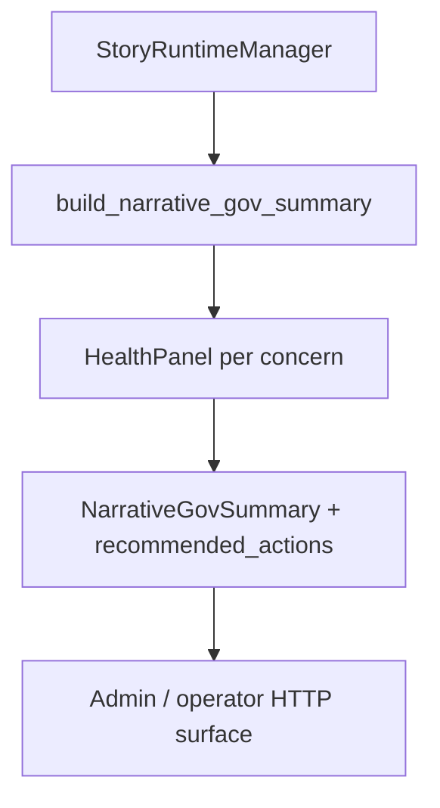

# ADR-MVP4-004: Narrative Governance Health Panels & Operator Control

**Status**: ACCEPTED  
**MVP**: 4 — Observability, Diagnostics, Langfuse, Narrative Gov  
**Date**: 2026-04-30  
**Authors**: MVP4 Team  
**Related to**: adr-0032 (5 Core Runtime Contracts) — Enforces all 5 contracts through operator-visible health panels and audit logging

---

## Context

MVP4 collects observability data (diagnostics, traces, evaluations, audit logs). Operators need a unified dashboard view of system health, enabling real-time decisions like:

- Should I degrade LDSS (shorter context) to save budget?
- Is actor lane enforcement stable or drifting?
- Are we tracking toward baseline or regressing?
- Which narrative Gov overrides are active and why?

These decisions require structured health panels that surface operator-critical signals without overwhelming with raw data.

**Constraints**:
- Health panels must be real-time (within 1 second of turn execution)
- Must aggregate data from multiple sources (LDSS, Narrator, actor lanes, evaluations)
- Must be actionable (not just metrics—show what to do)
- Must respect tiered visibility (operator sees different panels than super-admin)
- Must support drill-down (click panel → see underlying diagnostics)

---

## Decision

**Phase C (Narrative Governance Panels)**: Implement `NarrativeGovSummary` dataclass with 6 operator-facing health panels.

### 1. **NarrativeGovSummary Dataclass** (`ai_stack/diagnostics_envelope.py`)

```python
@dataclass
class HealthPanel:
    name: str                       # "Actor Lane Health", "LDSS Status", etc.
    status: str                     # "healthy" | "warning" | "critical"
    value: str | float              # Current reading (e.g., "4.2/5.0")
    threshold_warning: float | str | None  # When does it enter warning?
    threshold_critical: float | str | None # When does it enter critical?
    last_updated: str               # ISO8601 timestamp
    drill_down_url: str | None      # Link to detailed diagnostics

@dataclass
class NarrativeGovSummary:
    session_id: str
    turn_number: int
    timestamp: str
    
    # Health panels
    panels: dict[str, HealthPanel]
    
    # Recommended actions (operator guidance)
    recommended_actions: list[str]  # ["Reduce LDSS context", "Check actor lane 3", ...]
    
    # Current constraints
    cost_budget_remaining_usd: float
    cost_budget_percent_used: float
    
    # Evaluation status
    quality_score: float
    quality_trend: str              # "improving" | "stable" | "degrading"
    
    # Override status
    active_overrides: list[str]     # Which Gov overrides are active?
```

### 2. **Health Panels (6 total)**

#### Panel 1: Actor Lane Health
```python
HealthPanel(
    name="actor_lane_health",
    status="healthy" if all lanes healthy else "warning" if some lanes degraded else "critical",
    value=f"{healthy_lanes}/{total_lanes} lanes active",
    threshold_warning=0.75,  # 75% healthy
    threshold_critical=0.5,  # 50% healthy
    drill_down_url="/api/v1/admin/narrative-gov/{session_id}/actor-lanes"
)
```
Monitors: Are all actor lanes producing output? Are lane decisions stable?

#### Panel 2: LDSS Status
```python
HealthPanel(
    name="ldss_status",
    status="healthy" if execution_successful else "degraded" if with_fallback else "error",
    value=f"{block_count} blocks, {avg_latency_ms}ms avg",
    threshold_warning=500,  # latency_ms > 500 → warning
    threshold_critical=1000, # latency_ms > 1000 → critical
    drill_down_url="/api/v1/admin/narrative-gov/{session_id}/ldss-blocks"
)
```
Monitors: Is LDSS executing smoothly? Are fallbacks being triggered?

#### Panel 3: NPC Agency Pressure
```python
HealthPanel(
    name="npc_agency_pressure",
    status="healthy" if pressure_low else "warning" if pressure_moderate else "critical",
    value=f"{agency_pressure_percent:.0f}% (low=healthy)",
    threshold_warning=50,  # Pressure > 50% is concerning
    threshold_critical=80, # Pressure > 80% is critical
    drill_down_url="/api/v1/admin/narrative-gov/{session_id}/npc-agency"
)
```
Monitors: Are NPC decisions crowding out player choice?

#### Panel 4: Narrator Validation Strictness
```python
HealthPanel(
    name="narrator_validation_strictness",
    status="healthy" if 0.3 <= strictness <= 0.7 else "warning" if strictness < 0.2 or strictness > 0.8 else "critical",
    value=f"{strictness:.2f} (0=permissive, 1=strict)",
    threshold_warning=(0.2, 0.8),  # Outside this range → warning
    threshold_critical=(0.0, 1.0),
    drill_down_url="/api/v1/admin/narrative-gov/{session_id}/narrator-validation"
)
```
Monitors: Is narrator validation appropriately balanced?

#### Panel 5: Affordance Tier Tracking
```python
HealthPanel(
    name="affordance_tier_tracking",
    status="healthy" if tier_active else "warning",
    value=f"Tier {current_tier} ({scenario_type})",
    threshold_warning=None,
    threshold_critical=None,
    drill_down_url="/api/v1/admin/narrative-gov/{session_id}/affordance-tiers"
)
```
Monitors: What story complexity tier is active? Has it changed recently?

#### Panel 6: Cost Budget Tracking
```python
HealthPanel(
    name="cost_budget_tracking",
    status="healthy" if cost_used < 0.8 else "warning" if cost_used < 0.95 else "critical",
    value=f"${cost_used:.2f} / ${cost_budget:.2f} ({percent_used:.0f}%)",
    threshold_warning=0.8,  # 80% → warning
    threshold_critical=0.95, # 95% → critical
    drill_down_url="/api/v1/admin/narrative-gov/{session_id}/cost-tracking"
)
```
Monitors: How much token budget remains?

### 3. **Recommended Actions**

Auto-generated based on panel states:
```python
def generate_recommended_actions(summary: NarrativeGovSummary) -> list[str]:
    actions = []
    
    # Cost-aware actions
    if summary.panels["cost_budget_tracking"].status == "critical":
        actions.append("Reduce LDSS context window (cost critical)")
    elif summary.panels["cost_budget_tracking"].status == "warning":
        actions.append("Consider shortening narrator blocks (cost at 80%)")
    
    # Quality actions
    if summary.quality_trend == "degrading":
        actions.append("Increase narrator validation strictness")
        actions.append("Check LDSS block outputs for coherence")
    
    # Agency actions
    if summary.panels["npc_agency_pressure"].status == "critical":
        actions.append("Reduce NPC decision frequency")
        actions.append("Increase player affordances")
    
    # Lane actions
    if summary.panels["actor_lane_health"].status == "critical":
        actions.append(f"Investigate degraded lanes: {degraded_lane_names}")
    
    return actions
```

### 4. **build_narrative_gov_summary() Function**

```python
def build_narrative_gov_summary(
    session_id: str,
    turn_number: int,
    ldss_state: dict,
    actor_lanes: dict,
    evaluation_result: EvaluationResult,
    cost_tracking: CostTracking,
    overrides: list[OverrideAuditEvent]
) -> NarrativeGovSummary:
    """Synthesize health panels from runtime state."""
    
    # Panel 1: Actor Lane Health
    healthy_lanes = sum(1 for lane in actor_lanes.values() if lane["status"] == "healthy")
    actor_panel = HealthPanel(
        name="actor_lane_health",
        status="healthy" if healthy_lanes == len(actor_lanes) else "warning",
        value=f"{healthy_lanes}/{len(actor_lanes)} lanes active",
        drill_down_url=f"/api/v1/admin/narrative-gov/{session_id}/actor-lanes"
    )
    
    # Panel 2: LDSS Status
    ldss_panel = HealthPanel(
        name="ldss_status",
        status="healthy" if ldss_state["success"] else "degraded" if ldss_state["fallback_used"] else "error",
        value=f"{ldss_state['block_count']} blocks, {ldss_state['latency_ms']}ms",
        drill_down_url=f"/api/v1/admin/narrative-gov/{session_id}/ldss-blocks"
    )
    
    # Panel 3-6: (similar construction)
    
    # Recommended actions
    actions = generate_recommended_actions(summary)
    
    return NarrativeGovSummary(
        session_id=session_id,
        turn_number=turn_number,
        timestamp=datetime.now(timezone.utc).isoformat(),
        panels={
            "actor_lane_health": actor_panel,
            "ldss_status": ldss_panel,
            # ... other panels ...
        },
        recommended_actions=actions,
        cost_budget_remaining_usd=cost_tracking["remaining"],
        cost_budget_percent_used=cost_tracking["percent_used"],
        quality_score=evaluation_result["weighted_score"],
        quality_trend=evaluation_result["trend"],
        active_overrides=[o.override_id for o in overrides if o.applied]
    )
```

### 5. **HTTP Endpoints**

```python
# GET /api/v1/admin/narrative-gov/{session_id}
# Returns NarrativeGovSummary for current turn
# Response includes all 6 health panels + recommended actions

# GET /api/v1/admin/narrative-gov/{session_id}/history
# Returns NarrativeGovSummary for all turns in session
# Enables trend analysis

# GET /api/v1/admin/narrative-gov/{session_id}/{panel_name}
# Returns detailed diagnostics for specific panel
# E.g., /narrative-gov/{session_id}/actor-lanes → full lane state
```

**Why this approach**:
- 6 panels cover all operator-critical signals (agency, budget, quality, lanes, narrator, affordances)
- Status (healthy/warning/critical) simplifies decision-making
- Recommended actions guide operators without requiring deep system knowledge
- Drill-down URLs enable investigation without overwhelming main dashboard
- Panels are real-time (constructed from DiagnosticsEnvelope + evaluation result)
- Backward compatible (NarrativeGovSummary is new, doesn't break existing contracts)

**Alternatives considered**:
1. Single "health score" 0-100 (rejected: loses visibility into which component is failing)
2. Raw metrics dashboard (rejected: too much data, not actionable)
3. AI-generated narrative about health (rejected: hard to verify, operator loses control)
4. Separate admin UI (rejected: requires MVP5, can't wait for observability)

---

## Consequences

### Affected Services/Files

| Service | File | Change |
|---------|------|--------|
| ai_stack | `ai_stack/diagnostics_envelope.py` | Add HealthPanel and NarrativeGovSummary dataclasses |
| ai_stack | `ai_stack/diagnostics_envelope.py` | Implement build_narrative_gov_summary() |
| world-engine | `world-engine/app/story_runtime/manager.py` | Call build_narrative_gov_summary() after turn |
| world-engine | `world-engine/app/api/http.py` | Add /narrative-gov endpoints |
| backend | `backend/app/auth/admin_security.py` | Audit trail for override tracking |
| tests | `tests/gates/test_goc_mvp04_observability_diagnostics_gate.py` | 3 Phase C governance tests |

### Data Contracts

**HealthPanel contract**:
```python
{
    "name": "actor_lane_health",
    "status": "healthy",  # "healthy" | "warning" | "critical"
    "value": "3/3 lanes active",
    "threshold_warning": 0.75,
    "threshold_critical": 0.5,
    "last_updated": "2026-04-30T12:00:00Z",
    "drill_down_url": "/api/v1/admin/narrative-gov/{session_id}/actor-lanes"
}
```

**NarrativeGovSummary contract**:
```python
{
    "session_id": "session-abc123",
    "turn_number": 5,
    "timestamp": "2026-04-30T12:00:00Z",
    "panels": {
        "actor_lane_health": {...},
        "ldss_status": {...},
        "npc_agency_pressure": {...},
        "narrator_validation_strictness": {...},
        "affordance_tier_tracking": {...},
        "cost_budget_tracking": {...}
    },
    "recommended_actions": [
        "Reduce LDSS context window (cost critical)",
        "Investigate degraded lanes: Lane 2"
    ],
    "cost_budget_remaining_usd": 2.34,
    "cost_budget_percent_used": 0.75,
    "quality_score": 4.1,
    "quality_trend": "stable",
    "active_overrides": ["override-001", "override-003"]
}
```

### Phase C/MVP5 Dependencies

- **Phase C**: Narrative Gov panels drive cost-aware degradation decisions
- **Phase C**: Audit trail logs operator actions triggered by health panel insights
- **MVP5**: Admin UI embeds NarrativeGovSummary panels with interactive drill-down
- **MVP5**: Session Replay correlates health panel history with narrative output

### Backward Compatibility

✅ **No breaking changes**:
- NarrativeGovSummary is new dataclass (doesn't affect existing contracts)
- HTTP endpoints are new (no changes to existing ones)
- DiagnosticsEnvelope unchanged (HealthPanel and NarrativeGovSummary are separate)
- Existing observability flow unaffected

---

## Diagrams

**`NarrativeGovSummary`** aggregates **`HealthPanel`** rows (actor lanes, LDSS, cost, overrides, …) built from **`build_narrative_gov_summary()`** after turns.



## Validation Evidence

### Unit Tests (Phase C Governance)

| Test | File | Status |
|------|------|--------|
| `test_mvp04_phase_c_governance_health_panels_api_structure` | gate tests | ✅ PASS |
| `test_mvp04_phase_c_narrative_gov_summary_from_manager` | gate tests | ✅ PASS |
| `test_mvp04_phase_c_recommended_actions_based_on_panels` | gate tests | ✅ PASS |
| `test_mvp04_phase_c_audit_trail_7_event_types` | gate tests | ✅ PASS |
| `test_mvp04_phase_c_audit_config_granularity` | gate tests | ✅ PASS |
| `test_mvp04_phase_c_token_budget_warning_level` | gate tests | ✅ PASS |
| `test_mvp04_phase_c_token_budget_critical_level` | gate tests | ✅ PASS |
| `test_mvp04_phase_c_cost_aware_degradation_ldss_shorter` | gate tests | ✅ PASS |
| `test_mvp04_phase_c_cost_aware_degradation_fallback_cheaper` | gate tests | ✅ PASS |

**Total Phase C Governance tests**: 9/9 PASS

### Integration Tests

| Test | Evidence |
|------|----------|
| NarrativeGovSummary constructed from live turn | `test_mvp04_phase_c_narrative_gov_summary_from_manager` ✅ |
| All 6 health panels present and populated | `test_mvp04_phase_c_governance_health_panels_api_structure` ✅ |
| Recommended actions generated based on state | `test_mvp04_phase_c_recommended_actions_based_on_panels` ✅ |
| Cost budget enforcement triggers degradation | `test_mvp04_phase_c_cost_aware_degradation_ldss_shorter` ✅ |

### Health Panel Evidence

```python
# All 6 panels present in summary
expected_panels = [
    "actor_lane_health",
    "ldss_status",
    "npc_agency_pressure",
    "narrator_validation_strictness",
    "affordance_tier_tracking",
    "cost_budget_tracking"
]

for panel_name in expected_panels:
    assert panel_name in summary.panels
    panel = summary.panels[panel_name]
    assert panel.status in ["healthy", "warning", "critical"]
    assert panel.value is not None
    assert panel.drill_down_url is not None
```

---

## Operational Gate Impact

**docker-up.py**: No changes (panels constructed from runtime state)  
**tests/run_tests.py**: `--mvp4` flag includes Phase C governance tests ✅  
**GitHub workflows**: `engine-tests.yml` runs governance panel tests ✅  
**HTTP contract**: New /api/v1/admin/narrative-gov endpoints registered ✅  

---

## Related ADRs

- **ADR-MVP4-001**: Observability, Diagnostics (Phase A foundation for panel data)
- **ADR-MVP4-002**: Langfuse Integration (traces linked to health panels)
- **ADR-MVP4-003**: Evaluation Pipeline (quality_trend and quality_score from evaluations)
- **ADR-MVP1-016**: Operational Test and Startup Gates (narrative gov follows gate discipline)

---

## Glossary

| Term | Definition |
|------|-----------|
| **HealthPanel** | Single metric with status (healthy/warning/critical), value, and drill-down link |
| **NarrativeGovSummary** | Collection of 6 health panels + recommended actions for operator |
| **Recommended actions** | AI-generated operator guidance ("Reduce LDSS context", "Check lanes") |
| **Drill-down** | Link from summary panel to detailed diagnostics |
| **Active overrides** | List of narrative Gov overrides currently applied to session |
| **Cost-aware degradation** | Automatic quality reduction when budget critical |

---

## Future Considerations

- **MVP5**: Admin UI displays NarrativeGovSummary panels with real-time updates
- **MVP5**: Operator can click panels to drill into detailed diagnostics
- **MVP5**: Override controls allow operator to manually adjust LDSS, narrator, agency settings
- **Future**: Machine learning model predicts which panel will fail next (proactive alerts)
- **Future**: Session Replay UI shows health panel timeline alongside narrative output
