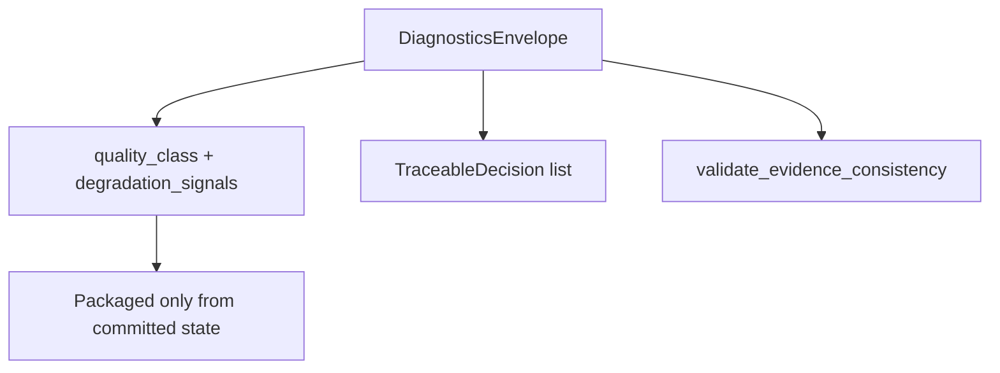

# ADR-MVP4-008: Diagnostics and Degradation Semantics

**Status**: Accepted
**MVP**: 4 — Observability, Diagnostics, Langfuse, and Narrative Gov
**Date**: 2026-04-26
**Related to**: adr-0032 (5 Core Runtime Contracts) — Implements Contract 4 (Diagnostics Truthfulness)

## Context

Prior to MVP4, the runtime produced quality_class and degradation_signals in internal graph state, but this was not surfaced in a standardized, operator-readable diagnostic contract. Operators could not tell from a turn response whether the output was normal, degraded, failed, or mock/static.

MVP4 introduces the DiagnosticsEnvelope contract to make quality and degradation evidence explicit and non-placeholder.

## Decision

1. **DiagnosticsEnvelope** is the canonical per-turn diagnostic surface. Contract: `diagnostics_envelope.v1`.

2. **Four quality outcomes** are defined:
   - `ok` / `normal` — canonical quality, no degradation
   - `ok_with_degradation` / `degraded` — committed but with known degradation signals
   - `failed` — validation rejected, commit not applied
   - `mock_static_invalid` — static fixture or placeholder; cannot be accepted as final proof

3. **Degraded output requires reasons**: If `quality_class == "degraded"`, `degradation_signals` must be non-empty. An empty degradation_signals list with degraded quality is rejected with `degraded_output_missing_reasons`.

4. **Validation before evidence claim**: `validate_evidence_consistency()` accepts LDSS proof statuses from the active runtime path: `"approved"` for direct canonical-step LDSS envelopes and `"evidenced_live_path"` for higher-level story-manager evidence projection. The validator also requires no LDSS error, `decision_count > 0`, and `scene_block_count > 0`. An envelope with only static success-looking fields and zero counts fails with `diagnostics_missing_evidence`; an unsupported or errored LDSS status fails with `diagnostics_missing_ldss_proof`.

5. **Response packaging is committed-state only**: `response_packaged_from_committed_state = True` is always set. Diagnostics never claim AI proposals as committed truth.

6. **TraceableDecision** records each runtime decision (responder plan, actor-lane validation, dramatic validation, commit) with `decision_id`, `status`, `input_refs`, `rejected_reasons`.

## Affected Services/Files

- `ai_stack/telemetry/diagnostics_envelope.py` — `DiagnosticsEnvelope`, `validate_evidence_consistency()`, `build_diagnostics_envelope()`
- `world-engine/app/story_runtime/manager/` — `_finalize_committed_turn` adds `diagnostics_envelope` to event
- `tests/gates/test_goc_mvp04_observability_diagnostics_gate.py` — gate tests
- `tests/gates/we_contract_helpers.py` — behavioral integration oracle for the world-engine diagnostics test

## Consequences

- Every GoC solo turn produces a structured, non-placeholder DiagnosticsEnvelope
- Operators can tell exactly what happened: validation status, commit result, quality class, degradation signals
- Static fields claiming success without evidence are rejected by the validator
- Direct canonical-step LDSS diagnostics can remain truthful as `"approved"` while still satisfying diagnostics evidence consistency; the story manager may expose the same successful path as `"evidenced_live_path"` for operator-level summaries
- The world-engine execute-turn integration oracle allows slow local backend bootstrap while still failing with an explicit timeout diagnostic if the behavioral proof stalls

## Diagrams

**`DiagnosticsEnvelope.v1`** exposes **quality_class** (ok / degraded / failed / mock_static_invalid), mandatory **degradation reasons**, **`TraceableDecision`** records, and **evidence consistency** checks.

## Alternatives Considered

- Extending the existing `runtime_governance_surface` dict: rejected — untyped, not consumer-ready for MVP5
- Adding diagnostics only to logs: rejected — operators need structured API response, not log scraping

## Validation Evidence

- `test_mvp04_annette_turn_produces_diagnostics_envelope` — PASS
- `test_mvp04_alain_turn_produces_diagnostics_envelope` — PASS
- `test_mvp04_response_packaging_uses_committed_state` — PASS
- `test_mvp04_narrative_gov_treats_direct_approved_ldss_as_evidenced` — PASS
- `test_mvp04_rejects_false_green_static_field_presence` — PASS
- `test_mvp04_degraded_output_diagnostics_include_reasons` — PASS
- `test_mvp04_diagnostics_include_commit_result` — PASS
