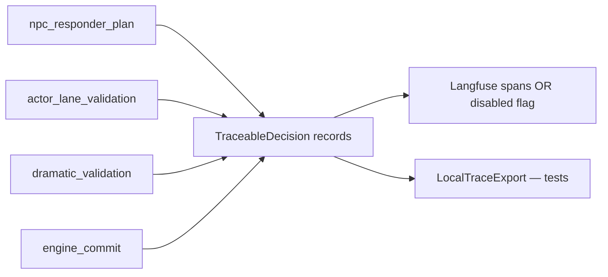

# ADR-MVP4-009: Langfuse and Traceable Decisions

**Status**: Accepted
**MVP**: 4 — Observability, Diagnostics, Langfuse, and Narrative Gov
**Date**: 2026-04-26
**Related to**: adr-0032 (5 Core Runtime Contracts) — Enables trace correlation for all contracts, particularly Contract 4 (Diagnostics Truthfulness)

## Context

The live runtime makes multiple decisions per turn (responder plan, actor-lane validation, dramatic validation, commit). These decisions were not individually traceable. Operators had no way to correlate a turn response with a specific Langfuse trace or to inspect per-decision outcomes.

## Decision

1. **TraceableDecision** records each turn decision with `decision_id`, `decision_type`, `story_session_id`, `turn_number`, `status`, `trace_span_name`, `input_refs`, `selected_output_ref`, `rejected_reasons`.

2. **Decision types**: `npc_responder_plan`, `actor_lane_validation`, `dramatic_validation`, `engine_commit`.

3. **Langfuse is optional and disabled by default**. When disabled, `langfuse_status = "disabled"` is reported. The system never claims trace success when Langfuse is unconfigured.

4. **LocalTraceExport** is the test-friendly alternative to Langfuse. It is always generated by real test execution (not a static fixture). Contract: `langfuse_real_trace_evidence.v1`. `static_fixture = False` must be enforced. If `static_fixture = True`, the trace fails validation with `langfuse_mock_only_trace_not_final`.

5. **Trace ID correlation**: `trace_id` from the HTTP request header appears in `DiagnosticsEnvelope.trace_id`. This allows log/trace/diagnostics correlation without Langfuse.

6. **Secret redaction**: `redact_secrets()` removes any value whose key contains `secret`, `key`, `token`, `password`, `credential`, `auth`, `api_key`, `private`, `passphrase`, `access_token`.

7. **Span names**: Each TraceableDecision has a `trace_span_name` matching the Langfuse span hierarchy: `live_dramatic_scene_simulator.responder_plan`, `actor_lane_validation`, `dramatic_validation`, `commit_seam`.

## Affected Services/Files

- `ai_stack/diagnostics_envelope.py` — `TraceableDecision`, `LocalTraceExport`, `build_traceable_decisions()`, `build_local_trace_export()`, `redact_secrets()`
- `backend/app/observability/langfuse_adapter.py` — pre-existing Langfuse adapter (unchanged)
- `backend/app/observability/trace.py` — trace_id context var (unchanged)

## Consequences

- Every turn has traceable per-decision records
- Langfuse disabled mode is safe and explicit (no false success)
- Test environments can prove the trace contract without Langfuse credentials
- Secrets are never in diagnostics or trace exports

## Diagrams

Each seam emits **`TraceableDecision`** rows; **Langfuse optional** (explicit disabled), **`LocalTraceExport`** proves traces in CI, **`redact_secrets`** on exports.

## Validation Evidence

- `test_mvp04_langfuse_trace_created_when_enabled` — PASS
- `test_mvp04_langfuse_disabled_does_not_claim_success` — PASS
- `test_mvp04_trace_id_correlates_runtime_diagnostics_and_logs` — PASS
- `test_mvp04_ai_human_actor_violation_is_traced_as_rejected` — PASS
- `test_mvp04_secrets_are_redacted_from_diagnostics_and_traces` — PASS
- `test_mvp04_fallback_path_is_traced` — PASS
