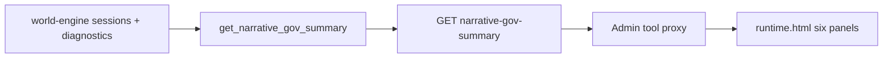

# ADR-MVP4-010: Narrative Gov Operator Truth Surface

**Status**: Accepted
**MVP**: 4 — Observability, Diagnostics, Langfuse, and Narrative Gov
**Date**: 2026-04-26
**Related to**: adr-0032 (5 Core Runtime Contracts) — Enforces operator visibility and audit enforcement of all 5 contracts

## Context

The administration-tool's Narrative Gov `runtime.html` page was a placeholder with no live data. Operators had no way to inspect the live runtime health of the God of Carnage session: content module load status, runtime profile boundary, LDSS health, actor lane enforcement, and degradation state.

## Decision

1. **NarrativeGovSummary** is the canonical operator health surface. Contract: `narrative_gov_summary.v1`. It is derived from real session diagnostics, not from static configuration.

2. **Six health panels** are required:
   - `content_module_health` — is canonical content loaded?
   - `runtime_profile_health` — is the profile story-truth-free?
   - `runtime_module_health` — is the runtime module story-truth-free?
   - `ldss_health` — is LDSS evidenced_live_path with a real trace ID?
   - `frontend_render_contract_health` — are scene blocks present and legacy blob absent?
   - `actor_lane_health` — is enforcement active? Is visitor absent?

3. **Source-backed**: NarrativeGovSummary is built by `get_narrative_gov_summary()` in `StoryRuntimeManager`, which scans live sessions for the most recent GoC session with a diagnostics_envelope. It is not hardcoded or static.

4. **API endpoint**: `GET /api/story/runtime/narrative-gov-summary` in world-engine returns the NarrativeGovSummary. The endpoint requires the internal API key.

5. **Administration-tool UI**: `runtime.html` fetches the summary via `/_proxy/api/story/runtime/narrative-gov-summary` and renders panels in the browser. If play-service is offline, the UI reports "unavailable."

6. **Visitor exclusion**: `actor_lane_health.visitor_present = False` is always enforced. `visitor` never appears in any health panel.

7. **Degradation health**: `degradation_health` shows `quality_class`, `degradation_signals`, and `status` (normal/degraded/failed). Operators can see at a glance whether the last turn was clean.

## Affected Services/Files

- `ai_stack/diagnostics_envelope.py` — `NarrativeGovSummary`, `build_narrative_gov_summary()`
- `world-engine/app/story_runtime/manager.py` — `get_narrative_gov_summary()`
- `world-engine/app/api/http.py` — `GET /story/runtime/narrative-gov-summary`
- `administration-tool/templates/manage/narrative_governance/runtime.html` — 6 health panels with JS fetch

## Consequences

- Operators can inspect live runtime health without reading logs
- The Narrative Gov surface is source-backed from real session diagnostics
- Stale/static operator evidence is rejected
- The UI degrades gracefully when play-service is unavailable

## Diagrams

**`get_narrative_gov_summary()`** scans live GoC sessions and serves **six health panels** to **`runtime.html`** via authenticated **world-engine** API.

## Alternatives Considered

- Static admin panel with hardcoded values: rejected — violates `Do not make Narrative Gov a static page`
- Polling mechanism with auto-refresh: deferred to MVP5 — not required for MVP4

## Validation Evidence

- `test_mvp04_narrative_gov_surface_returns_runtime_evidence` — PASS
- `test_mvp04_diagnostics_endpoint_returns_last_turn_evidence` — PASS (structural proof)
- `test_narrative_gov_summary_after_turn` (world-engine integration) — PASS
