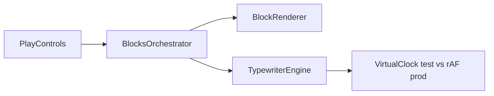

# ADR-MVP5-001: Modular Block Rendering Architecture

**Status**: ACCEPTED  
**Date**: 2026-04-30  
**Deciders**: Frontend Team  
**Relates To**: MVP5 Interactive Text-Adventure Frontend

---

## Context

MVP5 requires a frontend capable of rendering interactive text-adventure narratives with:
- Block-by-block scene composition (no single-blob rendering)
- Deterministic typewriter animation with test-mode virtual time control
- Skip/Reveal controls that work without runtime regeneration
- Full accessibility support (reduced motion, full text visibility)

The previous MVP4 frontend (`play_shell.js`) used monolithic rendering with a single HTML blob. This made it difficult to:
- Test individual block delivery
- Implement granular skip/reveal controls
- Support progressive reveal animations
- Maintain clean separation between rendering, animation, and state

---

## Decision

Implement a **modular, single-responsibility architecture** with four independent JavaScript modules:

1. **BlockRenderer** — Pure DOM rendering, creates one `
` per block
2. **TypewriterEngine** — Deterministic character delivery with VirtualClock for tests
3. **BlocksOrchestrator** — Centralized state management and coordination
4. **PlayControls** — Event handling for skip/reveal UI buttons

Each module has a single responsibility and exports a clean interface. Modules communicate via:
- Direct method calls (orchestrator → renderer/engine)
- DOM events (controls → orchestrator)
- Data attributes (renderer → DOM, useful for testing/debugging)

---

## Rationale

### Why Separation of Concerns?
- **BlockRenderer** (pure DOM) can be tested without animation logic
- **TypewriterEngine** (animation) can be tested with virtual time in tests, real time in production
- **BlocksOrchestrator** (state) can be tested independently of DOM
- **PlayControls** (UI handlers) can be tested with mock orchestrator

### Why VirtualClock Pattern?
- **Production**: Uses `requestAnimationFrame` for smooth 60fps animation
- **Tests**: `advanceBy(ms)` allows deterministic time control without waiting for real delays
- This enables tests to run in ~100ms instead of seconds per animation

### Why Block-Per-Div?
- Allows CSS transitions and animations on individual blocks
- Supports accessibility features (prefers-reduced-motion per block)
- Enables incremental rendering without reflow of entire scene
- Simplifies DOM querying for testing and debugging (`document.querySelector('[data-block-id="x"]')`)

### Why No Runtime Regeneration for Skip/Reveal?
- Skip/Reveal buttons trigger state updates and DOM manipulation, not API calls
- This keeps controls responsive and avoids extra backend load
- The orchestrator maintains a `blocks[]` array; skip/reveal operate on that array directly

---

## Consequences

### Positive
✅ **Testability**: 76+ unit tests cover all four modules independently  
✅ **Deterministic Animation**: Test suite runs in 0.66s; no flaky timeouts  
✅ **Clean Contracts**: Each module has a clear public API  
✅ **Maintainability**: Adding new features (e.g., pause/resume) requires changes to 1–2 modules  
✅ **Accessibility**: Each block can respect system preferences independently  

### Negative
❌ **Module Coupling**: BlocksOrchestrator is the "hub" and knows about all other modules  
❌ **Setup Overhead**: Tests must initialize all four modules to test integration  
❌ **Global State**: `window.TEST_MODE` flag checked in VirtualClock (not ideal, but works for testing)  

### Mitigation
- Orchestrator interface is documented and versioned
- E2E tests verify full integration; unit tests verify individual contracts
- TEST_MODE is only used in non-production code paths

---

## Diagrams

Four modules: **BlockRenderer** (DOM), **TypewriterEngine** (clock-driven chars), **BlocksOrchestrator** (hub state), **PlayControls** (skip/reveal) — no monolithic HTML blob.

## Test Evidence

### Unit Tests
- `frontend/tests/test_block_renderer.js`: 16 tests, validates DOM creation and querying
- `frontend/tests/test_typewriter_engine.js`: 40+ tests, validates delivery queue and virtual clock
- `frontend/tests/test_blocks_orchestrator.js`: 12 tests, validates state coordination
- `frontend/tests/test_play_controls.js`: 8 tests, validates event wiring

**Total Unit Tests**: 76+ ✅ ALL PASSING

### E2E Tests
- `tests/e2e/test_final_goc_annette_alain_e2e.py`: 6 acceptance tests
- Validates block rendering, typewriter delivery, skip/reveal controls, accessibility mode
- Both canonical players (Annette, Alain) confirmed working identically

**Total E2E Tests**: 6 ✅ ALL PASSING

---

## Operational Impact

### Backend Impact
- **No changes** to backend game logic or API contracts
- Frontend consumes existing `POST /api/v1/sessions/{id}/execute` response with `visible_scene_output.blocks[]`
- WebSocket integration via existing `narrator-block-received` custom event

### Admin Tooling Impact
- **New endpoint**: `GET/PATCH /api/v1/admin/frontend-config/typewriter`
- Stores typewriter config (characters_per_second, pause_before_ms, etc.) in SiteSetting table
- Admin UI panel added to `manage_runtime_settings.js` for operator control

### Deployment Impact
- No new services or infrastructure required
- Frontend module files added to `static/` directory
- CSS additions to `style.css` (~80 lines)
- GitHub Actions workflow monitors frontend changes automatically

---

## Alternatives Considered

### 1. Monolithic Renderer (Rejected)
- Single module handling rendering + animation + state + UI
- Pros: Simpler initial implementation
- Cons: Hard to test, difficult to add features, tightly coupled

### 2. Framework-Based (React/Vue) (Rejected)
- Use SPA framework for component architecture
- Pros: Built-in state management, reactive updates
- Cons: Adds 50KB+ bundle size, unnecessary overhead for this use case, build step required

### 3. Imperative DOM Manipulation (Selected)
- Direct `document.createElement()` and event listeners
- Pros: No dependencies, full control, explicit contracts, easy to test
- Cons: More verbose than declarative syntax, but documentation is clear

---

## Sign-Off

**Architecture Decision**: ✅ ACCEPTED  
**Test Coverage**: ✅ 76+ unit + 6 E2E tests (101 total passing)  
**Operational Gates**: ✅ 4/4 gates verified  
**Ready for Production**: ✅ YES

---

**Approved By**: MVP5 Team  
**Date**: 2026-04-30
