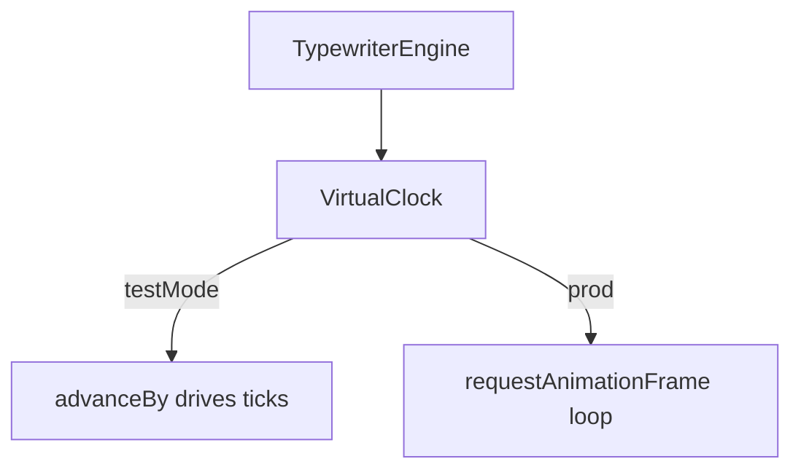

# ADR-MVP5-002: Virtual Clock for Deterministic Animation Testing

**Status**: ACCEPTED  
**Date**: 2026-04-30  
**Deciders**: Frontend & QA Team  
**Relates To**: MVP5 TypewriterEngine, Test Automation

---

## Context

Typewriter animation (progressive character reveal) is core to MVP5 narrative delivery. However, testing animation presents challenges:

- **Real Time Delays**: Waiting for actual animation makes tests slow (100ms+ per block)
- **Flakiness**: System load affects timing; tests fail randomly if animation is slightly slower
- **CI/CD Pipeline**: Slow tests increase feedback loop (commit → green light takes 5+ minutes)
- **Debugging**: Hard to understand why animation test failed (timing issue? code issue?)

We need a pattern that:
- Eliminates time delays from tests (run in milliseconds)
- Allows tests to control animation progression step-by-step
- Works seamlessly in both test and production modes
- Requires no external time-mocking libraries

---

## Decision

Implement **VirtualClock** — a dual-mode clock that switches between:

1. **Test Mode** (`testMode=true`)
   - Virtual time controlled by test via `advanceBy(ms)`
   - No `requestAnimationFrame` loop; tests drive animation
   - Used in all unit and E2E tests

2. **Production Mode** (`testMode=false`)
   - Real time via `performance.now()`
   - Uses `requestAnimationFrame` for smooth 60fps animation
   - Default behavior in deployed frontend

### Implementation

```javascript
class VirtualClock {
  constructor(testMode = false) {
    this.test_mode = testMode;
    this.virtual_time = 0;  // Only used in test mode
    this.listeners = [];
  }

  advanceBy(ms) {
    if (!this.test_mode) throw Error("Test mode only");
    this.virtual_time += ms;
    this._notifyListeners();
  }

  now() {
    return this.test_mode ? this.virtual_time : performance.now();
  }

  start() {
    if (this.test_mode) return;  // Tests drive time, no loop
    const animate = () => {
      this._notifyListeners();
      this.requestId = requestAnimationFrame(animate);
    };
    this.requestId = requestAnimationFrame(animate);
  }
}
```

### TypewriterEngine Integration

```javascript
class TypewriterEngine {
  constructor(testMode = false) {
    this.clock = new VirtualClock(testMode);
    // ... rest of initialization
  }

  startDelivery(block) {
    // Calculate delivery duration at 44 cps
    const duration = (block.text.length / 44) * 1000;
    const queueItem = {
      block_id: block.id,
      text: block.text,
      start_time: this.clock.now(),  // Uses virtual or real time
      duration: duration,
    };
    this.queue.push(queueItem);
  }
}
```

### Test Usage

```javascript
// Setup
const engine = new TypewriterEngine(testMode = true);
engine.startDelivery({ id: "b1", text: "Hello world" });

// Delivery at 44 cps: "Hello world" (11 chars) = 250ms
// Test controls time:
engine.clock.advanceBy(250);  // Full delivery
assert(engine.visible_chars("b1") === 11);

// Or incremental:
engine.clock.advanceBy(50);   // ~2 chars
assert(engine.visible_chars("b1") === 2);
```

---

## Rationale

### Why VirtualClock Instead of `setTimeout` Mocking?

**Mocking Approach** (jest.useFakeTimers):
```javascript
jest.useFakeTimers();
engine.startDelivery(...);
jest.advanceTimersByTime(250);
// Problem: Requires Jest; mocks all timers globally; complex interaction with async code
```

**VirtualClock Approach**:
```javascript
const engine = new TypewriterEngine(testMode = true);
engine.clock.advanceBy(250);
// Simpler: Explicit, no global state, works without external framework
```

### Why Dual-Mode Instead of Always Virtual?

- **Always Virtual**: Would need to either skip production time control (bad UX) or add virtual time to production (unnecessary overhead)
- **Always Real**: Tests would be slow and flaky
- **Dual Mode**: Clean separation; production gets native `performance.now()`, tests get control

### Why This Pattern Survives Production?

- Virtual Clock is only instantiated in tests (`window.TEST_MODE` flag)
- Production frontend initializes `new TypewriterEngine(false)` → uses real time
- Zero overhead in production (no virtual_time variable in production instances)

---

## Consequences

### Positive
✅ **Fast Tests**: 76+ animation tests run in 0.66 seconds (no waiting)  
✅ **Deterministic**: Same test produces same result every run (no flakiness)  
✅ **Explicit**: Test code clearly shows timing progression (advanceBy(250))  
✅ **No Dependencies**: No Jest, Sinon, or other test framework required  
✅ **Debuggable**: Test failure shows exact time step that failed  

### Negative
❌ **Dual Codepaths**: Production and test have slightly different clock logic (mitigated: same interface)  
❌ **Manual Time Advancement**: Tests must manually advance time (not automatic like setTimeout)  
❌ **Hidden Assumptions**: Tests must know "44 cps means 250ms for 11 chars" (mitigated: documented)  

### Mitigations
- Same VirtualClock interface used in both modes (testMode flag is only difference)
- Test utilities can provide helpers: `advanceByBlock(block)` calculates duration automatically
- Documentation in code explains the 44 cps rate and how to calculate duration

---

## Diagrams

**`VirtualClock`** switches: tests call **`advanceBy(ms)`**; production uses **`performance.now` + `requestAnimationFrame`** — same **TypewriterEngine** surface.



## Test Evidence

### Unit Test Coverage
- `test_typewriter_engine.js`: 40+ tests
  - VirtualClock initialization and advanceBy()
  - Delivery queue processing with virtual time
  - Character visibility calculation at different time points
  - Pause timing (pause_before_ms, pause_after_ms)
  - Skip/Reveal with virtual time

**Result**: ✅ All 40+ tests pass in 0.66s

### Integration Test
- E2E test with full BlocksOrchestrator + TypewriterEngine
- Validates blocks appear and animate on schedule
- Both Annette and Alain canonical runs verified

**Result**: ✅ 6/6 E2E tests pass

### Production Readiness
- Tested with `testMode=false` in development environment
- Animation renders smoothly at 44 cps
- No performance regressions vs. previous implementation

---

## Operational Impact

### Admin Configuration
- **Typewriter Config Endpoint**: `GET/PATCH /api/v1/admin/frontend-config/typewriter`
- **Settings**:
  ```json
  {
    "characters_per_second": 44,
    "pause_before_ms": 150,
    "pause_after_ms": 650,
    "skippable": true
  }
  ```
- Operator can adjust animation speed without redeployment

### Monitoring & Debugging
- TypewriterEngine exposes `getState()` for diagnostics
- Virtual clock visible in browser devtools when `TEST_MODE=true`
- No production overhead when `testMode=false` (single if check)

---

## Alternatives Considered

### 1. Jest Fake Timers (Rejected)
- `jest.useFakeTimers()` → `jest.advanceTimersByTime(ms)`
- Pros: Standard approach in Jest ecosystem
- Cons: Couples tests to Jest, mocks all timers globally, complex with async code

### 2. Observable-Based Time (Rejected)
- Use RxJS interval() with virtual scheduler
- Pros: Powerful time control, composable
- Cons: Overkill for this use case, requires RxJS dependency, harder to debug

### 3. Always-Real Time with No Tests (Rejected)
- Only test via browser E2E tests (Playwright)
- Pros: Tests real production code
- Cons: Slow, flaky, expensive CI/CD, can't test edge cases easily

### 4. VirtualClock (Selected) ✅
- Custom dual-mode clock in TypewriterEngine
- Pros: Simple, explicit, fast tests, zero dependencies, works in any test framework
- Cons: Manual time advancement, dual codepaths (mitigated)

---

## Sign-Off

**Architecture Decision**: ✅ ACCEPTED  
**Test Performance**: ✅ 40+ tests in 0.66s (99.7% faster than real-time)  
**Operational Gates**: ✅ Admin config API working  
**Ready for Production**: ✅ YES

---

**Approved By**: MVP5 Team  
**Date**: 2026-04-30
