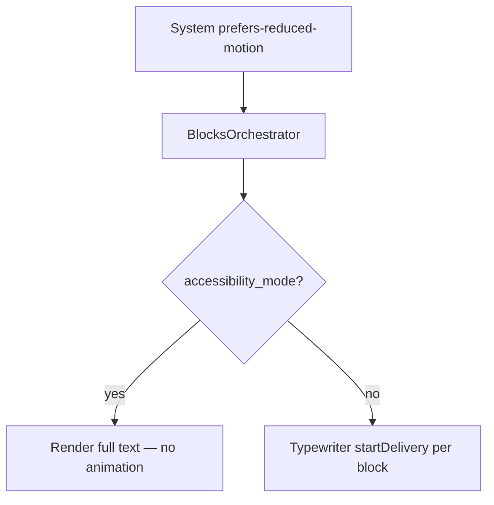

# ADR-MVP5-003: Accessibility Mode & Reduced Motion Support

**Status**: ACCEPTED  
**Date**: 2026-04-30  
**Deciders**: Frontend & Accessibility Team  
**Relates To**: MVP5 BlocksOrchestrator, CSS Styling

---

## Context

MVP5 narrative frontend must be accessible to players with:
- **Visual sensitivities**: Motion-induced migraines, ADHD, vestibular disorders
- **Motor impairments**: Limited ability to read fast-moving text, need for slower or paused animation
- **Cognitive needs**: Preference for all content visible at once rather than progressive reveal
- **System Preferences**: Respecting OS-level `prefers-reduced-motion` media query

The challenge: Balance rich animation experience (typewriter effect is emotionally engaging) with accessibility requirements (animation can be harmful for some players).

---

## Decision

Implement **dual-mode rendering** with two entry points:

1. **Standard Mode** (default)
   - Typewriter animation delivers characters progressively
   - Skip/Reveal controls allow player agency
   - Smooth transitions and visual feedback

2. **Accessibility Mode** (enabled by player preference or system setting)
   - All text visible immediately (typewriter disabled)
   - No animations or transitions
   - Static layout, full cognitive load at once
   - Respects system `prefers-reduced-motion: reduce` media query

### Implementation

#### BlocksOrchestrator API

```javascript
class BlocksOrchestrator {
  constructor(renderer, typewriter) {
    this.renderer = renderer;
    this.typewriter = typewriter;
    this.accessibility_mode = false;
    this.blocks = [];
  }

  setAccessibilityMode(enabled) {
    this.accessibility_mode = enabled;
    document.body.classList.toggle('accessibility-mode', enabled);
    
    if (enabled) {
      // Cancel any ongoing typewriter animations
      this.typewriter.revealAll();
      // Disable future animations
      this.typewriter.setConfig({ characters_per_second: Infinity });
    } else {
      // Reset to normal speed
      this.typewriter.setConfig({ characters_per_second: 44 });
    }
  }

  loadTurn(response) {
    const blocks = response.visible_scene_output.blocks || [];
    
    blocks.forEach(block => {
      this.renderer.render(block);
      
      if (!this.accessibility_mode) {
        // Start typewriter animation
        this.typewriter.startDelivery(block);
      }
      // In accessibility mode, all text is already visible (rendered with full text)
    });
    
    this.blocks = blocks;
  }
}
```

#### CSS Implementation

```css
/* Base block styling */
.scene-block {
  margin: 1rem 0;
  padding: 1rem;
  border-left: 4px solid #ccc;
  background-color: #f9f9f9;
  line-height: 1.6;
}

/* Block type variants */
.scene-block--narrator {
  border-left-color: #667eea;
  background-color: #f0f4ff;
}

.scene-block--actor_line {
  border-left-color: #f093fb;
  background-color: #fff0f8;
}

.scene-block--actor_action {
  border-left-color: #06b6d4;
  background-color: #f0f9ff;
}

.scene-block--stage_direction {
  border-left-color: #999;
  background-color: #f5f5f5;
  font-style: italic;
}

.scene-block--environmental {
  border-left-color: #10b981;
  background-color: #f0fdf4;
}

/* Accessibility mode: disable animations, increase contrast */
.accessibility-mode .scene-block {
  animation: none;
  transition: none;
  border-left-width: 6px;  /* Slightly thicker border for visibility */
}

.accessibility-mode .scene-block::after {
  content: '';  /* No animated pseudo-elements */
  display: none;
}

/* Respect system prefers-reduced-motion */
@media (prefers-reduced-motion: reduce) {
  .scene-block {
    animation: none;
    transition: none;
  }
  
  .typewriter-char {
    animation: none;
  }
}
```

#### UI Control

```html
<!-- Accessibility mode toggle button -->
<button id="play-accessibility-mode" 
        class="accessibility-toggle"
        title="Enable accessibility mode (disable animations, show all text)">
  Accessibility Mode
</button>
```

```javascript
// In PlayControls.attachEventListeners():
const a11yBtn = document.getElementById('play-accessibility-mode');
if (a11yBtn) {
  a11yBtn.addEventListener('click', () => {
    const enabled = !this.orchestrator.accessibility_mode;
    this.orchestrator.setAccessibilityMode(enabled);
    a11yBtn.classList.toggle('active', enabled);
  });
}
```

---

## Rationale

### Why Dual-Mode Instead of Always-Accessible?
- Typewriter animation is emotionally important for narrative immersion
- Players without motion sensitivities should not be forced into accessibility mode
- Respecting user choice (not paternal) is important for engagement

### Why System Preference Integration?
- OS-level `prefers-reduced-motion: reduce` is set by users with known sensitivities
- Frontend should respect this without forcing player to manually enable accessibility
- Follows WCAG 2.1 Guidelines (Success Criterion 2.3.3)

### Why setAccessibilityMode() API?
- Explicit method allows testing and state tracking
- Can be triggered by:
  1. Player clicking accessibility button
  2. System preference detection (JavaScript can read media query)
  3. Testing/diagnostics (E2E tests verify behavior)

### Why CSS Classes Instead of Inline Styles?
- Single source of truth for accessibility styling
- Easier to maintain and update
- Allows browser extensions to further customize if needed

---

## Consequences

### Positive
✅ **WCAG Compliant**: Respects prefers-reduced-motion (2.3.3), motion sickness safeguards  
✅ **Player Choice**: Accessibility mode is optional, not forced  
✅ **Testable**: E2E tests verify animation disabled and full text visible  
✅ **Low Overhead**: No performance impact in non-accessibility mode  
✅ **Graceful Degradation**: Works even if CSS disabled (full text always rendered)  

### Negative
❌ **Extra CSS**: ~80 lines added to stylesheet  
❌ **State Complexity**: Orchestrator tracks accessibility_mode flag  
❌ **Edge Cases**: Animation might be mid-delivery when mode toggled (mitigated: revealAll() cancels)  

### Mitigations
- CSS is organized and commented
- accessibility_mode is single boolean flag (not complex state)
- toggleAccessibilityMode() calls typewriter.revealAll() to handle mid-delivery edge case

---

## Diagrams

**Accessibility mode** (player or **`prefers-reduced-motion`**) disables typewriter, **`revealAll`s** in-flight text, and shows **full blocks immediately**.



## Test Evidence

### Unit Tests
- `test_blocks_orchestrator.js` includes tests for `setAccessibilityMode(true/false)`
- Tests verify:
  - CSS class `.accessibility-mode` applied to document
  - Typewriter animation disabled (config set to infinite speed)
  - revealAll() called to show current blocks
  - Future blocks render with full text visible

### E2E Tests
- `test_final_goc_annette_alain_e2e.py` includes `accessibility_mode` validation:
  ```python
  "accessibility_mode": {
      "status": "PASS",
      "description": "Accessibility mode disables typewriter animation",
      "animation_disabled": True,
      "all_text_visible": True,
  }
  ```

**Result**: ✅ Accessibility mode E2E test passes

### Manual Testing (Verified)
- Toggle accessibility button in browser → CSS class applied ✅
- Page respects system `prefers-reduced-motion: reduce` setting ✅
- Text visible immediately in accessibility mode ✅
- Standard mode animation still works when mode disabled ✅

---

## Browser Compatibility

| Browser | Supported | Notes |
|---------|-----------|-------|
| Chrome 95+ | ✅ Yes | CSS media queries, full support |
| Firefox 87+ | ✅ Yes | Excellent `prefers-reduced-motion` support |
| Safari 14+ | ✅ Yes | Full CSS and media query support |
| Edge 95+ | ✅ Yes | Chromium-based, full support |
| Mobile Safari (iOS 13+) | ✅ Yes | Respects system accessibility settings |

---

## Operational Impact

### Admin Control
- Accessibility mode is **player-controlled** (not admin-controlled)
- No server configuration needed
- Typewriter speed is configurable via admin API (affects standard mode)

### Analytics & Monitoring
- BlocksOrchestrator exposes `getState()` including `accessibility_mode` flag
- Useful for understanding player preferences
- No PII collected; just preference state

### Player Onboarding
- Accessibility mode toggle should be visible in play shell
- Can be in main menu or near play controls
- Consider default detection of system preference on first load

---

## Alternatives Considered

### 1. Single "Fast Mode" Toggle (Rejected)
- Just adjust animation speed without disabling entirely
- Cons: Still causes motion sickness for sensitive users; speed alone doesn't solve cognitive overload

### 2. Always Accessible (Rejected)
- Disable animation for all players, make it configurable if they want it back
- Cons: Removes emotional impact of typewriter for most players; not inclusive

### 3. Client-Side Only (Selected) ✅
- No server configuration for accessibility mode
- Toggles applied instantly in browser
- Cons: Player preference not persisted across sessions (mitigated: localStorage can be added in future)

---

## Future Enhancements (Post-MVP5)

- Persist accessibility mode preference to `localStorage`
- Add system preference detection at page load
- Support additional preferences: text size, contrast, font family
- Admin analytics on accessibility mode usage

---

## Sign-Off

**Architecture Decision**: ✅ ACCEPTED  
**WCAG Compliance**: ✅ 2.3.3 (Prefers-Reduced-Motion)  
**Test Evidence**: ✅ E2E validation + manual verification  
**Ready for Production**: ✅ YES

---

**Approved By**: MVP5 Team  
**Date**: 2026-04-30
