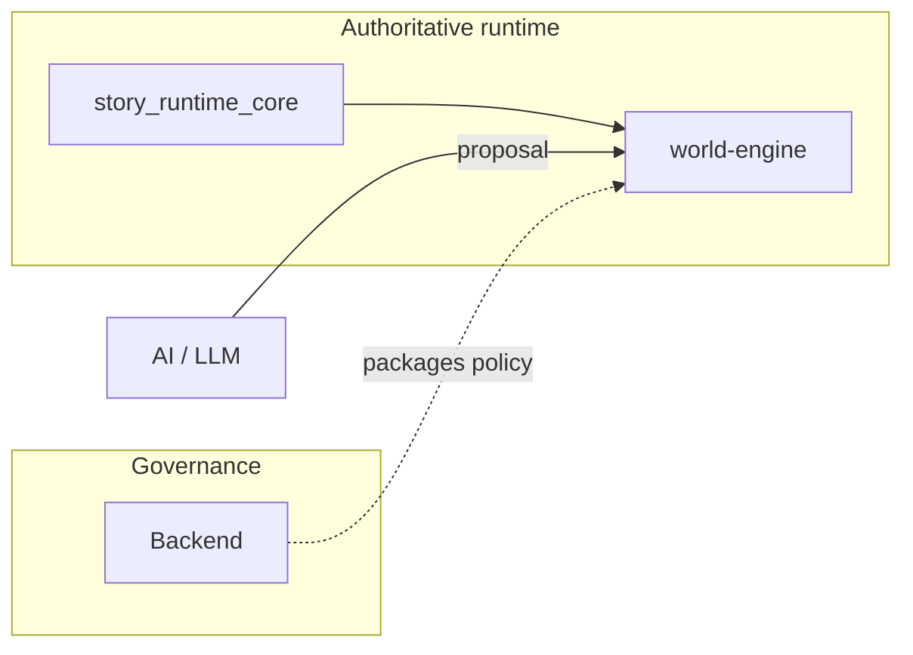

# ADR-0001: Runtime authority in world-engine

## Status
Accepted

## Implementation Status

**Implemented — matches ADR.**

- `world-engine/app/story_runtime/manager.py` (`StoryRuntimeManager`) is the single authoritative runtime host for story sessions, turn execution, and session lifecycle.
- `backend/app/api/v1/game_routes.py` proxies to world-engine; no competing session commit logic exists in the backend layer.
- `story_runtime_core` provides shared interpretation and registry/adapters consumed by the play service.
- AI output proposal-only contract enforced: validation + commit seams in `world-engine/app/api/http.py`.
- Governance investigation confirms: `CTR-ADR-0001-RUNTIME-AUTHORITY` implemented by `world-engine/app/story_runtime/manager.py` and `world-engine/app/api/http.py`, validated by `world-engine/tests/test_story_runtime_api.py`.
- Supersedes ADR-0021 (stub, moved to `docs/ADR/legacy/`).

## Date
2026-04-10 (ADR authored with documentation program; decision content predates this file.)

## Supersedes

- [ADR-0021](adr-0021-runtime-authority.md) — earlier duplicate stub; all normative content lives in this ADR.

## Intellectual property rights
Repository authorship and licensing: see project LICENSE; contact maintainers for clarification.

## Privacy and confidentiality
This ADR contains no personal data. Implementers must follow the repository privacy and confidentiality policies, avoid committing secrets, and document any sensitive data handling in implementation steps.

## Related ADRs

- [`README.md`](README.md) — ADR index
- [ADR-0002](adr-0002-backend-session-surface-quarantine.md) — quarantine and retirement of backend transitional runtime surfaces aligned to this authority split.

## Context
World of Shadows split **platform API / governance** from **live narrative execution**. Without a single authoritative runtime host, duplicate business logic and conflicting session state would emerge across Flask backends and experimental paths.

**MVP narrative governance (historical index):** Runtime must consume only **approved compiled packages**; raw authored source, research outputs, and draft patches are never read directly by live runtime execution. Preview builds are first-class; rollback is feasible; promotion is a formal act. (Source: [`02_architecture_decisions.md`](../MVPs/MVP_Narrative_Governance_And_Revision_Foundation/02_architecture_decisions.md) — index only; **this ADR is normative** for authority placement.)

## Decision
1. **`world-engine` (play service)** is the **authoritative runtime host** for story sessions: lifecycle, turn execution, and runtime-side session persistence model.
2. **`backend`** remains responsible for content curation, publishing controls, review/moderation workflows, policy validation, and admin/operator diagnostics integration - **not** for hosting canonical player HTML or re-implementing committed turn logic.
3. **`story_runtime_core`** holds shared interpretation, registry/adapters, and reusable models consumed by the play service.
4. **AI output** remains **non-authoritative proposal data** until validated and committed by runtime seams (see `docs/MVPs/MVP_VSL_And_GoC_Contracts/CANONICAL_TURN_CONTRACT_GOC.md` for GoC specifics).

## Consequences
**Positive**

- Clear seam for engineering ownership and on-call triage.
- Enables MCP and admin tooling without conflating them with committed play state.

**Negative / risks**

- Requires careful **proxy and secret** configuration between backend and play service.
- Transitional backend paths must be **explicitly labeled** deprecated until removed.

**Follow-ups**

- Track removal of transitional in-process runtime shims as documented in `runtime_authority_decision.md`.
- Keep ADR synchronized if authority shifts (supersede rather than silently edit).

## Diagrams

Authoritative play runs in **world-engine**; **backend** owns governance and curation; **story_runtime_core** shares models. AI output is **proposal** until validated and committed.

## Testing

- **Documentation / review:** cross-check against [`runtime-authority-and-state-flow.md`](../technical/runtime/runtime-authority-and-state-flow.md) and [`runtime-authority-and-session-lifecycle.md`](../dev/architecture/runtime-authority-and-session-lifecycle.md).
- **Code anchors:** `StoryRuntimeManager` and play-service session lifecycle paths in `world-engine/` must remain the only authority for committed play; flag any new backend “truth” writes in review.
- **Failure mode:** duplicated session commit paths or Flask-hosted canonical play without an ADR amendment.

## References

- [`docs/ADR/README.md`](README.md) — ADR catalogue
- `docs/technical/runtime/runtime-authority-and-state-flow.md`
- `docs/archive/architecture-legacy/runtime_authority_decision.md` (archived original)
- `world-engine/app/story_runtime/manager.py` (`StoryRuntimeManager`)
- `docs/dev/architecture/runtime-authority-and-session-lifecycle.md`
