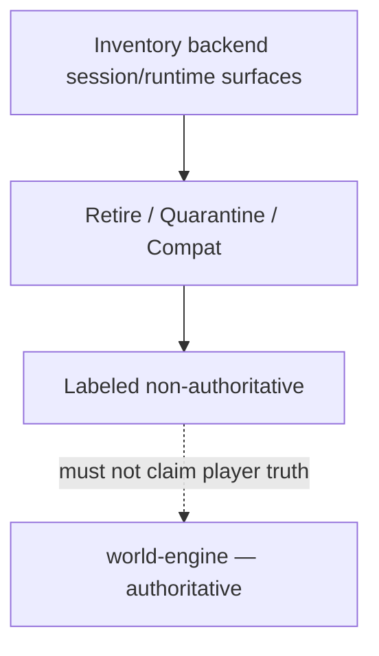

# ADR-0002: Backend session / transitional runtime surface - quarantine and retirement

## Status
Accepted

## Date
2026-04-17

## Intellectual property rights
Repository authorship and licensing: see project LICENSE; contact maintainers for clarification.

## Privacy and confidentiality
This ADR contains no personal data. Implementers must follow the repository privacy and confidentiality policies, avoid committing secrets, and document any sensitive data handling in implementation steps.

## Related ADRs

- [`README.md`](README.md) — ADR index
- [ADR-0001](adr-0001-runtime-authority-in-world-engine.md) — authoritative runtime host and backend role boundaries.

## Context
The platform historically exposed backend-local session and runtime-shaped APIs. The world-engine is the **authoritative** live and story runtime for committed play state. A large transitional surface on the backend increases the risk that tools, tests, or new features attach to the wrong authority layer (audit finding class "backend transitional session drift").

**Package immutability (historical MVP ADR-002 wording):** A package version, once built and stored under `versions/<package_version>/`, is **immutable**. `active/` is a **pointer** to a version, never the storage location of mutable content. Consequences: package promotion is pointer movement plus event log; rollback is pointer movement; audit history is lossless; preview vs active comparisons are reliable. (Source: [`02_architecture_decisions.md`](../MVPs/MVP_Narrative_Governance_And_Revision_Foundation/02_architecture_decisions.md) — index only; **operational detail lives in this ADR and linked architecture docs**.)

## Decision
1. **Inventory** all backend routes and services under `backend/app/runtime/`, `session_service.py`, `session_start.py`, and session-related API modules (normative list: **Appendix A**).
2. **Classify** each entry point as: **retire** (remove when no caller), **quarantine** (explicit non-authoritative labeling, narrow compatibility window), or **compat** (documented operator-only surface with no player truth claims).
3. **Quarantine** non-authoritative surfaces in naming and documentation so they cannot be mistaken for production authority (prefixes, deprecation notices, ADR links).

## Consequences
- Positive: Reduced drift; clearer onboarding for engineers.
- Negative: Migration work for any remaining callers of retired surfaces; coordination with product for compat timelines.

## Diagrams

Transitional backend runtime APIs are **inventoried and classified** so nothing competes with **world-engine** as truth for committed play.

## Testing

- **Inventory / classification:** verify Appendix A style lists stay current when new session routes land.
- **Review gate:** any new `backend/app/runtime/` or session API must declare retire | quarantine | compat per this ADR.
- **Failure mode:** undocumented player-truth claims on backend paths or missing deprecation labels on transitional shims.

## References

- [`docs/MVPs/MVP_Narrative_Governance_And_Revision_Foundation/02_architecture_decisions.md`](../MVPs/MVP_Narrative_Governance_And_Revision_Foundation/02_architecture_decisions.md) *(index — normative detail in this ADR)*
- [`docs/ADR/README.md`](README.md) *(ADR catalogue)*
- [`docs/governance/audit_resolution/audit_resolution_state_world_of_shadows.md`](../governance/audit_resolution/audit_resolution_state_world_of_shadows.md) (finding F-H2)
- [`docs/technical/architecture/backend-runtime-classification.md`](../technical/architecture/backend-runtime-classification.md)
