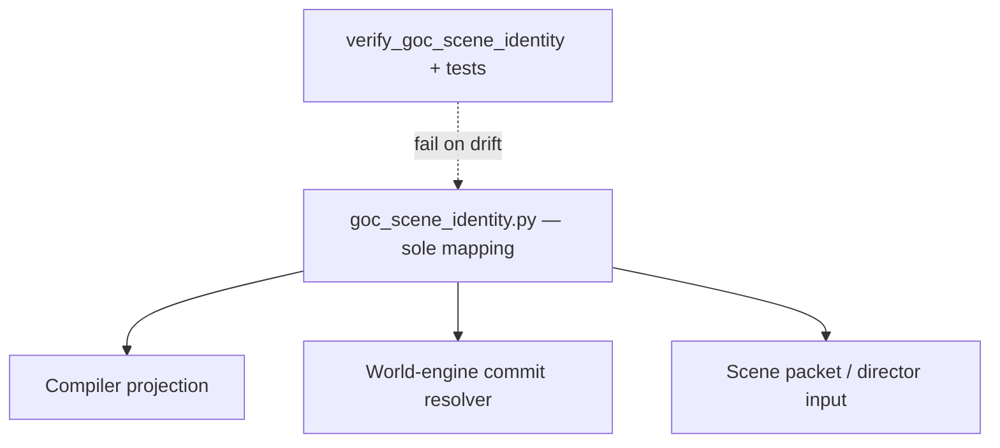

# ADR-0003: Single canonical scene identity surface across compile, AI guidance, and commit

## Status
Accepted

## Implementation Status

**Implemented — matches ADR.**

- `ai_stack/goc_scene_identity.py` is the sole definition point for `guidance_phase_key_for_scene_id`.
- `ai_stack/goc_yaml_authority.py` re-exports and consumes that module without introducing a second mapping dict.
- `ai_stack/tests/test_goc_scene_identity.py` includes `test_sole_definition_of_guidance_phase_key_for_scene_id` which scans the entire repo for duplicate definitions and fails on any found.
- `tools/verify_goc_scene_identity_single_source.py` enforces the no-local-remap rule in CI.
- Governance investigation confirms `CTR-ADR-0003-SCENE-IDENTITY` implemented and validated.

## Date
2026-04-17

## Intellectual property rights
Repository authorship and licensing: see project LICENSE; contact maintainers for clarification.

## Privacy and confidentiality
This ADR contains no personal data. Implementers must follow the repository privacy and confidentiality policies, avoid committing secrets, and document any sensitive data handling in implementation steps.

## Related ADRs

- [`README.md`](README.md) — ADR index
- [ADR-0001](adr-0001-runtime-authority-in-world-engine.md) — runtime authority and compiled-package truth.
- [ADR-0004](adr-0004-runtime-model-output-proposal-only-until-validator-approval.md) — proposal-only model output until validation.

## Context
Authored narrative modules are consumed by more than one component (content compiler, optional direct YAML readers in AI/helpers, world-engine narrative commit). Without a single canonical scene identifier vocabulary and a small, tested translation layer, regressions at handoffs can reappear even after point fixes (audit finding class "dual interpretation surfaces").

**Scene packet contract (historical MVP ADR-003 wording):** The model call must be built from a typed **`NarrativeDirectorScenePacket`**. This is not optional retrieval context and not ad hoc prompt interpolation. Consequences: runtime model input is inspectable and testable; policy, legality, actor scope, and constraints are explicit; generation becomes reproducible enough for regression testing. (Source: [`02_architecture_decisions.md`](../MVPs/MVP_Narrative_Governance_And_Revision_Foundation/02_architecture_decisions.md) — index only.)

## Decision
1. Treat **compiler runtime projection** and world-engine **commit resolver** as the **normative** contract for scene row identity at the seam (unchanged from prior draft).
2. **Single owned module:** [`ai_stack/goc_scene_identity.py`](../../ai_stack/goc_scene_identity.py) is the only place that defines runtime `scene_id` -> `scene_guidance.yaml` phase keys and guidance-phase -> escalation-arc subkeys. [`ai_stack/goc_yaml_authority.py`](../../ai_stack/goc_yaml_authority.py) **re-exports** and consumes that module; it must not introduce a second mapping dict.
3. **No local remap (mandatory):**
   - No duplicate scene-id -> guidance dicts outside `goc_scene_identity.py` (enforced by `python tools/verify_goc_scene_identity_single_source.py` in CI and by `test_sole_definition_of_guidance_phase_key_for_scene_id` in `ai_stack/tests/test_goc_scene_identity.py`).
   - No ad hoc `if scene_id == "...": phase = ...` mapping in consumers; use `guidance_phase_key_for_scene_id` (exceptions require ADR amendment or state decision log + expiry).
4. Prefer **contract tests** that load canonical content and assert vocabulary legibility (see `ai_stack/tests/test_goc_scene_identity.py`).

## Consequences
- Positive: Fewer silent failures at seams; CI enforcement against mapping drift.
- Negative: GoC YAML or guidance renames need a coordinated code update.

## Diagrams

A **single mapping module** feeds compiler projection, commit resolver, and AI scene packets — CI blocks duplicate `scene_id` → guidance maps.

## Testing

- **CI:** `python tools/verify_goc_scene_identity_single_source.py` and `ai_stack/tests/test_goc_scene_identity.py` (including `test_sole_definition_of_guidance_phase_key_for_scene_id`).
- **Failure mode:** duplicate scene-id → guidance maps or ad hoc `if scene_id == …` branches outside `goc_scene_identity.py`.

## References

- [`docs/MVPs/MVP_Narrative_Governance_And_Revision_Foundation/02_architecture_decisions.md`](../MVPs/MVP_Narrative_Governance_And_Revision_Foundation/02_architecture_decisions.md) *(index)*
- [`docs/ADR/README.md`](README.md) *(ADR catalogue)*
- [`docs/governance/audit_resolution/audit_resolution_state_world_of_shadows.md`](../governance/audit_resolution/audit_resolution_state_world_of_shadows.md) (finding F-H3)
- [`docs/dev/contracts/normative-contracts-index.md`](../dev/contracts/normative-contracts-index.md)
