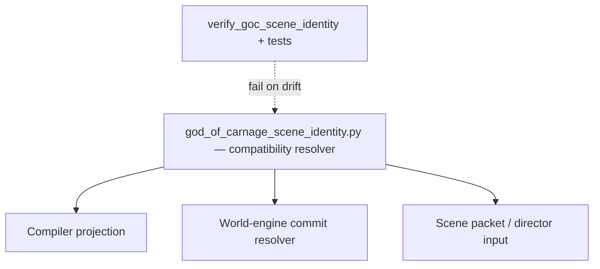

# ADR-0003: Scene Identity Compatibility Surface Across Compile, AI Guidance, and Commit

## Status
Accepted

## Implementation Status

**Implemented as a bounded compatibility surface.**

- `ai_stack/story_runtime/god_of_carnage/god_of_carnage_scene_identity.py` is the sole legacy-compatible definition
  point for `guidance_phase_key_for_scene_id`.
- `ai_stack/story_runtime/god_of_carnage/god_of_carnage_yaml_authority.py` re-exports and consumes that module without introducing a second mapping dict.
- `ai_stack/tests/test_god_of_carnage_scene_identity.py` includes `test_sole_definition_of_guidance_phase_key_for_scene_id` which scans the entire repo for duplicate definitions and fails on any found.
- `tools/verify_goc_scene_identity_single_source.py` enforces the no-local-remap rule in CI.
- Governance investigation confirms `CTR-ADR-0003-SCENE-IDENTITY` implemented and validated.
- This ADR does not authorize semantic routing, language translation, actor
  targeting, or scene-candidate selection from raw player text. Current GoC
  direction is governed by authored `canonical_path/`, `scene_graph.yaml`,
  phase policy, and AI semantic payloads.

## Date
2026-04-17

## Intellectual property rights
Repository authorship and licensing: see project LICENSE; contact maintainers for clarification.

## Privacy and confidentiality
This ADR contains no personal data. Implementers must follow the repository privacy and confidentiality policies, avoid committing secrets, and document any sensitive data handling in implementation steps.

## Related ADRs

- [`README.md`](README.md) — ADR index
- [ADR-0001](adr-0001-runtime-authority-in-world-engine.md) — runtime authority and compiled-package truth.
- [ADR-0004](adr-0004-runtime-model-output-proposal-only-until-validator-approval.md) — proposal-only model output until validation.

## Context
Authored narrative modules are consumed by more than one component (content compiler, optional direct YAML readers in AI/helpers, world-engine narrative commit). Without a single canonical scene identifier vocabulary and a small, tested translation layer, regressions at handoffs can reappear even after point fixes (audit finding class "dual interpretation surfaces").

**Scene packet contract (historical MVP ADR-003 wording):** The model call must be built from a typed **`NarrativeDirectorScenePacket`**. This is not optional retrieval context and not ad hoc prompt interpolation. Consequences: runtime model input is inspectable and testable; policy, legality, actor scope, and constraints are explicit; generation becomes reproducible enough for regression testing. (Source: [`02_architecture_decisions.md`](../MVPs/MVP_Narrative_Governance_And_Revision_Foundation/02_architecture_decisions.md) — index only.)

## Decision
1. Treat **compiler runtime projection** and world-engine **commit resolver** as the **normative** contract for scene row identity at the seam (unchanged from prior draft).
2. **Single owned compatibility resolver:** [`ai_stack/story_runtime/god_of_carnage/god_of_carnage_scene_identity.py`](../../ai_stack/story_runtime/god_of_carnage/god_of_carnage_scene_identity.py) is the only place that defines legacy runtime `scene_id` -> phase-policy guidance keys and guidance-phase -> escalation-arc subkeys. [`ai_stack/story_runtime/god_of_carnage/god_of_carnage_yaml_authority.py`](../../ai_stack/story_runtime/god_of_carnage/god_of_carnage_yaml_authority.py) **re-exports** and consumes that module; it must not introduce a second mapping dict.
3. **No local remap (mandatory):**
   - No duplicate scene-id -> guidance dicts outside `god_of_carnage_scene_identity.py` (enforced by `python tools/verify_goc_scene_identity_single_source.py` in CI and by `test_sole_definition_of_guidance_phase_key_for_scene_id` in `ai_stack/tests/test_god_of_carnage_scene_identity.py`).
   - No ad hoc `if scene_id == "...": phase = ...` mapping in consumers; use `guidance_phase_key_for_scene_id` (exceptions require ADR amendment or state decision log + expiry).
4. Prefer **contract tests** that load canonical content and assert vocabulary legibility (see `ai_stack/tests/test_god_of_carnage_scene_identity.py`).
5. Do not add new runtime maps for player language, semantic moves, actor
   aliases, location aliases, or scene candidates. Those meanings must come
   from authored content IDs and AI semantic resolution.
6. The compatibility resolver does **not** authorize phase-helper fallback.
   Backend transitional helpers such as `app.runtime.next_situation` and
   `app.runtime.reference_policy` remain strict over
   `ContentModule.scene_phases`: a `SessionState.current_scene_id` that names
   only a `scene_graph.yaml` node is rejected instead of being silently
   remapped to a phase id. Even scene self-reference checks first require the
   referenced id to exist in the module phase vocabulary.

## Consequences
- Positive: Fewer silent failures at seams; CI enforcement against mapping drift.
- Negative: GoC YAML or guidance renames need a coordinated code update.

## Diagrams

A bounded compatibility resolver feeds compiler projection, commit resolver,
and AI scene packets. CI blocks duplicate `scene_id` -> guidance maps, and new
semantic routing maps are outside this ADR.

## Testing

- **CI:** `python tools/verify_goc_scene_identity_single_source.py` and `ai_stack/tests/test_god_of_carnage_scene_identity.py` (including `test_sole_definition_of_guidance_phase_key_for_scene_id`).
- **Failure mode:** duplicate scene-id -> guidance maps, ad hoc `if scene_id == ...` branches outside `god_of_carnage_scene_identity.py`, or tests that require transitional phase/reference helpers to accept scene-graph node ids as backward-compatible phase aliases.
- **Out of scope:** raw player text, actor names, locale words, or scene-topic
  keywords selecting semantic moves or scene candidates.

## References

- [`docs/MVPs/MVP_Narrative_Governance_And_Revision_Foundation/02_architecture_decisions.md`](../MVPs/MVP_Narrative_Governance_And_Revision_Foundation/02_architecture_decisions.md) *(index)*
- [`docs/ADR/README.md`](README.md) *(ADR catalogue)*
- [`docs/governance/audit_resolution/audit_resolution_state_world_of_shadows.md`](../governance/audit_resolution/audit_resolution_state_world_of_shadows.md) (finding F-H3)
- [`docs/dev/contracts/normative-contracts-index.md`](../dev/contracts/normative-contracts-index.md)
