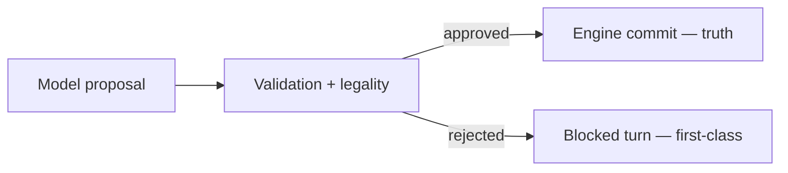

# ADR-0004: Runtime model output is proposal-only until validator approval

## Status
Accepted

## Implementation Status

**Implemented — principle enforced throughout the runtime.**

- Model output is treated as a proposal in `world-engine/app/story_runtime/manager.py` (LangGraph graph execution → validation seam → commit seam).
- `world-engine/app/api/http.py` enforces the proposal → validation → commit pipeline for every turn.
- `ai_stack/live_runtime_commit_semantics.py` formalizes `live_success` computation separating "commit_applied" from proof of real generation.
- ADR-0033 (Live Runtime Commit Semantics) extends this principle with specific fields (`adapter_kind`, `live_success`, `validation_status` provenance) — the two ADRs are complementary.
- Blocked turns are first-class: degradation markers and `quality_class=degraded` propagate when validation fails.

## Date
2026-04-17

## Intellectual property rights
Repository authorship and licensing: see project LICENSE; contact maintainers for clarification.

## Privacy and confidentiality
This ADR contains no personal data. Implementers must follow the repository privacy and confidentiality policies, avoid committing secrets, and document any sensitive data handling in implementation steps.

## Related ADRs

- [README.md](README.md) — ADR index *(no tightly coupled ADR beyond references below)*.

## Context

## Decision
The model may suggest narrative text, triggers, and effects. No suggestion is authoritative until output validation and engine legality checks pass.

## Consequences
- the model cannot silently mutate truth
- blocked turns are first-class
- commit logic remains engine authority

## Diagrams

Model output stays **non-authoritative** until validation and engine checks succeed; blocked turns remain explicit.

## Testing

Contract / unit coverage as cited in **References**; extend this section when a dedicated gate exists. Revisit this ADR if enforcement drifts or the decision is bypassed in code review.

## References
docs/MVPs/MVP_Narrative_Governance_And_Revision_Foundation/02_architecture_decisions.md
