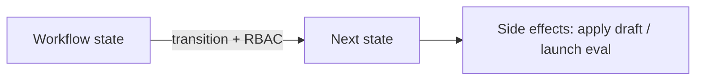

# ADR-0006: Revision review uses a state machine, not loose status strings

## Status
Not Finished

## Implementation Status

**Decision stated; no state machine implementation found in codebase.**

- The principle (revision lifecycle as a typed state machine with role-based transitions) is architecturally sound and referenced in MVP governance docs.
- No formal `RevisionStateMachine` or equivalent class was found in `backend/` or `world-engine/`.
- The writers-room review workflow (`/api/v1/writers-room/reviews`) has stages (accept/reject/revise) that approximate state transitions, but they are not implemented as a formal state machine with explicit RBAC gate enforcement per transition.
- Implementation is blocked on: defining revision state model, role permission matrix per transition, and side-effect hooks (draft apply, evaluation launch).
- Required before: full multi-operator revision workflows can be safely operated.

## Date
2026-04-17

## Intellectual property rights
Repository authorship and licensing: see project LICENSE; contact maintainers for clarification.

## Privacy and confidentiality
This ADR contains no personal data. Implementers must follow the repository privacy and confidentiality policies, avoid committing secrets, and document any sensitive data handling in implementation steps.

## Related ADRs

- [README.md](README.md) — ADR index *(no tightly coupled ADR beyond references below)*.

## Context

## Decision
Revision lifecycle must be enforced through a formal workflow state machine with role permissions and side effects.

## Consequences
- multi-operator work is safer
- approval paths become auditable
- system side effects like draft apply and evaluation launch can be attached to transitions

## Diagrams

Revision lifecycle is a **typed state machine**: transitions carry **roles** and may attach **side effects** (draft apply, evaluation).

## Testing

Contract / unit coverage as cited in **References**; extend this section when a dedicated gate exists. Revisit this ADR if enforcement drifts or the decision is bypassed in code review.

## References
docs/MVPs/MVP_Narrative_Governance_And_Revision_Foundation/02_architecture_decisions.md
