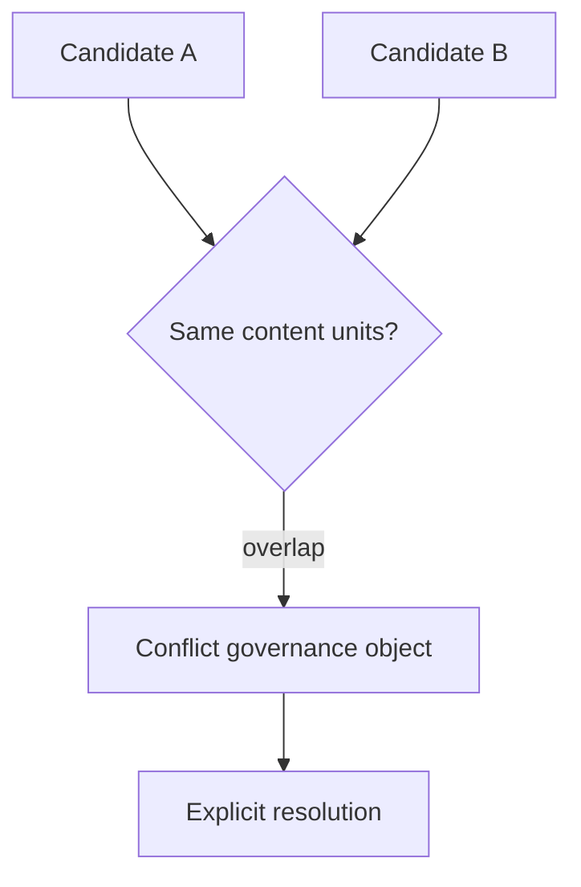

# ADR-0007: Revision conflicts are explicit governance objects

## Status
Not Finished

## Implementation Status

**Decision stated; conflict record implementation not found in codebase.**

- The principle (overlapping revision candidates produce an explicit conflict record before draft apply) is referenced in MVP governance docs.
- No `ConflictRecord` class, conflict detection logic, or conflict resolution workflow was found in `backend/` or `world-engine/`.
- The writers-room review workflow exists but does not include conflict detection between concurrent revision candidates.
- Prerequisite: ADR-0006 (revision state machine) must be implemented first, since conflict detection naturally integrates with revision lifecycle transitions.
- Required before: concurrent multi-author revision workflows can operate safely without silent last-write-wins behavior.

## Date
2026-04-17

## Intellectual property rights
Repository authorship and licensing: see project LICENSE; contact maintainers for clarification.

## Privacy and confidentiality
This ADR contains no personal data. Implementers must follow the repository privacy and confidentiality policies, avoid committing secrets, and document any sensitive data handling in implementation steps.

## Related ADRs

- [README.md](README.md) — ADR index *(no tightly coupled ADR beyond references below)*.

## Context

## Decision
Competing revision candidates targeting overlapping content units must create conflict records before draft apply.

## Consequences
- no silent last-write-wins behavior
- operators can resolve conflicts deliberately
- revision batches remain inspectable

## Diagrams

Overlapping revision candidates produce a **conflict record** before draft apply — no silent last-write-wins.

## Testing

Contract / unit coverage as cited in **References**; extend this section when a dedicated gate exists. Revisit this ADR if enforcement drifts or the decision is bypassed in code review.

## References
docs/MVPs/MVP_Narrative_Governance_And_Revision_Foundation/02_architecture_decisions.md
