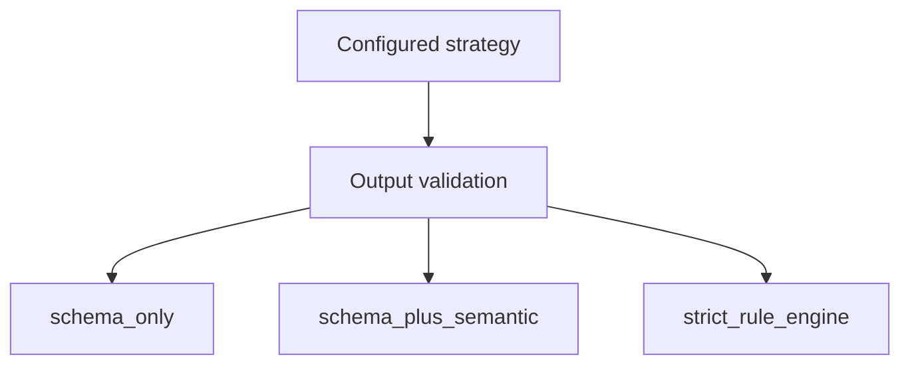

# ADR-0008: Validation strategy must be explicit and configurable

## Status
Accepted

## Implementation Status

**Implemented — validation strategy enum and configuration in place.**

- `backend/app/models/narrative_enums.py`: `NarrativeValidationStrategy` enum with values `SCHEMA_ONLY`, `SCHEMA_PLUS_SEMANTIC`, `STRICT_RULE_ENGINE`.
- `backend/app/models/governance_enums.py`: `ValidationExecutionMode` enum with matching values.
- `world-engine/app/main.py`: strategy resolved from `validation_mode` setting into `OutputValidatorConfig` with `strategy`, `semantic_policy_check`, `enable_corrective_feedback`, and `max_retry_attempts` fields.
- World-engine startup lifespan reads the configured mode and wires the validator accordingly.
- Environments can trade latency for scrutiny by changing `VALIDATION_MODE` config.
- Status promoted from "Proposed" because the decision and all three strategy values are implemented.

## Date
2026-04-17

## Intellectual property rights
Repository authorship and licensing: see project LICENSE; contact maintainers for clarification.

## Privacy and confidentiality
This ADR contains no personal data. Implementers must follow the repository privacy and confidentiality policies, avoid committing secrets, and document any sensitive data handling in implementation steps.

## Related ADRs

- [ADR-0009](adr-0009-evaluation-is-a-promotion-gate.md) — promotion and evaluation evidence (orthogonal axis: *when* something may ship).
- [ADR-0039](adr-0039-gate-tests-no-hardcoded-oracle-bypass.md) — tests that assert validation outcomes must not use hardcoded literals as the primary oracle; oracles must trace to contract, schema, or canonical content so the configured strategy stays **meaningful**, not cosmetic.
- [README.md](README.md) — ADR index.

## Context

Output validation intensity and cost vary by environment (local dev vs. staging vs. gate CI). Without an **explicit, named strategy**, teams cannot align runtime behavior, observability, and automated tests: the same code path might be “strict” in one place and “schema-only” in another without documentation. That ambiguity invites silent drift and brittle tests that pin accidental behavior instead of declared invariants.

## Decision
Output validation must expose a strategy: `schema_only`, `schema_plus_semantic`, or `strict_rule_engine`.

## Consequences
- runtime behavior becomes transparent
- environments can trade latency for scrutiny
- test suites can target strategy-specific expectations **without** inventing a second truth surface: expectations must still satisfy [ADR-0039](adr-0039-gate-tests-no-hardcoded-oracle-bypass.md) (derive assertions from schema, contracts, or canonical authored content—not from copy-pasted example output)

## Diagrams

Runtime picks an explicit **validation strategy** per environment — behavior and tests target that mode.

## Testing

Contract / unit coverage as cited in **References**; extend this section when a dedicated gate exists. Revisit this ADR if enforcement drifts or the decision is bypassed in code review.

**Gate and regression tests** that exist to prove validation behavior must:

- assert **invariants** and **strategy wiring** (e.g. which branch runs for a given `VALIDATION_MODE`, presence of corrective feedback fields, rejection classes) rather than long literal model outputs; and
- comply with [ADR-0039](adr-0039-gate-tests-no-hardcoded-oracle-bypass.md): hardcoded strings as the primary pass/fail oracle are forbidden when they only encode a one-off symptom fix.

## References
docs/MVPs/MVP_Narrative_Governance_And_Revision_Foundation/02_architecture_decisions.md
