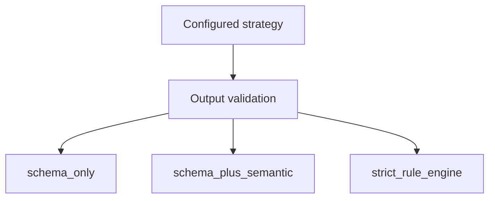

# ADR-0008: Validation strategy must be explicit and configurable

## Status
Accepted

## Implementation Status

**Implemented — validation strategy enum and configuration in place.**

- `backend/app/models/narrative_enums.py`: `NarrativeValidationStrategy` enum with values `SCHEMA_ONLY`, `SCHEMA_PLUS_SEMANTIC`, `STRICT_RULE_ENGINE`.
- `backend/app/models/governance_enums.py`: `ValidationExecutionMode` enum with matching values.
- `world-engine/app/main.py`: strategy resolved from `validation_mode` setting into `OutputValidatorConfig` with `strategy`, `semantic_policy_check`, `enable_corrective_feedback`, and `max_retry_attempts` fields.
- World-engine startup lifespan reads the configured mode and wires the validator accordingly.
- Environments can trade latency for scrutiny by changing `VALIDATION_MODE` config.
- Status promoted from "Proposed" because the decision and all three strategy values are implemented.

## Date
2026-04-17

## Intellectual property rights
Repository authorship and licensing: see project LICENSE; contact maintainers for clarification.

## Privacy and confidentiality
This ADR contains no personal data. Implementers must follow the repository privacy and confidentiality policies, avoid committing secrets, and document any sensitive data handling in implementation steps.

## Related ADRs

- [README.md](README.md) — ADR index *(no tightly coupled ADR beyond references below)*.

## Context

## Decision
Output validation must expose a strategy: `schema_only`, `schema_plus_semantic`, or `strict_rule_engine`.

## Consequences
- runtime behavior becomes transparent
- environments can trade latency for scrutiny
- test suites can target strategy-specific expectations

## Diagrams

Runtime picks an explicit **validation strategy** per environment — behavior and tests target that mode.

## Testing

Contract / unit coverage as cited in **References**; extend this section when a dedicated gate exists. Revisit this ADR if enforcement drifts or the decision is bypassed in code review.

## References
docs/MVPs/MVP_Narrative_Governance_And_Revision_Foundation/02_architecture_decisions.md
