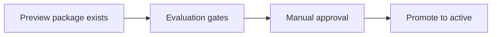

# ADR-0009: Evaluation is a promotion gate

## Status
Not Finished

## Implementation Status

**Partially implemented — evaluation pipeline exists; formal promotion gate enforcement is incomplete.**

- `ai_stack/quality_lab/evaluation_pipeline.py` exists and handles evaluation scoring/baselines.
- Backend operator routes under `/api/v1/admin/mvp4/...` expose evaluation recent-turns, baselines, and regression checks (per ADR-0032).
- What is NOT implemented: a hard gate that blocks package promotion without passing evaluation scores. The evaluation pipeline produces data but does not currently block a promotion action if scores fail.
- Manual approval path: not formalized as a system-enforced gate; relies on operator workflow convention.
- Required before: fully automated content promotion pipelines can trust quality guarantees.

## Date
2026-04-17

## Intellectual property rights
Repository authorship and licensing: see project LICENSE; contact maintainers for clarification.

## Privacy and confidentiality
This ADR contains no personal data. Implementers must follow the repository privacy and confidentiality policies, avoid committing secrets, and document any sensitive data handling in implementation steps.

## Related ADRs

- [ADR-0008](adr-0008-validation-strategy-explicit-configurable.md) — runtime output validation strategy (orthogonal axis: *how* proposals are checked before commit).
- [ADR-0039](adr-0039-gate-tests-no-hardcoded-oracle-bypass.md) — evaluation and promotion **gate tests** must not “go green” by hardcoding expected scores, labels, or narrative snippets; evidence must trace to baselines, schemas, or documented scoring rules.
- [Capability Matrix live claim gates](../MVPs/capability_matrix_live_claim_gates.md) — Capability Matrix promotion and live claims require dated, reproducible evidence; local-only or degraded evidence is not live success.
- [README.md](README.md) — ADR index.

## Context

Preview and staging packages can exist indefinitely without proving narrative or governance quality. If promotion is informal, operators carry unwritten rules and regressions slip through. Formal **evaluation gates** and **approval** make “promotable” a defined state: measurable, comparable to baseline, and reviewable—once enforcement is complete (see **Implementation Status**).

## Decision
A preview package is not promotable only because it exists. Promotion requires passing evaluation gates and manual approval.

Capability Matrix promotion follows the same principle: a row is not promotable only because source code, documentation, a test name, or a local PASS line exists. Runtime wiring, behavior tests, ADR relation, anti-hardcoding coverage, and any required live/staging/Langfuse/MCP evidence must be present before a capability is described as implemented or live-proven.

For hard runtime drift loops such as `tonal_consistency`, local runtime
enforcement and recoverable rejection are still not enough for a live/promoted
claim. A failed hard-loop validation must block healthy commit/live-success,
but promotion additionally requires dated provider traces, evaluator baselines,
Langfuse/MCP evidence, and explicit readiness coupling.

## Consequences
- quality becomes measurable
- package changes can be compared to active baseline
- regression risk is materially reduced
- when evaluation gate tests are added or tightened, they are subject to [ADR-0039](adr-0039-gate-tests-no-hardcoded-oracle-bypass.md): scoring and pass/fail oracles must not be reduced to hardcoded literals that only mirror a single failing ticket’s wording

## Diagrams

A **preview package** alone is not enough; **evaluation evidence** and **approval** sit on the path to promotion.

## Testing

Contract / unit coverage as cited in **References**; extend this section when a dedicated gate exists. Revisit this ADR if enforcement drifts or the decision is bypassed in code review.

**Promotion / evaluation gate tests** (when implemented) must prove that failed scores or failed regression checks **block** promotion—or that approved overrides are explicit—not that a magic string in the test file matches last week’s output. Follow [ADR-0039](adr-0039-gate-tests-no-hardcoded-oracle-bypass.md): derive expected evaluation artifacts from versioned baselines, published scoring contracts, or fixture generators tied to the same pipeline as production evaluation.

## References
docs/MVPs/MVP_Narrative_Governance_And_Revision_Foundation/02_architecture_decisions.md
