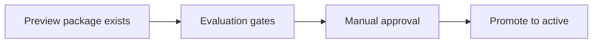

# ADR-0009: Evaluation is a promotion gate

## Status
Not Finished

## Implementation Status

**Partially implemented — evaluation pipeline exists; formal promotion gate enforcement is incomplete.**

- `ai_stack/evaluation_pipeline.py` exists and handles evaluation scoring/baselines.
- Backend operator routes under `/api/v1/admin/mvp4/...` expose evaluation recent-turns, baselines, and regression checks (per ADR-0032).
- What is NOT implemented: a hard gate that blocks package promotion without passing evaluation scores. The evaluation pipeline produces data but does not currently block a promotion action if scores fail.
- Manual approval path: not formalized as a system-enforced gate; relies on operator workflow convention.
- Required before: fully automated content promotion pipelines can trust quality guarantees.

## Date
2026-04-17

## Intellectual property rights
Repository authorship and licensing: see project LICENSE; contact maintainers for clarification.

## Privacy and confidentiality
This ADR contains no personal data. Implementers must follow the repository privacy and confidentiality policies, avoid committing secrets, and document any sensitive data handling in implementation steps.

## Related ADRs

- [README.md](README.md) — ADR index *(no tightly coupled ADR beyond references below)*.

## Context

## Decision
A preview package is not promotable only because it exists. Promotion requires passing evaluation gates and manual approval.

## Consequences
- quality becomes measurable
- package changes can be compared to active baseline
- regression risk is materially reduced

## Diagrams

A **preview package** alone is not enough; **evaluation evidence** and **approval** sit on the path to promotion.

## Testing

Contract / unit coverage as cited in **References**; extend this section when a dedicated gate exists. Revisit this ADR if enforcement drifts or the decision is bypassed in code review.

## References
docs/MVPs/MVP_Narrative_Governance_And_Revision_Foundation/02_architecture_decisions.md
