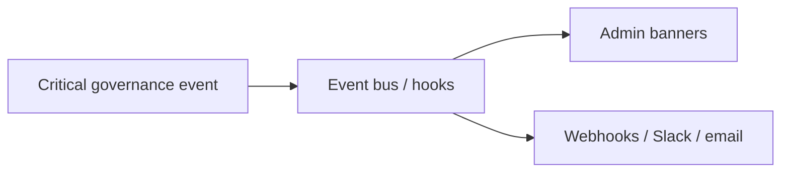

# ADR-0010: Governance workflows are event-driven

## Status
Proposed (migrated excerpt from MVP docs)

## Date
2026-04-17

## Intellectual property rights
Repository authorship and licensing: see project LICENSE; contact maintainers for clarification.

## Privacy and confidentiality
This ADR contains no personal data. Implementers must follow the repository privacy and confidentiality policies, avoid committing secrets, and document any sensitive data handling in implementation steps.

## Related ADRs

- [README.md](README.md) — ADR index *(no tightly coupled ADR beyond references below)*.

## Context

## Decision
Critical governance events must be emitted and may trigger admin banners, email, Slack, or webhooks.

## Consequences
- operators do not need to manually poll all pages
- failed evaluations and urgent findings become visible
- async multi-role workflows become operational

## Diagrams

Governance **events** fan out to operator channels instead of relying on manual polling.

## Testing

Contract / unit coverage as cited in **References**; extend this section when a dedicated gate exists. Revisit this ADR if enforcement drifts or the decision is bypassed in code review.

## References
docs/MVPs/MVP_Narrative_Governance_And_Revision_Foundation/02_architecture_decisions.md
