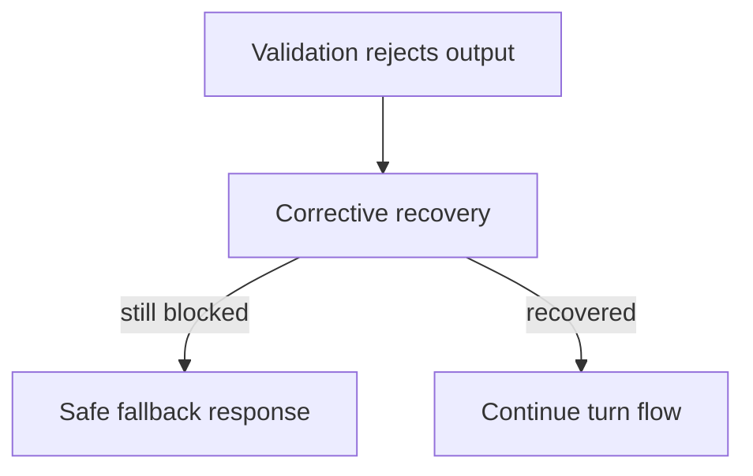

# ADR-0011: Validation failures in live play must degrade gracefully

## Status
Accepted

## Implementation Status

**Implemented — graceful degradation with LDSS fallback in place.**

- `world-engine/app/story_runtime/manager.py`: `_ldss_opening_fallback_state()` provides a guaranteed safe fallback (LDSS deterministic output) when live opening fails validation — player never hits a hard dead end.
- Fallback produces `quality_class=degraded`, `fallback_used=True`, and explicit `degradation_signals` — not silently treated as healthy.
- `ai_stack/live_dramatic_scene_simulator.py`: deterministic fallback stubs serve as the safe content pool.
- `world-engine` wraps opening execution in retry + fallback logic; `_opening_retry_count()` controls retry attempts before falling back.
- ADR-0033 constrains how fallback turns are classified (cannot be `live_success=true`).
- Status promoted from "Proposed" because the decision is in force with working code paths.

## Date
2026-04-17

## Intellectual property rights
Repository authorship and licensing: see project LICENSE; contact maintainers for clarification.

## Privacy and confidentiality
This ADR contains no personal data. Implementers must follow the repository privacy and confidentiality policies, avoid committing secrets, and document any sensitive data handling in implementation steps.

## Related ADRs

- [README.md](README.md) — ADR index *(no tightly coupled ADR beyond references below)*.

## Context

## Decision
A rejected model output must not produce a player-visible dead end. Runtime must attempt corrective recovery and, if needed, emit a guaranteed safe fallback response.

## Consequences
- every playable scene needs fallback content
- runtime needs explicit retry/fallback telemetry
- operator tooling must surface fallback spikes
- degraded quality is acceptable for continuity; broken turns are not

## Diagrams

Rejected model output triggers **corrective recovery** and, if needed, a **safe fallback** — the player never hits a hard dead end.

## Testing

Contract / unit coverage as cited in **References**; extend this section when a dedicated gate exists. Revisit this ADR if enforcement drifts or the decision is bypassed in code review.

## References
docs/MVPs/MVP_Narrative_Governance_And_Revision_Foundation/02_architecture_decisions.md
