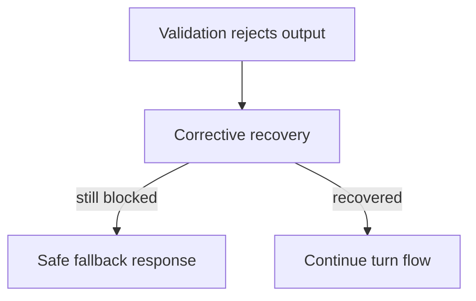

# ADR-0011: Validation failures in live play must degrade gracefully

## Status
Proposed (migrated excerpt from MVP docs)

## Date
2026-04-17

## Intellectual property rights
Repository authorship and licensing: see project LICENSE; contact maintainers for clarification.

## Privacy and confidentiality
This ADR contains no personal data. Implementers must follow the repository privacy and confidentiality policies, avoid committing secrets, and document any sensitive data handling in implementation steps.

## Related ADRs

- [README.md](README.md) — ADR index *(no tightly coupled ADR beyond references below)*.

## Context

## Decision
A rejected model output must not produce a player-visible dead end. Runtime must attempt corrective recovery and, if needed, emit a guaranteed safe fallback response.

## Consequences
- every playable scene needs fallback content
- runtime needs explicit retry/fallback telemetry
- operator tooling must surface fallback spikes
- degraded quality is acceptable for continuity; broken turns are not

## Diagrams

Rejected model output triggers **corrective recovery** and, if needed, a **safe fallback** — the player never hits a hard dead end.

## Testing

Contract / unit coverage as cited in **References**; extend this section when a dedicated gate exists. Revisit this ADR if enforcement drifts or the decision is bypassed in code review.

## References
docs/MVPs/MVP_Narrative_Governance_And_Revision_Foundation/02_architecture_decisions.md
