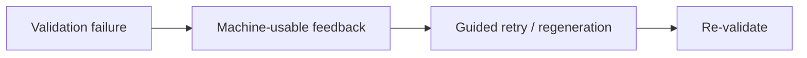

# ADR-0012: Corrective retry must provide actionable validation feedback

## Status
Accepted

## Implementation Status

**Implemented — `ValidationFeedback` / `ValidationViolation` types and corrective retry loop in place.**

- `world-engine/app/narrative/validation_feedback.py`: `ValidationViolation` (violation_type, specific_issue, rule_violated, suggested_fix) and `ValidationFeedback` (passed, violations, corrections_needed, legal_alternatives) as machine-usable contracts.
- World-engine retry logic uses `enable_corrective_feedback` flag in `OutputValidatorConfig` and feeds violation detail back into the retry generation context.
- `docs/MVPs/MVP_Narrative_Governance_And_Revision_Foundation/12_live_play_correction_and_fallbacks.md` documents the full 5-step recovery flow (generate → validate → feedback → corrective retry → safe fallback).
- Status promoted from "Proposed" because the decision and types are implemented and tested.

## Date
2026-04-17

## Intellectual property rights
Repository authorship and licensing: see project LICENSE; contact maintainers for clarification.

## Privacy and confidentiality
This ADR contains no personal data. Implementers must follow the repository privacy and confidentiality policies, avoid committing secrets, and document any sensitive data handling in implementation steps.

## Related ADRs

- [README.md](README.md) — ADR index *(no tightly coupled ADR beyond references below)*.

## Context

## Decision
Retry is not blind regeneration. When validation fails, the runtime must produce actionable feedback describing the violation, the violated rule, and legal alternatives where available.

## Consequences
- retry quality is materially better than blind re-roll
- validation feedback becomes a first-class contract
- semantic and rule-based validators must expose machine-usable violation details
- prompt assembly must support corrective context

## Diagrams

Retries carry **structured violation detail** (rule, seam, alternatives) into the next generation attempt — not blind re-roll.

## Testing

Contract / unit coverage as cited in **References**; extend this section when a dedicated gate exists. Revisit this ADR if enforcement drifts or the decision is bypassed in code review.

## References
docs/MVPs/MVP_Narrative_Governance_And_Revision_Foundation/02_architecture_decisions.md
