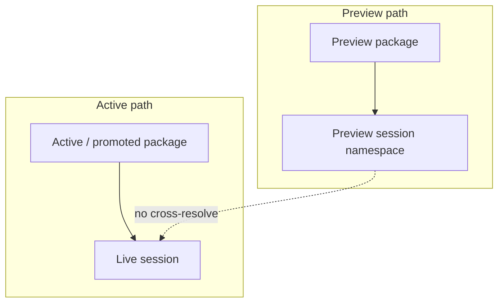

# ADR-0013: Preview sessions must be isolated from active runtime

## Status
Not Finished

## Implementation Status

**Decision stated; dedicated preview session isolation not found in current codebase.**

- The MVP spec (`docs/MVPs/MVP_Narrative_Governance_And_Revision_Foundation/01_revised_mvp_spec.md`) describes preview isolation as a requirement with three allowed modes: dedicated process/container, in-memory preview loader + namespace, or preview-token-keyed resolver.
- No `PreviewSessionNamespace`, `PreviewPackageLoader`, or preview-session-token isolation path was found in `world-engine/` or `backend/`.
- The current session model (`StorySession`, `StoryRuntimeManager`) does not distinguish preview vs. active session namespaces.
- Required before: preview package testing without risk of contaminating live player sessions.
- Dependency: content package promotion pipeline (ADR-0009) would normally drive the need for preview isolation.

## Date
2026-04-17

## Intellectual property rights
Repository authorship and licensing: see project LICENSE; contact maintainers for clarification.

## Privacy and confidentiality
This ADR contains no personal data. Implementers must follow the repository privacy and confidentiality policies, avoid committing secrets, and document any sensitive data handling in implementation steps.

## Related ADRs

- [README.md](README.md) — ADR index *(no tightly coupled ADR beyond references below)*.

## Context

## Decision
Preview packages are executable only inside explicitly isolated preview sessions. Active live sessions may never accidentally resolve against a preview package.

## Consequences
- preview execution must use explicit session namespace or isolated loader
- reload semantics for active and preview paths must stay distinct
- admin actions must show whether a package is active or preview-only

## Diagrams

**Preview** execution uses an isolated session/loader path so **active** live sessions never resolve preview packages by accident.

## Testing

Contract / unit coverage as cited in **References**; extend this section when a dedicated gate exists. Revisit this ADR if enforcement drifts or the decision is bypassed in code review.

## References
docs/MVPs/MVP_Narrative_Governance_And_Revision_Foundation/02_architecture_decisions.md
