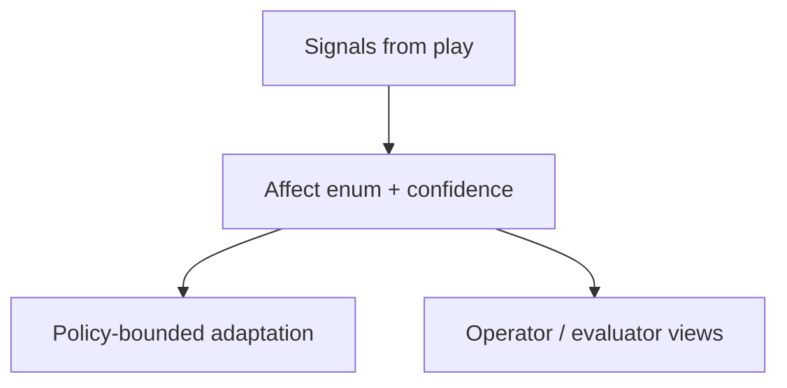

# ADR-0014: Player affect uses enum-based signals, not one-off frustration booleans

## Status
Proposed (migrated excerpt from MVP docs)

## Date
2026-04-17

## Intellectual property rights
Repository authorship and licensing: see project LICENSE; contact maintainers for clarification.

## Privacy and confidentiality
This ADR contains no personal data. Implementers must follow the repository privacy and confidentiality policies, avoid committing secrets, and document any sensitive data handling in implementation steps.

## Related ADRs

- [README.md](README.md) — ADR index *(no tightly coupled ADR beyond references below)*.

## Context

## Decision
Any player-state interpretation seam should use a general affect model with enums and confidence values. Frustration is one possible affect, not the architecture itself.

## Consequences
- future adaptive assistance remains extensible
- operators and evaluators can inspect broader player-state signals
- player adaptation can stay bounded by policy instead of ad hoc heuristics

## Diagrams

Player-state seams use a **typed affect model** (enums + confidence); “frustration” is one signal among many.

## Testing

Contract / unit coverage as cited in **References**; extend this section when a dedicated gate exists. Revisit this ADR if enforcement drifts or the decision is bypassed in code review.

## References
docs/MVPs/MVP_Narrative_Governance_And_Revision_Foundation/02_architecture_decisions.md
