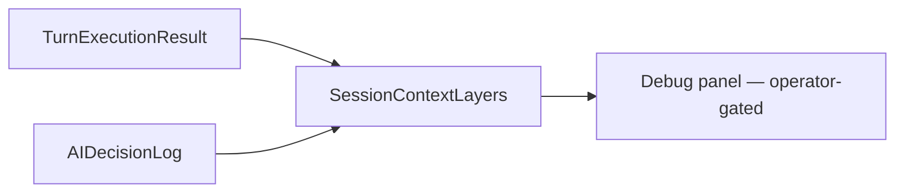

# ADR-0015: Persist TurnExecutionResult and AIDecisionLog in SessionState

## Status
Accepted

## Implementation Status

**Partially implemented — AIDecisionLog persists via session metadata; TurnExecutionResult persistence is incomplete.**

- `backend/app/runtime/ai_turn_recovery_paths.py`: `store_decision_log()` persists `AIDecisionLog` entries to `session.metadata["ai_decision_logs"]`.
- `backend/app/runtime/debug_presenter.py`: `present_debug_panel()` exposes diagnostics via `DebugPanelOutput`; `full_diagnostics` field populated from `short_term_context`.
- Gap noted in `debug_presenter.py` docstring (W3.5.1 limitation): "Does not include TurnExecutionResult fields (validation outcomes, failure reasons, timing) ... TurnExecutionResult and AIDecisionLog are not persisted in SessionState [directly]... Deferred to W3.5.2".
- Debug panel renders diagnostics via `
/
` in session UI (ADR-0020 implemented).
- Diagnostics retrieved via session inspection endpoints — partial; richer field coverage deferred.

## Date
2026-03-30

## Intellectual property rights
Yves Tanas

## Privacy and confidentiality
This ADR contains no personal data. Implementers must follow the repository privacy and confidentiality policies, avoid committing secrets, and document any sensitive data handling in implementation steps.

## Related ADRs

- [README.md](README.md) — ADR index *(no tightly coupled ADR beyond references below)*.

## Context
During W2/W3 workstreams the team implemented helper-role parsing, session APIs, and diagnostic visibility for the end-to-end AI decision pipeline. As part of closure, the team agreed which runtime artifacts must be persisted in order to provide traceability, debugging, and audit evidence.

## Decision
- Persist `TurnExecutionResult` in `SessionContextLayers`.
- Persist `AIDecisionLog` in `SessionContextLayers`.
- Track the last turn number in the session state.

Make persisted diagnostics visible in debug tooling (debug panel) including:
- Raw LLM output
- Role diagnostics (interpreter, director, responder)
- Validation errors (first 5)
- Recovery actions taken (inferred from degradation markers)
- Triggers, outcomes, degradation markers

## Consequences
- Auditability: decision and execution data required for post-hoc analysis are available.
- Storage: session-layer storage needs sizing and retention policy defined by operations (see Appendix A in archive evidence).
- UI: debug surfaces expose sensitive data; ensure operator-only access and auditing on access.

## Diagrams

Turn execution and **AIDecisionLog** persist in **session layers** for audit/debug; the **debug panel** reads the same canonical contracts.

## Testing
- Debug panel shows full diagnostics.
- Diagnostics persisted and retrievable via session inspection endpoints.
- Test results indicated: helper functions, API endpoints, and regressions passed for W2/W3 closure.

## References
(Automated migration entry created 2026-04-17)
