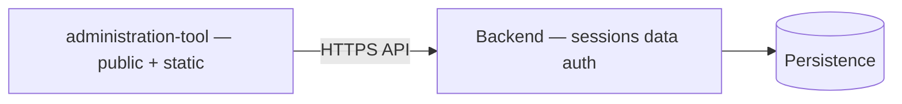

# ADR-0016: Frontend / Backend Restructure (separate Backend and administration-tool frontend)

## Status
Proposed

## Date
2026-04-17

## Intellectual property rights
Repository authorship and licensing: see project LICENSE; contact maintainers for clarification.

## Privacy and confidentiality
This ADR contains no personal data. Implementers must follow the repository privacy and confidentiality policies, avoid committing secrets, and document any sensitive data handling in implementation steps.

## Related ADRs

- [README.md](README.md) — ADR index *(no tightly coupled ADR beyond references below)*.

## Context
An architectural decision was made to split the repository into a `Backend/` process (data, API, auth, dashboard, persistence, tests) and a lightweight `administration-tool/` frontend (public landing, news pages, static assets) that consumes the Backend API. This move preserves existing auth patterns and avoids duplicating business logic.

## Decision
- Move data, API, auth, migrations, and protected UI (dashboard, game-menu) into `Backend/`.
- Implement a thin `administration-tool/` frontend that serves public pages and consumes `Backend` APIs only.
- Keep login/register/dashboard in `Backend/` (session + CSRF); `administration-tool/` contains only public pages and static assets.
- Implement `News` (or `Post`) model and `/api/v1/news` in Backend; frontend consumes it.
- Use `FRONTEND_URL` configuration to coordinate redirects and origin-dependent behavior.

## Consequences
- Repository reorganization required: files moved with `git mv`, import path updates, and CI adjustments.
- Backend storage and instance paths must be updated and accounted for in deployment/dockers.
- Public pages may require CORS or reverse-proxy configuration to access Backend APIs.

## Diagrams

**Backend** owns data, auth, dashboards; the **administration-tool** frontend is thin and consumes APIs (plus `FRONTEND_URL` for redirects).

## Testing

Contract / unit coverage as cited in **References**; extend this section when a dedicated gate exists. Revisit this ADR if enforcement drifts or the decision is bypassed in code review.

## References
(Automated migration entry created 2026-04-17)
