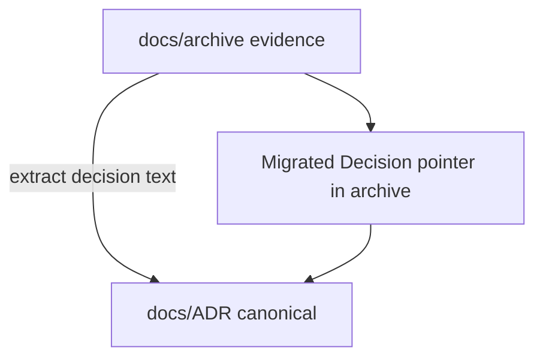

# ADR-0017: Durable-truth migration verification and archive policy

## Status
Accepted

## Implementation Status

**Implemented — migration policy was executed and is in force.**

- `docs/ADR/` is the canonical location for all architecture decisions; migration from archive completed 2026-04-17 (see `docs/ADR/migration_from_archive_2026-04-17.md`).
- Archived files updated with "Migrated Decision: See ADR-XXXX" pointer lines (observed in `docs/dev/architecture/runtime-authority-and-session-lifecycle.md`, `docs/technical/runtime/runtime-authority-and-state-flow.md`, etc.).
- `docs/archive/documentation-consolidation-2026/` holds migration ledgers as evidence.
- ADRs 0001–0029 were created through this policy; the process is complete for the initial consolidation pass.
- Ongoing: new decisions must be written as ADRs; this policy is self-referential and governs future ADR creation.
- Status promoted from "Proposed" because the migration was executed and the governance rule is active.

## Date
2026-04-17

## Intellectual property rights
Repository authorship and licensing: see project LICENSE; contact maintainers for clarification.

## Privacy and confidentiality
This ADR contains no personal data. Implementers must follow the repository privacy and confidentiality policies, avoid committing secrets, and document any sensitive data handling in implementation steps.

## Related ADRs

- [README.md](README.md) — ADR index *(no tightly coupled ADR beyond references below)*.

## Context
During a documentation consolidation effort, many source documents were merged into canonical technical pages, while historical plans and specs were moved to `docs/archive/` for evidence preservation. The consolidation requires a clear, auditable policy for where decisions live and how archival sources are referenced.

## Decision
- Canonical Architecture Decision Records live under `docs/ADR/` and are the single source of truth for architecture decisions and long-lived boundaries.
- Migration verification tables and consolidation ledgers remain in `docs/archive/documentation-consolidation-2026/` as evidence, but any explicit decision text discovered in those sources must be migrated into a new or existing ADR.
- Archived files that contained decisions must be updated with a short "Migrated Decision" pointer line referencing the canonical ADR (e.g., `Migrated Decision: See ADR-XXXX`) and left in archive for historical context.
- Where migration moves a decision into an existing ADR, append a `Migrated Decision (...)` section into the ADR to preserve provenance and source file references.
- Evidence-only archival materials (gate tables, test matrices, historical plans) may remain in `docs/archive/` without ADR counterparts, provided their role is explicitly documented in the migration verification table.

## Consequences
- Some archive files will be edited to include pointer lines; CI tests that reference archived paths must be updated to expect pointers or canonical ADR paths.
- Contractify discovery should be configured to prefer `docs/ADR/` while allowing archive evidence to remain discoverable for audit purposes.

## Diagrams

**docs/ADR/** is canonical decision truth; archive ledgers keep evidence; migrated files get **pointer lines** back to the ADR.

## Testing

Contract / unit coverage as cited in **References**; extend this section when a dedicated gate exists. Revisit this ADR if enforcement drifts or the decision is bypassed in code review.

## References
(Automated migration entry created 2026-04-17)
