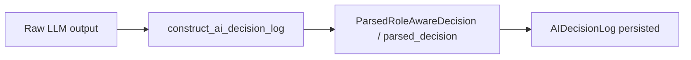

# ADR-0018: Role-aware `AIDecisionLog` and `ParsedRoleAwareDecision`

## Status
Accepted

## Implementation Status

**Implemented — `AIDecisionLog` with role-aware fields and `construct_ai_decision_log()` in place.**

- `backend/app/runtime/ai_decision_logging.py`: `construct_ai_decision_log()` populates `AIDecisionLog` with `parsed_decision`, `interpreter_output`, `director_output`, `responder_output` from `ParsedRoleAwareDecision` when present; falls back to `None` for legacy paths.
- `ParsedRoleAwareDecision` schema exists with `InterpreterSection`, `DirectorSection`, `ResponderSection` — normalizes role-aware fields into `parsed_decision`.
- `AIDecisionLog` includes `interpreter_output` (→ `InterpreterDiagnosticSummary`), `director_output` (→ `DirectorDiagnosticSummary`), `responder_output`, `validation_outcome`, `guard_outcome`.
- Backward compatibility maintained: when `role_aware_decision=None`, role fields are `None` and legacy `raw_output` path is used.
- Comprehensive tests in `backend/tests/runtime/test_ai_decision_logging.py`.
- Status promoted from "Proposed" because the decision and implementation are complete and tested.

## Date
2026-04-17

## Intellectual property rights
Repository authorship and licensing: see project LICENSE; contact maintainers for clarification.

## Privacy and confidentiality
This ADR contains no personal data. Implementers must follow the repository privacy and confidentiality policies, avoid committing secrets, and document any sensitive data handling in implementation steps.

## Related ADRs

- [README.md](README.md) — ADR index *(no tightly coupled ADR beyond references below)*.

## Context
Workstream W2/W3 introduced role-structured decision artifacts (interpreter, director, responder) and a need to record role-aware decision diagnostics in a canonical, machine-readable form for auditing and debugging.

## Decision
- Extend the `AIDecisionLog` to include: `parsed_decision` (the canonical `ParsedAIDecision`), role fields (interpreter, director, responder summaries), and `parsed_output` as a serialisable representation of the canonical decision.
- Introduce `ParsedRoleAwareDecision` as a schema that normalizes role-aware fields into `parsed_decision` when present.
- Implement helper `construct_ai_decision_log()` to populate these fields deterministically from the parsing layer.

## Consequences
- Logging schema changes; consumers must read `parsed_decision` from `AIDecisionLog` rather than inferring decisions from raw outputs.
- Tests and evidence builders should assert canonicalization invariants (parsed_decision identity).
- Backward compatibility: when role-aware fields are absent, systems fall back to legacy raw outputs.

## Diagrams

Parsing produces **`parsed_decision` / role summaries** stored on **`AIDecisionLog`**; consumers read the canonical object, not raw LLM text.

## Testing

Contract / unit coverage as cited in **References**; extend this section when a dedicated gate exists. Revisit this ADR if enforcement drifts or the decision is bypassed in code review.

## References
(Automated migration entry created 2026-04-17)
