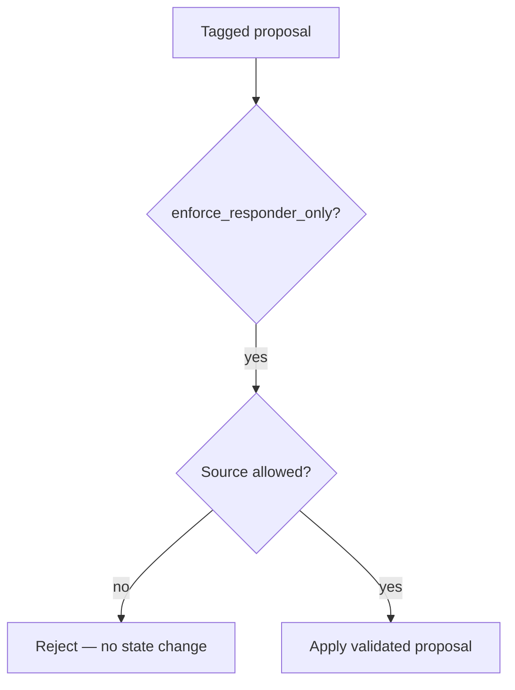

# ADR-0019: ProposalSource enum and responder-only gating

## Status
Accepted

## Implementation Status

**Implemented and tested.**

- `ProposalSource` enum exists with values: `RESPONDER_DERIVED`, `MOCK`, `ENGINE`, `OPERATOR`.
- `MockDecision` defaults `proposal_source=ProposalSource.MOCK` (conservative default, not responder-authoritative).
- `execute_turn()` with `enforce_responder_only=True` rejects proposals from non-responder sources before state changes apply.
- `backend/tests/runtime/test_responder_gating.py`: comprehensive test coverage including `test_proposal_source_enum_has_all_values`, `test_mock_decision_requires_proposal_source`, and enforcement tests.
- `GuardOutcome.REJECTED` is the result for non-responder proposals when enforcement is enabled; existing guard pipeline remains authoritative for content validation after source gate passes.

## Date
2026-03-29

## Intellectual property rights
Yves Tanas

## Privacy and confidentiality
This ADR contains no personal data. Implementers must follow the repository privacy and confidentiality policies, avoid committing secrets, and document any sensitive data handling in implementation steps.

## Related ADRs

- [README.md](README.md) — ADR index *(no tightly coupled ADR beyond references below)*.

## Context
Certain AI-produced proposals should be classified by origin (e.g., `MOCK`, `RESPONDER_DERIVED`, `DIRECTOR`, `MODEL_PROPOSAL`) to allow enforcement of "responder-only" execution modes and to ensure that proposals from non-authoritative sources are handled appropriately by runtime filters and validators.

## Decision
- Add a `ProposalSource` enum to decision/model types to tag the origin of a proposal.
- Extend `MockDecision` and other test helpers to support `proposal_source` for explicit test cases.
- Enforce `responder-only` gating in execution paths where `enforce_responder_only=True` so that only proposals with the correct source are applied as state changes.
- Ensure parsing converts director/interpreter content to `ParsedAIDecision.rationale` (diagnostic) and that state changes only come from validated proposals.

## Consequences
- Minor schema changes; tests updated to set `proposal_source` when required.
- Execution code must check `proposal_source` when `enforce_responder_only` is enabled.

## Diagrams

**`ProposalSource`** tags origin; **`enforce_responder_only`** drops non-responder proposals before state changes apply.

## Testing

Contract / unit coverage as cited in **References**; extend this section when a dedicated gate exists. Revisit this ADR if enforcement drifts or the decision is bypassed in code review.

## References
(Automated migration entry created 2026-04-17)
