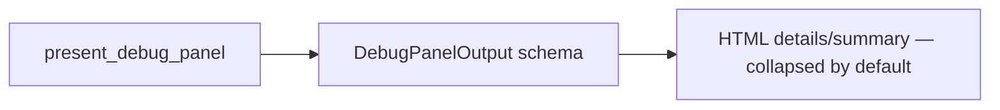

# ADR-0020: Debug Panel UI — bounded diagnostics in session UI

## Status
Accepted

## Date
2026-03-30

## Intellectual property rights
Yves Tanas

## Privacy and confidentiality
This ADR contains no personal data. Implementers must follow the repository privacy and confidentiality policies, avoid committing secrets, and document any sensitive data handling in implementation steps.

## Related ADRs

- [README.md](README.md) — ADR index *(no tightly coupled ADR beyond references below)*.

## Context
Workstream W3 introduced a bounded debug panel for playable sessions that renders developer-facing diagnostics and player-visible summaries from canonical presenter output (`DebugPanelOutput`). The panel must be accessible, minimally invasive, and strictly driven by canonical data contracts.

## Decision
- Render a collapsible debug panel into the session UI driven solely by `DebugPanelOutput` from `present_debug_panel(session_state)`.
- Use native HTML `
/
` for collapsible diagnostics; summary always visible, diagnostics collapsed by default.
- The panel fields are strictly limited to the `DebugPanelOutput` schema (primary_diagnostic, recent_pattern_context, degradation_markers).
- Add tests validating presence, collapsed default, update-after-execution behavior, and graceful degradation.

## Consequences
- Requires template updates and route context wiring; small CSS styling additions.
- Debug data exposure must be access-controlled in production (operator-only surfaces or gated by configuration).
- Acceptance tests added to ensure behavior and non-regression.

## Diagrams

Session UI embeds a **collapsible** panel driven only by **`DebugPanelOutput`** (`
` / `
`).

## Testing

Contract / unit coverage as cited in **References**; extend this section when a dedicated gate exists. Revisit this ADR if enforcement drifts or the decision is bypassed in code review.

## References
(Automated migration entry created 2026-04-17)
