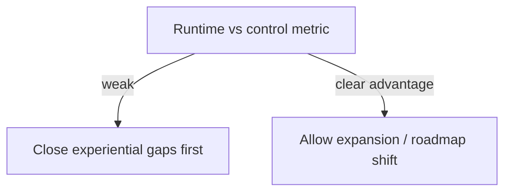

# ADR-0022: MVP Expansion Decision Rule — when not to expand the platform

## Status
Accepted

## Implementation Status

**Decision in force as a governance principle; no automated gate exists.**

- The expansion decision rule (require evaluator evidence of runtime advantage before expanding the platform) is referenced in `docs/MVPs/` roadmap documents.
- MVP progression itself follows this rule: MVP1→MVP2→MVP3→MVP4 required demonstrated value before expanding.
- No automated "expansion gate" system exists; the rule is enforced by engineering convention and ADR governance.
- Status promoted from "Proposed" because the decision is actively applied to MVP planning and has guided the current MVP sequence.

## Date
2026-04-17

## Intellectual property rights
Repository authorship and licensing: see project LICENSE; contact maintainers for clarification.

## Privacy and confidentiality
This ADR contains no personal data. Implementers must follow the repository privacy and confidentiality policies, avoid committing secrets, and document any sensitive data handling in implementation steps.

## Related ADRs

- [README.md](README.md) — ADR index *(no tightly coupled ADR beyond references below)*.

## Context
During MVP validation we need clear exit and expansion criteria to avoid premature allocation of engineering effort. The `ROADMAP_MVP_WORLD_OF_SHADOWS.md` documents an evidence-driven rule describing when to expand the platform.

## Decision
- Use the observed runtime advantage metric (evaluator evidence) to decide expansion.
- If the difference between runtime and control is assessed as *weak*, do NOT expand the platform; instead, first address experiential gaps.
- Expansion proceeds only when evidence shows a clear or sufficient advantage.

## Consequences
- Roadmap gating: teams must provide evaluator evidence before larger platform investments.
- Short-term work focuses on corrective passes rather than expansion epics.

## Diagrams

Expansion follows **evaluator evidence** of runtime advantage; **weak** evidence forces corrective work instead of platform growth.

## Testing

Contract / unit coverage as cited in **References**; extend this section when a dedicated gate exists. Revisit this ADR if enforcement drifts or the decision is bypassed in code review.

## References
(Automated migration entry created 2026-04-17)
